# Lec 01 : Introduction and Recent Advances

## Large Language Models: Course Overview 🤖

## Course Information 📚

### Teaching Team
| Role | Name | Institution |
|------|------|-------------|
| **Instructor** | Prof. Tanmoy Chakraborty | IIT Delhi |
| **Instructor** | Prof. Soumen Chakrabarti | IIT Bombay |
| **Teaching Assistant** | Anwoy Chatterjee | PhD student, IIT Delhi |
| **Teaching Assistant** | Poulami Ghosh | PhD student, IIT Bombay |

## Course Structure 🎓

### Core Components
1. **Foundational Knowledge**
   - Introduction to Natural Language Processing (NLP)
   - Deep Learning fundamentals
   - Essential concepts for understanding LLMs

2. **Advanced Topics**
   - Transformer architecture deep-dive
   - Recent developments in LLM research
   - State-of-the-art techniques and applications

## Course Level & Prerequisites 📋

This is designed as a **graduate-level introductory course** with the following characteristics:
- Focus on fundamental concepts
- Comprehensive coverage of LLM architecture
- Balance of theoretical understanding and practical applications

### Learning Path 🛣️


## Key Learning Objectives 🎯

- Understand core NLP concepts and their evolution
- Master the fundamentals of deep learning in the context of language models
- Gain in-depth knowledge of Transformer architecture
- Stay current with cutting-edge LLM research and developments

## Course Benefits 💡

- **Theoretical Foundation**: Build a strong understanding of LLM principles
- **Research Perspective**: Exposure to current trends and future directions
- **Practical Skills**: Apply concepts to real-world language processing challenges
- **Academic Rigor**: Graduate-level depth with clear learning progression

# Large Language Models: Comprehensive Course Structure 🎓

## 1. Foundational Basics 📚

### Natural Language Processing & Deep Learning
- **NLP Fundamentals** 
  - Core concepts and principles
  - Text processing techniques
  - Linguistic foundations

- **Deep Learning Essentials**
  - Neural network architectures
  - Training methodologies
  - Optimization techniques

### Language Models & Embeddings
- **Language Model Foundations**
  ```mermaid
  graph LR
    A[Statistical LMs] --> B[Neural LMs]
    B --> C[Modern LLMs]
  ```

- **Word Representation**
  | Model | Key Features |
  |-------|-------------|
  | Word2Vec | Context-based embeddings |
  | GloVE | Global word co-occurrence |

### Neural Architectures
```python
# Example architectures covered
architectures = {
    'CNN': 'Convolutional Neural Networks',
    'RNN': 'Recurrent Neural Networks',
    'Seq2Seq': 'Sequence-to-Sequence Models',
    'Attention': 'Attention Mechanisms'
}
```

## 2. Transformer Architecture 🔧

### Core Components
- **Positional Encoding**
  - Relative position representation
  - Sequence order preservation

- **Tokenization Strategies**
  ```markdown
  - BPE (Byte Pair Encoding)
  - WordPiece
  - SentencePiece
  ```

### Model Variants
- **Decoder-only LM** 
  - GPT-style architectures
  - Autoregressive generation

- **Encoder-only LM**
  - BERT-style models
  - Bidirectional context

- **Encoder-decoder LM**
  - T5-style architectures
  - Sequence transformation

## 3. Advanced Learning Paradigms 🧠

### Instruction & Context
- **Fine-tuning Approaches**
  - Task-specific adaptation
  - Instruction following

- **In-context Learning**
  - Few-shot learning
  - Zero-shot capabilities

### Advanced Prompting
```markdown
- Chain of Thoughts (CoT)
- Graph of Thoughts (GoT)
- Prompt Chaining
```

### Model Enhancement
- **Parameter-Efficient Fine-Tuning (PEFT)**
- **Alignment Techniques**

## 4. Knowledge Integration & Retrieval 📖

### Knowledge Management
- **Knowledge Graph Integration**
- **Question Answering Systems**

### Retrieval Techniques


## 5. Ethics & Contemporary Models 🌟

### Ethical Considerations
- **Bias Detection & Mitigation**
- **Toxicity Control**
- **Hallucination Prevention**

### Model Landscape
- Current SOTA models
- Comparative analysis
- Future directions

---

> 💡 **Note**: This course structure provides a comprehensive journey from fundamental concepts to advanced applications in LLM technology.

# Large Language Models: Course Prerequisites & Scope 📚

## Prerequisites Overview

### Core Requirements 🎯

#### Essential Prerequisites


#### Technical Requirements Matrix

| Category | Mandatory | Desirable |
|----------|-----------|-----------|
| **Programming** | ✅ Python | 🔄 Advanced frameworks |
| **Algorithms** | ✅ DSA | 🔄 Advanced algorithms |
| **ML/DL** | ✅ Machine Learning | 🔄 Deep Learning |
| **Domain** | ❌ None | 🔄 NLP background |

## Detailed Requirements Breakdown 🔍

### 1. Mandatory Prerequisites

#### Technical Skills
```python
required_skills = {
    "DSA": "Data Structures & Algorithms",
    "ML": "Machine Learning fundamentals",
    "Python": "Programming proficiency"
}
```

#### Soft Skills
- **Enthusiasm** for language and linguistics
- **Learning mindset** and adaptability
- **Problem-solving** approach

### 2. Desirable Background 📈

#### Advanced Knowledge Areas
- **NLP**: Natural Language Processing concepts
- **Deep Learning**: Neural network architectures
- **Advanced ML**: Modern machine learning techniques

## Course Scope Boundaries 🎯

### Not Covered in This Course ⚠️

```markdown
❌ Detailed coverage of:
    └── NLP fundamentals
    └── Machine Learning basics
    └── Deep Learning principles
```

### Modality Restrictions
```markdown
❌ Non-text generative models:
    └── Image generation
    └── Audio synthesis
    └── Video generation
```

## Success Factors 🌟

### Key Components for Success
1. **Strong Foundation**
   - Solid programming skills
   - Basic ML understanding
   - Algorithmic thinking

2. **Learning Approach**
   - Active participation
   - Regular practice
   - Collaborative learning

## Preparation Guidelines 📋

### Recommended Preparation
```markdown
1. Review Python programming
2. Brush up on ML basics
3. Practice DSA concepts
```

> 💡 **Pro Tip**: Focus on strengthening your understanding of mandatory prerequisites while gradually building knowledge in desirable areas.

---

*Note: While some prerequisites are listed as "desirable," the course is structured to accommodate learners with varying levels of experience in these areas.*
# Course Reading & Reference Resources 📚

## Core Reading Materials

### Essential Textbooks
1. **Speech and Language Processing**
   - Authors: Dan Jurafsky and James H. Martin
   - Access: [Stanford Online Edition](https://web.stanford.edu/~jurafsky/slp3/)

2. **Foundations of Statistical Natural Language Processing**
   - Authors: Chris Manning and Hinrich Schütze

3. **Natural Language Processing**
   - Author: Jacob Eisenstein
   - Access: [GitHub Repository](https://github.com/jacobeisenstein/gt-nlp-class/blob/master/notes/eisenstein-nlp-notes.pdf)

4. **Neural Network Models for NLP**
   - Author: Yoav Goldberg
   - Access: [Online Primer](http://u.cs.biu.ac.il/~yogo/nnlp.pdf)

## Academic Resources

### Key Journals 📰
- Computational Linguistics
- Natural Language Engineering
- Transactions of the ACL (TACL)
- Journal of Machine Learning Research (JMLR)
- Transactions on Machine Learning Research (TMLR)

### Major Conferences 🎯


## Course Acknowledgements

### Related Courses & Resources

#### NLP & Deep Learning
- **Stanford NLP**
  - Instructor: Chris Manning
  - Link: [CS224n](http://web.stanford.edu/class/cs224n/)

- **Advanced NLP**
  - Instructor: Graham Neubig
  - Link: [ANLP 2022](http://www.phontron.com/class/anlp2022/)
  - Instructor: Mohit Iyyer
  - Link: [CS685](https://people.cs.umass.edu/~miyyer/cs685/)

#### Large Language Models
- **Princeton LLM Course**
  - Instructor: Danqi Chen
  - Focus: Understanding Large Language Models

- **Stanford LLM Course**
  - Link: [CS324](https://stanford-cs324.github.io/winter2022/)

#### Specialized Topics
- **Computational Ethics in NLP**
  - Link: [CMU Course](https://demo.clab.cs.cmu.edu/ethical_nlp/)

- **Self-supervised Models**
  - Institution: JHU
  - Course: CS 601.471/671

- **WING.NUS LLM Course**
  - Link: [CS6101](https://wing-nus.github.io/cs6101/)

## Study Tips 💡

1. **Progressive Learning**
   - Start with foundational texts
   - Gradually explore advanced materials
   - Follow conference proceedings for latest developments

2. **Resource Utilization**
   - Use textbooks for core concepts
   - Reference journal papers for depth
   - Follow conference publications for cutting-edge research

3. **Practical Application**
   - Combine theoretical knowledge with hands-on practice
   - Implement concepts from papers
   - Participate in related research projects

> 📌 Note: All readings are optional but highly recommended for a deeper understanding of the field.

# 🤖 Text Generation with Language Models 📝

## How LMs Generate Text 🔄

> **Core Concept**: LMs can generate new text by calculating probabilities of token sequences and sampling from these distributions.

## Mathematical Foundation 📊

### Probability Chain Rule 🧮

Language models use the **chain rule of probability** to calculate the likelihood of token sequences:

$$P(x_{1:L}) = P(x_1) \cdot P(x_2|x_1) \cdot P(x_3|x_1,x_2) \cdot ... \cdot P(x_L|x_{L-1}) = \prod_{i=1}^{L} P(x_i|x_{1:i-1})$$

### Token Sequence Analysis 🔍

| Component | Mathematical Notation | Meaning |
|-----------|------------------------|---------|
| Token Sequence | {x₁, x₂, ..., xₗ} | Tokens from vocabulary V |
| Joint Probability | P(x₁, x₂, ..., xₗ) = P(x₁:ₗ) | Probability of entire sequence |
| Conditional Probability | P(xᵢ\|x₁:ᵢ₋₁) | Probability of next token given previous tokens |

## Generation Process 🚀

```mermaid
graph LR
    A["Input Context 'the monsoon rains have'"] --> B["Calculate P(xᵢ | context) ∀xᵢ∈V"]
    B --> C["Probability Distribution"]
    C --> D["Sample Next Token xᵢ ~ P(xᵢ | x₁:ᵢ₋₁)"]
    D --> E["Generated Token"]
    E --> F["Append to Context"]
    F -->|"Repeat"| B
```



## Example Prediction 📈

Given input "the monsoon rains have", the model calculates probabilities for all possible next tokens:

| Next Token | Probability | Likelihood |
|------------|-------------|------------|
| arrived    | ~0.38       | ⭐⭐⭐⭐⭐ |
| delhi      | ~0.05       | ⭐         |
| have       | ~0.02       | ⭐         |
| is         | ~0.04       | ⭐         |
| monsoon    | ~0.02       | ⭐         |
| rains      | ~0.05       | ⭐         |
| the        | ~0.30       | ⭐⭐⭐⭐   |

## Technical Implementation 🔧

- 🔹 **Auto-regressive LMs** calculate distributions efficiently
- 🔹 Uses "Deep" Neural Networks for processing
- 🔹 Sampling techniques control randomness in generation
- 🔹 Vocabulary constraints determine possible outputs

# 📊 Large Language Models (LLMs) Explained

## What Makes LLMs "Large"? 🔍

> **Two Key Dimensions**: The "Large" in Large Language Models refers to both **model size (# parameters)** and **massive training datasets**.

## Evolution of Model Size 📈

| Model | Organization | Date | Size (parameters) |
|-------|-------------|------|-------------------|
| ELMo | AI2 | Feb 2018 | 94,000,000 |
| GPT | OpenAI | Jun 2018 | 110,000,000 |
| BERT | Google | Oct 2018 | 340,000,000 |
| XLM | Facebook | Jan 2019 | 655,000,000 |
| GPT-2 | OpenAI | Mar 2019 | 1,500,000,000 |
| RoBERTa | Facebook | Jul 2019 | 355,000,000 |
| Megatron-LM | NVIDIA | Sep 2019 | 8,300,000,000 |
| T5 | Google | Oct 2019 | 11,000,000,000 |
| Turing-NLG | Microsoft | Feb 2020 | 17,000,000,000 |
| GPT-3 | OpenAI | May 2020 | 175,000,000,000 |
| Megatron-Turing NLG | Microsoft, NVIDIA | Oct 2021 | 530,000,000,000 |
| Gopher | DeepMind | Dec 2021 | 280,000,000,000 |

## Explosive Growth 🚀

- ⚡ Model sizes have increased by an order of **5000x** over just 4 years!
- 🧠 From millions to hundreds of billions of parameters (2018-2021)

## Training Data Scale 📚


## Latest Giant Models 🏆

| Model | Parameters | Notes |
|-------|------------|-------|
| PaLM | 540B | Google |
| OPT | 175B | Meta |
| BLOOM | 176B | BigScience |
| Gemini-Ultra | 1.56T* | Google |
| GPT-4 | 1.76T* | OpenAI |

*️⃣ *Disclaimer: For API-based models like GPT-4/Gemini-Ultra, parameter counts are not officially announced - these are rumored numbers from the web*

# 🤖 LLMs in the AI Landscape: A Visual Hierarchy

## The Nested Structure of AI Technologies 🏗️


## Hierarchical Relationships 📊

| Layer | Technology | Description | Example Capabilities |
|-------|------------|-------------|----------------------|
| 🔴 Outermost | **Artificial Intelligence** | Systems with human-like intelligence | Reasoning, problem-solving |
| 🟠 Second | **Machine Learning** | Algorithms that learn rules automatically from data | Pattern recognition, prediction |
| 🟡 Third | **Deep Learning** | Machine learning with neural networks consisting of many layers | Feature extraction, complex pattern recognition |
| 🟢 Inner | **Large Language Models** | Deep neural networks for parsing and generating human-like text | Text generation, understanding context |
| 🔵 Overlapping | **GenAI** | Neural networks creating new content (text, images, media) | Creative content generation, multimodal outputs |

## Key Relationships 🔍

> **LLMs are specialized deep learning models** focused primarily on natural language processing, while sharing technological foundations with the broader generative AI field.

### Technological Nesting 🎯

- 🔹 **AI** encompasses all intelligent systems
- 🔹 **Machine Learning** represents a data-driven approach to AI
- 🔹 **Deep Learning** leverages neural networks with multiple layers
- 🔹 **LLMs** specialize in language understanding and generation
- 🔹 **GenAI** spans multiple creative domains (text, images, other media)

## Applications Across Domains 🌐

- 📝 **Text**: Document generation, summarization, translation
- 🎨 **Visual**: Image creation, modification, style transfer
- 🔊 **Audio**: Speech synthesis, music composition
- 🎬 **Multimodal**: Combined text-image-audio generation

# 📚 Evolution of Language Models: Historical Timeline 🚀

> **A Journey Through LLM Development**: From early rule-based systems to modern neural architectures

## Timeline of Key Milestones 🕰️


## Detailed Milestone Breakdown 📊

| Year | Milestone | Organization | Significance | Impact |
|------|-----------|--------------|-------------|--------|
| 1966 | **ELIZA** | MIT (Weizenbaum) | First program to simulate conversations | 🔹 Pioneered human-computer interaction |
| 1972 | **STNLP** | MIT (Winograd) | Statistical language model generating text | 🔹 Early statistical approach to NLP |
| 1997 | **LSTM** | Hochreiter & Schmidhuber | Recurrent neural network architecture | 🔹 Enabled learning from sequential data |
| 1999 | **NVIDIA GPU** | NVIDIA | First Graphics Processing Unit | 🔹 Hardware acceleration for future AI |
| 2000 | **IBM Model 1** | IBM | Statistical machine translation | 🔹 Foundation for translation systems |
| 2006 | **FAIR Founded** | Facebook | Research lab established | 🔹 Corporate investment in AI research |
| 2013 | **IBM Tangora** | IBM | Speech recognition system | 🔹 Advanced spoken language processing |
| 2014 | **Google Brain** | Google | Deep learning research project | 🔹 Large-scale neural network research |
| 2015 | **Google TPUs** | Google | Tensor Processing Units | 🔹 Custom hardware for AI acceleration |
| 2015 | **OpenAI Founded** | OpenAI | AI research organization | 🔹 Dedicated to beneficial general AI |
| 2016 | **Stanford SQuAD** | Stanford | Question-answering dataset | 🔹 Benchmark dataset for NLP research |
| 2017 | **Transformer Models** | Google | "Attention is All You Need" paper | 🔹 Architecture powering modern LLMs |

## Technology Paradigm Shifts 🌈

### Three Eras of Language Models 📝

1. **Rule-based Era** (1960s-1990s)
   - 🔸 ELIZA (1966): Pattern matching and scripted responses
   - 🔸 STNLP (1972): Statistical rules for text generation

2. **Neural Network Era** (1997-2017)
   - 🔸 LSTM (1997): Learning from sequences with memory
   - 🔸 Hardware advances: GPUs (1999) and TPUs (2015)
   - 🔸 Research infrastructure: Google Brain (2014), FAIR (2006)

3. **Transformer Era** (2017-Present)
   - 🔸 Attention mechanisms revolutionize NLP
   - 🔸 Foundation for GPT, BERT, and all modern LLMs
   - 🔸 Enabled scaling to billions of parameters
# 📊 The Evolution of Large Language Models (2017-2023) 📚

## 🔄 Transformer Revolution (2017-2018)

> **Attention is All You Need** - The paper that started it all

| Year | Model | Organization | Breakthrough Contribution |
|------|-------|--------------|---------------------------|
| 2017 | **Transformers** | Google | Introduced attention mechanisms revolutionizing NLP |
| 2018 | **BERT** | Google | Pre-training of Deep Bidirectional Transformers for Language Understanding |

## 🚀 The Scaling Begins (2019)

### GPT-2: Unsupervised Multitask Learning

```mermaid
graph LR
    A[GPT-1 (117M)] -->|13x larger| B[GPT-2 (1.5B)]
```

- 🔹 **Parameter Jump**: 117M → 1.5B (13x increase)
- 🔹 **Context Length**: 512 → 1024 tokens
- 🔹 **Architecture**: Minimal changes (LayerNorms, weight initialization)

### Scaling Impact on Performance
- 📈 Reading Comprehension: Consistent improvements as parameters increased
- 📈 Translation: Better performance than unsupervised statistical MT
- 📈 Summarization: Approached supervised methods
- 📈 Question Answering: Significant gains with scale

### Parallel Developments
- 🧪 **T5** (Google, 2019): Unified Text-to-Text Transformer
- 🧪 **RoBERTa** (Meta, 2019): Optimized BERT pretraining
  - Revealed BERT was significantly undertrained
- 🧪 **XLM** (Meta, 2019): Cross-lingual Language Model Pretraining

## 💯 The Race to Scale (2020-2022)

| Year | Model | Organization | Size | Open/Closed |
|------|-------|--------------|------|-------------|
| 2020 | **GPT-3** | OpenAI | 175B | ❌ Closed |
| 2021-22 | **Megatron-Turing NLG** | Microsoft/NVIDIA | 530B | ❌ Closed |
| 2022 | **PaLM** | Google | 540B | ❌ Closed |
| 2022 | **OPT** | Meta | 125M-175B | ✅ Open-sourced |
| 2022 | **Gopher/Chinchilla** | DeepMind | | ❌ Closed |
| 2022 | **Codex** | OpenAI | | ❌ Closed |

> **Critical Shift**: OpenAI stops open-sourcing, beginning the "LLM Race" 🏁

## 🌟 The ChatGPT Moment (November 30, 2022)
- Transformed consumer AI landscape and public perception

## 🔥 2023: The Year of Rapid Development

| Month | Model | Organization | Significance |
|-------|-------|--------------|-------------|
| February | **Bard** | Google | Consumer chatbot |
| February | **LLaMA** | Meta | Family of open-source models |
| March | **Claude** | Anthropic | Founded by ex-OpenAI researchers |
| March | **GPT-4** | OpenAI | Multimodal capabilities |
| June | **Phi-1** | Microsoft | 1.3B parameter LLM for code |
| September | **Mistral 7B** | Mistral AI | Compact but powerful model |
| November | **Grok** | xAI | | 
| December | **Gemini** | Google | Multimodal capabilities |

## 📝 Key Trends

- 📊 **Exponential Scaling**: Parameter counts jumped from millions to hundreds of billions
- 🔍 **Architectural Innovation**: From Transformers to specialized variants
- 🔄 **Open vs. Closed**: Shifting from open research to proprietary models
- 🌐 **Corporate Competition**: Google vs OpenAI vs Meta vs Microsoft
- 💡 **Capabilities Expansion**: From text prediction to few-shot learning & multimodal processing

# 🧠 Why Study Large Language Models Separately? 🚀

## Emergent Capabilities Transform the Landscape 📈

> "Although the technical machineries are almost similar, 'just scaling up' these models results in new emergent behaviors, which lead to significantly different capabilities and societal impacts."

### The Emergence Phenomenon 🌟


## Key Emergent Capabilities 🔍

| Capability | Description | Previously Possible? |
|------------|-------------|----------------------|
| **In-context Learning** | Models perform tasks with only prompts, no fine-tuning | ❌ No |
| **Few-shot Learning** | Models learn from minimal examples | ❌ Limited |
| **Chain-of-thought** | Step-by-step reasoning for complex problems | ❌ No |
| **Multimodal Understanding** | Processing multiple types of data | ❌ Limited |

## 🏢 Real-World Adoption & Impact

### Research Applications 📚
- 🔹 State-of-the-art performance across NLP tasks
- 🔹 Sentiment classification, question answering
- 🔹 Summarization, machine translation

### Industry Implementation 💼
- 🔹 **Google Search**: BERT integration
- 🔹 **Facebook**: Content moderation via XLM
- 🔹 **Microsoft**: Azure OpenAI Service (GPT-3/3.5/4)

## ⚠️ Critical Risks & Challenges

### Four Major Concern Areas

1. **Reliability & Disinformation** 🔮
   - LLMs frequently "hallucinate" non-factual information
   - Critical issue for high-stakes domains (healthcare, legal)

2. **Social Bias** ⚖️
   - Performance disparities across demographic groups
   - Example: `P(He is a doctor) > P(She is a doctor)`
   - Reinforcement of harmful stereotypes

3. **Toxicity Generation** 🚫
   - Training on internet data (Reddit, etc.) includes offensive content
   - Challenges for writing assistants and public-facing chatbots

4. **Security Vulnerabilities** 🔒
   - Training on public internet creates attack vectors
   - Susceptibility to data poisoning attacks

## 📊 The Emergence-Risk Relationship


> **Course Rationale**: The unique emergent properties of LLMs, their widespread adoption, and their distinctive risk profiles necessitate specialized study beyond traditional language model courses.

# 🚀 Practical Learning Strategies for LLMs 🧠

## Hands-On Experimentation is Key! 🔬

> "LLM Research is all about implementing and experimenting with your ideas. Rule of thumb: Never believe in any hypothesis until your experiments verify it!"

### 🛠️ Recommended Learning Approach


### 📊 Model Accessibility Options

| Model Size | Where to Run | Tools | Hardware Requirements |
|------------|--------------|-------|----------------------|
| **Small** (GPT-2, DistilBERT) | Google Colab / Kaggle | Hugging Face | Basic GPU |
| **Medium** (7B parameter models) | Colab/Local with quantization | Hugging Face, GGML | Mid-range GPU |
| **Large** (>13B) | Cloud services | API access | Professional GPU setup |

### 💡 Implementation Tips

#### Platform Resources 🔗
- 🔹 [**Hugging Face**](https://huggingface.co/) - Model hub with easy implementation
- 🔹 [**Kaggle**](https://www.kaggle.com/) - Notebooks with free GPU access
- 🔹 [**Google Colab**](https://colab.research.google.com/) - Free GPU/TPU access

#### Model Optimization Techniques 🔧
- 🔹 **Quantization** - Reduce precision to run larger models
- 🔹 **Pruning** - Remove unnecessary weights
- 🔹 **Knowledge Distillation** - Create smaller, efficient versions

### ⚡ The Experimental Mindset

> **Always get your hands dirty!**

1. 📝 **Formulate clear hypotheses**
2. 🔍 **Design controlled experiments**
3. 📊 **Measure results systematically**
4. 🧪 **Iterate on failures**
5. 📈 **Document everything**

Remember: In LLM research, practical verification trumps theoretical assumptions every time!
