# Lec 02 : Introduction to Natural Language Processing

# 🔤 Natural Language Processing (NLP) 🧠

## 📚 Key Definitions

### 🌐 Natural Language
> Any language that has evolved naturally in humans through use and repetition without conscious planning or pre-meditation.

### 💻 Natural Language Processing
> A field of computer science, artificial intelligence and computational linguistics concerned with the interactions between computers and human (natural) languages.

## 🔍 NLP in Context

| Domain | Relationship to NLP |
|--------|---------------------|
| 🖥️ Computer Science | Provides computational methods and algorithms |
| 🤖 Artificial Intelligence | Enables machines to understand and generate human language |
| 👨‍💻 Computational Linguistics | Offers theoretical frameworks for language analysis |
| 🗣️ Human Language | Serves as the primary subject of study and application |

## 🚀 NLP Conceptual Flow

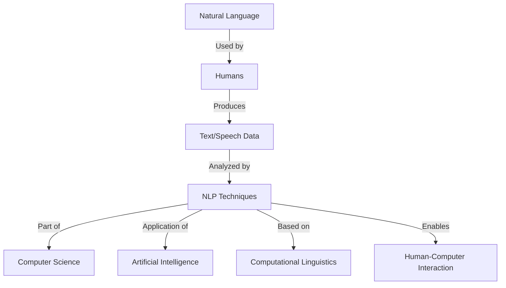

## 💡 Why NLP Matters

- 🔹 Bridges the gap between human communication and computer understanding
- 🔹 Enables applications like virtual assistants, translation services, and sentiment analysis
- 🔹 Represents a fundamental component of modern AI systems
- 🔹 Allows computers to process and derive meaning from human language

# 🤖 Natural Language Processing: The Turing Test 🧠

## 📋 Turing Test Setup

| Room | Occupants | Role |
|------|-----------|------|
| 🚪 Room 1 | Human C | Judge/Interrogator |
| 🚪 Room 2 | Computer (A) + Human (B) | Respondents |

## 🔍 Test Process

- 📝 Responses generated from Room 2 (either by computer A or human B)
- 🧩 Human C must determine the source of each response
- ⏱️ Test typically conducted through text-based communication

## 📊 Outcome Determination

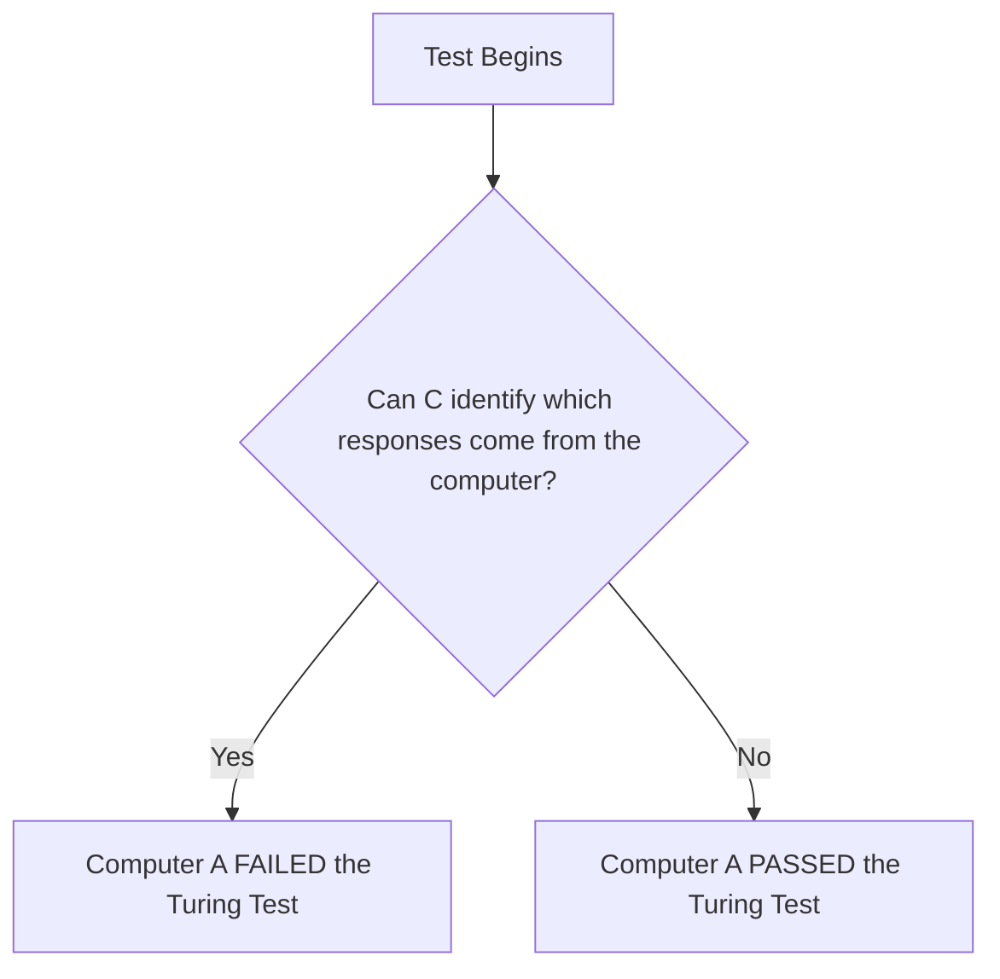

## 📘 Historical Context

> "**Computing Machinery and Intelligence**" proposed what is now called the Turing test.

## 💡 Key Implications

- 🔹 Tests a machine's ability to exhibit intelligent behavior indistinguishable from a human
- 🔹 Foundational concept in artificial intelligence evaluation
- 🔹 Closely connected to natural language processing capabilities
- 🔹 Measures conversational fluency rather than correctness of answers

## 🌟 Significance in NLP

The Turing test represents one of the earliest frameworks for evaluating whether machines can process and generate natural language in a human-like manner, making it a cornerstone concept in NLP development.

# 🧠 Natural Language Processing: Chomsky's Legacy 📚

## 👨‍🏫 Noam Chomsky: The Father of Modern Linguistics

> "The father of modern linguistics"

## 📘 Revolutionary Contributions

| Year | Publication | Impact |
|------|------------|--------|
| 1957 | **Syntactic Structures** | Revolutionized the field of linguistics |

### 🌟 Key Concept: Universal Grammar

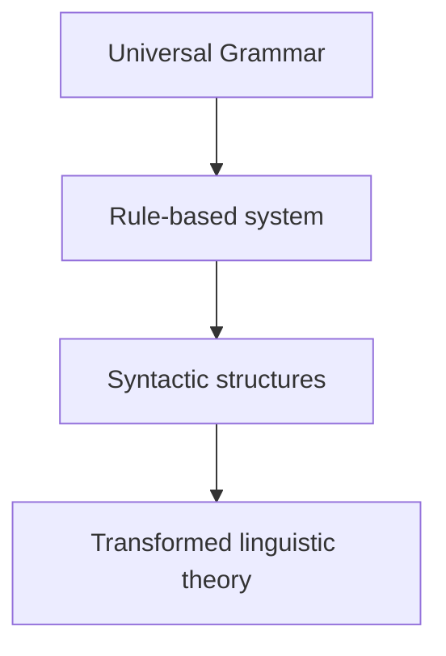

## 🎓 Academic Positions

- 🔹 **Laureate Professor** of Linguistics at University of Arizona
- 🔹 **Institute Professor Emeritus** at MIT

## 💡 Significance in NLP

Chomsky's theories of universal grammar and syntactic structures laid foundational principles that would later influence computational approaches to language understanding and natural language processing systems.

## 🔄 Connection to Modern NLP

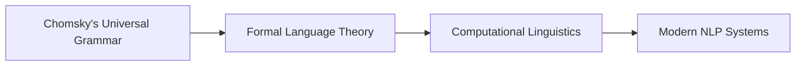

Chomsky's work established the theoretical framework that eventually enabled computers to process and analyze human language with rule-based systems, a precursor to today's statistical and neural approaches to NLP.


# 🤔 The Challenge of Ambiguity in NLP 🔍

## 📊 Why NLP is Hard: Core Challenges

### 🔥 Figurative Language
```
"Virat Kohli was on fire last night. He totally destroyed the other team."
```
> These metaphorical expressions aren't meant literally - they require contextual understanding beyond surface meaning.

### 🦆 Perceptual Ambiguity

| Question | Answer | Visual Example |
|----------|--------|----------------|
| Is ambiguity present in language only? | No, ambiguity is prevalent in every dimension! | Duck-Rabbit illusion |

## 📝 Types of Linguistic Ambiguity

### 🔹 Prepositional Phrase Attachment
```
"I saw a girl with a telescope."
```

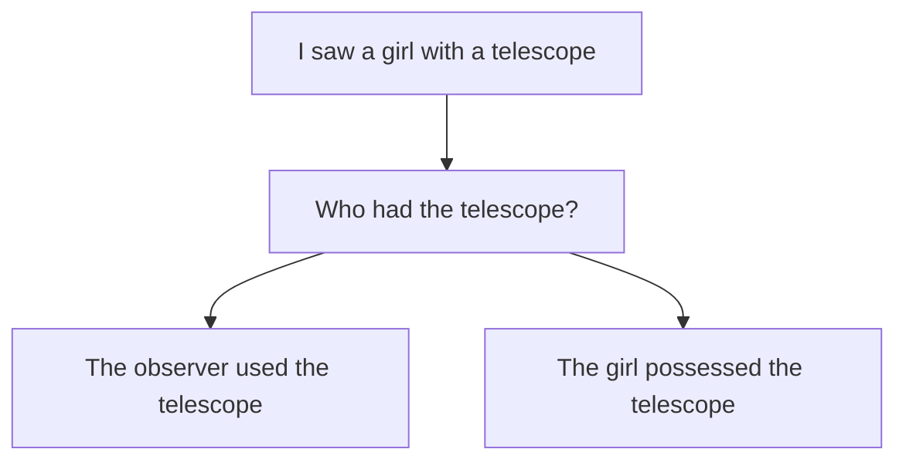

### 🔹 Surface Structure Ambiguities

| Sentence | Possible Interpretations |
|----------|--------------------------|
| "Mary had a little lamb." | 1. Mary owned a small sheep<br>2. Mary ate a small portion of lamb |
| "I ate rice with spoon." | Instrument for eating |
| "I ate rice with curd." | Accompaniment to rice |
| "I ate rice with Rahul." | Companion during meal |

### 🔹 Punctuation Changes Meaning

```
Let's eat Grandma!      vs.      Let's eat, Grandma!
```

```
A woman without her man is nothing.
A woman, without her man, is nothing.
A woman, without her, man is nothing.
```
> ✨ Punctuation is powerful.

## 💡 NLP Implications

- 🔹 Multiple valid interpretations from the same text
- 🔹 Context-dependent meaning resolution
- 🔹 Cross-linguistic ambiguity (shown with Hindi example)
- 🔹 Need for sophisticated disambiguation techniques

This ambiguity makes NLP challenging because computers must determine the intended meaning from multiple possible interpretations, something humans do naturally through context and world knowledge.

# 🦬 Buffalo Buffalo: A Linguistic Marvel 📝

## 📊 Sentence Analysis

```
Buffalo buffalo Buffalo buffalo buffalo buffalo Buffalo buffalo
```

> **Question**: Is this a valid sentence?
> **Answer**: Yes! ✅ It's grammatically correct English!

## 🔍 Word "Buffalo" - Triple Meaning

| # | Part of Speech | Definition | Example |
|---|---------------|------------|---------|
| 1 | Noun | The animal (plural unchanged) | *The buffalo graze in the field* |
| 2 | Proper Noun | City in New York State | *I visited Buffalo last summer* |
| 3 | Verb | To bully or intimidate | *Don't let them buffalo you* |

## 🧩 Sentence Structure Breakdown

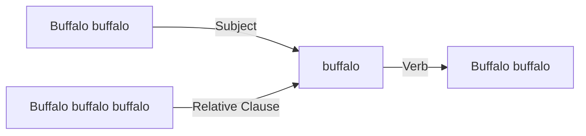

### 📋 Translation with Substitutions

```
[Buffalo-origin bison] [whom other Buffalo-origin bison bully] [themselves bully] [Buffalo-origin bison].
```

Or more clearly:

> 🔹 **Bison from Buffalo**, 
> 🔹 **that are bullied by other bison from Buffalo**,
> 🔹 **themselves bully**
> 🔹 **bison from Buffalo**.

## 💡 Grammatical Explanation

The sentence follows the pattern:
```
[Subject] [Relative Clause] [Verb] [Object]
```

This demonstrates how English can create valid but ambiguous sentences through:
- 🔹 Homonyms (same spelling/pronunciation, different meanings)
- 🔹 Omitted relative pronouns ("that" or "whom")
- 🔹 Recursive grammatical structures

## 🌟 Linguistic Significance

This sentence exemplifies why natural language processing is challenging - identical words in sequence can have completely different grammatical functions depending on their position and context!

# 🧩 Why Natural Language Understanding is Difficult 🤖

## 📊 Six Key Challenges in NLP

### 1️⃣ Non-standard English
```
Great job @justinbieber! Were SOO PROUD of what youve 
accomplished! U taught us 2 #neversaynever & you yourself 
should never give up either ❤
```
> Social media text features abbreviations, missing punctuation, hashtags, and emoticons that deviate from standard language rules.

### 2️⃣ Segmentation Issues
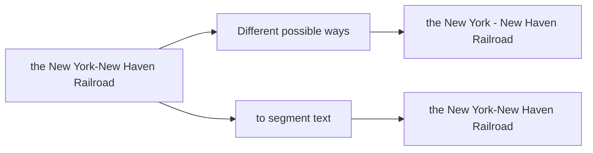

### 3️⃣ Idioms / Multiword Expressions

| Idiom | Literal Meaning | Actual Meaning |
|-------|----------------|----------------|
| 🏇 dark horse | A horse that is dark | Unexpected competitor/winner |
| ❄️ get cold feet | Feet become cold | Become nervous/hesitant |
| 😳 lose face | Misplace one's face | Suffer embarrassment |
| 🧻 throw in the towel | Toss a towel | Give up/surrender |
| 🔊 Khana-wana (Echo) | Food-etc. | Echo compounds in some languages |

### 4️⃣ Neologisms

- 🔹 **unfriend** - Remove someone as a friend on social media
- 🔹 **Retweet** - Share someone else's post on Twitter
- 🔹 **bromance** - Close non-romantic relationship between men

### 5️⃣ World Knowledge Required

```
Mary and Juhi are sisters.
Mary and Juhi are mothers.
```
> 💡 Understanding these statements requires contextual knowledge not present in the text itself.

### 6️⃣ Tricky Entity Names

| Example | Challenge |
|---------|-----------|
| Where is **A Bug's Life** playing... | Could be misinterpreted as a general question |
| **Let It Be** was recorded... | Phrase could be interpreted as an instruction |
| ...a mutation on the **for** gene... | "for" looks like a preposition but is a gene name |

## 🔍 NLP Implications

These challenges highlight why machines struggle with natural language understanding - they need to overcome the same ambiguities humans navigate effortlessly, while lacking humans' intuitive grasp of context, cultural references, and world knowledge.

# 🧠 Components of Natural Language Processing 🔤

## 🔄 Core NLP Components

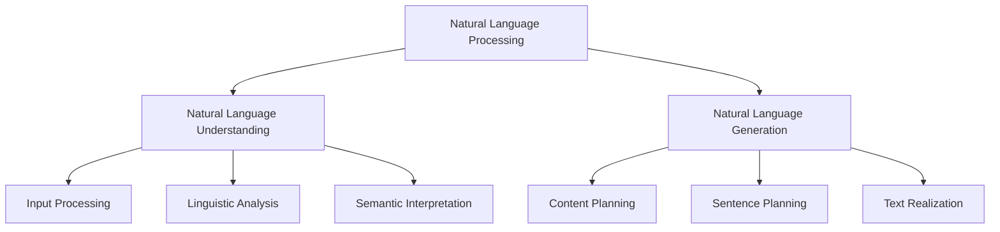

## 📊 Key NLP Component Comparison

| Component | Purpose | Common Applications | Challenges |
|-----------|---------|---------------------|------------|
| 🧩 **Natural Language Understanding** | Interpret and extract meaning from human language | Question answering, sentiment analysis, intent recognition | Ambiguity, context dependency, idioms |
| 🔊 **Natural Language Generation** | Produce human-like text from structured data | Report generation, chatbots, content creation | Coherence, naturalness, style consistency |

## 🔍 Natural Language Understanding (NLU)

### Core Elements of NLU:

- 🔹 **Morphological Analysis** - Breaking words into meaningful units
- 🔹 **Syntactic Analysis** - Parsing sentence structure using grammar rules
- 🔹 **Semantic Analysis** - Extracting meaning from words and sentences
- 🔹 **Pragmatic Analysis** - Understanding context-dependent meanings
- 🔹 **Discourse Analysis** - Interpreting connections between sentences

> 💡 **NLU Challenge**: Human language is inherently ambiguous, requiring systems to resolve multiple possible interpretations based on context.

## 🗣️ Natural Language Generation (NLG)

### NLG Pipeline:

1. **Content Determination** - Deciding what information to include
2. **Document Planning** - Organizing information coherently
3. **Aggregation** - Combining related sentences for natural flow
4. **Lexical Choice** - Selecting appropriate words
5. **Referring Expression Generation** - Creating consistent references
6. **Linguistic Realization** - Applying grammar rules to produce text

> 📝 **NLG Goal**: Generate text that is indistinguishable from human-written content in terms of fluency, coherence, and relevance.

## 🔄 Supporting NLP Components

| Component | Function | Example Technologies |
|-----------|----------|---------------------|
| 📋 **Text Preprocessing** | Clean and normalize text | Tokenization, stemming, lemmatization |
| 🏷️ **Named Entity Recognition** | Identify and classify entities | People, organizations, locations, dates |
| 🔗 **Coreference Resolution** | Link pronouns to their antecedents | Resolving "he," "she," "it," "they" references |
| 🌉 **Relationship Extraction** | Identify connections between entities | Subject-verb-object relationships |

## 💫 Advanced NLP Applications

- 🔹 **Machine Translation** - Converting text between languages
- 🔹 **Summarization** - Condensing text while preserving key information
- 🔹 **Sentiment Analysis** - Determining emotional tone of text
- 🔹 **Question Answering** - Providing direct responses to natural language queries
- 🔹 **Dialog Systems** - Maintaining coherent conversations over multiple turns

# 🧠 NLP Processing Layers: From Text to Meaning 📊

## 🔍 Understanding Natural Language Processing Complexity

> "Understanding the semantics is a non-trivial task. Needs to perform a series of incremental tasks to achieve this. NLP happens in layers."

## 📈 NLP Processing Hierarchy

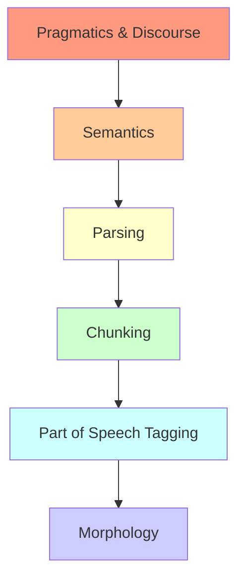

## 📋 NLP Layer Breakdown

| Layer | Description | Example | Complexity |
|-------|-------------|---------|------------|
| 🌐 **Pragmatics & Discourse** | Study of semantics in context | Understanding sarcasm, references across sentences | Highest |
| 🧩 **Semantics** | Meaning of the sentence | "The bank is closed" (financial or river?) | Very High |
| 🌳 **Parsing** | Syntactic structure of the sentence | Subject-verb-object relationships | High |
| 📦 **Chunking** | Grouping of meaningful phrases | Noun phrases, verb phrases | Medium |
| 🏷️ **Part of Speech Tagging** | Grammatical classes | Nouns, verbs, adjectives, etc. | Medium-Low |
| 📝 **Morphology** | Study of word structure | Prefixes, suffixes, word roots | Lowest |

## 🚀 Processing Complexity Factors

- 🔹 **Interdependence**: Higher layers depend on accurate processing at lower layers
- 🔹 **Ambiguity**: Increases dramatically at higher levels
- 🔹 **Context**: More context required as you move up the hierarchy
- 🔹 **World Knowledge**: External information increasingly needed at higher levels

## 💡 Key Insights

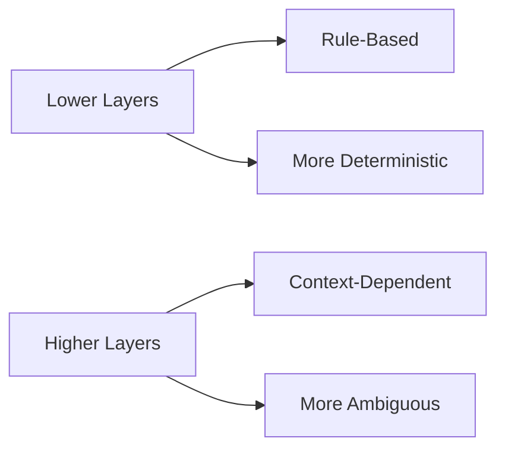

> 📘 **Processing Principle**: NLP systems typically process language bottom-up, with each layer building upon information extracted from previous layers, creating increasingly complex representations of meaning.

The increasing complexity of processing reflects the inherent challenges in moving from simple linguistic units to contextual understanding of human language.

# 🔺 The NLP Trinity: A 3D Framework 🔺

## 📊 Three-Dimensional Model of NLP

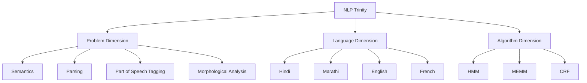

## 🧩 The Three Dimensions Explained

| Dimension | What It Represents | Examples | Complexity |
|-----------|-------------------|----------|------------|
| 🔴 **Problem** | Levels of linguistic analysis | Morphology → POS → Parsing → Semantics | Increasing ↑ |
| 🔵 **Language** | Target languages for processing | Hindi, Marathi, English, French | Varies by linguistic features |
| 🟢 **Algorithm** | Computational methods used | HMM, MEMM, CRF | Varies by capabilities |

## 📈 Problem Dimension: Increasing Complexity

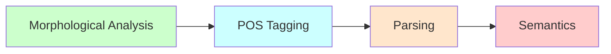

> 💡 **Key Insight**: As we move up the problem dimension, the complexity increases - not all algorithms work equally well at all levels.

## 🌐 Language Dimension: Cross-Linguistic Variation

| Language | Morphological Complexity | Word Order | Script Challenges |
|----------|--------------------------|------------|-------------------|
| 🇮🇳 **Hindi** | High | SOV | Devanagari |
| 🇮🇳 **Marathi** | Very High | SOV | Devanagari |
| 🇬🇧 **English** | Low | SVO | Latin |
| 🇫🇷 **French** | Moderate | SVO | Latin with diacritics |

## 🧠 Algorithm Dimension: Different Approaches

| Algorithm | Full Name | Strengths | Typical Applications |
|-----------|-----------|-----------|---------------------|
| 🔹 **HMM** | Hidden Markov Models | Simple, efficient | POS tagging, speech recognition |
| 🔹 **MEMM** | Maximum Entropy Markov Models | Better feature integration | Named entity recognition |
| 🔹 **CRF** | Conditional Random Fields | Handles complex dependencies | Parsing, sequence labeling |

## ⚠️ Limitations in the Trinity Space

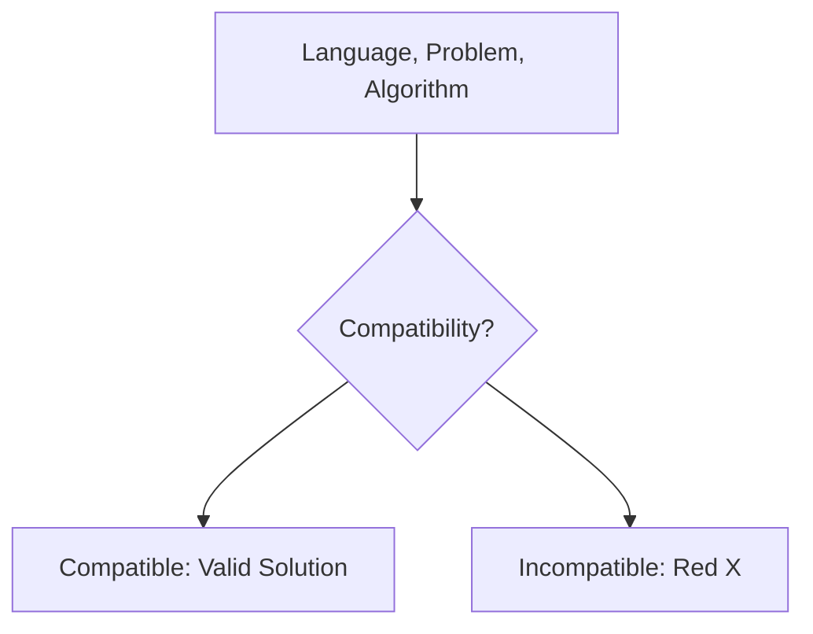

> 🚫 **Important Note**: Not all combinations of language, problem, and algorithm are viable. The red X in the diagram indicates areas where certain approaches fail or are unsuitable.

## 💡 Practical Implications

- 🔹 NLP solutions must consider all three dimensions simultaneously
- 🔹 Algorithms effective for one language may fail for others
- 🔹 Higher-level problems require more sophisticated algorithms
- 🔹 The ideal approach lives at the intersection of all three dimensions

This trinity framework helps researchers and engineers systematically approach NLP problems by considering the complex interplay between the linguistic task, target language, and algorithmic methodology.

# 🔤 Understanding Words and Tokens in NLP 📊

## 📝 Key Definitions

| Term | Definition | Context |
|------|------------|---------|
| 🔹 **Word** | Smallest sequence of phonemes of a spoken language that can be uttered in isolation | Speech-focused |
| 🔹 **Token** | Smallest sequence of graphemes that are delimited with predefined characters (space, comma, full-stop, etc.) | Text-focused |
| 🔹 **Word Segmentation/Tokenization** | Breaking a string of characters into a sequence of words | Processing step |

## 🧩 Tokenization Examples

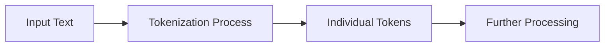

### 📊 Basic Sentence Tokenization

| Original Text | ⟹ | Tokenized Result |
|---------------|---|------------------|
| Ram, Shyam, and Mohan are playing. | ⟹ | [Ram] [,] [Shyam] [,] [and] [Mohan] [are] [playing] [.] |

### 📈 Number & Special Format Handling

| Original Text | ⟹ | Tokenization Options | Status |
|---------------|---|---------------------|--------|
| 21,53,010 COVID cases in India. | ⟹ | [21] [,] [53] [,] [010] [COVID] [cases] [in] [India] [.] | ❌ |
| | ⟹ | [21,53,010] [COVID] [cases] [in] [India] [.] | ✅ |

> 💡 **Note**: Preserving numeric formats as single tokens is often preferred for meaningful interpretation.

### 🔗 URL Handling in Tokenization

| Original Text | ⟹ | Tokenization Options | Status |
|---------------|---|---------------------|--------|
| Check this out...https://www.abc.com | ⟹ | [Check] [this] [out] [.] [.] [.] [https] [:] [/] [/] [www] [.] [abc] [.] [com] | ❌ |
| | ⟹ | [Check] [this] [out] [...] [https://www.abc.com] | ✅ |

> 🔍 **Insight**: Treating URLs as single tokens preserves their semantic meaning.

### 🏷️ Hashtag Processing

| Original Text | ⟹ | Tokenized Result |
|---------------|---|------------------|
| #GreatDayEver | ⟹ | [#] [Great] [Day] [Ever] |

## 🧠 Tokenization Considerations

- 🔹 **Context-sensitivity**: Different tokenization strategies may be appropriate for different applications
- 🔹 **Language-specific challenges**: Word boundaries vary across languages
- 🔹 **Domain knowledge**: Technical text may require specialized tokenization rules
- 🔹 **Semantic preservation**: Entities like URLs, numbers, and dates often need special handling

## 🚀 Why Tokenization Matters

Effective tokenization forms the foundation for:
- 🔹 Feature extraction
- 🔹 Vocabulary building
- 🔹 Sequence modeling
- 🔹 All downstream NLP tasks

# 🔤 Morphology: The Building Blocks of Words 📚

## 📋 Definition

> **Morphology** is the study of words, how they are formed, and their relationship to other words in the same language. It analyzes the structure of words and parts of words, such as stems, root words, prefixes, and suffixes.

## 🧩 Key Concepts

| Concept | Description | Function |
|---------|-------------|----------|
| 🔹 **Morphology** | Field of linguistics studying internal word structure | Establishes word formation rules |
| 🔹 **Morpheme** | Smallest linguistic unit with semantic meaning | Building block of words |
| 🔹 **Root Word** | Core word that carries the main meaning | Base for word formation |
| 🔹 **Affixes** | Attachments to roots that modify meaning | Create new words/forms |

## 🌱 Morpheme Types

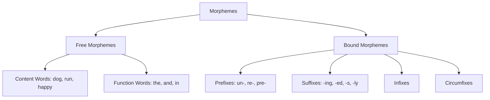

## 🔍 Morphological Analysis Examples

### 📊 Simple Words

| Word | Morphological Breakdown | Type |
|------|-------------------------|------|
| Dogs | dog + s | Root + plural suffix |
| Going | go + ing | Root + present participle |
| Unhappy | un + happy | Prefix (negation) + root |

### 📈 Complex Words

| Word | Detailed Breakdown | Analysis |
|------|-------------------|----------|
| Independently | independent + ly | Base word + adverb marker |
| | in + dependent + ly | Negation + base + adverb |
| | in + depend + ent + ly | Prefix + root + adjective + adverb |
| | in + de + pend + ent + ly | Multiple morphemes combined |

> 💡 **Root Word Analysis**: "pend" (verb) means "to remain undecided or unsettled"

## 🚀 More Examples

### 🔹 Prefix Examples
- **Pre**view = pre (before) + view
- **Re**write = re (again) + write
- **Dis**agree = dis (not) + agree
- **Un**load = un (reverse action) + load

### 🔹 Suffix Examples
- Talk**er** = talk + er (person who does)
- Quick**ly** = quick + ly (in a manner)
- Book**s** = book + s (plural)
- Walk**ed** = walk + ed (past tense)

### 🔹 Multiple Morpheme Words
- **Re**play**ing** = re + play + ing (again + action + continuous)
- **Un**friend**ly** = un + friend + ly (not + person + characteristic)
- **Dis**connect**ion** = dis + connect + ion (reverse + join + result)

## 💫 Why Morphology Matters in NLP

- 🔹 Enables stemming and lemmatization
- 🔹 Helps in understanding word relationships
- 🔹 Critical for language generation and understanding
- 🔹 Supports machine translation between languages with different morphological structures

Understanding morphology provides the foundation for analyzing how words are formed and how they relate to one another across languages!

# 🔍 Morphology: The Building Blocks of Words 📚

## 📋 Definition & Scope

> **Morphology** is the study of words, how they are formed, and their relationship to other words in the same language. It analyzes the structure of words and parts of words, such as stems, root words, prefixes, and suffixes.

## 🧩 Core Concepts

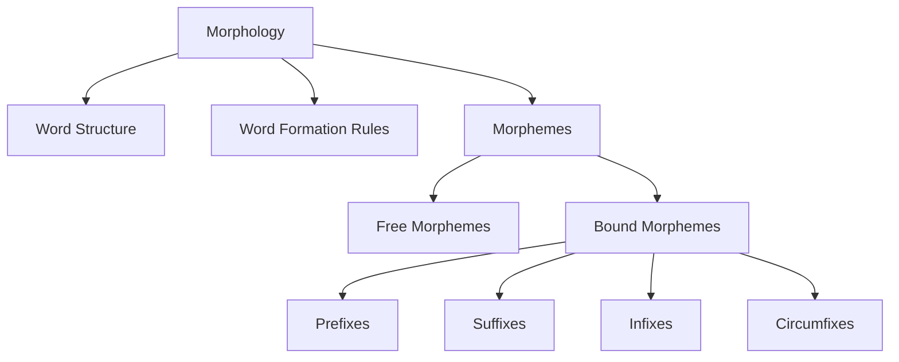

### 🔹 Morpheme: The Foundation of Morphology

> **Morpheme**: The smallest linguistic unit that has semantic meaning

| Type | Description | Examples |
|------|-------------|----------|
| 🔸 **Free Morphemes** | Can stand alone as words | dog, go, depend, happy |
| 🔸 **Bound Morphemes** | Must attach to other morphemes | -s, -ing, -ly, pre-, un- |

## 📊 Types of Bound Morphemes

| Type | Function | Examples |
|------|----------|----------|
| 🔸 **Derivational** | Change word class or meaning | happy → happiness, teach → teacher |
| 🔸 **Inflectional** | Indicate grammatical features | dog → dogs, walk → walked |

## 💡 Morphological Analysis Examples

### 1️⃣ Basic Morpheme Breakdown

- 🐕 **Dogs** ⟹ dog + s (root + plural marker)
- 🚶 **Going** ⟹ go + ing (root + present participle)
- 🔄 **Independently** ⟹ independent + ly (base + adverb marker)

### 2️⃣ Multi-Level Analysis of "Independently"

```
independently
│
├─ Level 1: independent + ly (Adverb)
│
├─ Level 2: in + dependent + ly (Negation)
│
├─ Level 3: in + depend + ent + ly (relying)
│
└─ Level 4: in + de + pend + ent + ly
```

### 3️⃣ More Complex Examples

| Word | Morpheme Breakdown | Meaning Components |
|------|-------------------|-------------------|
| 🔄 **Unchangeable** | un + change + able | not + action + capable of |
| 📚 **Misunderstanding** | mis + under + stand + ing | wrong + below + perceive + ongoing |
| 👨‍👩‍👧 **Antidisestablishmentarianism** | anti + dis + establish + ment + arian + ism | against + not + set up + result + supporter + belief system |

## 🌍 Cross-Linguistic Morphology

Different languages organize morphemes differently:

- 🔹 **Isolating Languages** (Chinese): Few bound morphemes
- 🔹 **Agglutinative Languages** (Turkish): Many distinct, sequentially arranged morphemes
  - Example: "Evlerimden" (from my houses) = ev + ler + im + den (house + plural + my + from)
- 🔹 **Fusional Languages** (Russian): Multiple meanings in single morphemes
  - Example: "Читаю" (I read) contains person, number, tense in one suffix

## 🤖 Morphology in NLP Applications

- 🔹 **Stemming**: Reducing words to stems (e.g., "running" → "run")
- 🔹 **Lemmatization**: Reducing words to dictionary form (e.g., "better" → "good")
- 🔹 **Compound splitting**: Breaking compound words (e.g., "firefighter" → "fire" + "fighter")
- 🔹 **Morphological generation**: Creating word forms (e.g., verb conjugation)

> 💡 **Fun fact**: English has relatively simple morphology compared to languages like Finnish, which can have words with dozens of morphemes combined into a single word!

# 🌐 Morphological Richness Across Languages 🔤

## 📊 Morphological Classification

| Classification | Languages | Characteristics |
|----------------|-----------|-----------------|
| 🔹 **Morphologically-poor** | English, Chinese, etc. | Fewer inflections, less word variation |
| 🔹 **Morphologically-rich** | Hindi, Turkish, Hungarian, etc. | Extensive inflections, many word forms |

## 🔍 English vs. Hindi Comparison

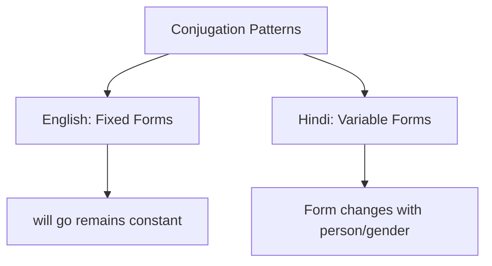

### 📋 Verb Form Comparison Table

| English | Hindi | Linguistic Property |
|---------|-------|---------------------|
| I will go. | मैं जाऊँगा। | Different morphological |
| We will go. | हम जाएँगे। | forms of word 'will go' in |
| You will go. | तुम जाओगे। | Hindi based on |
| He will go. | वह जाएगा। | person, number, and gender |
| She will go. | वह जाएगी। | |

## 💡 Key Insights

> In **morphologically-poor** languages like English, grammatical relationships are often expressed through separate words (auxiliaries, prepositions) and word order rather than through word changes.

> In **morphologically-rich** languages like Hindi, grammatical information is packed into the word itself through suffixes, prefixes, or internal changes.

## 🌟 Implications for NLP

- 🔹 **Morphologically-poor languages**: Simpler tokenization, smaller vocabulary, but more complex syntax
- 🔹 **Morphologically-rich languages**: Complex morphological analysis needed, larger vocabulary, but potentially richer semantic information within words

> 📘 **Example**: The Hindi verb जाएगी (jāegī) contains information about: gender (feminine), number (singular), tense (future), and the action (go) - all in a single word!

# 🔤 Parts-of-Speech (POS) & Syntax in NLP 📝

## 📋 Parts-of-Speech: Definition

> **Parts-of-Speech (POS)**: Grammatical class of the word.

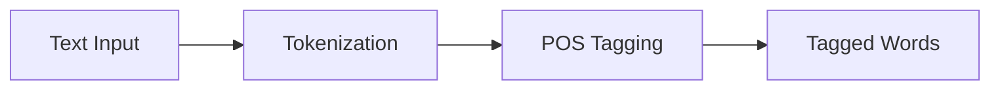

## 🏷️ POS Tagging Examples

| Word | POS Tag | Description |
|------|---------|-------------|
| He | PRP | Personal Pronoun |
| ate | VBD | Verb, Past |
| an | DT | Determiner |
| apple | NN | Noun, Singular, Mass |
| . | . | Punctuation |

## 🔄 POS Disambiguation Challenge

> 🔍 **POS disambiguation**: A word can belong to different grammatical classes.

### 📊 Example: "park" as different POS

| Sentence | Word "park" as... |
|----------|-------------------|
| He went to the **park** in a car. | **NN** (Noun) |
| They went to **park** the car in the shed. | **VB** (Verb) |

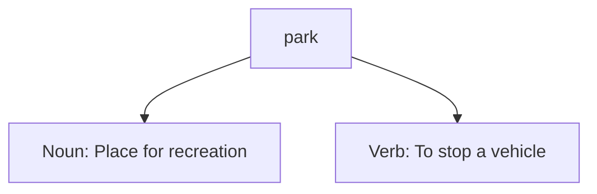

## 🏷️ Common POS Tags

| Tag | Description |
|-----|-------------|
| 🔹 PRP | Personal Pronoun |
| 🔹 VBD | Verb, Past |
| 🔹 DT | Determiner |
| 🔹 NN | Noun, Singular, Mass |
| 🔹 TO | to |
| 🔹 IN | Preposition |

## 📚 POS Tagsets

- 🔹 **45 tags** in Penn Treebank tagset
- 🔹 **146 tags** in C7

> 💡 **Note**: Larger tagsets provide more detailed grammatical information but increase complexity.

## 🌉 Connection to Syntax

> **Syntax**: Concerns the way in which words can be combined together to form (grammatical) sentences.

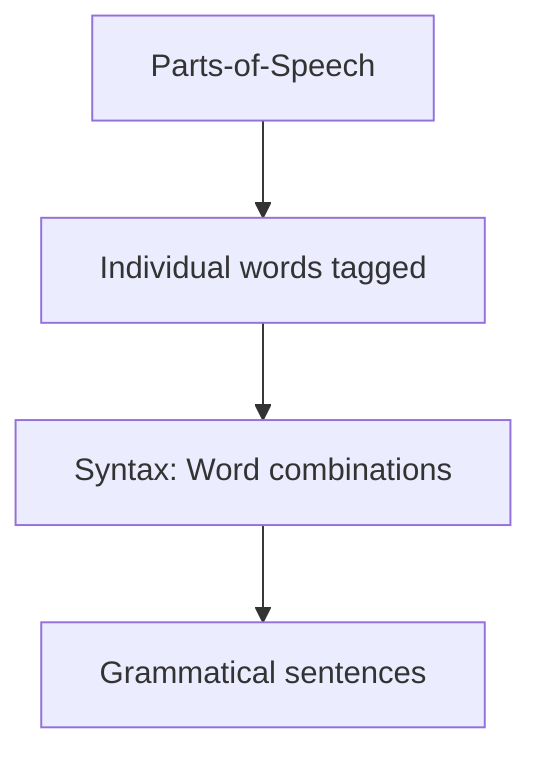

## 🔍 POS Tagging Process

```mermaid
graph LR
    A[Input Text] --> B[Tokenizer]
    B --> C[POS Tagger]
    C --> D[Disambiguation Module]
    D --> E[Context Analysis]
    E --> F[Final Tagged Text]
```

## 💡 POS Tagging Approaches

| Method | Description | Accuracy |
|--------|-------------|----------|
| 🔹 **Rule-based** | Manually crafted linguistic rules | 90-95% |
| 🔹 **Statistical** | Probability models (HMM, MEMM) | 95-97% |
| 🔹 **Neural** | Deep learning approaches | 97-98%+ |

The foundation of many NLP pipelines, POS tagging serves as a critical step between tokenization and higher-level syntactic and semantic analysis.

# 📦 Chunking in NLP 📦

## 📋 Definition

> **Chunking**: Identification of non-recursive phrases (noun, verb, etc.)

```mermaid
graph TD
    A[Text with POS Tags] --> B[Chunking Process]
    B --> C[Phrase Chunks]
    C --> D{Chunk Types}
    D --> E[NP: Noun Phrases]
    D --> F[VP: Verb Phrases]
    D --> G[PP: Prepositional Phrases]
    D --> H[Other Phrase Types]
```

## 🧩 Chunking Examples

### 🔹 Example 1: Basic Sentence

| Original Sentence | He went to the Indian city Mumbai. |
|-------------------|-----------------------------------|

Chunked as:
```
[NP He] [VP went] [PP to] [NP the Indian city Mumbai]
```

### 🔹 Example 2: Complex Sentence

| Original Sentence | Mumbai green lights women icons on traffic signals earns global praise. |
|-------------------|-----------------------------------------------------------------------|

Chunked as:
```
[NP Mumbai green lights women icons] [PP on] [NP traffic signals] [VP earns] [NP global praise]
```

## 📊 Chunking Structure Visualization

```mermaid
graph LR
    A[Sentence] --> B[NP: Noun Phrase]
    A --> C[VP: Verb Phrase]
    A --> D[PP: Prepositional Phrase]
    B --> E[Determiners + Nouns + Adjectives]
    C --> F[Verbs + Adverbs]
    D --> G[Preposition + NP]
```

## 💡 Key Characteristics of Chunking

| Feature | Description |
|---------|-------------|
| 🔹 **Non-recursive** | Chunks don't contain other chunks of the same type |
| 🔹 **Flat structure** | Simpler than full parsing trees |
| 🔹 **Partial parsing** | Middle ground between POS tagging and full parsing |
| 🔹 **Efficiency** | Faster to compute than complete syntactic analysis |

## 🔍 NLP Pipeline Position

```
Tokenization → POS Tagging → CHUNKING → Parsing → Semantic Analysis
```

Chunking serves as a crucial intermediate step that groups words into meaningful phrasal units, providing a foundation for more complex syntactic analysis without the computational expense of full parsing.

# 🌳 Syntax Processing & Syntactic Ambiguity 📊

## 📋 Syntax Processing: Validating Sentence Structure

> **Syntax Processing**: Validate the grammatical structure of the sentence.

```mermaid
graph TD
    A[Input Text] --> B[Tokenization]
    B --> C[POS Tagging]
    C --> D[Parsing]
    D --> E[Parse Tree Construction]
    E --> F[Grammaticality Validation]
```

### ✅ Grammatical Validity Examples

| Sentence | Validity | Explanation |
|----------|----------|-------------|
| He eats a mango. | ✓ Valid | Follows English syntax rules |
| He mango eats a. | ❌ Invalid | Incorrect word order |

> 💡 **Key Principle**: The sequence of words must follow the grammatical structure of the language to form a valid sentence.

### 🌳 Parse Tree Construction

```
      S
    /  |  \
   NP  VP  .
   |   / \
  PRP VBZ NP
   |   |  / \
  He eats DT NN
          |  |
          a mango
```

## 🔀 Syntactic Ambiguity: Multiple Valid Interpretations

> **Syntactic Ambiguity**: When a sentence can have multiple valid parse trees, resulting in different interpretations.

### 📊 Example: "I saw a girl with a telescope"

#### 🔍 Interpretation 1: I used a telescope to see a girl
```mermaid
graph TD
    S[S] --> NP1[NP]
    S --> VP[VP]
    S --> P[.]
    NP1 --> PRP[PRP: I]
    VP --> VBZ[VBZ: saw]
    VP --> NP2[NP]
    VP --> PP[PP]
    NP2 --> DT1[DT: a]
    NP2 --> NN1[NN: girl]
    PP --> IN[IN: with]
    PP --> NP3[NP]
    NP3 --> DT2[DT: a]
    NP3 --> NN2[NN: telescope]
```

#### 🔍 Interpretation 2: I saw a girl who had a telescope
```mermaid
graph TD
    S[S] --> NP1[NP]
    S --> VP[VP]
    S --> P[.]
    NP1 --> PRP[PRP: I]
    VP --> VBZ[VBZ: saw]
    VP --> NP2[NP]
    NP2 --> DT1[DT: a]
    NP2 --> NN1[NN: girl]
    NP2 --> PP[PP]
    PP --> IN[IN: with]
    PP --> NP3[NP]
    NP3 --> DT2[DT: a]
    NP3 --> NN2[NN: telescope]
```

## 💡 Syntax Processing Challenges

| Challenge | Description | Impact on NLP |
|-----------|-------------|---------------|
| 🔹 **Ambiguity Resolution** | Multiple valid parse trees | Requires context for disambiguation |
| 🔹 **Computational Complexity** | Parsing is computationally expensive | Limits real-time applications |
| 🔹 **Non-standard Language** | Social media, colloquialisms | Reduces parser accuracy |
| 🔹 **Cross-linguistic Variation** | Different languages have different rules | Requires language-specific parsers |

## 🧩 Parsing Approaches in NLP

- 🔹 **Rule-based parsing**: Uses formal grammar rules (CFG, PCFG)
- 🔹 **Statistical parsing**: Learns patterns from annotated data
- 🔹 **Deep learning approaches**: Neural networks for syntax modeling
- 🔹 **Dependency parsing**: Focus on relationships between words rather than phrases

The ability to correctly parse sentences and handle syntactic ambiguity is crucial for machines to understand natural language, as syntax provides the structural framework for interpreting meaning.

# 🧠 Semantics in Natural Language Processing 🌐

## 📋 Fundamental Definition

> **Semantics (and pragmatics) are the glue that connect language to the real world.**

Semantics is concerned with the meaning of words and how to combine words into meaningful phrases and sentences.

```mermaid
graph TD
    A[Semantics] --> B[Decompositional]
    A --> C[Ontological]
    A --> D[Distributional]
    style A fill:#ff9980
    style B fill:#ccffcc
    style C fill:#ccffff
    style D fill:#ffffcc
```

## 🧩 Three Approaches to Semantic Analysis

| Approach | Definition | Application in NLP |
|----------|------------|-------------------|
| 🔹 **Decompositional** | What the "components" of meaning "in" a word are | Feature-based representations, semantic primitives |
| 🔹 **Ontological** | How the meaning of the word relates to the meanings of other words | Knowledge graphs, semantic networks |
| 🔹 **Distributional** | What contexts the word is found in, relative to other words | Word embeddings, vector space models |

## 📊 Decompositional Semantics

> Divides the meaning of words into component features or semantic primitives

### Feature-Based Word Representation

| Word | Semantic Features |
|------|------------------|
| 👦 **boy** | [+human, -female, -adult] |
| 👧 **girl** | [+human, +female, -adult] |
| 👨 **man** | [+human, -female, +adult] |
| 👩 **woman** | [+human, +female, +adult] |

```mermaid
graph TD
    A[Human] --> B[Adult]
    A --> C[Non-Adult]
    B --> D[Male/Man]
    B --> E[Female/Woman]
    C --> F[Male/Boy]
    C --> G[Female/Girl]
```

### 💡 Strengths and Weaknesses

- 🔹 **Strengths**: Precise definitions, captures core meaning components, computationally tractable
- 🔹 **Weaknesses**: Difficult to capture nuance, cultural variations, and context-dependent meanings

## 🕸️ Ontological Semantics

> The meaning of a word is its relationship to other words

### 📋 Basic Semantic Relations

| Relation | Definition | Example |
|----------|------------|---------|
| 🔹 **Synonymy** | Equivalence | small, little |
| 🔹 **Antonymy** | Opposition | small, large |
| 🔹 **Hyponymy** | Subset; is-a relation | dog, mammal |
| 🔹 **Hypernymy** | Superset | mammal, dog |
| 🔹 **Meronymy** | Part-of relation | liver, body |
| 🔹 **Holonymy** | Has-a relation | body, liver |

### 🌳 WordNet: A Semantic Network

```mermaid
graph TD
    A[vehicle] --> B[wheeled vehicle]
    A --> C[self-propelled vehicle]
    B --> D[wagon/waggon]
    B --> E[car/auto/automobile/machine/motorcar]
    C --> E
    C --> F[tractor]
    E --> G[convertible]
    E --> H[accelerator/accelerator pedal/gas pedal/throttle]
```

> 📚 **WordNet** is a lexical resource that organizes words according to their semantic relations, functioning as:
> - A graph
> - A taxonomy
> - An ontology

## 📊 Distributional Semantics

> A word's meaning is determined by the contexts in which it appears

- 🔹 Based on the distributional hypothesis: "You shall know a word by the company it keeps"
- 🔹 Words appearing in similar contexts tend to have similar meanings
- 🔹 Forms the basis for modern word embeddings like Word2Vec and GloVe

```mermaid
graph LR
    A[Word] --> B[Co-occurrence patterns]
    B --> C[Vector representation]
    C --> D[Semantic similarity]
```

## 💫 Practical Applications in NLP

| Semantic Approach | NLP Applications |
|-------------------|------------------|
| 🔹 **Decompositional** | Information extraction, question answering |
| 🔹 **Ontological** | Knowledge graphs, semantic search, reasoning |
| 🔹 **Distributional** | Document classification, sentiment analysis, machine translation |

## 🌉 The Semantic-Pragmatic Interface

> While semantics deals with literal meaning, pragmatics considers context, speaker intention, and real-world knowledge

Semantics provides the foundation for understanding language, but full comprehension requires integrating multiple approaches and moving beyond literal meanings to contextual interpretations.

# 📊 Distributional Semantics: Meaning Through Context 🔍

## 📌 Core Principle

> **The meanings of words can be derived from their distributional properties in large corpora of text. It relies on the context in which words appear.**

```mermaid
graph LR
    A[Word] --> B[Context Patterns]
    B --> C[Distribution Vector]
    C --> D[Semantic Understanding]
```

## 🧩 Theoretical Foundation

Distributional semantics is based on the **distributional hypothesis** formulated by linguist J.R. Firth:

> 💡 "You shall know a word by the company it keeps."

This approach treats words as having similar meanings if they appear in similar contexts, allowing semantic relationships to emerge naturally from usage patterns.

## 📋 Co-occurrence Matrix Representation

### 📊 The Co-occurrence Matrix

| Word | leash | walk | run | owner | pet | bark |
|------|-------|------|-----|-------|-----|------|
| 🐕 **dog** | 3 | 5 | 2 | 5 | 3 | 2 |
| 🐱 **cat** | 0 | 3 | 3 | 2 | 3 | 0 |
| 🦁 **lion** | 0 | 3 | 2 | 0 | 1 | 0 |
| 💡 **light** | 0 | 0 | 0 | 0 | 0 | 0 |
| 🌳 **bark** | 1 | 0 | 0 | 2 | 1 | 0 |
| 🚗 **car** | 0 | 0 | 1 | 3 | 0 | 0 |

> **Example**: The meaning of the word "cat" can be inferred from the contexts it appears in, such as sentences where it co-occurs with words like "pet," "animal," "meow," and "feline."

## 🔍 Pattern Analysis

### 🔹 Similarity Patterns
- **dog** and **cat** have similar patterns with "walk," "pet," and "owner"
- **light** shows a completely different distribution from animal terms
- **lion** shares patterns with "cat" but appears less frequently with "pet" and "owner"

### 🔹 Vector Representation
Each word can be represented as a vector of its co-occurrence counts:
- 🐕 **dog**: [3, 5, 2, 5, 3, 2]
- 🐱 **cat**: [0, 3, 3, 2, 3, 0]

```
Semantic similarity = cosine(dog_vector, cat_vector)
```

## 💻 Modern Applications

| Technique | Description | Example Application |
|-----------|-------------|---------------------|
| 🔹 **Word Embeddings** | Dense vector representations (Word2Vec, GloVe) | Machine translation |
| 🔹 **Contextual Embeddings** | Context-sensitive representations (BERT, GPT) | Question answering |
| 🔹 **Topic Modeling** | Document-level semantic analysis | Content recommendation |
| 🔹 **Semantic Search** | Matching by meaning not just keywords | Information retrieval |

## 🚀 Advantages & Limitations

### ✅ Advantages
- 🔹 Captures semantic relationships without human annotation
- 🔹 Scales to massive vocabularies and corpora
- 🔹 Reveals latent semantic patterns
- 🔹 Enables quantitative measurement of semantic similarity

### ⚠️ Limitations
- 🔹 May miss rare word meanings
- 🔹 Struggles with polysemy (multiple meanings)
- 🔹 Requires large corpora for accuracy
- 🔹 Sensitive to domain-specific language

Distributional semantics has revolutionized NLP by providing data-driven approaches to meaning that form the foundation of modern language technologies, from search engines to virtual assistants.

# 🗣️ Pragmatics: Beyond Literal Meaning 🧠

## 📋 Core Definition

> **Pragmatics** considers [Thomas, 1995]:
> - The negotiation of meaning between speaker and listener
> - The context of the utterance
> - The intention of the user

```mermaid
graph TD
    A[Utterance] --> B[Literal Meaning]
    A --> C[Pragmatic Meaning]
    B --> D[Semantics]
    C --> E[Context]
    C --> F[Intention]
    C --> G[World Knowledge]
    E & F & G --> H[True Communicative Intent]
```

## 🌍 Context & World Knowledge Example

| Component | Content | Response |
|-----------|---------|----------|
| 🔹 **Scenario** | An employee coming late to the office | |
| 🔹 **Utterance** | "Do you know what time is it?" | |
| 🔹 **Literal Meaning** | Are you aware of the current time? | "Yes, it is 12:30 PM" |
| 🔹 **Pragmatic Meaning** | Why are you coming so late? | "I had a flat tire on my way" |

## 🎯 Intention Example

| Component | Content | Response |
|-----------|---------|----------|
| 🔹 **Utterance** | "Can you pass the water bottle?" | |
| 🔹 **Literal Meaning** | Are you able to pass the water bottle? | "Yes, I can." |
| 🔹 **Pragmatic Meaning** | Pass me the water bottle. | *[Hands over the water bottle]* |

## 💡 Semantics vs. Pragmatics: Key Differences

| Aspect | Semantics | Pragmatics |
|--------|-----------|------------|
| 🔹 **Focus** | Word and sentence meaning | Intended meaning in context |
| 🔹 **Question Answered** | "What does X mean?" | "What does speaker mean by X?" |
| 🔹 **Dependencies** | Lexicon, grammar | Context, world knowledge, social norms |
| 🔹 **Analysis Level** | Word, phrase, sentence | Utterance, discourse, conversation |

## 🚀 Why Pragmatics Matters in NLP

- 🔹 **Conversational Agents**: Enables natural, human-like interactions
- 🔹 **Intent Recognition**: Identifies user goals beyond literal statements
- 🔹 **Sentiment Analysis**: Captures implied attitudes and emotions
- 🔹 **Machine Translation**: Preserves communicative intent across languages
- 🔹 **Disambiguation**: Resolves multiple possible interpretations based on context

Pragmatics bridges the gap between what is said and what is meant, creating the foundation for truly understanding human communication in natural language processing.
# 🔄 Discourse Processing in NLP 📚

## 📋 Definition
> **Discourse**: Processing of sequence of sentences.

```mermaid
graph LR
    A[Individual Sentences] --> B[Discourse Analysis]
    B --> C[Coherent Understanding]
    C --> D[Reference Resolution]
    C --> E[Ellipsis Resolution]
    C --> F[Causal Inferences]
```

## 🌟 Example Discourse

> Mother said to John: Go to school. It is open today. Are you planning to bunk? Father will be very angry.

## 🧩 Discourse Processing Challenges

| Question | Discourse Challenge | Resolution |
|----------|---------------------|------------|
| 🔹 **What is open?** | Reference resolution | "It" refers to "school" |
| 🔹 **Bunk what?** | Ellipsis resolution | "Bunk" means skipping school |
| 🔹 **Why the father will be angry?** | Causal inference | Anger would result from John skipping school |

## 💡 Key Components of Discourse Processing

- 🔹 **Anaphora Resolution**: Determining what pronouns refer to
- 🔹 **Coreference Resolution**: Identifying when different phrases refer to the same entity
- 🔹 **Discourse Coherence**: Understanding logical connections between sentences
- 🔹 **Temporal Reasoning**: Determining sequence of events
- 🔹 **Causal Reasoning**: Inferring cause-effect relationships

## 🚀 Applications in NLP

```mermaid
graph TD
    A[Discourse Processing] --> B[Chatbots]
    A --> C[Text Summarization]
    A --> D[Question Answering]
    A --> E[Story Understanding]
```

## 🔍 Linguistic Devices in Discourse

| Device | Function | Example |
|--------|----------|---------|
| 🔹 **Pronouns** | Reference without repetition | He, she, it, they |
| 🔹 **Demonstratives** | Point to elements | This, that, these, those |
| 🔹 **Ellipsis** | Omit understood information | "I can swim and John can [swim] too" |
| 🔹 **Conjunctions** | Show relationships | And, but, so, because |
| 🔹 **Discourse markers** | Signal structure | First, moreover, however |

Discourse processing enables machines to understand text beyond the sentence level, establishing connections and coherence across multiple statements to derive meaningful interpretations of complete texts or conversations.

# 🏷️ Semantic Role Labelling (SRL) in NLP 🧠

## 📋 Definition & Purpose

> **Semantic Role Labelling (SRL)**: Identify the semantic role of each argument (noun phrase) with respect to the predicate (main verb) of the sentence.

```mermaid
graph LR
    A[Sentence] --> B[Identify Predicate]
    B --> C[Extract Arguments]
    C --> D[Assign Semantic Roles]
    D --> E[Complete Predicate-Argument Structure]
```

## 🧩 Common Semantic Roles

| Role | Definition | Example |
|------|------------|---------|
| 🔴 **Agent** | Entity performing the action | John, Ram |
| 🟢 **Patient** | Entity affected by the action | Mary, Shyam |
| 🟣 **Source** | Origin point of movement/transfer | Delhi |
| 🔵 **Destination** | End point of movement/transfer | Pune |
| 🟠 **Instrument** | Tool used to perform the action | car, hockey stick |
| 🟡 **Time** | When the action occurred | yesterday |
| 🟤 **Location** | Where the action occurred | in the park |
| ⚪ **Manner** | How the action was performed | quickly, carefully |

## 📊 Example Analysis

### 🔹 Example 1: Travel Scenario

| Word | John | drove | Mary | from | Delhi | to | Pune | in | his | car |
|------|------|-------|------|------|-------|----|----|----|----|-----|
| **Role** | 🔴 Agent | Predicate | 🟢 Patient | - | 🟣 Source | - | 🔵 Destination | - | - | 🟠 Instrument |

### 🔹 Example 2: Action Scenario

| Word | Ram | hit | Shyam | with | a | hockey | stick | yesterday |
|------|-----|-----|-------|------|---|--------|-------|-----------|
| **Role** | 🔴 Agent | Predicate | 🟢 Patient | - | - | 🟠 Instrument | - | 🟡 Time |

## 💡 SRL Benefits for NLP

- 🔹 **Enhanced Understanding**: Captures "who did what to whom, where, when, and how"
- 🔹 **Language Independence**: Semantic roles exist across languages
- 🔹 **Inference Support**: Enables logical reasoning about events
- 🔹 **Information Extraction**: Facilitates structured data extraction
- 🔹 **Question Answering**: Helps match questions to appropriate answer types

## 🚀 Applications in Advanced NLP

```mermaid
graph TD
    A[Semantic Role Labelling] --> B[Machine Translation]
    A --> C[Information Extraction]
    A --> D[Text Summarization]
    A --> E[Question Answering]
    A --> F[Event Understanding]
```

SRL bridges the gap between syntax and semantics, providing crucial structure for higher-level language understanding tasks by identifying the functional relationships between predicates and their arguments.

# 🔄 Textual Entailment in NLP 📝

## 📋 Definition

> **Textual Entailment**: Determine whether one natural language sentence entails (implies) another under an ordinary interpretation.

```mermaid
graph LR
    A[Premise Statement] --> B{Logical Relationship}
    B -->|Implies| C[Positive Entailment]
    B -->|Contradicts| D[Negative Entailment]
    B -->|Neither| E[Non-Entailment]
```

## 📊 Types of Entailment Relationships

| Premise | Hypothesis | Relationship | Type |
|---------|------------|--------------|------|
| 🔴 (Ram hit Shyam with a hockey stick yesterday.) | 🟢 Shyam got hurt. | ✅ Premise implies hypothesis | **Positive TE** |
| 🔴 (Ram hit Shyam with a hockey stick yesterday.) | 🔵 Shyam did not get hurt. | ❌ Premise contradicts hypothesis | **Negative TE** |
| 🔴 (Ram hit Shyam with a hockey stick yesterday.) | 🟡 Shyam got his first goal. | ❓ No logical connection | **Non TE** |

## 🧠 Entailment Logic Explained

- 🔹 **Positive Entailment**: If the premise is true, the hypothesis must also be true
- 🔹 **Negative Entailment**: If the premise is true, the hypothesis must be false
- 🔹 **Non-Entailment**: The premise provides no information about the truth of the hypothesis

## 💡 NLP Applications

```mermaid
graph TD
    A[Textual Entailment] --> B[Question Answering]
    A --> C[Fact Verification]
    A --> D[Information Extraction]
    A --> E[Summarization Evaluation]
```

Textual entailment serves as a fundamental component in natural language inference tasks, helping systems understand logical relationships between sentences - a critical capability for advanced language understanding.

# 🔗 Co-reference Resolution in NLP 🔍

## 📋 Definition

> **Co-reference Resolution**: Determining which phrases in a document refer to the same entity.

```mermaid
graph LR
    A[Text with Multiple References] --> B[Co-reference Resolution]
    B --> C[Entity Identification]
    C --> D[Reference Chains]
```

## 🧩 Core Concept

Two referring expressions used to refer to the same entity are said to **co-refer**.

## 🌟 Example Analysis

Let's break down the co-reference chains in the example text:

```
John shows Bob his Toyota yesterday. It's similar to the one I bought five years ago.
That was really nice, but he likes this one even better.
```

| Reference | Co-referent Expressions | Entity |
|-----------|-------------------------|--------|
| 🔹 **Entity 1** | "John", "he" | John |
| 🔹 **Entity 2** | "Bob" | Bob |
| 🔹 **Entity 3** | "his Toyota", "It", "the one", "That", "this one" | Toyota (car) |
| 🔹 **Entity 4** | "I" | Speaker |

## 🔍 Reference Types

```mermaid
graph TD
    A[Co-reference Types] --> B[Pronominal]
    A --> C[Nominal]
    A --> D[Named Entity]
    B --> B1["Pronouns (he, she, it, they)"]
    C --> C1["Definite noun phrases (the car)"]
    C --> C2["Demonstratives (this, that)"]
    D --> D1["Proper names (John, Bob)"]
```

## 💡 Resolution Challenges

- 🔹 **Ambiguity**: "his Toyota" could refer to John's or Bob's car
- 🔹 **Distance**: References can span multiple sentences
- 🔹 **World Knowledge**: Understanding that "That was really nice" refers to the car, not the showing action
- 🔹 **Gender/Number Agreement**: Matching "he" with "John" not "Toyota"

## 🚀 Applications in NLP

| Application | How Co-reference Helps |
|-------------|------------------------|
| 🔹 **Machine Translation** | Maintaining correct pronoun relationships across languages |
| 🔹 **Question Answering** | Finding complete information about entities |
| 🔹 **Summarization** | Avoiding redundant entity mentions |
| 🔹 **Information Extraction** | Building comprehensive entity profiles |
| 🔹 **Sentiment Analysis** | Tracking opinions about specific entities |

Co-reference resolution is a fundamental component for achieving true language understanding, allowing NLP systems to track entities across discourse and build coherent representations of text.

# 📊 Information Extraction in NLP 🔍

## 📋 Definition
> **Information Extraction**: Extraction of relevant piece of information from unstructured text.

```mermaid
graph TD
    A[Unstructured Text] --> B[Information Extraction]
    B --> C[Named Entity Recognition]
    B --> D[Relation Extraction]
    C --> E[Structured Data]
    D --> E
```

## 🏷️ Named Entity Recognition (NER)

- 🔹 **Purpose**: Identify names (Proper nouns) and classify them by entity types
- 🔹 **Entity Types**: Person, Organization, Location, Date, Time, etc.

### 📊 NER Example

| Text Segment | Entity Type |
|--------------|-------------|
| India | 🌍 Location |
| Sundar Pichai | 👤 Person |
| Google | 🏢 Organization |
| Alphabet | 🏢 Organization |

```
[India]Location born [Sundar Pichai]Person is the CEO of [Google]Organization and its parent company [Alphabet]Organization
```

## 🔗 Relation Extraction

- 🔹 **Purpose**: Identify meaningful relationships among entities
- 🔹 **Output**: Structured relational tuples

### 📊 Relation Example

| Relation | Entity 1 | Entity 2 |
|----------|----------|----------|
| 🔹 CEO | Sundar Pichai | Google |
| 🔹 CEO | Sundar Pichai | Alphabet |
| 🔹 Born-at | Sundar Pichai | India |
| 🔹 ParentOrg | Alphabet | Google |

```
CEO(Sundar Pichai, Google), CEO(Sundar Pichai, Alphabet), Born-at(Sundar Pichai, India), ParentOrg(Alphabet, Google)
```

## 💡 Applications of Information Extraction

- 🔹 **Knowledge Graph Construction**
- 🔹 **Automated Database Population**
- 🔹 **Question Answering Systems**
- 🔹 **Content Recommendation**
- 🔹 **Business Intelligence**

Information extraction bridges the gap between unstructured text and structured data, enabling machines to transform human language into actionable information that can be queried, analyzed, and utilized for downstream applications.

# 🔍 Word Sense Disambiguation (WSD) 📚

## 📋 Definition
> **Word Sense Disambiguation**: Determining which meaning of a word is activated by its use in a specific context.

```mermaid
graph LR
    A[Ambiguous Word] --> B[Context Analysis]
    B --> C[Sense Selection]
    C --> D[Correct Interpretation]
```

## 🧩 The Challenge

> **Core Question**: What does a word mean when it has multiple possible meanings?

| Example Sentence | Ambiguity | Possible Interpretations |
|------------------|-----------|--------------------------|
| 🔹 The fisherman went to the **bank**. | ❓ Financial bank or river bank? | Two distinct meanings of "bank" |

## 📊 Disambiguation Through Context

### Context 1: Financial Institution
```
The fisherman went to the bank to withdraw money.
```
> 💰 Here "bank" clearly refers to a financial institution.

### Context 2: River Edge
```
The fisherman went to the bank to fish.
```
> 🎣 Here "bank" clearly refers to the edge of a river.

## 💡 WSD Approaches in NLP

- 🔹 **Knowledge-based**: Using dictionaries, thesauri, and knowledge bases
- 🔹 **Supervised**: Machine learning with labeled examples
- 🔹 **Unsupervised**: Clustering word occurrences
- 🔹 **Semi-supervised**: Combination of labeled and unlabeled data

Word sense disambiguation is a fundamental task in natural language processing that impacts the performance of many applications, from machine translation to information retrieval.

# 😀 Sentiment Analysis in NLP 😡

## 📋 Definition
> **Sentiment Analysis**: Extract polarity orientation of the subjectivity in text.

```mermaid
graph LR
    A[Text Input] --> B[Sentiment Analysis]
    B --> C[Positive]
    B --> D[Negative]
    B --> E[Neutral]
```

## 📊 Sentiment Classification Examples

| Text | Sentiment | Explanation |
|------|-----------|-------------|
| 🟢 "Really superb pillow. Love to sleep on it.. very comfortable..." | ✅ Positive | Clear positive terms: "superb," "love," "comfortable" |
| 🔴 "It's a mass Chinese product. Too expensive. Thin and useless" | ❌ Negative | Negative terms: "mass product," "too expensive," "useless" |
| 🔵 "My neighbours are home and it's good to wake up at 3am in the morning." | ❓ Negative? | Sarcasm detection: "good" contradicts typical reaction to 3am wakeup |
| 🔴 "Campus has deadly snakes." | ❌ Negative | "Deadly" indicates danger and negative sentiment |
| 🔵 "Shane Warne is a deadly spinner." | ❓ Positive? | Domain-specific: "deadly" as positive in cricket context |
| 🔵 "The food was cheap." | ❓ Positive? | Ambiguous: "cheap" could be good (affordable) or bad (low quality) |
| 🔴 "Not to mention the cheap service I got at the restaurant." | ❌ Negative | Context indicates "cheap" means poor quality |
| 🟡 "Movie was 4 hours long." | ❓ Neutral? | Objective statement without clear sentiment markers |

## 🧠 Sentiment Analysis Challenges

```mermaid
graph TD
    A[Sentiment Analysis Challenges] --> B[Sarcasm & Irony]
    A --> C[Context Dependency]
    A --> D[Domain-Specific Terms]
    A --> E[Negation Handling]
    A --> F[Implicit Sentiment]
    A --> G[Mixed Sentiment]
```

## 💡 Key Approaches in NLP

| Approach | Description | Advantages |
|----------|------------|------------|
| 🔹 **Lexicon-based** | Using dictionaries of words with sentiment scores | Simple, interpretable, no training data |
| 🔹 **Machine Learning** | Supervised classification using labeled examples | Better accuracy, context awareness |
| 🔹 **Deep Learning** | Neural networks (RNNs, LSTMs, Transformers) | Captures complex patterns, contextual understanding |
| 🔹 **Hybrid Approaches** | Combining lexicons with ML/DL models | Balances rules and learning |

## 🚀 Real-World Applications

- 🔹 **Brand Monitoring**: Tracking public perception of products
- 🔹 **Customer Service**: Prioritizing negative feedback
- 🔹 **Market Research**: Understanding consumer opinions
- 🔹 **Social Media Analysis**: Measuring public sentiment
- 🔹 **Recommendation Systems**: Incorporating sentiment into suggestions
- 🔹 **Political Analysis**: Gauging public opinion on issues

Sentiment analysis faces numerous complexities in accurately interpreting human emotions and opinions, particularly with nuanced language features like sarcasm, context-dependent meanings, and domain-specific terminology.

# 🌍 Machine Translation in NLP 🔄

## 📋 Definition & Purpose

> **Machine Translation**: Given a sentence in the source language L1, convert it to the target language L2, such that the semantic (adequacy and fluency) is preserved.

```mermaid
graph LR
    A[Source Text L1] --> B[Machine Translation System]
    B --> C[Target Text L2]
    D[Preserve Semantics] --> B
    E[Maintain Fluency] --> B
```

## 🧩 Core Components of Machine Translation

| Component | Description | Importance |
|-----------|-------------|------------|
| 🔹 **Source Analysis** | Parsing and understanding input text | High |
| 🔹 **Transfer Mechanism** | Converting between language representations | Critical |
| 🔹 **Target Generation** | Producing natural output in target language | High |
| 🔹 **Language Models** | Ensuring fluent, natural-sounding output | Medium-High |

## 🚀 Evolution of Machine Translation Approaches

```mermaid
graph TD
    A[MT Approaches] --> B[Rule-Based MT]
    A --> C[Statistical MT]
    A --> D[Neural MT]
    B --> B1[Dictionary-based]
    B --> B2[Syntax-based]
    C --> C1[Phrase-based]
    C --> C2[Syntax-based]
    D --> D1[Encoder-Decoder]
    D --> D2[Transformer-based]
```

## 💡 Key Challenges in Machine Translation

- 🔹 **Linguistic Divergence**: Languages differ in grammar, word order, and structure
- 🔹 **Ambiguity Resolution**: Words with multiple meanings require context understanding
- 🔹 **Cultural Nuance**: Idioms, metaphors, and cultural references often don't translate directly
- 🔹 **Low-Resource Languages**: Limited data for many of the world's languages
- 🔹 **Evaluation Complexity**: Difficulty in automating quality assessment

## 📊 Evaluation Metrics

| Metric | Measures | Approach |
|--------|----------|----------|
| 🔹 **BLEU** | n-gram precision | Compares MT output with human references |
| 🔹 **METEOR** | Precision, recall, synonyms | More linguistic awareness than BLEU |
| 🔹 **TER** | Edit distance | Measures editing effort needed |
| 🔹 **Human Evaluation** | Overall quality | Direct assessment by bilingual evaluators |

## 🌟 Modern Applications

- 🔹 **Content Localization**: Websites, apps, and documentation
- 🔹 **Cross-lingual Communication**: Social media, messaging, email
- 🔹 **Multilingual Research**: Scientific literature translation
- 🔹 **Educational Tools**: Language learning and educational content
- 🔹 **Global Commerce**: Product information and international business

Machine translation represents one of the most challenging and practical applications of NLP, combining linguistic knowledge, statistical methods, and deep learning to bridge communication gaps across languages and cultures.
# 🌐 Machine Translation: Cross-Language Challenges 🔄

## 📋 Core Definition

> **Machine Translation**: Given a sentence in the source language L1, convert it to the target language L2, such that the semantic (adequacy and fluency) is preserved.

## 🔍 Translation Examples Analyzed

```mermaid
graph LR
    A[Source Text] --> B[Machine Translation System]
    B --> C[Target Text]
    D[Challenges] --> B
    D --> E[Gender Ambiguity]
    D --> F[Structural Differences]
    D --> G[Preposition Handling]
```

### 📊 Example Translations

| English | Hindi | Transliteration | Notes |
|---------|-------|----------------|-------|
| 🔹 "I saw a girl with telescope." | 🔹 "मैंने दूरबीन से एक लड़की को देखा।" | Maine doorbeen se ek ladki ko dekha | Preposition "with" interpreted as "using" |
| 🔹 "She is a doctor" | 🔹 "वह एक डॉक्टर है" | Vah ek doktar hai | Gender preserved in translation |
| 🔹 Hindi: "वह एक डॉक्टर है" | 🔹 English: "He is a doctor" | - | ❌ Gender ambiguity issue! |

## 💡 Translation Challenges Highlighted

| Challenge | Description | Example from Slide |
|-----------|-------------|-------------------|
| 🔹 **Gender Ambiguity** | Many languages have gender-neutral pronouns | "वह" (vah) → translated as "He" when original was "She" |
| 🔹 **Structural Differences** | Subject-verb-object ordering varies | English SVO vs. Hindi SOV structure |
| 🔹 **Preposition Handling** | Prepositions don't map 1:1 between languages | "with telescope" → "दूरबीन से" (with using telescope) |

## 🚀 Machine Translation Approaches

- 🔹 **Rule-Based MT**: Grammar rules and dictionaries
- 🔹 **Statistical MT**: Probability models from parallel corpora
- 🔹 **Neural MT**: Deep learning encoder-decoder architectures
- 🔹 **Hybrid Systems**: Combining multiple approaches

## ⚠️ Common Translation Issues

- 🔹 **Ambiguity Resolution**: Words with multiple meanings
- 🔹 **Gender Agreement**: Preserving gender across languages
- 🔹 **Idiomatic Expressions**: Non-literal phrases
- 🔹 **Cultural Context**: Culture-specific references
- 🔹 **Syntactic Reordering**: Different sentence structures

Translation systems must navigate these challenges while maintaining both adequacy (preserving meaning) and fluency (natural-sounding output) in the target language.

# 📝 Summarization in NLP 📝

## 📋 Definition & Purpose

> **Text Summarization**: Given a document, summarize the semantics (extract relevant information) in shorter length text.

```mermaid
graph LR
    A[Input Document] --> B[Summarization System]
    B --> C[Condensed Output]
    D[Preserve Key Information] --> B
    E[Reduce Length] --> B
```

## 🔍 Types of Summarization

| Type | Description | Approach | Complexity |
|------|-------------|----------|------------|
| 🔹 **Extractive** | Selects and combines existing sentences | Selection of important sentences | Medium |
| 🔹 **Abstractive** | Generates new text to express main ideas | Semantic understanding and generation | High |
| 🔹 **Hybrid** | Combines extraction and abstraction | Selection followed by reformulation | Very High |

## 💡 Core Techniques

```mermaid
graph TD
    A[Summarization Techniques] --> B[Statistical Methods]
    A --> C[Graph-Based Methods]
    A --> D[Machine Learning]
    A --> E[Deep Learning]
    B --> B1[TF-IDF]
    B --> B2[Sentence Position]
    C --> C1[TextRank]
    C --> C2[LexRank]
    D --> D1[Supervised Classification]
    E --> E1[Seq2Seq Models]
    E --> E2[Transformer Models]
```

## ⚠️ Summarization Challenges

- 🔹 **Information Preservation**: Capturing key content without losing critical details
- 🔹 **Coherence**: Ensuring logical flow in the summary
- 🔹 **Redundancy Elimination**: Removing duplicate information
- 🔹 **Domain Adaptation**: Handling specialized vocabulary in different domains
- 🔹 **Evaluation**: Measuring summary quality objectively

## 📊 Evaluation Metrics

| Metric | Description | Focus Area |
|--------|-------------|------------|
| 🔹 **ROUGE** | Recall-Oriented Understudy for Gisting Evaluation | N-gram overlap |
| 🔹 **BLEU** | Bilingual Evaluation Understudy | Precision-focused |
| 🔹 **BERTScore** | Contextual embedding similarity | Semantic similarity |
| 🔹 **Human Evaluation** | Manual assessment by humans | Overall quality |

## 🚀 Real-World Applications

- 🔹 **News Digests**: Condensing articles into headlines and brief summaries
- 🔹 **Document Summarization**: Creating executive summaries of reports
- 🔹 **Meeting Notes**: Extracting key points from transcripts
- 🔹 **Medical Records**: Summarizing patient histories
- 🔹 **Legal Document Analysis**: Condensing contracts and cases
- 🔹 **Research Paper Abstracts**: Generating summaries of scientific work

## 💫 Recent Advances

| Approach | Key Innovation | Impact |
|----------|---------------|--------|
| 🔹 **Pre-trained Models** | Using models like BART, T5 | Higher quality summaries |
| 🔹 **Multi-document** | Summarizing multiple sources | Information consolidation |
| 🔹 **Controllable Summarization** | User-defined length, style, focus | Customizable outputs |
| 🔹 **Factual Consistency** | Ensuring accuracy in generated text | Reducing hallucinations |

Text summarization continues to evolve as a critical NLP task that bridges information overload and efficient knowledge consumption by distilling the essence of content while maintaining its core meaning.

# 🤔 Question Answering in NLP 💬

## 📋 Definition & Purpose

> **Question Answering**: Answer natural language questions based on information presented in the repository.

```mermaid
graph LR
    A[Natural Language Question] --> B[QA System]
    B --> C[Information Repository]
    C --> B
    B --> D[Precise Answer]
```

## 🔍 Question Types & Examples

| Type | Description | Example Question | Example Answer |
|------|-------------|------------------|---------------|
| 🔴 **Factoid Questions** | Single, specific fact | Who is the author of the book Wings of Fire? | A. P. J. Abdul Kalam |
| 🔵 **List Questions** | Multiple items as answer | What are the islands in India? | Andaman Island, Nicobar Island, Labyrinth Island, Barren Island |
| 🟢 **Descriptive Questions** | Explanatory answers | What is Greenhouse effect? | The analogy used to describe the ability of gases in the atmosphere to absorb heat from the earth's surface. |

## 💡 QA System Components

```mermaid
graph TD
    A[Question Processing] --> B[Query Formulation]
    B --> C[Information Retrieval]
    C --> D[Answer Extraction]
    D --> E[Answer Formulation]
```

## 🧩 Key QA Approaches

- 🔹 **Retrieval-Based QA**: Finds and extracts answers from existing text
- 🔹 **Knowledge-Based QA**: Answers from structured knowledge bases
- 🔹 **Hybrid QA**: Combines multiple information sources
- 🔹 **Generative QA**: Creates new answers using language models
- 🔹 **Visual QA**: Answers questions about images

## 🚀 Advanced QA Capabilities

| Capability | Description | Complexity |
|------------|-------------|------------|
| 🔹 **Multi-hop Reasoning** | Connecting information across multiple sources | High |
| 🔹 **Conversational QA** | Maintaining context across questions | Medium-High |
| 🔹 **Complex Inference** | Reasoning beyond explicit information | Very High |
| 🔹 **Uncertainty Handling** | Expressing confidence levels in answers | Medium |

## ⚠️ QA Challenges

- 🔹 **Ambiguity Resolution**: Questions with multiple interpretations
- 🔹 **Information Synthesis**: Combining information from multiple sources
- 🔹 **Answer Verification**: Ensuring factual correctness
- 🔹 **Unanswerable Questions**: Detecting when no answer exists
- 🔹 **Complex Questions**: Questions requiring multi-step reasoning

## 🌟 Real-World Applications

- 🔹 **Search Engines**: Direct answers to user queries
- 🔹 **Virtual Assistants**: Siri, Alexa, Google Assistant
- 🔹 **Customer Support**: Automated service systems
- 🔹 **Educational Tools**: Interactive learning platforms
- 🔹 **Medical Diagnosis**: Clinical decision support

Question Answering represents one of the most natural and intuitive interfaces between humans and information systems, requiring sophisticated natural language understanding capabilities to bridge the gap between human questions and machine-accessible knowledge.
