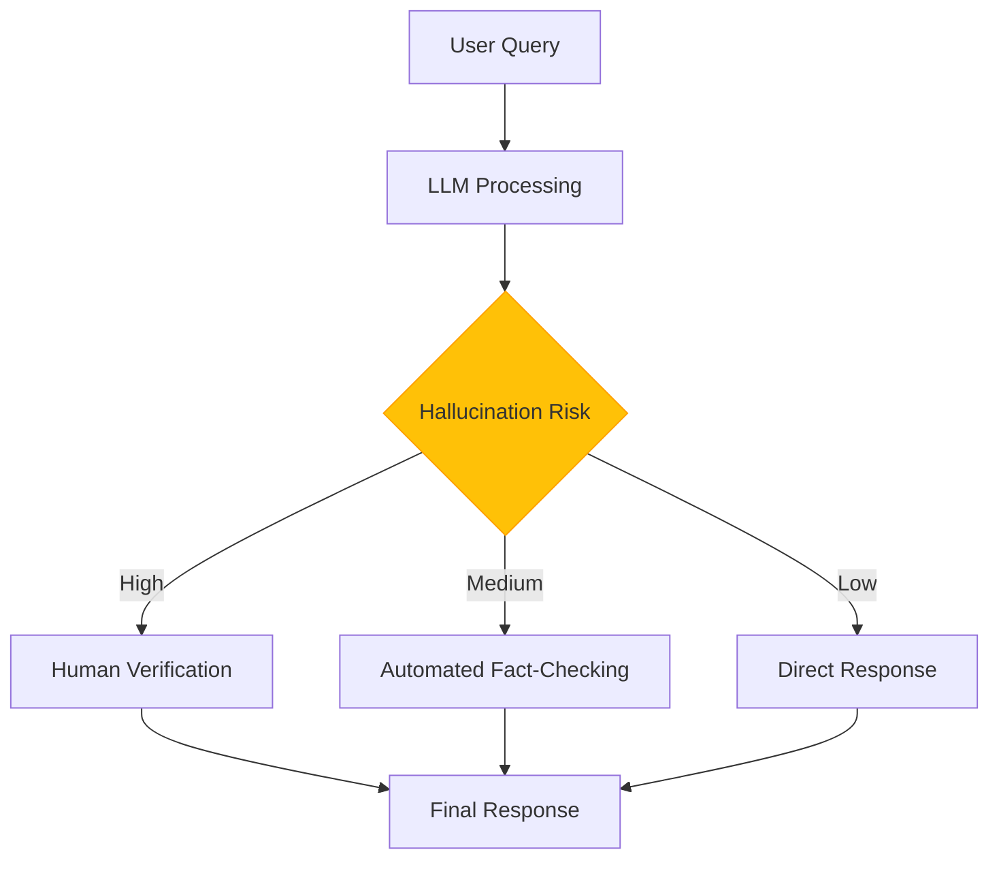

# Lec 37 | Conclusion: Expert Panel Discussion

# 🚀 LLM Research Panel Discussion: Academia & Industry Perspectives 

## 📋 Session Overview

This document summarizes the concluding panel discussion for a course on Large Language Models (LLMs). The panel featured experts from both academia and industry discussing the current landscape of LLM research, challenges, and future directions.

### 👥 Panelists

| Name | Role | Affiliation |
|------|------|-------------|
| Tanmay | Faculty (Moderator) | IIT Delhi |
| Jatin | Conversational AI Researcher | IBM Research |
| Gorab Pandi | Research Scientist | IBM Research |
| Sish Kas Gupta | Professor | Ilaani Institute of Information and Communication Technology |
| Anoi | PhD Student | IIT Delhi |

## 🔍 Key Discussion Topics

### 1️⃣ Deploying LLMs in Real-World Applications

- 🏢 **Scale challenges**: Smaller companies can't develop their own LLMs
  > "Many small scale industries right they will not have capabilities to develop these language models on their own... that is why these are being served as a service."

- 🔒 **Privacy concerns**: Client data going to external servers
- 🤥 **Hallucination issues**: Need for verification and guardrails
  > "Currently the way language models are used, you always have a verifier at the end... hallucination is the biggest challenge at this point in time."

### 2️⃣ Data Challenges for LLM Training

- 📊 **Data scarcity solutions**:
  - Synthetic data generation approaches
  - Chain of thought data generation
  - Search techniques for higher quality data

- 🏥 **Domain-specific applications** (e.g., healthcare):
  - Converting documents to question-answer formats
  - Document summarization for medical/finance documents

- ©️ **Copyright and ethical concerns**:
  - Federated learning where data stays on-premise
  - Legal team verification of training data

### 3️⃣ Industry-Academia Partnership

- 🤝 **Collaboration benefits**:
  - Industry provides resources and real-world problems
  - Academia contributes independent thinking and "blue sky" research

- 🔐 **Research publication concerns**:
  - Some companies keep high-value research confidential
  - Only low-value research gets published

- 🌐 **Future outlook**:
  > "First mover's advantage... with many of the companies if they found an algorithm better than what they have currently, they will probably release the current algorithm."

### 4️⃣ Teaching NLP in the LLM Era

- 📚 **Curriculum adaptation**:
  - Start with classical NLP fundamentals (3 weeks)
  - Teach how heuristics become inductive biases in neural models
  - Show correspondence between modern models and probabilistic graphical models (CRF, HMM)

### 5️⃣ Academic Research with Limited Resources

- 💻 **Computing constraints**:
  - Need for state-level consortiums and government support
  - Maintenance challenges of shared resources

- 🔄 **Industry collaboration as solution**:
  > "Whenever I feel that I need large resources, I just go and talk to industries... they are actually happy to collaborate."

### 6️⃣ Student Perspective on LLM Research

- 🔄 **India vs. abroad research quality**:
  - Similar quality but different volume
  - Improving opportunities with big tech research labs in India

- 🛠️ **Resource constraint workarounds**:
  - Start with interpretability on toy models
  - Collaborate with industry for larger experiments
  - Convert models to more efficient frameworks (e.g., JAX)

### 7️⃣ Future Directions in LLM Research

- 📈 **Scaling laws and alternatives**:
  - Running out of training data eventually
  - Role of synthetic data in future development
  - Alternative models like Colon models with fewer parameters
  - Neurosymbolic techniques and logic-driven approaches

- 🧩 **Specialized models vs. general models**:
  > "Do we really need one model which can do everything or do we need specialized models? And if we have specialized task or specialized domains, then can smaller models suffice?"

### 8️⃣ Human-AI Collaboration

- 🤖 **Current integration**:
  - Already part of daily life (e.g., WhatsApp with LLaMA)
  - AI as assistant for coding, email drafting, etc.

- 🔮 **Future potential**:
  - Questions about AI as autonomous agents

## 💡 Advice for Students

1. **Don't forget fundamentals**:
   > "The fundamentals of machine learning, the fundamentals of NLP... are extremely important if you really want to understand and build on LLMs."

2. **Transfer knowledge to real problems**:
   > "The real use case will be if they could apply if they can transfer that knowledge to a new problem."

3. **Develop coding skills**:
   - PyTorch/Python for AI models
   - Data analysis skills

4. **Understand inner workings**:
   > "Can you write a transformer layer without using hugging face? Can you write plain PyTorch code?"

5. **Make informed decisions about studying abroad**:
   > "At least come work with us for few months and then decide."

## 🏁 Conclusion

The panel provided valuable insights from both academia and industry perspectives on the current state and future of LLM research. The discussion emphasized the importance of fundamentals, collaborative approaches to overcome resource constraints, and the potential for more efficient and specialized models in the future.

# 🤖 Deploying LLMs in Real-World Applications 📊

## 📋 Overview of Deployment Challenges

The panel discussion highlighted several critical challenges that organizations face when attempting to deploy Large Language Models (LLMs) in real-world business applications. These challenges represent both technical and operational hurdles that must be addressed for successful implementation.

### 🏢 Scale & Resource Challenges

Many small-scale industries don't have the capabilities to develop language models on their own. This is why LLMs are increasingly being served as a service rather than deployed on-premise.

> "If you're trying to deploy on-prem, then that requires another level of expertise." - Jatin, IBM Research

#### 📈 Evolution of Deployment Models

| Past Deployment Model | Current Trend | Future Direction |
|----------------------|---------------|------------------|
| On-premise neural networks | Cloud-based LLM services | Specialized domain-specific models |
| Company-specific training | Pre-trained with fine-tuning | More efficient smaller models |
| Direct hardware control | API-based integration | Hybrid deployment options |

### 🔒 Privacy & Security Concerns

When LLMs are run on the cloud by a few experts, it brings challenges such as privacy concerns. Clients' data going to external servers raises questions about trust and data security.

#### 🛡️ Key Security Considerations

- Data transmission security between client and LLM service
- Storage protection for sensitive queries and responses
- Access controls for model interactions
- Compliance with regional data protection regulations
- Intellectual property protection for proprietary information

### 🤥 Hallucination Management

The biggest challenge currently is hallucination. Models require human verification and cannot work autonomously. Without a verifier, organizations are vulnerable to potential misuse or misinformation.

> "Currently the way language models are used, you always have a verifier at the end... without an adversary at the end, you are doomed."

#### ⚠️ Hallucination Risk Framework

## 🔍 Implementation Strategies

### 💡 Practical Approaches for Organizations

1. **Start with guided implementation**
   - Begin with narrowly defined use cases
   - Implement strong verification processes
   - Collect feedback for continuous improvement

2. **Consider hybrid deployment models**
   - Use cloud services for general capabilities
   - Deploy specialized models on-premise for sensitive operations
   - Implement federated learning where appropriate

3. **Establish robust guardrails**
   - Define clear boundaries for model responses
   - Create verification workflows for critical applications
   - Develop fallback mechanisms for uncertain responses

4. **Prioritize transparency**
   - Clearly communicate LLM capabilities and limitations to users
   - Document processes for handling inaccuracies
   - Maintain human oversight for sensitive domains

## 🚀 Future Outlook

The panel suggested that as LLM technology matures, we may see:

- More specialized, domain-specific models replacing general-purpose solutions
- Better techniques for controlling hallucinations without human verification
- Improved methods for deploying powerful models with smaller resource footprints
- Enhanced privacy-preserving techniques that allow sensitive data processing
