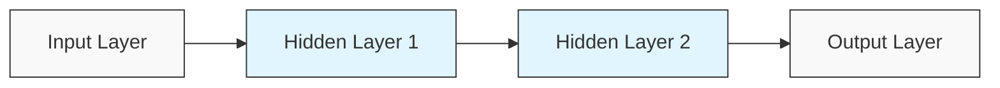
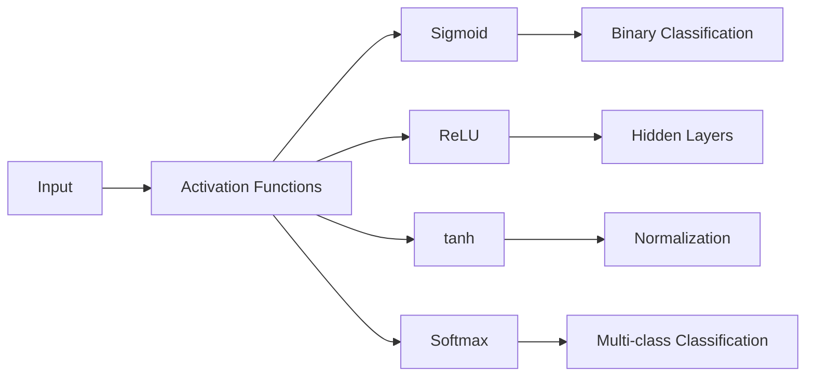

# Lec 05 : Introduction to Deep Learning

# Evolution of Neural Networks: Historical Timeline 🧠

Let me help break down and organize this important historical progression in neural network development. I notice you've outlined some key milestones from the 1940s to 1980s.

## 1. McCulloch & Pitts Neural Model (1943) 🔬
The foundational work that started it all:
- Introduced the first mathematical model of a neural network
- Demonstrated how simple neural units could perform logical operations
- Established the binary threshold concept (all-or-nothing activation)

## 2. Rosenblatt's Perceptron (1957-1958) 📈
Frank Rosenblatt made significant advances:
- Developed the Perceptron algorithm for supervised learning
- Introduced weights and adjustable parameters
- Demonstrated ability to learn pattern recognition tasks
- Pioneered binary classification capabilities

## 3. Multi-Layer Perceptron Era (1965-1968) 🔄
Key developments:
- Extended single-layer architecture to multiple layers
- Increased network complexity and capabilities
- Enabled more complex pattern recognition tasks
- Laid groundwork for deeper architectures

## 4. Minsky & Papert's Analysis (1969) ⚠️
Critical examination of neural networks:
- Published "Perceptrons" book highlighting limitations
- Demonstrated single-layer perceptrons couldn't solve XOR problem
- Led to decreased funding and research interest
- Created the "AI Winter" in neural network research

## 5. Renaissance Period (1986-1989) 🌟
### Back-propagation & Universal Approximation Theorem
Major breakthroughs:
- Development of efficient back-propagation algorithm
- Proof of Universal Approximation Theorem (UAT)
- Demonstrated MLPs with single hidden layer could approximate continuous functions
- Renewed interest in neural network research

## Key Achievement: Universal Approximation Theorem 📊
Important implications:
- Proved MLPs with single hidden layer are universal approximators
- Can approximate any continuous function with desired accuracy
- Provided theoretical foundation for deep learning
- Demonstrated practical potential of neural networks

# Evolution of Neural Networks: Historical Timeline 🧠

## 1. McCulloch & Pitts Neural Model (1943) 🧠🔬

| Key Contribution | Description |
|------------------|-------------|
| 📐 Mathematical Foundation | First mathematical model simulating neural behavior |
| ⚡ Logical Operations | Demonstrated how neural units could perform basic logic (AND, OR, NOT) |
| 📊 Binary Threshold | Introduced the concept of all-or-nothing activation |

> 💡 **Historical Impact**: This foundational work created the conceptual bridge between biological neurons and computational units that would eventually lead to modern artificial neural networks.

## 2. Rosenblatt's Perceptron (1957-1958) 📈🔄

| Innovation | Significance |
|------------|-------------|
| 🧮 Learning Algorithm | First trainable neural network model |
| ⚖️ Weighted Connections | Introduced adjustable parameters for learning |
| 🎯 Pattern Recognition | Demonstrated ability to classify simple visual patterns |
| 🔄 Adaptive Behavior | Could improve performance through training examples |

> 💡 **Key Insight**: The perceptron proved machines could learn from examples rather than being explicitly programmed for every task.

## 3. Multi-Layer Perceptron Era (1965-1968) 🔄🔍

| Advancement | Capability |
|-------------|------------|
| 📚 Layer Architecture | Extended single-layer design to multiple processing layers |
| 🧩 Increased Complexity | Enhanced the network's representational capacity |
| 🔍 Feature Hierarchy | Enabled more sophisticated pattern recognition |
| 📈 Complexity Scaling | Laid groundwork for deeper architectures |

## 4. Minsky & Papert's Analysis (1969) ⚠️📉

| Finding | Consequence |
|---------|-------------|
| ❌ XOR Problem | Proved single-layer perceptrons couldn't solve nonlinear problems |
| 📕 "Perceptrons" Book | Comprehensive critique of neural network limitations |
| 💸 Funding Impact | Led to significant reduction in research investment |
| ❄️ AI Winter | Triggered period of diminished interest and progress |

> ⚠️ **Critical Setback**: The mathematical proof of perceptron limitations nearly ended neural network research altogether, delaying progress by almost two decades.

## 5. Renaissance Period (1986-1989) 🌟🚀

### Back-propagation & Universal Approximation Theorem

| Breakthrough | Impact |
|--------------|--------|
| ⏪ Back-propagation | Efficient algorithm for training multi-layer networks |
| 🌐 Universal Approximation | Theoretical proof of neural network capabilities |
| 🧪 Practical Implementation | Enabled training of deeper, more complex networks |
| 🔬 Research Revival | Renewed scientific and commercial interest |

## Key Achievement: Universal Approximation Theorem 📊🔍

```
f(x) ≈ ∑ᵢ wᵢσ(vᵢᵀx + bᵢ)
```

| Theoretical Implication | Practical Application |
|-------------------------|----------------------|
| 📐 Function Approximation | Any continuous function can be approximated |
| 🎛️ Single Hidden Layer | Minimal architecture with maximum theoretical power |
| 🎯 Accuracy Control | Error can be made arbitrarily small with sufficient neurons |
| 🧮 Mathematical Foundation | Provided theoretical justification for neural networks |

> 💡 **Revolutionary Insight**: The UAT proved that neural networks weren't just experimental models but had solid mathematical foundations as universal function approximators.

---

### 📌 Summary Timeline

1. **1943**: McCulloch & Pitts lay mathematical foundations
2. **1957-1958**: Rosenblatt develops the trainable Perceptron
3. **1965-1968**: Researchers explore multi-layer architectures
4. **1969**: Minsky & Papert publish limitations analysis
5. **1970-1985**: AI Winter period of reduced research
6. **1986-1989**: Renaissance through back-propagation and UAT


# Neurons: In Deep Learning and the Human Brain

## Biological Neurons

Biological neurons are the fundamental cells of the nervous system. The human brain contains approximately 86 billion neurons, forming an intricate network for information processing.

### Structure
- **Cell Body (Soma)**: Contains the nucleus and maintains cellular functions
- **Dendrites**: Branch-like structures that receive signals from other neurons
- **Axon**: A long projection that transmits electrical signals to other neurons
- **Axon Terminals**: End points that release neurotransmitters
- **Myelin Sheath**: Insulating layer around axons that speeds up signal transmission

### Function
- Neurons communicate through electrochemical signals
- When a neuron receives sufficient input to exceed its threshold, it "fires" (action potential)
- Signals cross synapses (gaps between neurons) via neurotransmitters
- Each neuron may connect to thousands of others, forming complex circuits
- Neural plasticity allows connections to strengthen or weaken over time (the basis of learning)

## Artificial Neurons

In deep learning, neurons are mathematical models inspired by biological neurons but greatly simplified.

### Structure
- **Inputs**: Receive numerical values (analogous to dendrites)
- **Weights**: Values that determine the importance of each input
- **Bias**: An additional parameter that helps the neuron activate properly
- **Activation Function**: Determines whether and how strongly the neuron fires
- **Output**: The signal sent to other neurons (analogous to axon transmission)

### Function
- An artificial neuron computes a weighted sum of its inputs: Σ(weight × input) + bias
- This sum passes through an activation function (like ReLU, sigmoid, or tanh)
- The resulting output value is passed to connected neurons in the next layer
- During training, weights and biases are adjusted to minimize errors in prediction

## Similarities and Differences

### Similarities
- Both receive multiple inputs and produce an output
- Both have a threshold-like mechanism for activation
- Both form networks where collective activity creates complex behaviors
- Both can learn from experience (though through very different mechanisms)

### Differences
- Biological neurons are vastly more complex than artificial ones
- Brain neurons use sparse, spike-based communication; artificial neurons use continuous values
- A single biological neuron can perform operations that might require many artificial neurons
- Biological neurons operate on multiple timescales and use various neurotransmitters
- Artificial neurons typically perform identical mathematical operations, while biological neurons have diverse functions and properties

While artificial neural networks have made impressive strides in pattern recognition and learning, they remain highly simplified abstractions of the incredible complexity found in biological neural systems.

# MPNET and Neural Models

Based on your document, I'll explain MPNET (also written as "mpet" in the text) and how it relates to neurons in machine learning.

## MPNET: A Simple Neuron Model

MPNET is a simplified neuron model with the following characteristics:

### Structure and Operation
- **Binary Inputs**: All inputs (X₁, X₂, X₃, etc.) can only be 0 or 1
- **Binary Output**: The output (Y) is also binary (0 or 1)
- **Threshold Activation**: It sums all inputs and compares to a threshold (θ or S)
- **Decision Rule**: If sum ≥ threshold, output = 1; otherwise, output = 0

The function can be represented as:
- Y = 1 if (X₁ + X₂ + ... + Xₙ) ≥ θ
- Y = 0 otherwise

### Boolean Logic Implementation
MPNET can implement basic Boolean operations:

#### AND Operation
- Truth table: (0,0)→0, (0,1)→0, (1,0)→0, (1,1)→1
- Implementation: Set threshold θ = 2
- Decision boundary: X₁ + X₂ = 2

#### OR Operation
- Truth table: (0,0)→0, (0,1)→1, (1,0)→1, (1,1)→1
- Implementation: Set threshold θ = 1
- Decision boundary: X₁ + X₂ = 1

### Limitations
The key limitation of MPNET is that it can only classify linearly separable problems. As mentioned in your document, it cannot implement XOR operation because XOR requires a non-linear decision boundary.

This limitation was famously identified by Minsky and Papert around 1968-1969, which contributed to the first "AI winter" as they demonstrated that single-layer perceptrons (similar to MPNET) were severely limited.

## Perceptron: Evolution of MPNET

The perceptron, proposed in 1957, addressed some limitations of MPNET:

### Key Differences
- **Real-valued Inputs**: Inputs can be any real numbers, not just binary
- **Weighted Connections**: Each input has an associated weight (W₁, W₂, W₃)
- **Importance Modeling**: Weights represent the relative importance of each input

The perceptron computes a weighted sum: W₁X₁ + W₂X₂ + ... + WₙXₙ, which is then compared to a threshold.

However, even the perceptron faces the same fundamental limitation as MPNET: it cannot solve problems that aren't linearly separable, such as XOR.

## Connection to Modern Neural Networks

This historical context helps understand why modern neural networks:
- Use multiple layers (to overcome the XOR problem)
- Employ non-linear activation functions
- Require more complex training algorithms

The limitations of these early models directly influenced the development of multilayer networks and backpropagation, which eventually led to today's deep learning revolution.

# 🧠 MPNet (Perceptron Model) & Neurons in Deep Learning 📊

## 📘 MPNet (Simple Neuron Model)

MPNet (referred to as "impet" in the transcript) represents one of the earliest and simplest computational neuron models in machine learning history.

### 🔍 Key Characteristics

| Feature | Description |
|---------|-------------|
| Inputs | Binary (0 or 1) values only |
| Output | Binary (0 or 1) result |
| Processing | Simple summation compared against threshold |
| Decision Boundary | Linear only |

### ⚙️ How MPNet Works

```
Inputs (X₁, X₂, X₃, ..., Xₙ) → Sum all inputs → Compare with threshold → Output (0 or 1)
```

The computation follows this rule:
- If ∑Xᵢ ≥ threshold (θ) → Output = 1
- Otherwise → Output = 0

### 🧮 Boolean Operations with MPNet

#### 📋 AND Operation
```
Threshold (θ) = 2
```

| X₁ | X₂ | Sum | Output |
|----|----|----|--------|
| 0 | 0 | 0 | 0 (< 2) |
| 0 | 1 | 1 | 0 (< 2) |
| 1 | 0 | 1 | 0 (< 2) |
| 1 | 1 | 2 | 1 (= 2) |

#### 📋 OR Operation
```
Threshold (θ) = 1
```

| X₁ | X₂ | Sum | Output |
|----|----|----|--------|
| 0 | 0 | 0 | 0 (< 1) |
| 0 | 1 | 1 | 1 (= 1) |
| 1 | 0 | 1 | 1 (= 1) |
| 1 | 1 | 2 | 1 (> 1) |

## ⚠️ Limitations of MPNet

The critical limitation discovered by Minsky and Papert (around 1968-1969) was that MPNet cannot model non-linearly separable functions.

### 🚫 XOR Problem
XOR cannot be implemented with a single MPNet because it requires a non-linear decision boundary:

| X₁ | X₂ | XOR Output |
|----|----|----|
| 0 | 0 | 0 |
| 0 | 1 | 1 |
| 1 | 0 | 1 |
| 1 | 1 | 0 |

This limitation led to the first AI winter as researchers believed neural networks were fundamentally limited.

## 🔄 Evolution to Perceptron

The perceptron (proposed in 1957) expanded on the MPNet concept with:

| Enhancement | Description |
|-------------|-------------|
| Real-valued inputs | Not limited to binary values |
| Weighted connections | Each input has an importance factor (W₁, W₂, etc.) |
| Decision function | Computes weighted sum: ∑(Wᵢ×Xᵢ) compared to threshold |

The perceptron formula: 
```
Output = f(∑(Wᵢ×Xᵢ) + bias)
```

Where f is an activation function (originally a step function).

## 🌟 Conceptual Comparison with Biological Neurons

| Biological Neuron | MPNet/Perceptron |
|-------------------|------------------|
| Dendrites | Input connections |
| Cell body | Summation function |
| Action potential threshold | Activation threshold |
| Axon | Output connection |
| Synapse strength | Connection weights |

## 💡 Historical Significance

The MPNet and early perceptron models, despite their limitations, laid the foundation for modern deep learning by establishing the basic computational unit that would later be connected in multi-layer networks to overcome the XOR problem and other non-linear challenges.

# Neural Network Evolution: From Perceptrons to MLPs 🧠🔄

## Introduction to Perceptron Architecture 🔍

The text discusses the evolution of neural network models, focusing on how perceptrons improved upon the limitations of earlier models like the M-P neuron (MPET).

### Key Historical Context 📜
- **Minsky and Papert (1968-1969)** demonstrated that simple perceptrons couldn't classify XOR operations
- **Perceptron was proposed in 1957** as an improvement over the M-P neuron

## Perceptron Structure 🏗️

![Perceptron Architecture]

### Components of a Perceptron ⚙️
| Component | Description | Purpose |
|-----------|-------------|---------|
| Inputs (X₁, X₂, X₃) | Real numbers (not just Boolean) | Feature inputs to the model |
| Weights (W₁, W₂, W₃) | Numerical values | Indicate preference/importance of each input |
| Bias (W₀) | Additional parameter | Shifts the decision boundary |
| Summation | W₁X₁ + W₂X₂ + W₃X₃ + W₀ | Weighted sum of inputs plus bias |
| Activation (G) | Signum function | Transforms sum into discrete output |

### Key Advantage Over MPET 💡
Unlike the M-P neuron where all inputs are treated equally, perceptrons introduced **weights** to give different importance to different features.

### Real-World Analogy 🎬
> **Movie Decision Example**: When deciding whether to watch a movie, different people weigh features differently:
> - For a Shah Rukh Khan fan, the lead actor might be the most important feature
> - For others, the director, producer, or ticket cost might be more important

## Activation Functions ⚡

The perceptron initially used the **Signum function**:
```
G(x) = -1 if x < 0
G(x) = 0 if x = 0
G(x) = +1 if x > 0
```

Later modified to a binary function:
```
G(x) = 0 if x < z
G(x) = 1 if x ≥ z
```

## Logical Function Implementation 🧮

### AND Function
For inputs X₁ and X₂:
- Parameters: W₁ = 1, W₂ = 1, W₀ = -1.5
- Formula: X₁ + X₂ - 1.5
- When both inputs are 0: 0 + 0 - 1.5 = -1.5 → Output: 0
- When one input is 1: 1 + 0 - 1.5 = -0.5 → Output: 0
- When both inputs are 1: 1 + 1 - 1.5 = 0.5 → Output: 1

### OR Function
- Parameters: W₁ = 1, W₂ = 1, W₀ = -0.5
- Similar calculation pattern to AND function

## The XOR Problem ❌

Despite these improvements, perceptrons still couldn't implement the XOR function because:
- Perceptrons can only create linear decision boundaries
- XOR requires non-linear separation

## Multi-Layer Perceptron (MLP) 🔄

To solve the XOR problem, researchers developed the Multi-Layer Perceptron with:

### MLP Architecture 🏛️
- **Input layer**: Initial features
- **Hidden layers**: One or more intermediate processing layers
- **Output layer**: Final results

### Key Innovations 🌟
- **Non-linear activation functions**: Introduced true non-linearity
- **Multiple layers**: Allowed for complex transformations
- **Feed-forward structure**: Information flows in one direction

### Historical Context 📚
The text mentions that while early neural networks (1960s-1970s) tried to mimic the human brain, modern deep learning models focus more on effectiveness and complexity rather than biological accuracy.

> "These days nobody cares about human brain... the task is essentially to make these models more complex, more effective... doesn't matter whether they mimic human brain or not."

## Key Evolution Timeline 📈

1. **M-P Neuron (MPET)**: Simple summation with equal weights
2. **Perceptron**: Added weights to inputs but still linear
3. **Multi-Layer Perceptron**: Added layers and non-linear activation functions

This evolution shows how neural networks developed from simple linear classifiers to the complex architectures that enable today's deep learning models.

# XOR Operation in Multi-Layer Perceptrons 🧮🔄

## Understanding the XOR Problem 🔍

XOR (exclusive OR) is a logical operation that outputs true only when inputs differ:

| X₁ | X₂ | XOR Result |
|:--:|:--:|:----------:|
| 0  | 0  |     0      |
| 0  | 1  |     1      |
| 1  | 0  |     1      |
| 1  | 1  |     0      |

> 💡 **Key Challenge**: The XOR function cannot be solved with a single-layer perceptron because it is not linearly separable.

## Why Single-Layer Perceptrons Fail ❌


Single-layer perceptrons can only create linear decision boundaries:
- They can implement AND (all inputs must be 1)
- They can implement OR (at least one input must be 1)
- They **cannot** implement XOR (inputs must differ)

## MLP Architecture for XOR Implementation 🏗️

```
   Inputs    Hidden Layer    Output
    ┌─┐         ┌─┐
X₁ ─┤ ├────┬────┤ ├─ H₁       ┌─┐
    └─┘    │    └─┘      ┌────┤ ├─ Y
           │             │    └─┘
           │    ┌─┐      │
X₂ ─┤ ├────┴────┤ ├─ H₂ ─┘
    └─┘         └─┘
```

### Component Configuration ⚙️

| Component | Function | Weights & Bias |
|-----------|----------|----------------|
| H₁ | Implements OR | W₁₁ = 1, W₁₂ = 1, b₁ = -0.5 |
| H₂ | Implements AND | W₂₁ = 1, W₂₂ = 1, b₂ = -1.5 |
| Y | Implements H₁ AND (NOT H₂) | W₁ = 1, W₂ = -1, b = -0.5 |

## Step-by-Step XOR Computation Process 🔢

### 1️⃣ Hidden Layer Computations

#### For inputs (0,0):
- H₁: Signum(0×1 + 0×1 - 0.5) = Signum(-0.5) = 0 ⟹ OR gate: false
- H₂: Signum(0×1 + 0×1 - 1.5) = Signum(-1.5) = 0 ⟹ AND gate: false

#### For inputs (0,1):
- H₁: Signum(0×1 + 1×1 - 0.5) = Signum(0.5) = 1 ⟹ OR gate: true
- H₂: Signum(0×1 + 1×1 - 1.5) = Signum(-0.5) = 0 ⟹ AND gate: false

#### For inputs (1,0):
- H₁: Signum(1×1 + 0×1 - 0.5) = Signum(0.5) = 1 ⟹ OR gate: true
- H₂: Signum(1×1 + 0×1 - 1.5) = Signum(-0.5) = 0 ⟹ AND gate: false

#### For inputs (1,1):
- H₁: Signum(1×1 + 1×1 - 0.5) = Signum(1.5) = 1 ⟹ OR gate: true
- H₂: Signum(1×1 + 1×1 - 1.5) = Signum(0.5) = 1 ⟹ AND gate: true

### 2️⃣ Output Layer Computation

- Y = Signum(H₁×1 + H₂×(-1) - 0.5)

#### Results for all input combinations:
- (0,0): Y = Signum(0×1 + 0×(-1) - 0.5) = Signum(-0.5) = 0 ✓
- (0,1): Y = Signum(1×1 + 0×(-1) - 0.5) = Signum(0.5) = 1 ✓
- (1,0): Y = Signum(1×1 + 0×(-1) - 0.5) = Signum(0.5) = 1 ✓
- (1,1): Y = Signum(1×1 + 1×(-1) - 0.5) = Signum(-0.5) = 0 ✓

## Functional Composition Insight 🧩

The XOR operation is implemented as a composition of simpler operations:

```
XOR = (OR) AND (NOT AND)
```

This demonstrates how MLPs can create complex decision boundaries by combining simpler functions.


## Mathematical Representation 📐

The full computation can be expressed as:

$$Y = G(W_1 \cdot H_1 + W_2 \cdot H_2 + b_Y)$$

Where:
- $H_1 = G(W_{11} \cdot X_1 + W_{12} \cdot X_2 + b_1)$
- $H_2 = G(W_{21} \cdot X_1 + W_{22} \cdot X_2 + b_2)$
- $G$ is the activation function (Signum)

## Key Insights About MLP and XOR 🌟

1. **Non-linear Separation**: The MLP creates a non-linear decision boundary essential for XOR
2. **Layer Necessity**: At least one hidden layer is required to solve XOR
3. **Computational Power**: MLPs with sufficient hidden units are universal function approximators
4. **Functional Decomposition**: Complex functions can be broken down into combinations of simpler functions

> 🔑 **Core Principle**: The power of MLPs comes from their ability to transform the input space through hidden layers, making previously non-separable problems separable in the transformed space.

## Practical Applications Beyond XOR 🚀

The same principles that allow MLPs to solve XOR enable them to:

- Recognize complex patterns in data
- Perform non-linear classification tasks
- Approximate arbitrary functions
- Serve as building blocks for deep learning architectures

This fundamental capability is what led to the resurgence of neural networks after the initial limitations of single-layer perceptrons were discovered.

# 🧠 Neural Networks: Multilayer Perceptrons & Activation Functions 🔄

## 📊 Architecture Overview

The document presents a detailed explanation of multilayer perceptrons (MLPs) and activation functions, which form the core of neural network architectures.

### 🏗️ MLP Structure



> 📝 **Note**: Sometimes only the hidden layers are counted when referring to the number of layers in a neural network. For example, a network with two hidden layers plus input and output layers might be called a "two-layer network."

## 🔢 Mathematical Notation

| Symbol | Description |
|--------|-------------|
| X₁, X₂, ..., Xₙ | Input values |
| W_ji^(l) | Weight from unit i to unit j in layer l |
| a_j^(l) | Aggregation (pre-activation) at neuron j in layer l |
| z_j^(l) | Output (post-activation) at neuron j in layer l |
| h() | Activation function |
| W_j0^(l) | Bias term for neuron j in layer l |

## ⚙️ Neuron Operations

Each neuron performs two key operations:

1. **📊 Aggregation Operation**: Calculates weighted sum of inputs
2. **📈 Activation Function**: Applies non-linearity to the aggregated input

### 🔄 Forward Propagation Equations

#### First Hidden Layer:

```
a_j^(1) = ∑(i=1 to n) W_ji^(1) * x_i + W_j0^(1)
```

```
z_j^(1) = h(a_j^(1))
```

> 🔍 Here, a_j^(1) is the pre-activation output, and z_j^(1) is the post-activation output

#### Second Hidden Layer:

```
a_j^(2) = ∑(m=1 to M) W_jm^(2) * z_m^(1) + W_j0^(2)
```

```
z_j^(2) = h(a_j^(2))
```

#### Output Layer:

```
y_k = ∑(m=1 to M) W_km^(2) * z_m^(2) + W_k0^(2)
```

## 📈 Activation Functions

Activation functions introduce non-linearity, which is crucial for neural networks to learn complex patterns.

### 🔍 Types of Activation Functions

| Function | Equation | Derivative | Properties |
|----------|----------|------------|------------|
| Linear | g(x) = x | g'(x) = 1 | Constant derivative; limited learning capability |
| Constant | g(x) = 1 | g'(x) = 0 | Zero derivative; no learning capability |
| Sigmoid | g(x) = 1/(1+e^(-x)) | g'(x) = g(x)(1-g(x)) | Output range [0,1]; vanishing gradient problem |

### 📊 Sigmoid Activation Function

```
g(x) = 1 / (1 + e^(-x))
```


#### ✅ Advantages:
- Squashes input to range [0,1]
- Smooth and differentiable
- Derivative can be expressed in terms of the function itself:
  ```
  g'(x) = g(x) * (1 - g(x))
  ```

#### ⚠️ Limitations:
- Derivative approaches zero for large positive or negative inputs
- When input magnitude |x| > 3, gradient becomes very small
- This leads to the "vanishing gradient problem" during backpropagation
- Makes learning difficult for deep networks

## 🔄 Importance of Derivatives

The derivatives of activation functions are crucial during backpropagation:
- They contribute to weight updates
- Follow chain rule when calculating error gradients
- Need to be non-constant to allow meaningful learning
- This is why we need non-linear activation functions

> 💡 **Key Insight**: Non-linear activation functions enable neural networks to learn complex patterns and relationships that linear functions cannot capture.

This explanation covers the key concepts of multilayer perceptrons and activation functions as discussed in the lecture transcript, with particular emphasis on the mathematical notation, forward propagation, and the properties of different activation functions.

# Sigmoid Activation Function 📊 

## Definition & Formula 🧮

The sigmoid activation function (also known as the logistic function) is a mathematical function with an S-shaped curve that maps any input value to an output between 0 and 1.

**Mathematical Formula:**

$$\sigma(x) = \frac{1}{1 + e^{-x}}$$

Where:
- $\sigma(x)$ represents the sigmoid function
- $e$ is the base of natural logarithm (approximately 2.71828)
- $x$ is the input value

## Key Properties 🔑

| Property | Description |
|----------|-------------|
| **Output Range** | Always between 0 and 1 |
| **Shape** | S-shaped curve (hence "sigmoid") |
| **Differentiability** | Smooth and differentiable everywhere |
| **Derivative** | $\sigma'(x) = \sigma(x)(1-\sigma(x))$ |
| **Symmetry** | Symmetric around the point (0, 0.5) |

## Visual Representation 📈
```
<svg xmlns="http://www.w3.org/2000/svg" viewBox="0 0 500 300">
  <!-- Background and borders -->
  <rect width="500" height="300" fill="#f8f9fa" />
  
  <!-- Axes -->
  <line x1="50" y1="150" x2="450" y2="150" stroke="#333" stroke-width="2" /> <!-- x-axis -->
  <line x1="250" y1="20" x2="250" y2="280" stroke="#333" stroke-width="2" /> <!-- y-axis -->
  
  <!-- Axis labels -->
  <text x="470" y="150" dominant-baseline="middle" font-family="Arial" font-size="14">x</text>
  <text x="250" y="10" text-anchor="middle" font-family="Arial" font-size="14">σ(x)</text>
  
  <!-- Tick marks and values for x-axis -->
  <line x1="150" y1="145" x2="150" y2="155" stroke="#333" stroke-width="2" />
  <text x="150" y="170" text-anchor="middle" font-family="Arial" font-size="12">-5</text>
  
  <line x1="200" y1="145" x2="200" y2="155" stroke="#333" stroke-width="2" />
  <text x="200" y="170" text-anchor="middle" font-family="Arial" font-size="12">-2.5</text>
  
  <line x1="250" y1="145" x2="250" y2="155" stroke="#333" stroke-width="2" />
  <text x="250" y="170" text-anchor="middle" font-family="Arial" font-size="12">0</text>
  
  <line x1="300" y1="145" x2="300" y2="155" stroke="#333" stroke-width="2" />
  <text x="300" y="170" text-anchor="middle" font-family="Arial" font-size="12">2.5</text>
  
  <line x1="350" y1="145" x2="350" y2="155" stroke="#333" stroke-width="2" />
  <text x="350" y="170" text-anchor="middle" font-family="Arial" font-size="12">5</text>
  
  <!-- Tick marks and values for y-axis -->
  <line x1="245" y1="50" x2="255" y2="50" stroke="#333" stroke-width="2" />
  <text x="235" y="53" text-anchor="end" font-family="Arial" font-size="12">1</text>
  
  <line x1="245" y1="100" x2="255" y2="100" stroke="#333" stroke-width="2" />
  <text x="235" y="103" text-anchor="end" font-family="Arial" font-size="12">0.75</text>
  
  <line x1="245" y1="150" x2="255" y2="150" stroke="#333" stroke-width="2" />
  <text x="235" y="153" text-anchor="end" font-family="Arial" font-size="12">0.5</text>
  
  <line x1="245" y1="200" x2="255" y2="200" stroke="#333" stroke-width="2" />
  <text x="235" y="203" text-anchor="end" font-family="Arial" font-size="12">0.25</text>
  
  <line x1="245" y1="250" x2="255" y2="250" stroke="#333" stroke-width="2" />
  <text x="235" y="253" text-anchor="end" font-family="Arial" font-size="12">0</text>
  
  <!-- Sigmoid curve -->
  <path d="M 50,250 
           Q 100,250 125,245 
           C 150,240 175,220 200,200 
           C 225,180 235,150 250,150 
           C 265,150 275,120 300,100 
           C 325,80 350,60 375,55 
           Q 400,50 450,50" 
        fill="none" stroke="#4285F4" stroke-width="3" />
  
  <!-- Key points on the curve -->
  <circle cx="250" cy="150" r="4" fill="#DB4437" />
  <text x="260" y="145" font-family="Arial" font-size="10">(0, 0.5)</text>
  
  <circle cx="200" cy="200" r="4" fill="#DB4437" />
  <text x="180" y="210" font-family="Arial" font-size="10">(-2.5, 0.08)</text>
  
  <circle cx="300" cy="100" r="4" fill="#DB4437" />
  <text x="305" y="90" font-family="Arial" font-size="10">(2.5, 0.92)</text>
  
  <!-- Annotations -->
  <text x="100" y="35" font-family="Arial" font-size="12" fill="#0F9D58">Approaches 0 as x → -∞</text>
  <path d="M 110,40 L 100,50 L 90,70" fill="none" stroke="#0F9D58" stroke-width="1.5" />
  
  <text x="360" y="35" font-family="Arial" font-size="12" fill="#0F9D58">Approaches 1 as x → ∞</text>
  <path d="M 370,40 L 380,45 L 400,50" fill="none" stroke="#0F9D58" stroke-width="1.5" />
  
  <text x="320" y="220" font-family="Arial" font-size="12" fill="#F4B400">Steepest slope at x = 0</text>
  <path d="M 320,215 L 290,190 L 250,150" fill="none" stroke="#F4B400" stroke-width="1.5" />
  
  <!-- Formula display -->
  <rect x="50" y="260" width="170" height="30" rx="5" fill="#E1F5FE" stroke="#4285F4" stroke-width="1" />
  <text x="60" y="280" font-family="Arial" font-size="14">σ(x) = 1 / (1 + e⁻ˣ)</text>
</svg>
```
## Example Values 📊

| Input (x) | Computation | Output σ(x) |
|-----------|-------------|-------------|
| -10 | 1/(1+e^10) | ≈ 0.000045 |
| -5 | 1/(1+e^5) | ≈ 0.0067 |
| -2 | 1/(1+e^2) | ≈ 0.119 |
| -1 | 1/(1+e^1) | ≈ 0.269 |
| 0 | 1/(1+e^0) = 1/2 | 0.5 |
| 1 | 1/(1+e^-1) | ≈ 0.731 |
| 2 | 1/(1+e^-2) | ≈ 0.881 |
| 5 | 1/(1+e^-5) | ≈ 0.993 |
| 10 | 1/(1+e^-10) | ≈ 0.999955 |

## Applications in Neural Networks 🧠

| Application | Description |
|-------------|-------------|
| **Binary Classification** | Output layer to predict probability (0-1) |
| **Multi-layer Perceptrons** | Historically used in hidden layers |
| **Logistic Regression** | Core activation function |
| **Feature Transformation** | Normalizing features to a fixed range |

## The Derivative 📉

The derivative of the sigmoid function is particularly useful for neural network training:

$$\frac{d\sigma(x)}{dx} = \sigma(x)(1-\sigma(x))$$

This elegant derivative is computationally efficient as it can be expressed in terms of the sigmoid function itself.

## Advantages & Limitations ⚖️

### Advantages ✅
- 🔹 Smooth gradient (differentiable everywhere)
- 🔹 Output bounded between 0 and 1
- 🔹 Clear probabilistic interpretation
- 🔹 Has a simple derivative

### Limitations ⚠️
- 🔸 Suffers from vanishing gradient problem
- 🔸 Not zero-centered (outputs in range [0,1])
- 🔸 Computationally expensive (involves exponential)
- 🔸 Saturation in both extremes causes slow learning

## Sigmoid vs Other Activation Functions 🔄



## Code Implementation 💻

```python
import numpy as np
import matplotlib.pyplot as plt

def sigmoid(x):
    """Compute the sigmoid function for each value in x"""
    return 1 / (1 + np.exp(-x))

# Generate a range of values
x = np.linspace(-10, 10, 100)
y = sigmoid(x)

# Compute the derivative
y_derivative = y * (1 - y)

# Plot the function
plt.figure(figsize=(10, 6))
plt.plot(x, y, 'b-', linewidth=2, label='Sigmoid σ(x)')
plt.plot(x, y_derivative, 'r--', linewidth=2, label='Derivative σ\'(x)')
plt.grid(True)
plt.legend()
plt.title('Sigmoid Function and its Derivative')
plt.xlabel('x')
plt.ylabel('y')
plt.axhline(y=0, color='k', linestyle='-', alpha=0.3)
plt.axhline(y=1, color='k', linestyle='-', alpha=0.3)
plt.axvline(x=0, color='k', linestyle='-', alpha=0.3)
plt.show()
```

## 💡 Summary

The sigmoid function is a fundamental activation function in neural networks that:
- Maps any real-valued number to a value between 0 and 1
- Has an S-shaped curve with smooth transitions
- Is particularly useful for models predicting probability
- Has largely been replaced by ReLU in hidden layers but remains important for binary classification output layers
