# Lec 05 : Introduction to Deep Learning

# Evolution of Neural Networks: Historical Timeline 🧠

Let me help break down and organize this important historical progression in neural network development. I notice you've outlined some key milestones from the 1940s to 1980s.

## 1. McCulloch & Pitts Neural Model (1943) 🔬
The foundational work that started it all:
- Introduced the first mathematical model of a neural network
- Demonstrated how simple neural units could perform logical operations
- Established the binary threshold concept (all-or-nothing activation)

## 2. Rosenblatt's Perceptron (1957-1958) 📈
Frank Rosenblatt made significant advances:
- Developed the Perceptron algorithm for supervised learning
- Introduced weights and adjustable parameters
- Demonstrated ability to learn pattern recognition tasks
- Pioneered binary classification capabilities

## 3. Multi-Layer Perceptron Era (1965-1968) 🔄
Key developments:
- Extended single-layer architecture to multiple layers
- Increased network complexity and capabilities
- Enabled more complex pattern recognition tasks
- Laid groundwork for deeper architectures

## 4. Minsky & Papert's Analysis (1969) ⚠️
Critical examination of neural networks:
- Published "Perceptrons" book highlighting limitations
- Demonstrated single-layer perceptrons couldn't solve XOR problem
- Led to decreased funding and research interest
- Created the "AI Winter" in neural network research

## 5. Renaissance Period (1986-1989) 🌟
### Back-propagation & Universal Approximation Theorem
Major breakthroughs:
- Development of efficient back-propagation algorithm
- Proof of Universal Approximation Theorem (UAT)
- Demonstrated MLPs with single hidden layer could approximate continuous functions
- Renewed interest in neural network research

## Key Achievement: Universal Approximation Theorem 📊
Important implications:
- Proved MLPs with single hidden layer are universal approximators
- Can approximate any continuous function with desired accuracy
- Provided theoretical foundation for deep learning
- Demonstrated practical potential of neural networks

# Evolution of Neural Networks: Historical Timeline 🧠

## 1. McCulloch & Pitts Neural Model (1943) 🧠🔬

| Key Contribution | Description |
|------------------|-------------|
| 📐 Mathematical Foundation | First mathematical model simulating neural behavior |
| ⚡ Logical Operations | Demonstrated how neural units could perform basic logic (AND, OR, NOT) |
| 📊 Binary Threshold | Introduced the concept of all-or-nothing activation |

> 💡 **Historical Impact**: This foundational work created the conceptual bridge between biological neurons and computational units that would eventually lead to modern artificial neural networks.

## 2. Rosenblatt's Perceptron (1957-1958) 📈🔄

| Innovation | Significance |
|------------|-------------|
| 🧮 Learning Algorithm | First trainable neural network model |
| ⚖️ Weighted Connections | Introduced adjustable parameters for learning |
| 🎯 Pattern Recognition | Demonstrated ability to classify simple visual patterns |
| 🔄 Adaptive Behavior | Could improve performance through training examples |

> 💡 **Key Insight**: The perceptron proved machines could learn from examples rather than being explicitly programmed for every task.

## 3. Multi-Layer Perceptron Era (1965-1968) 🔄🔍

| Advancement | Capability |
|-------------|------------|
| 📚 Layer Architecture | Extended single-layer design to multiple processing layers |
| 🧩 Increased Complexity | Enhanced the network's representational capacity |
| 🔍 Feature Hierarchy | Enabled more sophisticated pattern recognition |
| 📈 Complexity Scaling | Laid groundwork for deeper architectures |

## 4. Minsky & Papert's Analysis (1969) ⚠️📉

| Finding | Consequence |
|---------|-------------|
| ❌ XOR Problem | Proved single-layer perceptrons couldn't solve nonlinear problems |
| 📕 "Perceptrons" Book | Comprehensive critique of neural network limitations |
| 💸 Funding Impact | Led to significant reduction in research investment |
| ❄️ AI Winter | Triggered period of diminished interest and progress |

> ⚠️ **Critical Setback**: The mathematical proof of perceptron limitations nearly ended neural network research altogether, delaying progress by almost two decades.

## 5. Renaissance Period (1986-1989) 🌟🚀

### Back-propagation & Universal Approximation Theorem

| Breakthrough | Impact |
|--------------|--------|
| ⏪ Back-propagation | Efficient algorithm for training multi-layer networks |
| 🌐 Universal Approximation | Theoretical proof of neural network capabilities |
| 🧪 Practical Implementation | Enabled training of deeper, more complex networks |
| 🔬 Research Revival | Renewed scientific and commercial interest |

## Key Achievement: Universal Approximation Theorem 📊🔍

```
f(x) ≈ ∑ᵢ wᵢσ(vᵢᵀx + bᵢ)
```

| Theoretical Implication | Practical Application |
|-------------------------|----------------------|
| 📐 Function Approximation | Any continuous function can be approximated |
| 🎛️ Single Hidden Layer | Minimal architecture with maximum theoretical power |
| 🎯 Accuracy Control | Error can be made arbitrarily small with sufficient neurons |
| 🧮 Mathematical Foundation | Provided theoretical justification for neural networks |

> 💡 **Revolutionary Insight**: The UAT proved that neural networks weren't just experimental models but had solid mathematical foundations as universal function approximators.

---

### 📌 Summary Timeline

1. **1943**: McCulloch & Pitts lay mathematical foundations
2. **1957-1958**: Rosenblatt develops the trainable Perceptron
3. **1965-1968**: Researchers explore multi-layer architectures
4. **1969**: Minsky & Papert publish limitations analysis
5. **1970-1985**: AI Winter period of reduced research
6. **1986-1989**: Renaissance through back-propagation and UAT


# Neurons: In Deep Learning and the Human Brain

## Biological Neurons

Biological neurons are the fundamental cells of the nervous system. The human brain contains approximately 86 billion neurons, forming an intricate network for information processing.

### Structure
- **Cell Body (Soma)**: Contains the nucleus and maintains cellular functions
- **Dendrites**: Branch-like structures that receive signals from other neurons
- **Axon**: A long projection that transmits electrical signals to other neurons
- **Axon Terminals**: End points that release neurotransmitters
- **Myelin Sheath**: Insulating layer around axons that speeds up signal transmission

### Function
- Neurons communicate through electrochemical signals
- When a neuron receives sufficient input to exceed its threshold, it "fires" (action potential)
- Signals cross synapses (gaps between neurons) via neurotransmitters
- Each neuron may connect to thousands of others, forming complex circuits
- Neural plasticity allows connections to strengthen or weaken over time (the basis of learning)

## Artificial Neurons

In deep learning, neurons are mathematical models inspired by biological neurons but greatly simplified.

### Structure
- **Inputs**: Receive numerical values (analogous to dendrites)
- **Weights**: Values that determine the importance of each input
- **Bias**: An additional parameter that helps the neuron activate properly
- **Activation Function**: Determines whether and how strongly the neuron fires
- **Output**: The signal sent to other neurons (analogous to axon transmission)

### Function
- An artificial neuron computes a weighted sum of its inputs: Σ(weight × input) + bias
- This sum passes through an activation function (like ReLU, sigmoid, or tanh)
- The resulting output value is passed to connected neurons in the next layer
- During training, weights and biases are adjusted to minimize errors in prediction

## Similarities and Differences

### Similarities
- Both receive multiple inputs and produce an output
- Both have a threshold-like mechanism for activation
- Both form networks where collective activity creates complex behaviors
- Both can learn from experience (though through very different mechanisms)

### Differences
- Biological neurons are vastly more complex than artificial ones
- Brain neurons use sparse, spike-based communication; artificial neurons use continuous values
- A single biological neuron can perform operations that might require many artificial neurons
- Biological neurons operate on multiple timescales and use various neurotransmitters
- Artificial neurons typically perform identical mathematical operations, while biological neurons have diverse functions and properties

While artificial neural networks have made impressive strides in pattern recognition and learning, they remain highly simplified abstractions of the incredible complexity found in biological neural systems.

# MPNET and Neural Models

Based on your document, I'll explain MPNET (also written as "mpet" in the text) and how it relates to neurons in machine learning.

## MPNET: A Simple Neuron Model

MPNET is a simplified neuron model with the following characteristics:

### Structure and Operation
- **Binary Inputs**: All inputs (X₁, X₂, X₃, etc.) can only be 0 or 1
- **Binary Output**: The output (Y) is also binary (0 or 1)
- **Threshold Activation**: It sums all inputs and compares to a threshold (θ or S)
- **Decision Rule**: If sum ≥ threshold, output = 1; otherwise, output = 0

The function can be represented as:
- Y = 1 if (X₁ + X₂ + ... + Xₙ) ≥ θ
- Y = 0 otherwise

### Boolean Logic Implementation
MPNET can implement basic Boolean operations:

#### AND Operation
- Truth table: (0,0)→0, (0,1)→0, (1,0)→0, (1,1)→1
- Implementation: Set threshold θ = 2
- Decision boundary: X₁ + X₂ = 2

#### OR Operation
- Truth table: (0,0)→0, (0,1)→1, (1,0)→1, (1,1)→1
- Implementation: Set threshold θ = 1
- Decision boundary: X₁ + X₂ = 1

### Limitations
The key limitation of MPNET is that it can only classify linearly separable problems. As mentioned in your document, it cannot implement XOR operation because XOR requires a non-linear decision boundary.

This limitation was famously identified by Minsky and Papert around 1968-1969, which contributed to the first "AI winter" as they demonstrated that single-layer perceptrons (similar to MPNET) were severely limited.

## Perceptron: Evolution of MPNET

The perceptron, proposed in 1957, addressed some limitations of MPNET:

### Key Differences
- **Real-valued Inputs**: Inputs can be any real numbers, not just binary
- **Weighted Connections**: Each input has an associated weight (W₁, W₂, W₃)
- **Importance Modeling**: Weights represent the relative importance of each input

The perceptron computes a weighted sum: W₁X₁ + W₂X₂ + ... + WₙXₙ, which is then compared to a threshold.

However, even the perceptron faces the same fundamental limitation as MPNET: it cannot solve problems that aren't linearly separable, such as XOR.

## Connection to Modern Neural Networks

This historical context helps understand why modern neural networks:
- Use multiple layers (to overcome the XOR problem)
- Employ non-linear activation functions
- Require more complex training algorithms

The limitations of these early models directly influenced the development of multilayer networks and backpropagation, which eventually led to today's deep learning revolution.

# 🧠 MPNet (Perceptron Model) & Neurons in Deep Learning 📊

## 📘 MPNet (Simple Neuron Model)

MPNet (referred to as "impet" in the transcript) represents one of the earliest and simplest computational neuron models in machine learning history.

### 🔍 Key Characteristics

| Feature | Description |
|---------|-------------|
| Inputs | Binary (0 or 1) values only |
| Output | Binary (0 or 1) result |
| Processing | Simple summation compared against threshold |
| Decision Boundary | Linear only |

### ⚙️ How MPNet Works

```
Inputs (X₁, X₂, X₃, ..., Xₙ) → Sum all inputs → Compare with threshold → Output (0 or 1)
```

The computation follows this rule:
- If ∑Xᵢ ≥ threshold (θ) → Output = 1
- Otherwise → Output = 0

### 🧮 Boolean Operations with MPNet

#### 📋 AND Operation
```
Threshold (θ) = 2
```

| X₁ | X₂ | Sum | Output |
|----|----|----|--------|
| 0 | 0 | 0 | 0 (< 2) |
| 0 | 1 | 1 | 0 (< 2) |
| 1 | 0 | 1 | 0 (< 2) |
| 1 | 1 | 2 | 1 (= 2) |

#### 📋 OR Operation
```
Threshold (θ) = 1
```

| X₁ | X₂ | Sum | Output |
|----|----|----|--------|
| 0 | 0 | 0 | 0 (< 1) |
| 0 | 1 | 1 | 1 (= 1) |
| 1 | 0 | 1 | 1 (= 1) |
| 1 | 1 | 2 | 1 (> 1) |

## ⚠️ Limitations of MPNet

The critical limitation discovered by Minsky and Papert (around 1968-1969) was that MPNet cannot model non-linearly separable functions.

### 🚫 XOR Problem
XOR cannot be implemented with a single MPNet because it requires a non-linear decision boundary:

| X₁ | X₂ | XOR Output |
|----|----|----|
| 0 | 0 | 0 |
| 0 | 1 | 1 |
| 1 | 0 | 1 |
| 1 | 1 | 0 |

This limitation led to the first AI winter as researchers believed neural networks were fundamentally limited.

## 🔄 Evolution to Perceptron

The perceptron (proposed in 1957) expanded on the MPNet concept with:

| Enhancement | Description |
|-------------|-------------|
| Real-valued inputs | Not limited to binary values |
| Weighted connections | Each input has an importance factor (W₁, W₂, etc.) |
| Decision function | Computes weighted sum: ∑(Wᵢ×Xᵢ) compared to threshold |

The perceptron formula: 
```
Output = f(∑(Wᵢ×Xᵢ) + bias)
```

Where f is an activation function (originally a step function).

## 🌟 Conceptual Comparison with Biological Neurons

| Biological Neuron | MPNet/Perceptron |
|-------------------|------------------|
| Dendrites | Input connections |
| Cell body | Summation function |
| Action potential threshold | Activation threshold |
| Axon | Output connection |
| Synapse strength | Connection weights |

## 💡 Historical Significance

The MPNet and early perceptron models, despite their limitations, laid the foundation for modern deep learning by establishing the basic computational unit that would later be connected in multi-layer networks to overcome the XOR problem and other non-linear challenges.

# Neural Network Evolution: From Perceptrons to MLPs 🧠🔄

## Introduction to Perceptron Architecture 🔍

The text discusses the evolution of neural network models, focusing on how perceptrons improved upon the limitations of earlier models like the M-P neuron (MPET).

### Key Historical Context 📜
- **Minsky and Papert (1968-1969)** demonstrated that simple perceptrons couldn't classify XOR operations
- **Perceptron was proposed in 1957** as an improvement over the M-P neuron

## Perceptron Structure 🏗️

![Perceptron Architecture]

### Components of a Perceptron ⚙️
| Component | Description | Purpose |
|-----------|-------------|---------|
| Inputs (X₁, X₂, X₃) | Real numbers (not just Boolean) | Feature inputs to the model |
| Weights (W₁, W₂, W₃) | Numerical values | Indicate preference/importance of each input |
| Bias (W₀) | Additional parameter | Shifts the decision boundary |
| Summation | W₁X₁ + W₂X₂ + W₃X₃ + W₀ | Weighted sum of inputs plus bias |
| Activation (G) | Signum function | Transforms sum into discrete output |

### Key Advantage Over MPET 💡
Unlike the M-P neuron where all inputs are treated equally, perceptrons introduced **weights** to give different importance to different features.

### Real-World Analogy 🎬
> **Movie Decision Example**: When deciding whether to watch a movie, different people weigh features differently:
> - For a Shah Rukh Khan fan, the lead actor might be the most important feature
> - For others, the director, producer, or ticket cost might be more important

## Activation Functions ⚡

The perceptron initially used the **Signum function**:
```
G(x) = -1 if x < 0
G(x) = 0 if x = 0
G(x) = +1 if x > 0
```

Later modified to a binary function:
```
G(x) = 0 if x < z
G(x) = 1 if x ≥ z
```

## Logical Function Implementation 🧮

### AND Function
For inputs X₁ and X₂:
- Parameters: W₁ = 1, W₂ = 1, W₀ = -1.5
- Formula: X₁ + X₂ - 1.5
- When both inputs are 0: 0 + 0 - 1.5 = -1.5 → Output: 0
- When one input is 1: 1 + 0 - 1.5 = -0.5 → Output: 0
- When both inputs are 1: 1 + 1 - 1.5 = 0.5 → Output: 1

### OR Function
- Parameters: W₁ = 1, W₂ = 1, W₀ = -0.5
- Similar calculation pattern to AND function

## The XOR Problem ❌

Despite these improvements, perceptrons still couldn't implement the XOR function because:
- Perceptrons can only create linear decision boundaries
- XOR requires non-linear separation

## Multi-Layer Perceptron (MLP) 🔄

To solve the XOR problem, researchers developed the Multi-Layer Perceptron with:

### MLP Architecture 🏛️
- **Input layer**: Initial features
- **Hidden layers**: One or more intermediate processing layers
- **Output layer**: Final results

### Key Innovations 🌟
- **Non-linear activation functions**: Introduced true non-linearity
- **Multiple layers**: Allowed for complex transformations
- **Feed-forward structure**: Information flows in one direction

### Historical Context 📚
The text mentions that while early neural networks (1960s-1970s) tried to mimic the human brain, modern deep learning models focus more on effectiveness and complexity rather than biological accuracy.

> "These days nobody cares about human brain... the task is essentially to make these models more complex, more effective... doesn't matter whether they mimic human brain or not."

## Key Evolution Timeline 📈

1. **M-P Neuron (MPET)**: Simple summation with equal weights
2. **Perceptron**: Added weights to inputs but still linear
3. **Multi-Layer Perceptron**: Added layers and non-linear activation functions

This evolution shows how neural networks developed from simple linear classifiers to the complex architectures that enable today's deep learning models.

# XOR Operation in Multi-Layer Perceptrons 🧮🔄

## Understanding the XOR Problem 🔍

XOR (exclusive OR) is a logical operation that outputs true only when inputs differ:

| X₁ | X₂ | XOR Result |
|:--:|:--:|:----------:|
| 0  | 0  |     0      |
| 0  | 1  |     1      |
| 1  | 0  |     1      |
| 1  | 1  |     0      |

> 💡 **Key Challenge**: The XOR function cannot be solved with a single-layer perceptron because it is not linearly separable.

## Why Single-Layer Perceptrons Fail ❌


Single-layer perceptrons can only create linear decision boundaries:
- They can implement AND (all inputs must be 1)
- They can implement OR (at least one input must be 1)
- They **cannot** implement XOR (inputs must differ)

## MLP Architecture for XOR Implementation 🏗️

```
   Inputs    Hidden Layer    Output
    ┌─┐         ┌─┐
X₁ ─┤ ├────┬────┤ ├─ H₁       ┌─┐
    └─┘    │    └─┘      ┌────┤ ├─ Y
           │             │    └─┘
           │    ┌─┐      │
X₂ ─┤ ├────┴────┤ ├─ H₂ ─┘
    └─┘         └─┘
```

### Component Configuration ⚙️

| Component | Function | Weights & Bias |
|-----------|----------|----------------|
| H₁ | Implements OR | W₁₁ = 1, W₁₂ = 1, b₁ = -0.5 |
| H₂ | Implements AND | W₂₁ = 1, W₂₂ = 1, b₂ = -1.5 |
| Y | Implements H₁ AND (NOT H₂) | W₁ = 1, W₂ = -1, b = -0.5 |

## Step-by-Step XOR Computation Process 🔢

### 1️⃣ Hidden Layer Computations

#### For inputs (0,0):
- H₁: Signum(0×1 + 0×1 - 0.5) = Signum(-0.5) = 0 ⟹ OR gate: false
- H₂: Signum(0×1 + 0×1 - 1.5) = Signum(-1.5) = 0 ⟹ AND gate: false

#### For inputs (0,1):
- H₁: Signum(0×1 + 1×1 - 0.5) = Signum(0.5) = 1 ⟹ OR gate: true
- H₂: Signum(0×1 + 1×1 - 1.5) = Signum(-0.5) = 0 ⟹ AND gate: false

#### For inputs (1,0):
- H₁: Signum(1×1 + 0×1 - 0.5) = Signum(0.5) = 1 ⟹ OR gate: true
- H₂: Signum(1×1 + 0×1 - 1.5) = Signum(-0.5) = 0 ⟹ AND gate: false

#### For inputs (1,1):
- H₁: Signum(1×1 + 1×1 - 0.5) = Signum(1.5) = 1 ⟹ OR gate: true
- H₂: Signum(1×1 + 1×1 - 1.5) = Signum(0.5) = 1 ⟹ AND gate: true

### 2️⃣ Output Layer Computation

- Y = Signum(H₁×1 + H₂×(-1) - 0.5)

#### Results for all input combinations:
- (0,0): Y = Signum(0×1 + 0×(-1) - 0.5) = Signum(-0.5) = 0 ✓
- (0,1): Y = Signum(1×1 + 0×(-1) - 0.5) = Signum(0.5) = 1 ✓
- (1,0): Y = Signum(1×1 + 0×(-1) - 0.5) = Signum(0.5) = 1 ✓
- (1,1): Y = Signum(1×1 + 1×(-1) - 0.5) = Signum(-0.5) = 0 ✓

## Functional Composition Insight 🧩

The XOR operation is implemented as a composition of simpler operations:

```
XOR = (OR) AND (NOT AND)
```

This demonstrates how MLPs can create complex decision boundaries by combining simpler functions.


## Mathematical Representation 📐

The full computation can be expressed as:

$$Y = G(W_1 \cdot H_1 + W_2 \cdot H_2 + b_Y)$$

Where:
- $H_1 = G(W_{11} \cdot X_1 + W_{12} \cdot X_2 + b_1)$
- $H_2 = G(W_{21} \cdot X_1 + W_{22} \cdot X_2 + b_2)$
- $G$ is the activation function (Signum)

## Key Insights About MLP and XOR 🌟

1. **Non-linear Separation**: The MLP creates a non-linear decision boundary essential for XOR
2. **Layer Necessity**: At least one hidden layer is required to solve XOR
3. **Computational Power**: MLPs with sufficient hidden units are universal function approximators
4. **Functional Decomposition**: Complex functions can be broken down into combinations of simpler functions

> 🔑 **Core Principle**: The power of MLPs comes from their ability to transform the input space through hidden layers, making previously non-separable problems separable in the transformed space.

## Practical Applications Beyond XOR 🚀

The same principles that allow MLPs to solve XOR enable them to:

- Recognize complex patterns in data
- Perform non-linear classification tasks
- Approximate arbitrary functions
- Serve as building blocks for deep learning architectures

This fundamental capability is what led to the resurgence of neural networks after the initial limitations of single-layer perceptrons were discovered.

# 🧠 Neural Networks: Multilayer Perceptrons & Activation Functions 🔄

## 📊 Architecture Overview

The document presents a detailed explanation of multilayer perceptrons (MLPs) and activation functions, which form the core of neural network architectures.

### 🏗️ MLP Structure


> 📝 **Note**: Sometimes only the hidden layers are counted when referring to the number of layers in a neural network. For example, a network with two hidden layers plus input and output layers might be called a "two-layer network."

## 🔢 Mathematical Notation

| Symbol | Description |
|--------|-------------|
| X₁, X₂, ..., Xₙ | Input values |
| W_ji^(l) | Weight from unit i to unit j in layer l |
| a_j^(l) | Aggregation (pre-activation) at neuron j in layer l |
| z_j^(l) | Output (post-activation) at neuron j in layer l |
| h() | Activation function |
| W_j0^(l) | Bias term for neuron j in layer l |

## ⚙️ Neuron Operations

Each neuron performs two key operations:

1. **📊 Aggregation Operation**: Calculates weighted sum of inputs
2. **📈 Activation Function**: Applies non-linearity to the aggregated input

### 🔄 Forward Propagation Equations

#### First Hidden Layer:

```
a_j^(1) = ∑(i=1 to n) W_ji^(1) * x_i + W_j0^(1)
```

```
z_j^(1) = h(a_j^(1))
```

> 🔍 Here, a_j^(1) is the pre-activation output, and z_j^(1) is the post-activation output

#### Second Hidden Layer:

```
a_j^(2) = ∑(m=1 to M) W_jm^(2) * z_m^(1) + W_j0^(2)
```

```
z_j^(2) = h(a_j^(2))
```

#### Output Layer:

```
y_k = ∑(m=1 to M) W_km^(2) * z_m^(2) + W_k0^(2)
```

## 📈 Activation Functions

Activation functions introduce non-linearity, which is crucial for neural networks to learn complex patterns.

### 🔍 Types of Activation Functions

| Function | Equation | Derivative | Properties |
|----------|----------|------------|------------|
| Linear | g(x) = x | g'(x) = 1 | Constant derivative; limited learning capability |
| Constant | g(x) = 1 | g'(x) = 0 | Zero derivative; no learning capability |
| Sigmoid | g(x) = 1/(1+e^(-x)) | g'(x) = g(x)(1-g(x)) | Output range [0,1]; vanishing gradient problem |

### 📊 Sigmoid Activation Function

```
g(x) = 1 / (1 + e^(-x))
```


#### ✅ Advantages:
- Squashes input to range [0,1]
- Smooth and differentiable
- Derivative can be expressed in terms of the function itself:
  ```
  g'(x) = g(x) * (1 - g(x))
  ```

#### ⚠️ Limitations:
- Derivative approaches zero for large positive or negative inputs
- When input magnitude |x| > 3, gradient becomes very small
- This leads to the "vanishing gradient problem" during backpropagation
- Makes learning difficult for deep networks

## 🔄 Importance of Derivatives

The derivatives of activation functions are crucial during backpropagation:
- They contribute to weight updates
- Follow chain rule when calculating error gradients
- Need to be non-constant to allow meaningful learning
- This is why we need non-linear activation functions

> 💡 **Key Insight**: Non-linear activation functions enable neural networks to learn complex patterns and relationships that linear functions cannot capture.

This explanation covers the key concepts of multilayer perceptrons and activation functions as discussed in the lecture transcript, with particular emphasis on the mathematical notation, forward propagation, and the properties of different activation functions.

# Sigmoid Activation Function 📊 

## Definition & Formula 🧮

The sigmoid activation function (also known as the logistic function) is a mathematical function with an S-shaped curve that maps any input value to an output between 0 and 1.

**Mathematical Formula:**

$$\sigma(x) = \frac{1}{1 + e^{-x}}$$

Where:
- $\sigma(x)$ represents the sigmoid function
- $e$ is the base of natural logarithm (approximately 2.71828)
- $x$ is the input value

## Key Properties 🔑

| Property | Description |
|----------|-------------|
| **Output Range** | Always between 0 and 1 |
| **Shape** | S-shaped curve (hence "sigmoid") |
| **Differentiability** | Smooth and differentiable everywhere |
| **Derivative** | $\sigma'(x) = \sigma(x)(1-\sigma(x))$ |
| **Symmetry** | Symmetric around the point (0, 0.5) |

## Visual Representation 📈


## Example Values 📊

| Input (x) | Computation | Output σ(x) |
|-----------|-------------|-------------|
| -10 | 1/(1+e^10) | ≈ 0.000045 |
| -5 | 1/(1+e^5) | ≈ 0.0067 |
| -2 | 1/(1+e^2) | ≈ 0.119 |
| -1 | 1/(1+e^1) | ≈ 0.269 |
| 0 | 1/(1+e^0) = 1/2 | 0.5 |
| 1 | 1/(1+e^-1) | ≈ 0.731 |
| 2 | 1/(1+e^-2) | ≈ 0.881 |
| 5 | 1/(1+e^-5) | ≈ 0.993 |
| 10 | 1/(1+e^-10) | ≈ 0.999955 |

## Applications in Neural Networks 🧠

| Application | Description |
|-------------|-------------|
| **Binary Classification** | Output layer to predict probability (0-1) |
| **Multi-layer Perceptrons** | Historically used in hidden layers |
| **Logistic Regression** | Core activation function |
| **Feature Transformation** | Normalizing features to a fixed range |

## The Derivative 📉

The derivative of the sigmoid function is particularly useful for neural network training:

$$\frac{d\sigma(x)}{dx} = \sigma(x)(1-\sigma(x))$$

This elegant derivative is computationally efficient as it can be expressed in terms of the sigmoid function itself.

## Advantages & Limitations ⚖️

### Advantages ✅
- 🔹 Smooth gradient (differentiable everywhere)
- 🔹 Output bounded between 0 and 1
- 🔹 Clear probabilistic interpretation
- 🔹 Has a simple derivative

### Limitations ⚠️
- 🔸 Suffers from vanishing gradient problem
- 🔸 Not zero-centered (outputs in range [0,1])
- 🔸 Computationally expensive (involves exponential)
- 🔸 Saturation in both extremes causes slow learning

## Sigmoid vs Other Activation Functions 🔄


## Code Implementation 💻

```python
import numpy as np
import matplotlib.pyplot as plt

def sigmoid(x):
    """Compute the sigmoid function for each value in x"""
    return 1 / (1 + np.exp(-x))

# Generate a range of values
x = np.linspace(-10, 10, 100)
y = sigmoid(x)

# Compute the derivative
y_derivative = y * (1 - y)

# Plot the function
plt.figure(figsize=(10, 6))
plt.plot(x, y, 'b-', linewidth=2, label='Sigmoid σ(x)')
plt.plot(x, y_derivative, 'r--', linewidth=2, label='Derivative σ\'(x)')
plt.grid(True)
plt.legend()
plt.title('Sigmoid Function and its Derivative')
plt.xlabel('x')
plt.ylabel('y')
plt.axhline(y=0, color='k', linestyle='-', alpha=0.3)
plt.axhline(y=1, color='k', linestyle='-', alpha=0.3)
plt.axvline(x=0, color='k', linestyle='-', alpha=0.3)
plt.show()
```

## 💡 Summary

The sigmoid function is a fundamental activation function in neural networks that:
- Maps any real-valued number to a value between 0 and 1
- Has an S-shaped curve with smooth transitions
- Is particularly useful for models predicting probability
- Has largely been replaced by ReLU in hidden layers but remains important for binary classification output layers

# Hyperbolic Tangent (tanh) Activation Function 📊🧮

## Definition & Formula 🔤

The hyperbolic tangent (tanh) activation function is a mathematical function that maps any input value to an output between -1 and 1, creating an S-shaped curve similar to sigmoid but centered at 0.

**Mathematical Formula:**

$$\tanh(x) = \frac{e^x - e^{-x}}{e^x + e^{-x}} = \frac{\sinh(x)}{\cosh(x)}$$

It can also be expressed in terms of the sigmoid function:

$$\tanh(x) = 2\sigma(2x) - 1$$

Where $\sigma(x)$ is the sigmoid function.

## Key Properties 🔑

| Property | Description |
|----------|-------------|
| **Output Range** | Always between -1 and 1 |
| **Shape** | S-shaped curve (hyperbolic) |
| **Differentiability** | Smooth and differentiable everywhere |
| **Derivative** | $\tanh'(x) = 1 - \tanh^2(x)$ |
| **Symmetry** | Odd function, symmetric around the origin (0,0) |
| **Zero-centered** | Unlike sigmoid, outputs are centered around 0 |

## Visual Representation 📈

## Example Values 📊

| Input (x) | Computation | Output tanh(x) |
|-----------|-------------|---------------|
| -10 | $(e^{-10} - e^{10})/(e^{-10} + e^{10})$ | ≈ -0.9999999 |
| -5 | $(e^{-5} - e^{5})/(e^{-5} + e^{5})$ | ≈ -0.9999 |
| -2 | $(e^{-2} - e^{2})/(e^{-2} + e^{2})$ | ≈ -0.9640 |
| -1 | $(e^{-1} - e^{1})/(e^{-1} + e^{1})$ | ≈ -0.7616 |
| 0 | $(e^{0} - e^{0})/(e^{0} + e^{0})$ = 0 | 0.0000 |
| 1 | $(e^{1} - e^{-1})/(e^{1} + e^{-1})$ | ≈ 0.7616 |
| 2 | $(e^{2} - e^{-2})/(e^{2} + e^{-2})$ | ≈ 0.9640 |
| 5 | $(e^{5} - e^{-5})/(e^{5} + e^{-5})$ | ≈ 0.9999 |
| 10 | $(e^{10} - e^{-10})/(e^{10} + e^{-10})$ | ≈ 0.9999999 |

## Applications in Neural Networks 🧠

| Application | Description |
|-------------|-------------|
| **Hidden Layers** | Commonly used in hidden layers of neural networks |
| **Recurrent Networks** | Popular in RNNs, LSTMs, and GRUs |
| **Speech Recognition** | Effective for processing sequential audio data |
| **Natural Language Processing** | Used in text and language models |
| **Feature Transformation** | For features where zero-centered outputs are beneficial |

## The Derivative 📉

The derivative of the tanh function is:

$$\frac{d\tanh(x)}{dx} = 1 - \tanh^2(x)$$

This derivative also has a simple form in terms of the function itself, making it computationally efficient for backpropagation.

## Advantages & Limitations ⚖️

### Advantages ✅
- 🔹 Zero-centered outputs (range [-1, 1])
- 🔹 Stronger gradients than sigmoid
- 🔹 Symmetric around the origin
- 🔹 Simple derivative form
- 🔹 Acts as a normalization function

### Limitations ⚠️
- 🔸 Still suffers from vanishing gradient problem (though less severe than sigmoid)
- 🔸 Computationally expensive due to exponential calculations
- 🔸 Saturation at extreme values (though centering helps with gradient flow)

## tanh vs. Sigmoid Comparison 🔄

| Feature | tanh | Sigmoid |
|---------|------|---------|
| **Output Range** | [-1, 1] | [0, 1] |
| **Centered at** | 0 | 0.5 |
| **Symmetry** | Odd function | Not symmetric around origin |
| **Gradient Strength** | Stronger | Weaker |
| **Vanishing Gradient** | Still present but less severe | More pronounced |
| **Network Convergence** | Often faster | Often slower |
| **Typical Use Case** | Hidden layers, RNNs | Binary classification output |

## Visualization of tanh vs. Sigmoid 📊


## Code Implementation 💻

```python
import numpy as np
import matplotlib.pyplot as plt

def tanh(x):
    """Compute the hyperbolic tangent for each value in x"""
    return np.tanh(x)

def sigmoid(x):
    """Compute the sigmoid function for comparison"""
    return 1 / (1 + np.exp(-x))

# Generate a range of values
x = np.linspace(-6, 6, 100)
y_tanh = tanh(x)
y_sigmoid = sigmoid(x)

# Compute the derivatives
tanh_derivative = 1 - y_tanh**2
sigmoid_derivative = y_sigmoid * (1 - y_sigmoid)

# Plot the functions and their derivatives
plt.figure(figsize=(12, 8))

# Plot tanh
plt.subplot(2, 1, 1)
plt.plot(x, y_tanh, 'b-', linewidth=2, label='tanh(x)')
plt.plot(x, tanh_derivative, 'b--', linewidth=2, label='tanh\'(x)')
plt.plot(x, y_sigmoid, 'r-', linewidth=2, alpha=0.5, label='sigmoid(x)')
plt.grid(True)
plt.legend()
plt.title('tanh vs. Sigmoid Functions')
plt.ylabel('Output')
plt.axhline(y=0, color='k', linestyle='-', alpha=0.3)
plt.axhline(y=1, color='k', linestyle='-', alpha=0.3)
plt.axhline(y=-1, color='k', linestyle='-', alpha=0.3)
plt.axvline(x=0, color='k', linestyle='-', alpha=0.3)

# Plot derivatives
plt.subplot(2, 1, 2)
plt.plot(x, tanh_derivative, 'b-', linewidth=2, label='tanh\'(x)')
plt.plot(x, sigmoid_derivative, 'r-', linewidth=2, label='sigmoid\'(x)')
plt.grid(True)
plt.legend()
plt.title('Derivatives Comparison')
plt.xlabel('x')
plt.ylabel('Derivative')
plt.axhline(y=0, color='k', linestyle='-', alpha=0.3)
plt.axvline(x=0, color='k', linestyle='-', alpha=0.3)

plt.tight_layout()
plt.show()
```

## Mathematical Relationship with Sigmoid 🧮

The tanh function can be expressed in terms of the sigmoid function:

$$\tanh(x) = 2\sigma(2x) - 1$$

This relationship shows how tanh is essentially a rescaled and shifted version of sigmoid, explaining their similar S-shaped curves but different output ranges.

## 💡 Summary

The tanh activation function:
- Maps inputs to outputs between -1 and 1
- Is zero-centered, making it more effective for many neural network tasks
- Produces stronger gradients than sigmoid
- Is particularly useful in hidden layers and recurrent networks
- Has largely been superseded by ReLU for many deep learning tasks, but remains valuable for specific applications, especially in RNNs

> 🔍 **Key Insight**: The zero-centered nature of tanh helps prevent the "zigzag" training dynamics that can occur with sigmoid activation, often leading to faster convergence in neural network training.
# Softmax Activation Function 🧠🔢

## Definition & Mathematical Formula 📊

The Softmax activation function transforms a vector of raw scores into a probability distribution. It's an extension of the logistic function to multiple dimensions, ensuring all outputs sum to 1.

**Mathematical Formula:**

$$\text{Softmax}(z_i) = \frac{e^{z_i}}{\sum_{j=1}^{K} e^{z_j}}$$

Where:
- $z_i$ is the input vector element at position $i$
- $K$ is the number of classes in the output
- $e$ is the natural exponential (Euler's number, approximately 2.71828)

## Key Properties 🔑

| Property | Description |
|----------|-------------|
| **Output Range** | Always between 0 and 1 for each element |
| **Sum of Outputs** | Always equal to 1 (probability distribution) |
| **Differentiability** | Smooth and differentiable everywhere |
| **Max Emphasis** | Enhances the largest elements while suppressing smaller ones |
| **Non-linearity** | Introduces essential non-linearity for classification tasks |
| **Invariance** | Adding the same constant to all inputs doesn't change the output |

## Visual Representation 📈


## Example Calculation 🧮

Let's walk through a step-by-step example of applying Softmax to a vector of logits:

| Step | Computation | Result |
|------|-------------|--------|
| **Input Vector** | $\mathbf{z} = [2.0, 1.0, 0.5, -1.0]$ | Raw logits (unnormalized scores) |
| **Apply Exponential** | $e^{2.0} = 7.39$ <br> $e^{1.0} = 2.72$ <br> $e^{0.5} = 1.65$ <br> $e^{-1.0} = 0.37$ | Exponentiating each input |
| **Calculate Sum** | $7.39 + 2.72 + 1.65 + 0.37 = 12.13$ | Sum of all exponentials |
| **Normalize** | $\frac{7.39}{12.13} = 0.61$ <br> $\frac{2.72}{12.13} = 0.22$ <br> $\frac{1.65}{12.13} = 0.14$ <br> $\frac{0.37}{12.13} = 0.03$ | Division by sum |
| **Final Output** | $[0.61, 0.22, 0.14, 0.03]$ | Probability distribution (sums to 1) |

## Applications in Neural Networks 🧠

| Application | Description |
|-------------|-------------|
| **Multi-class Classification** | 🏆 Primary use case - converts network outputs to class probabilities |
| **Last Layer Activation** | 🔚 Typically used as the final activation function in classification networks |
| **Object Detection** | 🔍 Used in models like YOLO, Faster R-CNN for class confidence scores |
| **Machine Translation** | 🌐 Used in sequence-to-sequence models for next token prediction |
| **Reinforcement Learning** | 🤖 Used in policy networks to output action probabilities |
| **Attention Mechanisms** | 👁️ Used in transformers to compute attention weights |

## The Derivative & Backpropagation 📉

The derivative of Softmax is slightly more complex than other activation functions because each output depends on all inputs. For backpropagation:

$$\frac{\partial \text{Softmax}(z_i)}{\partial z_j} = 
\begin{cases}
\text{Softmax}(z_i)(1 - \text{Softmax}(z_i)) & \text{if } i = j \\
-\text{Softmax}(z_i)\text{Softmax}(z_j) & \text{if } i \neq j
\end{cases}$$

This is often used with cross-entropy loss, which simplifies the gradient calculation.

## Softmax vs. Other Activation Functions 🔄


## Comparison with Other Functions 📊

| Function | Output Range | Use Case | Multi-class Support | Probability Output |
|----------|--------------|----------|---------------------|-------------------|
| **Softmax** | [0,1] for each element, sum=1 | Multi-class classification | ✅ Native support | ✅ True probabilities |
| **Sigmoid** | [0,1] for each element | Binary classification | ❌ Needs multiple outputs | ❌ Independent probabilities |
| **ReLU** | [0,∞) | Hidden layers | ❌ Not suitable | ❌ Not suitable |
| **tanh** | [-1,1] | Hidden layers, RNNs | ❌ Not suitable | ❌ Not suitable |

## Advantages & Limitations ⚖️

### Advantages ✅
- 🔹 Outputs form a valid probability distribution (sum to 1)
- 🔹 Differentiable everywhere (smooth gradients)
- 🔹 Emphasizes the maximum value (winner-take-all behavior)
- 🔹 Interpretable outputs as class probabilities
- 🔹 Naturally handles multi-class problems

### Limitations ⚠️
- 🔸 Computationally expensive for large output spaces
- 🔸 Sensitive to extreme values (numerical stability issues)
- 🔸 Can lead to vanishing gradients for saturated outputs
- 🔸 Often requires numerical tricks for stability
- 🔸 Not suitable for multi-label classification (where multiple classes can be true)

## Code Implementation 💻

```python
import numpy as np
import matplotlib.pyplot as plt

def softmax(x):
    """Compute softmax values for each set of scores in x."""
    # Subtract max for numerical stability (prevents overflow)
    shifted_x = x - np.max(x, axis=1, keepdims=True)
    exp_x = np.exp(shifted_x)
    return exp_x / np.sum(exp_x, axis=1, keepdims=True)

# Example input
logits = np.array([[2.0, 1.0, 0.5, -1.0]])
probs = softmax(logits)

print("Input logits:", logits)
print("Softmax probabilities:", probs)
print("Sum of probabilities:", np.sum(probs))

# Visualization
plt.figure(figsize=(10, 6))
labels = ['Class 1', 'Class 2', 'Class 3', 'Class 4']

# Plot input logits
plt.subplot(1, 2, 1)
plt.bar(labels, logits[0], color='lightblue')
plt.title('Input Logits')
plt.ylim(-1.5, 2.5)

# Plot softmax probabilities
plt.subplot(1, 2, 2)
plt.bar(labels, probs[0], color='lightgreen')
plt.title('Softmax Probabilities')
plt.ylim(0, 1)

plt.tight_layout()
plt.show()
```

## Numerical Stability 🛡️

When implementing Softmax, we often encounter numerical issues with large inputs:

```python
def stable_softmax(x):
    """Compute softmax values for each set of scores in x with numerical stability."""
    # Subtract max for numerical stability (prevents overflow)
    shifted_x = x - np.max(x, axis=1, keepdims=True)
    exp_x = np.exp(shifted_x)
    return exp_x / np.sum(exp_x, axis=1, keepdims=True)
```

The subtraction of the maximum value prevents overflow without changing the result, since Softmax is invariant to constant shifts in input.

## Relationship with Cross-Entropy Loss 🔗

Softmax is commonly paired with cross-entropy loss for classification tasks:

$$\text{Cross-Entropy}(y, \hat{y}) = -\sum_{i} y_i \log(\hat{y}_i)$$

Where:
- $y$ is the one-hot encoded ground truth
- $\hat{y}$ is the Softmax output

This pairing simplifies the gradient computation during backpropagation.

## Temperature Scaling 🌡️

Temperature scaling in Softmax allows control over the "peakiness" of the distribution:

$$\text{Softmax}(z_i, T) = \frac{e^{z_i/T}}{\sum_{j=1}^{K} e^{z_j/T}}$$

- **Lower temperature** (T < 1): Makes distribution more peaked (more confident)
- **Higher temperature** (T > 1): Makes distribution more uniform (less confident)

This technique is useful for:
- Knowledge distillation
- Controlling exploration in reinforcement learning
- Calibrating model confidence

## 💡 Summary

The Softmax activation function is a fundamental component in neural networks that:
- Transforms arbitrary real values into a probability distribution
- Provides a differentiable "arg max" function
- Is essential for multi-class classification problems
- Works naturally with cross-entropy loss
- Requires careful implementation to ensure numerical stability

> 🔍 **Key Insight**: While Softmax is primarily used in the output layer for classification tasks, understanding its behavior and implementation details is crucial for building effective deep learning models.
# ReLU (Rectified Linear Unit) Activation Function 📊🔥

## Definition & Formula 🧮

The Rectified Linear Unit (ReLU) is one of the most widely used activation functions in deep learning. It applies a simple non-linear transformation that replaces negative values with zero while keeping positive values unchanged.

**Mathematical Formula:**

$$\text{ReLU}(x) = \max(0, x)$$

In other words:
$$
\text{ReLU}(x) = 
\begin{cases}
x & \text{if } x > 0 \\
0 & \text{if } x \leq 0
\end{cases}
$$

## Key Properties 🔑

| Property | Description |
|----------|-------------|
| **Output Range** | [0, ∞) - zero for negative inputs, identity for positive inputs |
| **Shape** | Piece-wise linear function with a "kink" at x = 0 |
| **Sparsity** | Produces true zeros for negative inputs (sparse activation) |
| **Differentiability** | Not differentiable at x = 0, but has a subgradient |
| **Derivative** | 0 for x < 0, 1 for x > 0, undefined at x = 0 (typically set to 0 or 1) |
| **Computational Efficiency** | Extremely simple and fast to compute |

## Visual Representation 📈

## Example Values 📊

| Input (x) | Computation | Output ReLU(x) |
|-----------|-------------|----------------|
| -10 | max(0, -10) | 0 |
| -5 | max(0, -5) | 0 |
| -2 | max(0, -2) | 0 |
| -0.1 | max(0, -0.1) | 0 |
| 0 | max(0, 0) | 0 |
| 0.1 | max(0, 0.1) | 0.1 |
| 1 | max(0, 1) | 1 |
| 2 | max(0, 2) | 2 |
| 5 | max(0, 5) | 5 |
| 10 | max(0, 10) | 10 |

## ReLU in Neural Networks 🧠


| Application | Description |
|-------------|-------------|
| **Hidden Layers** | 🔥 Primary use case - default choice for convolutional and fully connected layers in deep networks |
| **Computer Vision** | 👁️ Dominant in CNNs like ResNet, Inception, and VGG architectures |
| **Natural Language Processing** | 📝 Used in many transformer architectures (prior to activations like GELU) |
| **Deep Reinforcement Learning** | 🤖 Common in policy and value networks |
| **Generative Models** | 🎨 Used in GANs, VAEs, and other generative architectures |

## The Derivative 📉

The derivative of ReLU is straightforward:

$$\frac{d\text{ReLU}(x)}{dx} = 
\begin{cases}
1 & \text{if } x > 0 \\
0 & \text{if } x < 0 \\
\text{undefined} & \text{if } x = 0
\end{cases}$$

In practice, we typically define the derivative at x = 0 as either 0 or 1 for computational purposes.

## 🔍 ReLU vs. Other Activation Functions

| Function | Output Range | Gradient Behavior | Computational Cost | Main Advantage |
|----------|--------------|-------------------|-------------------|----------------|
| **ReLU** | [0, ∞) | 0 or 1 (binary) | ⭐ Very low | ✅ Reduces vanishing gradient |
| **Sigmoid** | [0, 1] | Always < 0.25 | ⭐⭐⭐ Medium | ✅ Bounded output |
| **tanh** | [-1, 1] | Always < 1 | ⭐⭐⭐ Medium | ✅ Zero-centered |
| **Softmax** | [0, 1], sum=1 | Complex | ⭐⭐⭐⭐ High | ✅ Probability distribution |

## Popular ReLU Variants 🌈

### Leaky ReLU

Introduces a small slope for negative values to prevent "dying ReLU" problem:

$$\text{LeakyReLU}(x) = 
\begin{cases}
x & \text{if } x > 0 \\
\alpha x & \text{if } x \leq 0
\end{cases}$$

Where $\alpha$ is typically 0.01.

### Parametric ReLU (PReLU)

Makes the negative slope learnable:

$$\text{PReLU}(x) = 
\begin{cases}
x & \text{if } x > 0 \\
\alpha_i x & \text{if } x \leq 0
\end{cases}$$

Where $\alpha_i$ is a learnable parameter.

### Exponential Linear Unit (ELU)

Smoother transition at x = 0:

$$\text{ELU}(x) = 
\begin{cases}
x & \text{if } x > 0 \\
\alpha(e^x - 1) & \text{if } x \leq 0
\end{cases}$$

### Comparison of ReLU Variants


## Advantages & Limitations ⚖️

### Advantages ✅
- 🔹 **Computational Efficiency**: Extremely simple to compute
- 🔹 **Sparsity**: Naturally creates sparse activations (network regularization)
- 🔹 **Non-Saturation**: No upper bound, preventing vanishing gradients for positive inputs
- 🔹 **Convergence**: Accelerates convergence compared to sigmoid/tanh (up to 6x faster)
- 🔹 **Biological Plausibility**: Resembles neuronal firing patterns in the brain

### Limitations ⚠️
- 🔸 **Dying ReLU Problem**: Neurons can "die" during training if they consistently output 0
- 🔸 **Non-Zero Centered**: Outputs are always positive, which can cause zig-zagging in gradient descent
- 🔸 **Unbounded Activation**: Can lead to exploding gradients without proper initialization
- 🔸 **Non-Differentiable at Zero**: Theoretically problematic, though rarely an issue in practice
- 🔸 **No Negative Firing**: Cannot represent negative relationships effectively

## Code Implementation 💻

```python
import numpy as np
import matplotlib.pyplot as plt

def relu(x):
    """Compute ReLU activation function."""
    return np.maximum(0, x)

def leaky_relu(x, alpha=0.01):
    """Compute Leaky ReLU activation function."""
    return np.maximum(alpha * x, x)

def elu(x, alpha=1.0):
    """Compute ELU activation function."""
    return np.where(x > 0, x, alpha * (np.exp(x) - 1))

# Generate a range of values
x = np.linspace(-5, 5, 1000)
y_relu = relu(x)
y_leaky = leaky_relu(x)
y_elu = elu(x)

# Plot the functions
plt.figure(figsize=(12, 6))
plt.plot(x, y_relu, 'r-', linewidth=2, label='ReLU')
plt.plot(x, y_leaky, 'g--', linewidth=2, label='Leaky ReLU (α=0.01)')
plt.plot(x, y_elu, 'b-.', linewidth=2, label='ELU (α=1.0)')
plt.grid(True)
plt.legend()
plt.title('ReLU and Variants')
plt.xlabel('x')
plt.ylabel('Activation')
plt.axhline(y=0, color='k', linestyle='-', alpha=0.3)
plt.axvline(x=0, color='k', linestyle='-', alpha=0.3)
plt.tight_layout()
plt.show()
```

## Historical Impact & Deep Learning Revolution 🚀

The introduction of ReLU in deep learning architectures marked a turning point in the field:

| Year | Milestone |
|------|-----------|
| 2010 | Nair & Hinton demonstrate ReLU's effectiveness in restricted Boltzmann machines |
| 2011 | Early adoption in deep neural networks showing significant improvements |
| 2012 | **AlexNet** uses ReLU and wins ImageNet competition by a large margin |
| 2014+ | Becomes the default activation function in most deep learning architectures |

## The "Dying ReLU" Problem ⚡

The most significant issue with ReLU is neuron "death" during training:

1. If large negative bias develops during training
2. Neuron constantly produces negative net input
3. ReLU outputs zero consistently
4. Gradient becomes zero through this neuron
5. Neuron stops learning (becomes "dead")

This problem led to the development of variants like Leaky ReLU, PReLU, and ELU, which maintain small gradients for negative inputs.

## Practical Recommendations 🛠️

- 🔹 Use ReLU as the default activation for most hidden layers
- 🔹 Pair with proper weight initialization (He initialization optimized for ReLU)
- 🔹 Consider Leaky ReLU when neuron death is an issue
- 🔹 Monitor activation patterns during training to detect dead neurons
- 🔹 Try ELU for smoother learning in some problems
- 🔹 Switch to GELU for transformer architectures

## 💡 Summary

ReLU revolutionized deep learning by:
- Introducing a simple, computationally efficient non-linearity
- Addressing the vanishing gradient problem that plagued sigmoid/tanh
- Enabling the training of much deeper networks
- Creating natural sparsity in neural network activations
- Offering biological plausibility for neural activations

> 🔍 **Key Insight**: ReLU's simplicity is its greatest strength - the function does just enough to introduce non-linearity while preserving gradients for positive activations, striking an excellent balance between expressiveness and trainability.

# ReLU Variants: Leaky ReLU, Parametric ReLU, and Clipped ReLU 🧠⚡

## 1. Leaky ReLU 📊

### Definition & Formula 🧮

Leaky ReLU addresses the "dying ReLU" problem by allowing a small, non-zero gradient when the unit is not active.

**Mathematical Formula:**

$$\text{LeakyReLU}(x) = 
\begin{cases}
x & \text{if } x > 0 \\
\alpha x & \text{if } x \leq 0
\end{cases}$$

Where α is a small constant, typically 0.01 or 0.001.

### Key Properties 🔑

| Property | Description |
|----------|-------------|
| **Output Range** | (-∞, ∞) with controlled negative outputs |
| **Shape** | Piece-wise linear with different slopes |
| **Differentiability** | Not differentiable at x = 0 (subgradient exists) |
| **Derivative** | α for x < 0, 1 for x > 0 |
| **Common α values** | 0.01, 0.001, 0.2 |

### Advantages & Limitations ⚖️

#### Advantages ✅
- 🔹 Prevents "dying" neurons by allowing small gradients when inactive
- 🔹 Maintains most of the computational simplicity of ReLU
- 🔹 Better gradient flow through the network
- 🔹 No saturation in negative region (unlike ELU)

#### Limitations ⚠️
- 🔸 α is a hyperparameter that requires tuning
- 🔸 Not zero-centered (outputs still primarily positive)
- 🔸 Negative slope is fixed rather than learned

### Code Implementation 💻

```python
def leaky_relu(x, alpha=0.01):
    """Compute the Leaky ReLU activation function."""
    return np.maximum(alpha * x, x)
```

## 2. Parametric ReLU (PReLU) 🎛️

### Definition & Formula 🧮

Parametric ReLU extends Leaky ReLU by making the negative slope coefficient learnable during training.

**Mathematical Formula:**

$$\text{PReLU}(x) = 
\begin{cases}
x & \text{if } x > 0 \\
a_i x & \text{if } x \leq 0
\end{cases}$$

Where $a_i$ is a learnable parameter that can be trained via backpropagation.


### Key Properties 🔑

| Property | Description |
|----------|-------------|
| **Output Range** | (-∞, ∞) with adaptively controlled negative outputs |
| **Shape** | Piece-wise linear with learned negative slope |
| **Differentiability** | Not differentiable at x = 0 (subgradient exists) |
| **Derivative** | a_i for x < 0, 1 for x > 0 |
| **Parameter Sharing** | Can learn per-channel or shared parameters |

### Advantages & Limitations ⚖️

#### Advantages ✅
- 🔹 Adaptively learns the optimal negative slope during training
- 🔹 Can vary across channels/dimensions for more expressive capacity
- 🔹 Reduces the need for manual hyperparameter tuning
- 🔹 Often outperforms fixed-slope activations

#### Limitations ⚠️
- 🔸 Adds trainable parameters to the model
- 🔸 Requires regularization to prevent overfitting
- 🔸 Slightly more computational overhead during training
- 🔸 Initialization of a_i is important for convergence

### Code Implementation 💻

```python
class PReLU(nn.Module):
    def __init__(self, num_parameters=1, init=0.25):
        super(PReLU, self).__init__()
        self.weight = nn.Parameter(torch.Tensor(num_parameters).fill_(init))
        
    def forward(self, x):
        return torch.max(0, x) + self.weight * torch.min(0, x)
```

## 3. Clipped ReLU 📏

### Definition & Formula 🧮

Clipped ReLU (also called Capped ReLU) places an upper bound on the activation to prevent potential exploding activations.

**Mathematical Formula:**

$$\text{ClippedReLU}(x) = 
\begin{cases}
0 & \text{if } x \leq 0 \\
x & \text{if } 0 < x < c \\
c & \text{if } x \geq c
\end{cases}$$

Where c is the ceiling/maximum value, typically between 5 and 20.


### Key Properties 🔑

| Property | Description |
|----------|-------------|
| **Output Range** | [0, c] - bounded both below and above |
| **Shape** | Piece-wise linear with horizontal asymptote |
| **Differentiability** | Not differentiable at x = 0 and x = c |
| **Derivative** | 0 for x ≤ 0 or x ≥ c, 1 for 0 < x < c |
| **Common c values** | 5, 6, 10, 20 |

### Advantages & Limitations ⚖️

#### Advantages ✅
- 🔹 Prevents exploding activations and gradients
- 🔹 Can improve model robustness to outliers
- 🔹 Computationally efficient (simple clipping operation)
- 🔹 Useful in specific architectures like quantized networks

#### Limitations ⚠️
- 🔸 May limit representational power for legitimate large activations
- 🔸 Introduces an additional hyperparameter (c)
- 🔸 Creates a saturation region with zero gradient for large inputs
- 🔸 Less commonly used than ReLU or Leaky ReLU

### Code Implementation 💻

```python
def clipped_relu(x, ceiling=6.0):
    """Compute the Clipped ReLU activation function."""
    return np.minimum(np.maximum(0, x), ceiling)
```

## Comparison of ReLU Variants 🧪🔍

```mermaid
graph TD
    A[ReLU Variants] --> B[Standard ReLU]
    A --> C[Leaky ReLU]
    A --> D[Parametric ReLU]
    A --> E[Clipped ReLU]
    
    B --> F["f(x) = max(0,x)"]
    C --> G["f(x) = max(αx,x), α fixed"]
    D --> H["f(x) = max(aᵢx,x), aᵢ learned"]
    E --> I["f(x) = min(max(0,x),c)"]
    
    F --> J["Pro: Simple
    Con: Dying neurons"]
    
    G --> K["Pro: No dying neurons
    Con: Fixed slope"]
    
    H --> L["Pro: Adaptive slope
    Con: More parameters"]
    
    I --> M["Pro: Bounded output
    Con: Limited expressivity"]
```



### Side-by-Side Visualization 📊

| Property | ReLU | Leaky ReLU | Parametric ReLU | Clipped ReLU |
|----------|------|------------|-----------------|--------------|
| **Negative inputs** | 0 (dead) | Small slope (αx) | Learned slope (a_i x) | 0 (dead) |
| **Positive inputs** | Linear (x) | Linear (x) | Linear (x) | Linear until cap (min(x,c)) |
| **Output range** | [0, ∞) | (-∞, ∞) | (-∞, ∞) | [0, c] |
| **Parameters** | None | α (fixed) | a_i (learned) | c (fixed) |
| **Dying neurons** | Yes | No | No | Yes |
| **Exploding activations** | Possible | Possible | Possible | Prevented |

## Practical Applications & Recommendations 💡

| Scenario | Recommended Activation | Reason |
|----------|------------------------|--------|
| **Default choice** | ReLU | Simple, effective for most cases |
| **Deep networks** | Leaky ReLU | Prevents dying neurons |
| **When tuning α is difficult** | PReLU | Learns optimal negative slope |
| **Quantized networks** | Clipped ReLU | Controls activation range |
| **Limited computational resources** | ReLU or Clipped ReLU | Most computationally efficient |
| **Transfer learning** | Match base model | Consistency matters |

## Code Example: Visualizing All ReLU Variants 💻

```python
import numpy as np
import matplotlib.pyplot as plt

def relu(x):
    return np.maximum(0, x)

def leaky_relu(x, alpha=0.01):
    return np.maximum(alpha * x, x)

def parametric_relu(x, a_vals=[0.1, 0.3, 0.5]):
    """Simulating different learned parameters."""
    results = []
    for a in a_vals:
        results.append(np.maximum(a * x, x))
    return results

def clipped_relu(x, ceiling=6):
    return np.minimum(np.maximum(0, x), ceiling)

# Generate input range
x = np.linspace(-5, 10, 1000)

# Compute activations
y_relu = relu(x)
y_leaky = leaky_relu(x, 0.1)
y_parametric = parametric_relu(x, [0.05, 0.2, 0.5])
y_clipped = clipped_relu(x, 5)

# Plot
plt.figure(figsize=(12, 8))
plt.plot(x, y_relu, 'r-', linewidth=2, label='ReLU')
plt.plot(x, y_leaky, 'g-', linewidth=2, label='Leaky ReLU (α=0.1)')
for i, y in enumerate(y_parametric):
    plt.plot(x, y, 'b--', linewidth=1, alpha=0.7, 
             label=f'PReLU (a={[0.05, 0.2, 0.5][i]})' if i==0 else None)
plt.plot(x, y_clipped, 'm-', linewidth=2, label='Clipped ReLU (c=5)')

plt.grid(True)
plt.legend()
plt.title('Comparison of ReLU Variants')
plt.xlabel('x')
plt.ylabel('Activation')
plt.axhline(y=0, color='k', linestyle='-', alpha=0.3)
plt.axvline(x=0, color='k', linestyle='-', alpha=0.3)
plt.xlim(-5, 10)
plt.ylim(-1, 6)
plt.show()
```

## Summary & Key Takeaways 🌟

- **Leaky ReLU**: Fixed small slope for negative inputs, preventing dying neurons
- **Parametric ReLU**: Learnable slope for negative inputs, offering adaptive behavior
- **Clipped ReLU**: Upper-bound on activation, preventing exploding values

> 💡 **Pro Tip**: For most modern deep learning architectures, Leaky ReLU is a solid choice that balances simplicity and effectiveness. PReLU can offer improved performance at the cost of additional parameters, while Clipped ReLU is useful in specific scenarios where bounded activations are required.

# Exponential Linear Unit (ELU) Activation Function 📊🧪

## Definition & Mathematical Formula 🧮

The Exponential Linear Unit (ELU) is an activation function that combines linear behavior for positive inputs with exponential behavior for negative inputs, providing a smooth, differentiable alternative to ReLU variants.

**Mathematical Formula:**

$$\text{ELU}(x) = 
\begin{cases}
x & \text{if } x > 0 \\
\alpha(e^x - 1) & \text{if } x \leq 0
\end{cases}$$

Where α is a hyperparameter that controls the saturation value for negative inputs (typically α = 1.0).


## Key Properties 🔑

| Property | Description |
|----------|-------------|
| **Output Range** | (-α, ∞) - bounded below but unbounded above |
| **Shape** | Smooth curve with exponential shape for negative inputs |
| **Differentiability** | ✅ Differentiable everywhere (including at x = 0) |
| **Derivative** | 1 for x > 0, α*e^x for x ≤ 0 |
| **Mean Activation** | Closer to zero than ReLU (helps with faster convergence) |
| **Asymptotic Behavior** | Approaches -α as x approaches negative infinity |

## Example Values 📊

| Input (x) | Computation (α = 1) | Output ELU(x) |
|-----------|---------------------|---------------|
| -10 | 1(e^(-10) - 1) | ≈ -0.9999 |
| -5 | 1(e^(-5) - 1) | ≈ -0.9933 |
| -2 | 1(e^(-2) - 1) | ≈ -0.8647 |
| -1 | 1(e^(-1) - 1) | ≈ -0.6321 |
| -0.5 | 1(e^(-0.5) - 1) | ≈ -0.3935 |
| 0 | 1(e^(0) - 1) = 0 | 0.0000 |
| 0.5 | 0.5 | 0.5000 |
| 1 | 1 | 1.0000 |
| 2 | 2 | 2.0000 |
| 5 | 5 | 5.0000 |

## ELU in Neural Networks 🧠


| Application | Description |
|-------------|-------------|
| **Deep Networks** | 🔥 Excellent for very deep networks where vanishing gradients are problematic |
| **Computer Vision** | 👁️ Used in some CNN architectures for improved accuracy |
| **Self-Normalizing Networks** | 🧪 A variant called SELU forms the basis for self-normalizing networks |
| **Recurrent Neural Networks** | 🔄 Can help with gradient flow in time-series models |
| **Generative Models** | 🎨 Sometimes used in VAEs and GANs for smooth generation |

## The Derivative 📉

The derivative of ELU is:

$$\frac{d\text{ELU}(x)}{dx} = 
\begin{cases}
1 & \text{if } x > 0 \\
\alpha e^x & \text{if } x \leq 0
\end{cases}$$

This smooth, continuous derivative helps with gradient-based optimization during backpropagation.

## Advantages & Limitations ⚖️

### Advantages ✅
- 🔹 **Smooth Gradient**: Differentiable everywhere, including at x = 0
- 🔹 **Mean Activation Closer to Zero**: Helps reduce bias shift effect
- 🔹 **Prevents Dying Neurons**: Negative values have non-zero gradients
- 🔹 **Faster Convergence**: Often converges faster than ReLU and its variants
- 🔹 **Self-Normalizing Properties**: With proper initialization, helps maintain activations in a normalized range

### Limitations ⚠️
- 🔸 **Computational Cost**: More expensive than ReLU due to exponential calculation
- 🔸 **Hyperparameter Tuning**: Requires selection of appropriate α value
- 🔸 **Saturation for Very Negative Inputs**: Gradients approach zero for large negative inputs
- 🔸 **Not Zero-Centered**: Output distribution still slightly biased positive

## ELU vs. Other Activation Functions 🔍

| Function | Output Range | Negative Input Handling | Differentiability at x=0 | Computational Cost |
|----------|--------------|-------------------------|--------------------------|-------------------|
| **ELU** | (-α, ∞) | Exponential curve to -α | ✅ Yes | ⭐⭐⭐ Medium-High |
| **ReLU** | [0, ∞) | Zero (dying neurons) | ❌ No | ⭐ Very Low |
| **Leaky ReLU** | (-∞, ∞) | Linear with small slope | ❌ No | ⭐⭐ Low |
| **PReLU** | (-∞, ∞) | Linear with learned slope | ❌ No | ⭐⭐ Low |
| **SELU** | (-λα, ∞) | Similar to ELU, self-normalizing | ✅ Yes | ⭐⭐⭐ Medium-High |
| **Swish** | (-0.28, ∞) | Limited negative values | ✅ Yes | ⭐⭐⭐⭐ High |

## Visualization of Various Activation Functions 📊


## Code Implementation 💻

```python
import numpy as np
import matplotlib.pyplot as plt

def elu(x, alpha=1.0):
    """Compute the Exponential Linear Unit activation function."""
    return np.where(x > 0, x, alpha * (np.exp(x) - 1))

def elu_derivative(x, alpha=1.0):
    """Compute the derivative of the ELU activation function."""
    return np.where(x > 0, 1, alpha * np.exp(x))

# Generate a range of values
x = np.linspace(-5, 5, 1000)
y_elu = elu(x)
y_elu_deriv = elu_derivative(x)

# Plot the function and its derivative
plt.figure(figsize=(12, 6))
plt.plot(x, y_elu, 'g-', linewidth=2, label='ELU(x), α=1.0')
plt.plot(x, y_elu_deriv, 'r--', linewidth=2, label='ELU\'(x), α=1.0')
plt.grid(True)
plt.legend()
plt.title('Exponential Linear Unit (ELU) and its Derivative')
plt.xlabel('x')
plt.ylabel('Activation / Derivative')
plt.axhline(y=0, color='k', linestyle='-', alpha=0.3)
plt.axvline(x=0, color='k', linestyle='-', alpha=0.3)
plt.axhline(y=-1, color='k', linestyle='--', alpha=0.3)
plt.ylim(-1.5, 5)
plt.tight_layout()
plt.show()
```

## Advanced Variant: SELU (Scaled ELU) 🔍

SELU (Scaled Exponential Linear Unit) is a variant of ELU that enables self-normalizing properties in neural networks:

$$\text{SELU}(x) = \lambda
\begin{cases}
x & \text{if } x > 0 \\
\alpha(e^x - 1) & \text{if } x \leq 0
\end{cases}$$

Where:
- α ≈ 1.6733
- λ ≈ 1.0507

These specific values are mathematically derived to ensure that activations automatically converge toward mean 0 and variance 1.

## PyTorch/TensorFlow Implementation 🔧

### PyTorch
```python
# PyTorch implementation
import torch.nn as nn

# Using built-in implementation
model = nn.Sequential(
    nn.Linear(784, 256),
    nn.ELU(alpha=1.0),
    nn.Linear(256, 128),
    nn.ELU(alpha=1.0),
    nn.Linear(128, 10)
)

# Custom implementation
class CustomELU(nn.Module):
    def __init__(self, alpha=1.0):
        super().__init__()
        self.alpha = alpha
        
    def forward(self, x):
        return torch.where(x > 0, x, self.alpha * (torch.exp(x) - 1))
```

### TensorFlow
```python
# TensorFlow implementation
import tensorflow as tf

# Using built-in implementation
model = tf.keras.Sequential([
    tf.keras.layers.Dense(256),
    tf.keras.layers.ELU(alpha=1.0),
    tf.keras.layers.Dense(128),
    tf.keras.layers.ELU(alpha=1.0),
    tf.keras.layers.Dense(10)
])
```

## Historical Context & Development 🕰️

ELU was introduced in the 2015 paper "Fast and Accurate Deep Network Learning by Exponential Linear Units (ELUs)" by Djork-Arné Clevert, Thomas Unterthiner, and Sepp Hochreiter. It was proposed as an improvement over ReLU and its variants to:

1. Address the dying ReLU problem
2. Create activations with mean closer to zero
3. Speed up learning in deep neural networks
4. Improve robustness to noise and variations in the input

## Practical Recommendations 🛠️

- 🔹 **Default α value**: 1.0 works well for most applications
- 🔹 **Weight Initialization**: He initialization is recommended
- 🔹 **When to Use**: Consider ELU when ReLU networks suffer from dying neurons
- 🔹 **Learning Rate**: Often allows for slightly higher learning rates than ReLU
- 🔹 **Computational Consideration**: Use GPU acceleration to mitigate the computational overhead
- 🔹 **Self-Normalizing Networks**: Consider SELU if you want self-normalizing properties

## 💡 Summary

The Exponential Linear Unit (ELU) is a powerful activation function that:
- Provides a smooth alternative to ReLU with continuous derivatives
- Helps prevent the dying neuron problem by allowing negative activations
- Creates activations with mean closer to zero, accelerating learning
- Offers a balance between expressivity and computational complexity
- Forms the foundation for self-normalizing networks through its SELU variant

> 🔍 **Key Insight**: ELU's main advantage is its smooth transition at x=0, which provides better gradient flow during backpropagation, while its asymptotic behavior toward -α for negative inputs helps prevent vanishing gradients while still maintaining sparsity properties beneficial for deep networks.

# GELU (Gaussian Error Linear Unit) Activation Function 🧠📊

## Definition & Mathematical Formula 🧮

The Gaussian Error Linear Unit (GELU) is a sophisticated activation function that combines properties of both ReLU and dropout, using the cumulative distribution function of a Gaussian distribution to determine the activation weight.

**Mathematical Formula:**

$$\text{GELU}(x) = x \cdot \Phi(x)$$

Where $\Phi(x)$ is the cumulative distribution function of the standard normal distribution.

**Exact Formula:**

$$\text{GELU}(x) = x \cdot \frac{1}{2}\left[1 + \text{erf}\left(\frac{x}{\sqrt{2}}\right)\right]$$

**Common Approximation:**

$$\text{GELU}(x) \approx x \cdot \frac{1}{2}\left[1 + \tanh\left(\sqrt{\frac{2}{\pi}}\left(x + 0.044715x^3\right)\right)\right]$$


## Key Properties & Characteristics 🔑

| Property | Description |
|----------|-------------|
| **Output Range** | (−∞, ∞) with smooth transitions |
| **Shape** | Smooth, S-shaped curve with non-zero gradients |
| **Stochastic Behavior** | Provides dropout-like regularization effects |
| **Differentiability** | ✅ Smooth and differentiable everywhere |
| **Derivative** | Complex but well-behaved |
| **Mean Activation** | Approximately zero for Gaussian inputs |
| **Interpretation** | Stochastically multiplies input by binary noise |

## Example Values 📊

| Input (x) | GELU Approximation | Comment |
|-----------|-------------------|---------|
| -5.0 | -0.0000 | Nearly zero for large negative values |
| -2.0 | -0.0455 | Small negative value |
| -1.0 | -0.1587 | Moderate negative effect |
| -0.5 | -0.1543 | Peak negative effect |
| 0.0 | 0.0000 | Zero at origin |
| 0.5 | 0.3458 | Moderate positive effect |
| 1.0 | 0.8413 | Strong positive effect |
| 2.0 | 1.9545 | Nearly linear for moderate positives |
| 5.0 | 5.0000 | Nearly identical to input for large positives |

## Comparison with Other Activation Functions 🔍


| Function | Behavior for −ve Inputs | Transition at 0 | Computational Cost | Modern Usage |
|----------|-------------------------|-----------------|-------------------|--------------|
| **GELU** | 🔹 Smooth negative values | 🔹 Very smooth | ⭐⭐⭐⭐ High | 🔥 Transformers, BERT, GPT |
| **ReLU** | 🔸 Zero (dying neurons) | 🔸 Non-differentiable | ⭐ Very Low | 🔥 CNNs, older architectures |
| **ELU** | 🔹 Exponential curve to -α | 🔹 Smooth | ⭐⭐⭐ Medium | 🔥 Deep networks |
| **Swish** | 🔹 Limited negative values | 🔹 Smooth | ⭐⭐⭐ Medium | 🔥 EfficientNet |

## The Derivative 📉

The derivative of GELU is more complex than ReLU variants:

$$\frac{d\text{GELU}(x)}{dx} = \Phi(x) + x\phi(x)$$

Where:
- $\Phi(x)$ is the cumulative distribution function of the standard normal distribution
- $\phi(x)$ is the probability density function of the standard normal distribution

For the approximation:

$$\frac{d\text{GELU}(x)}{dx} \approx 0.5 + 0.5\tanh\left(\sqrt{\frac{2}{\pi}}(x + 0.044715x^3)\right) + \frac{x}{2}\text{sech}^2\left(\sqrt{\frac{2}{\pi}}(x + 0.044715x^3)\right)\sqrt{\frac{2}{\pi}}(1 + 0.134145x^2)$$

## GELU in Neural Networks 🧠

| Architecture | Year | GELU Usage |
|--------------|------|------------|
| **BERT** | 2018 | ✅ Default activation |
| **GPT-2/3/4** | 2019-2023 | ✅ Default activation |
| **T5** | 2020 | ✅ Used throughout |
| **ViT** | 2021 | ✅ Vision Transformer |
| **CLIP** | 2021 | ✅ Multimodal model |
| **Stable Diffusion** | 2022 | ✅ Text-to-image models |
| **Claude** | 2023-2024 | ✅ Large language model |

## Code Implementation 💻

```python
import numpy as np
import matplotlib.pyplot as plt
from scipy.special import erf

def gelu_exact(x):
    """Compute the exact GELU activation function."""
    return 0.5 * x * (1 + erf(x / np.sqrt(2)))

def gelu_approx(x):
    """Compute the approximate GELU activation function."""
    return 0.5 * x * (1 + np.tanh(np.sqrt(2 / np.pi) * (x + 0.044715 * x**3)))

def relu(x):
    """Compute ReLU for comparison."""
    return np.maximum(0, x)

# Generate a range of values
x = np.linspace(-5, 5, 1000)
y_gelu_exact = gelu_exact(x)
y_gelu_approx = gelu_approx(x)
y_relu = relu(x)

# Plot the functions
plt.figure(figsize=(12, 6))
plt.plot(x, y_gelu_exact, 'b-', linewidth=2, label='GELU (Exact)')
plt.plot(x, y_gelu_approx, 'g--', linewidth=2, label='GELU (Approximation)')
plt.plot(x, y_relu, 'r-.', linewidth=2, label='ReLU (for comparison)')
plt.grid(True)
plt.legend()
plt.title('Gaussian Error Linear Unit (GELU) Activation Function')
plt.xlabel('x')
plt.ylabel('Activation')
plt.axhline(y=0, color='k', linestyle='-', alpha=0.3)
plt.axvline(x=0, color='k', linestyle='-', alpha=0.3)
plt.ylim(-1, 5)
plt.tight_layout()
plt.show()
```

## PyTorch/TensorFlow Implementation 🔧

### PyTorch
```python
# PyTorch implementations
import torch
import torch.nn as nn
import torch.nn.functional as F

# Built-in implementation (available in recent versions)
model_builtin = nn.Sequential(
    nn.Linear(768, 3072),
    nn.GELU(),
    nn.Linear(3072, 768)
)

# Manual implementation
class CustomGELU(nn.Module):
    def forward(self, x):
        # Exact implementation
        # return 0.5 * x * (1 + torch.erf(x / math.sqrt(2)))
        
        # Approximation used in most transformer libraries
        return 0.5 * x * (1 + torch.tanh(
            math.sqrt(2 / math.pi) * (x + 0.044715 * torch.pow(x, 3))))
```

### TensorFlow
```python
# TensorFlow implementation
import tensorflow as tf

# Using built-in activation
model = tf.keras.Sequential([
    tf.keras.layers.Dense(3072),
    tf.keras.layers.Activation('gelu'),
    tf.keras.layers.Dense(768)
])

# Custom implementation
def gelu_activation(x):
    # Approximation of GELU
    return 0.5 * x * (1 + tf.tanh(
        tf.math.sqrt(2 / 3.14159) * (x + 0.044715 * tf.pow(x, 3))))
```

## Advantages & Limitations ⚖️

### Advantages ✅
- 🔹 **Stochastic Properties**: Acts as a smooth stochastic regularizer
- 🔹 **Transformer Performance**: Empirically superior in attention-based architectures
- 🔹 **Non-Monotonic**: Can selectively suppress some inputs near zero
- 🔹 **No Dying Neurons**: Maintains gradients for all input values
- 🔹 **Self-Regularizing**: Provides implicit regularization effects

### Limitations ⚠️
- 🔸 **Computational Complexity**: More expensive than ReLU and many alternatives
- 🔸 **Implementation Subtleties**: Multiple approximations exist with slight differences
- 🔸 **Theoretical Understanding**: Less theoretical justification than alternatives
- 🔸 **Training Stability**: Can be less stable in very deep networks without proper initialization

## Historical Context & Development 🕰️

GELU was introduced in the 2016 paper ["Gaussian Error Linear Units (GELUs)"](https://arxiv.org/abs/1606.08415) by Dan Hendrycks and Kevin Gimpel. It gained mainstream popularity after being adopted in transformer models:

| Year | Milestone |
|------|-----------|
| 2016 | 📝 Original GELU paper published as a preprint |
| 2018 | 🚀 Adopted in BERT, dramatically increasing visibility |
| 2019 | 🔥 Became standard in OpenAI's GPT-2 architecture |
| 2020+ | 📊 Widely adopted across transformer literature |
| 2023 | 🌐 Default choice for most cutting-edge LLMs |

## Interpretations & Theoretical Insights 🧩

GELU can be understood through multiple lenses:

1. **Stochastic Viewpoint**: Multiplies input x by binary noise sampled from Φ(x)
2. **Information Flow**: Provides better information flow through deep networks
3. **Regularization**: Creates dropout-like effects during training
4. **Gradient Stability**: Balances informative gradients across the input range

## Practical Recommendations 🛠️

- 🔹 **Default for Transformers**: First choice for transformer-based architectures
- 🔹 **Initialization**: Use careful weight initialization (Glorot/Xavier works well)
- 🔹 **Approximation Choice**: Use tanh approximation for computational efficiency
- 🔹 **Resource Consideration**: Consider ReLU or ELU for resource-constrained applications
- 🔹 **Normalization**: Combine with LayerNorm for best results in deep networks

## 💡 Summary

Gaussian Error Linear Unit (GELU) is a sophisticated activation function that:
- Combines properties of ReLU, ELU, and dropout in one activation
- Provides smooth, differentiable transitions across the entire input range
- Has become the de facto standard for transformer models including BERT, GPT, and other large language models
- Offers better performance in deep networks, particularly those using attention mechanisms
- Creates implicit regularization effects through its stochastic interpretation

> 🔍 **Key Insight**: GELU's prominence stems from its empirical success in transformer architectures, where its non-monotonic nature and stochastic properties appear to align particularly well with self-attention mechanisms, enabling more effective learning of complex patterns in data.

# Gated Linear Unit (GLU) Activation Function 🔐⚡

## Definition & Mathematical Formula 🧮

The Gated Linear Unit (GLU) introduces a gating mechanism to control information flow through neural networks. Unlike traditional activation functions that transform a single input, GLU splits the input into two parts, using one to modulate the other.

**Mathematical Formula:**

$$\text{GLU}(x) = A \otimes \sigma(B)$$

Where:
- $x$ is the input that is split into two parts: $A$ and $B$
- $\otimes$ represents element-wise multiplication
- $\sigma$ is the sigmoid activation function
- $A$ is the linear part
- $B$ is the gating part


## Key Properties & Characteristics 🔑

| Property | Description |
|----------|-------------|
| **Mechanism** | Multiplicative gating (unlike additive operations in most activations) |
| **Components** | Two parallel paths: linear and gated |
| **Input Split** | Typically splits input into two equal halves |
| **Output Dimension** | Half the size of the input (reduces dimensionality) |
| **Non-linearity** | Provided by the sigmoid function in the gating path |
| **Gradient Flow** | ✅ Excellent gradient propagation through linear path |
| **Interpretability** | Acts as a learned element-wise feature selector |

## Implementation Details 📝

In practice, GLU is typically implemented on a vector $x \in \mathbb{R}^{2d}$ as follows:

1. Split the input into two halves: $x = [x_A; x_B]$ where $x_A, x_B \in \mathbb{R}^d$
2. Apply the gating mechanism: $\text{GLU}(x) = x_A \otimes \sigma(x_B)$
3. The output has dimension $d$ (half of the input dimension)

### Tensor Implementation 💻

```python
def glu(x, dim=-1):
    """
    Gated Linear Unit
    
    Args:
        x: Input tensor with even dimension along specified dim
        dim: Dimension along which to split the input
    
    Returns:
        GLU activation output (half the size of input along dim)
    """
    a, b = torch.chunk(x, 2, dim=dim)
    return a * torch.sigmoid(b)
```

## Variants of GLU 🔄

```mermaid
graph TD
    A[Gated Activation Functions] --> B[Standard GLU]
    A --> C[BiLinear GLU]
    A --> D[Gated Swish]
    A --> E[ReGLU]
    A --> F[GEGLU]
    
    B --> G["Linear × Sigmoid"]
    C --> H["Linear × Tanh"]
    D --> I["Linear × Swish"]
    E --> J["Linear × ReLU"]
    F --> K["Linear × GELU"]
    
    style A fill:#EDE7F6,stroke:#673AB7
    style B fill:#E3F2FD,stroke:#2196F3
    style C fill:#E3F2FD,stroke:#2196F3
    style D fill:#E3F2FD,stroke:#2196F3
    style E fill:#E3F2FD,stroke:#2196F3
    style F fill:#E3F2FD,stroke:#2196F3
```



| Variant | Formula | Key Difference |
|---------|---------|----------------|
| **GLU** | $A \otimes \sigma(B)$ | Original form using sigmoid |
| **BiGLU** | $A \otimes \tanh(B)$ | Uses tanh instead of sigmoid |
| **SwiGLU** | $A \otimes \text{Swish}(B)$ | Uses Swish activation in gate |
| **ReGLU** | $A \otimes \text{ReLU}(B)$ | Uses ReLU in gate (faster) |
| **GEGLU** | $A \otimes \text{GELU}(B)$ | Uses GELU in gate (transformer-friendly) |

## Applications in Neural Networks 🧠

| Architecture | GLU Usage | Benefit |
|--------------|-----------|---------|
| **Transformers** | ✅ FFN layers in modern variants | Improved performance and training dynamics |
| **Language Models** | ✅ GPT-4, LLaMA, Claude | Enhanced contextual reasoning |
| **Convolutional Networks** | ✅ Temporal convolutions | Better sequential modeling |
| **Seq2Seq Models** | ✅ Encoder-decoder architectures | Controlled information flow |
| **Audio Processing** | ✅ WaveNet, Speech models | Improved audio generation |

## Historical Context & Development 🕰️

GLU was introduced in the 2017 paper ["Language Modeling with Gated Convolutional Networks"](https://arxiv.org/abs/1612.08083) by Yann Dauphin, Angela Fan, Michael Auli, and David Grangier at Facebook AI Research.

| Year | Milestone |
|------|-----------|
| 2017 | 📝 Original GLU paper for language modeling |
| 2019 | 🚀 Adoption in advanced NLP models |
| 2020 | 🔥 Variants like ReGLU and GEGLU proposed |
| 2021+ | 📊 Wide adoption in transformer architectures |
| 2023 | 🌐 Standard component in cutting-edge LLMs |

## Advantages & Limitations ⚖️

### Advantages ✅
- 🔹 **Controlled Information Flow**: Gates can selectively pass information
- 🔹 **Gradient Highway**: Provides paths for gradients to flow easily
- 🔹 **Adaptive Computation**: Can learn to activate only relevant features
- 🔹 **Vanishing Gradient Resistance**: Linear path helps with deep networks
- 🔹 **Improved Performance**: Empirically superior in many language tasks

### Limitations ⚠️
- 🔸 **Dimensionality Reduction**: Halves the dimension, requiring larger intermediate layers
- 🔸 **Computational Overhead**: More computationally expensive than simple activations
- 🔸 **Parameter Efficiency**: Requires twice as many parameters for the same output size
- 🔸 **Implementation Complexity**: More complex than standard activation functions

## GLU vs Other Activation Functions 📊

| Function | Mechanism | Parameter Cost | Gradient Flow | Modern Usage |
|----------|-----------|----------------|---------------|--------------|
| **GLU** | 🔹 Multiplicative gating | 🔸 High (2x) | ✅ Excellent | 🔥 LLMs, Transformers |
| **ReLU** | 🔹 Threshold function | ✅ None | 🔸 Dying neuron issue | 🔹 CNNs, Older models |
| **GELU** | 🔹 Probabilistic activation | ✅ None | ✅ Good | 🔥 Transformers, BERT |
| **ELU** | 🔹 Exponential negative part | ✅ None | 🔹 Medium | 🔹 Deep networks |

## GLU in Modern Architectures 🏗️

### Transformer Feed-Forward Networks
```python
class GLUFeedForward(nn.Module):
    def __init__(self, d_model, d_ff):
        super().__init__()
        # Note: d_ff is doubled to account for GLU's dimensionality reduction
        self.linear1 = nn.Linear(d_model, d_ff * 2)
        self.linear2 = nn.Linear(d_ff, d_model)
        
    def forward(self, x):
        # Apply GLU activation
        x = self.linear1(x)
        a, b = torch.chunk(x, 2, dim=-1)
        x = a * torch.sigmoid(b)
        
        # Project back to original dimension
        return self.linear2(x)
```

### GEGLU in PaLM and Modern LLMs
```python
class GEGLUFeedForward(nn.Module):
    def __init__(self, d_model, d_ff):
        super().__init__()
        self.linear1 = nn.Linear(d_model, d_ff * 2)
        self.linear2 = nn.Linear(d_ff, d_model)
        
    def forward(self, x):
        # Split for GEGLU
        x = self.linear1(x)
        a, b = torch.chunk(x, 2, dim=-1)
        
        # Apply GELU to gating branch
        b = F.gelu(b)
        x = a * b
        
        return self.linear2(x)
```

## Practical Recommendations 🛠️

- 🔹 **Default Choice**: Use GEGLU for transformer architectures
- 🔹 **Computational Efficiency**: Consider ReGLU for faster inference
- 🔹 **Parameter Budget**: Account for dimensionality reduction when designing layers
- 🔹 **Implementation**: Use built-in GLU implementations in frameworks when available
- 🔹 **Initialization**: Apply careful weight initialization for stable training

## Code Example: Comparing GLU Variants 💻

```python
import torch
import torch.nn.functional as F
import matplotlib.pyplot as plt

# GLU and variants on 1D examples
def standard_glu(x):
    a, b = torch.chunk(x, 2, dim=0)
    return a * torch.sigmoid(b)

def geglu(x):
    a, b = torch.chunk(x, 2, dim=0)
    return a * F.gelu(b)

def reglu(x):
    a, b = torch.chunk(x, 2, dim=0)
    return a * F.relu(b)

# Generate input values
x = torch.linspace(-3, 3, 1000)
# Pair each value with itself for simplicity
paired_x = torch.stack([x, x]).view(-1)

# Apply GLU variants
glu_output = standard_glu(paired_x).reshape(-1)
geglu_output = geglu(paired_x).reshape(-1)
reglu_output = reglu(paired_x).reshape(-1)

# Plot the results
plt.figure(figsize=(12, 6))
plt.plot(x, glu_output, 'b-', linewidth=2, label='GLU (Sigmoid)')
plt.plot(x, geglu_output, 'g--', linewidth=2, label='GEGLU')
plt.plot(x, reglu_output, 'r-.', linewidth=2, label='ReGLU')
plt.grid(True)
plt.legend()
plt.title('Comparison of GLU Variants')
plt.xlabel('Input x (where a=b=x for visualization)')
plt.ylabel('Activation Output')
plt.axhline(y=0, color='k', linestyle='-', alpha=0.3)
plt.axvline(x=0, color='k', linestyle='-', alpha=0.3)
plt.tight_layout()
```

## 💡 Summary

Gated Linear Unit (GLU) is a powerful activation mechanism that:
- Uses multiplicative gates to control information flow
- Provides effective gradient paths for deep networks
- Reduces dimensionality while maintaining expressiveness
- Has become a core component in state-of-the-art language models
- Offers several variants (GEGLU, ReGLU) tailored to specific use cases

> 🔍 **Key Insight**: GLU's success in modern architectures stems from its ability to selectively filter information through learned gates while maintaining a direct gradient path. This combination of controlled information flow and gradient highway makes it particularly well-suited for deep transformer networks where traditional activation functions often struggle.

# Swish Activation Function 📊🧠✨

## Definition & Mathematical Formula 🧮

Swish is a modern activation function that combines the sigmoid and linear functions in a simple yet effective way. It was proposed by researchers at Google Brain as a self-gated activation function.

**Mathematical Formula:**

$$\text{Swish}(x) = x \cdot \sigma(x) = \frac{x}{1 + e^{-x}}$$

Where:
- $\sigma(x)$ is the sigmoid function: $\sigma(x) = \frac{1}{1 + e^{-x}}$
- The function multiplies the input by its own sigmoid


## Key Properties & Characteristics 🔑

| Property | Description |
|----------|-------------|
| **Output Range** | Unbounded above, bounded below at approximately -0.28 |
| **Shape** | Smooth S-shaped curve with a slight dip below zero |
| **Non-monotonicity** | ✅ Unlike ReLU, Swish is non-monotonic (has a minimum value) |
| **Differentiability** | ✅ Smooth and differentiable everywhere |
| **Linear Behavior** | Approaches identity function for large positive inputs |
| **Zero-crossing** | Crosses the origin (0,0) like ReLU |
| **Minimum Value** | Approximately -0.28 at x ≈ -1.3 |

## Example Values 📊

| Input (x) | Computation | Output Swish(x) |
|-----------|-------------|----------------|
| -5.0 | -5.0 · σ(-5.0) | -0.033 |
| -3.0 | -3.0 · σ(-3.0) | -0.142 |
| -1.3 | -1.3 · σ(-1.3) | -0.278 (minimum) |
| -1.0 | -1.0 · σ(-1.0) | -0.269 |
| 0.0 | 0.0 · σ(0.0) | 0.000 |
| 1.0 | 1.0 · σ(1.0) | 0.731 |
| 3.0 | 3.0 · σ(3.0) | 2.858 |
| 5.0 | 5.0 · σ(5.0) | 4.967 |

## Comparison with Other Activation Functions 🔍


| Function | −ve Input Handling | Smoothness | Computation Cost | Modern Usage |
|----------|-------------------|------------|-----------------|--------------|
| **Swish** | 🔹 Small negative values | 🔹 Smooth everywhere | ⭐⭐⭐ Medium | 🔥 EfficientNet, MobileNetV3 |
| **ReLU** | 🔸 Zero (dying neurons) | 🔸 Non-differentiable at 0 | ⭐ Very Low | 🔥 Many CNNs, older models |
| **GELU** | 🔹 Smooth negative values | 🔹 Smooth everywhere | ⭐⭐⭐⭐ High | 🔥 Transformers, BERT, GPT |
| **ELU** | 🔹 Exponential curve to -α | 🔹 Smooth | ⭐⭐⭐ Medium | 🔥 Various deep networks |

## The Derivative 📉

The derivative of Swish has a particularly interesting form:

$$\frac{d\text{Swish}(x)}{dx} = \sigma(x) + x \cdot \sigma(x) \cdot (1 - \sigma(x)) = \sigma(x) + \text{Swish}(x) \cdot (1 - \sigma(x))$$

This derivative is always positive for x > 0, and also positive for sufficiently negative x, with a region of negative derivatives in between.

## Advantages & Limitations ⚖️

### Advantages ✅
- 🔹 **Self-gated**: Combines benefits of linear and non-linear activations
- 🔹 **Smooth Gradients**: Differentiable everywhere, helping gradient flow
- 🔹 **Non-monotonic**: Better fits complex data patterns
- 🔹 **No Dying Neurons**: Allows small negative outputs
- 🔹 **Empirical Performance**: Often outperforms ReLU in deep networks

### Limitations ⚠️
- 🔸 **Computational Cost**: More expensive than ReLU (but comparable to GELU/ELU)
- 🔸 **Non-zero Centered**: Output distribution slightly biased positive
- 🔸 **Theoretical Understanding**: Less theoretical justification than alternatives
- 🔸 **Saturation**: For very negative inputs, gradients become very small

## Historical Context & Development 🕰️

Swish was introduced in the 2017 paper ["Searching for Activation Functions"](https://arxiv.org/abs/1710.05941) by Prajit Ramachandran, Barret Zoph, and Quoc V. Le from Google Brain. The function was discovered using automated search techniques to find better activation functions.

| Year | Milestone |
|------|-----------|
| 2017 | 📝 Original Swish paper published |
| 2018 | 🌟 Independently rediscovered as SiLU (Sigmoid Linear Unit) |
| 2019 | 🚀 Adopted in EfficientNet architecture |
| 2019 | 🔥 Used in MobileNetV3 for mobile vision applications |
| 2020+ | 📊 Became a standard option in many deep learning libraries |

## Code Implementation 💻

```python
import numpy as np
import matplotlib.pyplot as plt

def swish(x, beta=1.0):
    """Compute the Swish activation function with optional beta parameter.
    
    Args:
        x: Input tensor
        beta: Beta parameter (default=1.0)
    
    Returns:
        Swish activation: x * sigmoid(beta * x)
    """
    return x * sigmoid(beta * x)

def sigmoid(x):
    """Compute sigmoid function."""
    return 1 / (1 + np.exp(-x))

# Generate a range of values
x = np.linspace(-6, 6, 1000)
y_swish = swish(x)
y_relu = np.maximum(0, x)
y_sigmoid = sigmoid(x)

# Plot the functions
plt.figure(figsize=(12, 6))
plt.plot(x, y_swish, 'g-', linewidth=2, label='Swish(x)')
plt.plot(x, y_relu, 'r--', linewidth=2, label='ReLU(x)')
plt.plot(x, y_sigmoid, 'b-.', linewidth=2, label='Sigmoid(x)')
plt.grid(True)
plt.legend()
plt.title('Swish Activation Function')
plt.xlabel('x')
plt.ylabel('Activation')
plt.axhline(y=0, color='k', linestyle='-', alpha=0.3)
plt.axvline(x=0, color='k', linestyle='-', alpha=0.3)
plt.ylim(-0.5, 5)
plt.tight_layout()
plt.show()
```

## PyTorch/TensorFlow Implementation 🔧

### PyTorch
```python
# PyTorch implementation
import torch
import torch.nn as nn
import torch.nn.functional as F

# Using built-in implementation (PyTorch 1.9+)
model = nn.Sequential(
    nn.Linear(784, 256),
    nn.SiLU(),  # PyTorch's name for Swish
    nn.Linear(256, 128),
    nn.SiLU(),
    nn.Linear(128, 10)
)

# Custom implementation
class Swish(nn.Module):
    def __init__(self, beta=1.0):
        super().__init__()
        self.beta = beta
        
    def forward(self, x):
        return x * torch.sigmoid(self.beta * x)
```

### TensorFlow
```python
# TensorFlow implementation
import tensorflow as tf

# Using built-in activation
model = tf.keras.Sequential([
    tf.keras.layers.Dense(256),
    tf.keras.layers.Activation('swish'),  # Built-in since TF 2.0
    tf.keras.layers.Dense(128),
    tf.keras.layers.Activation('swish'),
    tf.keras.layers.Dense(10)
])

# Custom implementation
def swish(x, beta=1.0):
    return x * tf.sigmoid(beta * x)
```

## Swish Variants: Hard-Swish and Beta-Swish 🔄

### Hard-Swish
Designed for mobile devices, Hard-Swish approximates Swish with cheaper operations:

$$\text{Hard-Swish}(x) = x \cdot \text{ReLU6}(x + 3) / 6$$

### Beta-Swish
Introduces a learnable parameter β to adjust the steepness of the sigmoid part:

$$\text{Beta-Swish}(x) = x \cdot \sigma(\beta x)$$

## Applications in Neural Networks 🧠

| Architecture | Swish Usage | Benefit |
|--------------|-------------|---------|
| **EfficientNet** | ✅ Throughout the network | Improved accuracy-efficiency tradeoff |
| **MobileNetV3** | ✅ Hard-Swish variant | Computational efficiency on mobile |
| **FixEfficientNet** | ✅ Throughout the network | State-of-the-art performance |
| **Vision Transformers** | ⚠️ Sometimes (GELU more common) | Alternative to GELU |
| **Reinforcement Learning** | ✅ Some policy networks | Smooth policy gradients |

## Practical Recommendations 🛠️

- 🔹 **When to Use**: Consider as a drop-in replacement when ReLU networks underperform
- 🔹 **Architecture Pairing**: Works particularly well with batch normalization
- 🔹 **Parameter Efficiency**: No additional parameters (unless using Beta-Swish)
- 🔹 **Mobile Applications**: Consider Hard-Swish for computational efficiency
- 🔹 **Learning Rate**: Often allows for slightly higher learning rates than ReLU

## 💡 Summary

Swish is a modern, self-gated activation function that:
- Combines the linear and non-linear benefits of x and sigmoid
- Provides smooth, differentiable transitions across the entire input range
- Performs empirically better than ReLU in many deep networks
- Has found particular success in efficient computer vision models
- Offers unique non-monotonic behavior that can capture more complex patterns

> 🔍 **Key Insight**: Swish's success stems from its smooth balance of linear and non-linear behaviors, allowing networks to benefit from the positive aspects of both without the drawbacks of either one alone. Its non-monotonicity gives it added expressivity compared to more traditional activation functions.

# Sigmoid Linear Unit (SiLU) Activation Function 📊🧠

## Definition & Mathematical Formula 🧮

The Sigmoid Linear Unit (SiLU) is an activation function identical to the Swish function, discovered independently by different research groups. SiLU multiplies the input by its sigmoid, creating a smooth, non-monotonic activation function.

**Mathematical Formula:**

$$\text{SiLU}(x) = x \cdot \sigma(x) = \frac{x}{1 + e^{-x}}$$

Where:
- $\sigma(x)$ is the sigmoid function: $\sigma(x) = \frac{1}{1 + e^{-x}}$
- SiLU is mathematically identical to Swish


## Historical Context & Naming 🕰️

The function has two common names due to independent discovery:

| Name | Year | Reference |
|------|------|-----------|
| **SiLU** | 2017 | Originally proposed in ["Self-Normalizing Neural Networks"](https://arxiv.org/abs/1706.02515) by Klambauer et al. |
| **Swish** | 2017 | Independently discovered in ["Searching for Activation Functions"](https://arxiv.org/abs/1710.05941) by Ramachandran et al. at Google Brain |

Both names refer to the exact same mathematical function, with "Swish" becoming more widely known after Google's extensive experiments showed its effectiveness.

## Key Properties 🔑

| Property | Description |
|----------|-------------|
| **Output Range** | Unbounded above, bounded below at approximately -0.28 |
| **Non-monotonicity** | ✅ Has a minimum value around x ≈ -1.3 |
| **Differentiability** | ✅ Smooth and differentiable everywhere |
| **Self-gating** | Multiplies input by its own sigmoid activation |
| **Asymptotic Behavior** | Approaches identity function for large positive values, approaches zero for large negative values |
| **Minimum Value** | Approximately -0.28 at x ≈ -1.3 |

## The Derivative 📉

The derivative of SiLU/Swish has an elegant form:

$$\frac{d\text{SiLU}(x)}{dx} = \sigma(x) + x \cdot \sigma(x) \cdot (1 - \sigma(x))$$

This can be rewritten as:

$$\frac{d\text{SiLU}(x)}{dx} = \text{SiLU}(x) + \sigma(x) \cdot (1 - \text{SiLU}(x))$$

The derivative has the interesting property that it's always positive for x > 0, creating good gradient flow for positive activations.

## Implementation in Major Frameworks 💻

### PyTorch
```python
# PyTorch implementation
import torch
import torch.nn as nn

# Using built-in implementation
model = nn.Sequential(
    nn.Linear(784, 256),
    nn.SiLU(),  # PyTorch explicitly uses the name SiLU
    nn.Linear(256, 10)
)

# Functional API
import torch.nn.functional as F
output = F.silu(input)  # Also accessible as F.silu()
```

### TensorFlow
```python
# TensorFlow implementation
import tensorflow as tf

# Using built-in activation
model = tf.keras.Sequential([
    tf.keras.layers.Dense(256),
    tf.keras.layers.Activation('swish'),  # TensorFlow uses the name swish
    tf.keras.layers.Dense(10)
])

# Functional API
output = tf.nn.swish(input)  # TF uses the swish name
```

## Parameterized SiLU/Swish 🎛️

A generalized version introduces a learnable parameter β:

$$\text{SiLU}_\beta(x) = x \cdot \sigma(\beta x)$$

When β = 1, this reduces to the standard SiLU/Swish. As β approaches infinity, the function approaches ReLU.

```python
class ParameterizedSiLU(nn.Module):
    def __init__(self, beta=1.0):
        super().__init__()
        self.beta = nn.Parameter(torch.tensor(beta))
        
    def forward(self, x):
        return x * torch.sigmoid(self.beta * x)
```

## Comparison with Other Activation Functions 📊

```mermaid
graph LR
    A[Activation Functions] --> B[Traditional]
    A --> C[Modern/Advanced]
    
    B --> D[ReLU]
    B --> E[Tanh]
    B --> F[Sigmoid]
    
    C --> G[SiLU/Swish]
    C --> H[GELU]
    C --> I[Mish]
    
    G --> J[x·σ(x)]
    H --> K[x·Φ(x)]
    I --> L[x·tanh(softplus(x))]
    
    style G fill:#FCE4EC,stroke:#E91E63,stroke-width:2px
```

| Function | Formula | Non-monotonic | Computational Cost | Main Applications |
|----------|---------|---------------|-------------------|-------------------|
| **SiLU/Swish** | x·σ(x) | ✅ Yes | ⭐⭐⭐ Medium | Mobile nets, EfficientNet |
| **ReLU** | max(0,x) | ❌ No | ⭐ Low | Classic CNNs, FCNs |
| **GELU** | x·Φ(x) | ✅ Yes | ⭐⭐⭐⭐ High | Transformers, BERT, GPT |
| **Mish** | x·tanh(softplus(x)) | ✅ Yes | ⭐⭐⭐⭐⭐ Very High | Advanced CNNs, YOLOv4 |

## Advantages & Limitations ⚖️

### Advantages ✅
- 🔹 **Better Accuracy**: Often improves model accuracy compared to ReLU
- 🔹 **Smooth Derivatives**: Differentiable everywhere, helping gradient flow
- 🔹 **Non-monotonicity**: Allows more complex feature relationships
- 🔹 **Self-gating**: Acts as an attention mechanism on the activation itself
- 🔹 **Unbounded Range**: No upper bound allows representation of strong positive signals

### Limitations ⚠️
- 🔸 **Computational Cost**: More expensive than ReLU (though most hardware optimizes for it now)
- 🔸 **Vanishing Gradient Risk**: For very negative inputs, gradients approach zero
- 🔸 **Theoretical Understanding**: Applied success came before theoretical justification
- 🔸 **Framework Naming Inconsistency**: Different names in different libraries can cause confusion

## Example Values 📊

| Input (x) | SiLU(x) | Description |
|-----------|---------|-------------|
| -5.0 | -0.033 | Nearly zero for large negative values |
| -2.0 | -0.239 | Approaching minimum region |
| -1.3 | -0.278 | Global minimum (approximately) |
| -0.5 | -0.155 | Small negative output |
| 0.0 | 0.000 | Zero at origin (like ReLU) |
| 0.5 | 0.311 | Small positive output |
| 2.0 | 1.762 | Approaching identity function |
| 5.0 | 4.967 | Nearly equal to input for large positive values |

## Applications in Neural Networks 🧠

| Network Architecture | SiLU/Swish Usage | Performance Impact |
|----------------------|------------------|-------------------|
| **EfficientNet** | ✅ Throughout the network | 0.5-1.0% Top-1 accuracy improvement |
| **MobileNetV3** | ✅ Hard-SiLU variant for efficiency | Improved accuracy-efficiency trade-off |
| **ResNet variants** | ✅ As ReLU replacement | Small but consistent improvements |
| **Vision Transformers** | ⚠️ Sometimes (GELU more common) | Alternative to GELU in some implementations |
| **GANs** | ✅ In generators and discriminators | Improved generation quality |

## Code Example: Visualizing SiLU/Swish 💻

```python
import numpy as np
import matplotlib.pyplot as plt

def silu(x):
    """Compute the SiLU/Swish activation function."""
    return x * sigmoid(x)

def sigmoid(x):
    """Compute sigmoid function."""
    return 1 / (1 + np.exp(-x))

def silu_derivative(x):
    """Compute the derivative of the SiLU/Swish function."""
    sig_x = sigmoid(x)
    return sig_x + x * sig_x * (1 - sig_x)

# Generate a range of values
x = np.linspace(-6, 6, 1000)
y_silu = silu(x)
y_deriv = silu_derivative(x)
y_sigmoid = sigmoid(x)
y_linear = x

# Plot the functions
plt.figure(figsize=(12, 8))

# Main plot showing SiLU and its components
plt.subplot(2, 1, 1)
plt.plot(x, y_silu, 'r-', linewidth=3, label='SiLU/Swish: x·σ(x)')
plt.plot(x, y_sigmoid, 'b--', linewidth=1.5, label='Sigmoid: σ(x)')
plt.plot(x, y_linear, 'g--', linewidth=1.5, label='Linear: x')
plt.grid(True)
plt.legend()
plt.title('SiLU/Swish Activation Function')
plt.ylabel('Output')
plt.axhline(y=0, color='k', linestyle='-', alpha=0.3)
plt.axvline(x=0, color='k', linestyle='-', alpha=0.3)

# Plot showing derivative
plt.subplot(2, 1, 2)
plt.plot(x, y_deriv, 'c-', linewidth=2, label='SiLU/Swish Derivative')
plt.grid(True)
plt.legend()
plt.title('Derivative of SiLU/Swish')
plt.xlabel('Input x')
plt.ylabel('Derivative')
plt.axhline(y=0, color='k', linestyle='-', alpha=0.3)
plt.axvline(x=0, color='k', linestyle='-', alpha=0.3)

plt.tight_layout()
plt.show()
```

## The Hard-SiLU Variant for Mobile Devices 📱

For computational efficiency on mobile devices, a piecewise linear approximation called Hard-SiLU was developed:

$$\text{Hard-SiLU}(x) = x \cdot \frac{\text{ReLU6}(x + 3)}{6}$$

This approximation is more efficient to compute while maintaining most of the benefits of the full SiLU/Swish function.

## 💡 Summary

The Sigmoid Linear Unit (SiLU), also known as Swish:
- Is a modern activation function discovered in 2017 by multiple research groups
- Combines properties of both sigmoid and linear functions through self-gating
- Offers a smooth, non-monotonic activation with superior performance in many tasks
- Has become a standard option in modern neural network libraries
- Enjoys widespread use in efficient model architectures like EfficientNet and MobileNetV3

> 🔍 **Key Insight**: SiLU/Swish represents an important step in activation function development, moving beyond simple threshold-based functions like ReLU to more expressive, non-monotonic functions that can model complex relationships while maintaining good gradient flow properties.

# SwiGLU Activation Function 🧠🔄✨

## Definition & Mathematical Formula 🧮

SwiGLU (Swish Gated Linear Unit) is an advanced activation function that combines the Swish activation with the Gated Linear Unit architecture. It has gained prominence in modern transformer models for its improved performance characteristics.

**Mathematical Formula:**

$$\text{SwiGLU}(x, W) = \text{Swish}(xW_1) \otimes (xW_2)$$

Where:
- $x$ is the input vector
- $W_1$ and $W_2$ are weight matrices
- $\otimes$ represents element-wise multiplication
- $\text{Swish}(x) = x \cdot \sigma(x)$ is the Swish activation function
- $\sigma(x)$ is the sigmoid function: $\frac{1}{1 + e^{-x}}$


## Architectural Context 🏗️

SwiGLU is primarily used as a replacement for traditional feed-forward blocks in transformer architectures. In modern transformers, the typical architecture of a feed-forward network (FFN) layer is:

```
Traditional FFN:   x → Linear → GELU → Linear → Output
SwiGLU FFN:        x → Split into two branches → Swish(xW₁) ⊗ (xW₂) → Linear → Output
```

## Key Properties & Characteristics 🔑

| Property | Description |
|----------|-------------|
| **Mechanism** | Combines gating and Swish activation for adaptive information flow |
| **Components** | Swish activation path and linear path with element-wise multiplication |
| **Parameter Count** | Higher than traditional FFN (requires additional linear projection) |
| **Gradient Flow** | ✅ Excellent gradient propagation through linear path |
| **Expressivity** | Higher expressivity than standard activations |
| **Performance** | Empirically superior in large language models |
| **Computational Cost** | Higher than standard activations but better parameter efficiency |

## Origin & Historical Context 🕰️

SwiGLU emerged from a line of research exploring more sophisticated activation functions:

| Year | Development |
|------|-------------|
| 2017 | Swish activation function introduced by Google researchers |
| 2017 | GLU architecture introduced for language modeling |
| 2020 | GEGLU (GELU-based GLU) used in some transformer variants |
| 2022 | SwiGLU introduced in Google's PaLM paper as a performance improvement |
| 2023 | Adopted in several leading LLMs including variants of LLaMA |

## Comparison with Related Activation Functions 🔍


| Function | Gating Mechanism | Complexity | Model Usage | Performance |
|----------|------------------|------------|-------------|-------------|
| **SwiGLU** | Swish(xW₁) | ⭐⭐⭐⭐ High | PaLM, LLaMA, GPT-4 | 🔥 State-of-the-art |
| **GEGLU** | GELU(xW₁) | ⭐⭐⭐⭐ High | PaLM, earlier LLMs | 🔥 Very good |
| **GLU** | σ(xW₁) | ⭐⭐⭐ Medium | Language models | 🔥 Good |
| **ReGLU** | ReLU(xW₁) | ⭐⭐ Low | Smaller models | 🔹 Moderate |

## Implementation in PyTorch 💻

```python
import torch
import torch.nn as nn
import torch.nn.functional as F

class SwiGLU(nn.Module):
    def __init__(self, in_features, hidden_features=None, out_features=None):
        super().__init__()
        out_features = out_features or in_features
        hidden_features = hidden_features or in_features * 4
        
        # Project to gating and linear paths
        self.w1 = nn.Linear(in_features, hidden_features)
        self.w2 = nn.Linear(in_features, hidden_features)
        
        # Project back to output dimension
        self.w3 = nn.Linear(hidden_features, out_features)
    
    def forward(self, x):
        # Compute swish activation on first path
        swish_output = self.w1(x) * torch.sigmoid(self.w1(x))  # Swish(xW₁)
        
        # Linear path
        linear_output = self.w2(x)  # xW₂
        
        # Element-wise multiplication
        gated_output = swish_output * linear_output
        
        # Project back to output dimension
        return self.w3(gated_output)
```

## Optimized Implementation with PyTorch 🔧

```python
class SwiGLUFFN(nn.Module):
    def __init__(self, d_model, d_ffn=None):
        super().__init__()
        d_ffn = d_ffn or 4 * d_model  # Typical expansion factor
        
        # Combine both projections in a single matrix multiplication for efficiency
        self.w12 = nn.Linear(d_model, 2 * d_ffn)
        self.w3 = nn.Linear(d_ffn, d_model)
    
    def forward(self, x):
        # Split the output of the first projection
        gating_path, linear_path = self.w12(x).chunk(2, dim=-1)
        
        # Apply Swish activation to gating path
        # Swish(x) = x * sigmoid(x)
        gating_path = gating_path * torch.sigmoid(gating_path)
        
        # Element-wise multiplication
        intermediate = gating_path * linear_path
        
        # Project back to model dimension
        return self.w3(intermediate)
```

## Applications in Advanced Models 🚀

SwiGLU has been particularly successful in large language models, where it's been shown to improve performance with similar or fewer parameters:

| Model | SwiGLU Usage | Impact |
|-------|-------------|--------|
| **PaLM** | ✅ Core FFN component | Improved convergence speed and final accuracy |
| **LLaMA** | ✅ Standard in LLaMA models | Better parameter efficiency |
| **GPT-4** | ✅ Likely used (based on reports) | State-of-the-art performance |
| **Claude** | ✅ Likely used in advanced models | High-quality language generation |
| **Phi-2** | ✅ Small but powerful model | Excellent performance-to-parameter ratio |

## Advantages & Limitations ⚖️

### Advantages ✅
- 🔹 **Superior Performance**: Better convergence and final metrics in large models
- 🔹 **Adaptive Computation**: Controls information flow based on input features
- 🔹 **Parameter Efficiency**: Often achieves better results with same parameter count
- 🔹 **Vanishing Gradient Resistance**: Multiple paths for gradient flow
- 🔹 **Expressivity**: Can represent more complex transformations than standard activations

### Limitations ⚠️
- 🔸 **Computational Overhead**: More compute-intensive than simpler activations
- 🔸 **Implementation Complexity**: More complex to implement and debug
- 🔸 **Memory Requirements**: Larger memory footprint during training
- 🔸 **Hyperparameter Sensitivity**: May require careful tuning of FFN size

## Comparison with Standard Feed-Forward Networks 📊

| Property | Traditional FFN (with GELU) | SwiGLU FFN |
|----------|------------------------------|------------|
| **Architecture** | `x → Linear → GELU → Linear → y` | `x → Split → Swish(xW₁) ⊗ (xW₂) → Linear → y` |
| **Parameters** | 2 linear layers | 3 effective linear layers |
| **Activation** | GELU | Swish (applied to one branch) |
| **Information Flow** | Sequential | Gated parallel paths |
| **Gradient Flow** | Single path | Multiple paths with gating |
| **Compute Efficiency** | ✅ Higher | 🔸 Lower |
| **Parameter Efficiency** | 🔸 Lower | ✅ Higher |

## LLaMA's Implementation 📝

The LLaMA series of models popularized the use of SwiGLU as a replacement for traditional feed-forward networks. Their implementation uses a slight optimization:

```python
def llama_swiglu_ffn(x):
    # Combined projection
    x_projected = self.gate_proj(x)  # W₁ projection
    y_projected = self.up_proj(x)    # W₂ projection
    
    # SwiGLU activation
    activated = F.silu(x_projected) * y_projected
    
    # Project back to model dimension
    return self.down_proj(activated)
```

## Relationship to MLP-Mixer and Modern FFN Architectures 🧩

SwiGLU represents part of a broader trend toward more sophisticated feed-forward blocks in transformers. It shares conceptual similarities with:

- **MLP-Mixer**: Uses multiple projection paths for information mixing
- **Gated MLP**: Uses explicit gating mechanisms for feature selection
- **FeedForward-Gating**: General class of architectures with parallel paths

## 💡 Summary

SwiGLU (Swish Gated Linear Unit) is a sophisticated activation function that:
- Combines the Swish activation with gating mechanisms
- Provides superior performance in large language models
- Offers better parameter efficiency than traditional feed-forward networks
- Has become a standard component in many state-of-the-art LLMs
- Represents the trend toward more complex activation mechanisms in deep learning

> 🔍 **Key Insight**: SwiGLU's success in large language models demonstrates that well-designed activation functions can significantly improve model performance. The combination of non-monotonic activation (Swish) with gating mechanisms (GLU) creates a more expressive computational block that allows models to learn more complex patterns with similar parameter counts.

# Backpropagation in Deep Learning: A Comprehensive Guide 🧠📊

## 1. Introduction to Backpropagation 🔄

Backpropagation is the cornerstone algorithm that powers the learning process in neural networks. It's essentially the mechanism that allows neural networks to adjust their internal parameters (weights and biases) based on error signals, enabling them to "learn" from data.

**Definition**: Backpropagation (short for "backward propagation of errors") is an algorithm that efficiently computes the gradient of the loss function with respect to the network's parameters by working backward from the output layer to the input layer.

## 2. The Learning Process Overview 🔍

The neural network learning process consists of two main phases:


1. **Forward Propagation**: Input data flows through the network, generating predictions
2. **Loss Calculation**: The error between predictions and actual targets is measured
3. **Backpropagation**: The error is propagated backward to calculate gradients
4. **Parameter Update**: Weights and biases are adjusted using an optimization algorithm

## 3. Mathematical Foundations 🧮

### 3.1 Neural Network Basics

A typical neural network consists of:
- Input layer: $\mathbf{x} = [x_1, x_2, ..., x_n]$
- Hidden layers: $\mathbf{h}^{(l)} = [h_1^{(l)}, h_2^{(l)}, ..., h_m^{(l)}]$ for layer $l$
- Output layer: $\mathbf{\hat{y}} = [\hat{y}_1, \hat{y}_2, ..., \hat{y}_k]$
- Weights: $\mathbf{W}^{(l)}$ connecting layer $l-1$ to layer $l$
- Biases: $\mathbf{b}^{(l)}$ for layer $l$
- Activation functions: $f^{(l)}(z)$ for layer $l$

### 3.2 Forward Propagation Equations

For each layer, the computation is:

$$\mathbf{z}^{(l)} = \mathbf{W}^{(l)}\mathbf{a}^{(l-1)} + \mathbf{b}^{(l)}$$
$$\mathbf{a}^{(l)} = f^{(l)}(\mathbf{z}^{(l)})$$

Where:
- $\mathbf{a}^{(0)} = \mathbf{x}$ (the input)
- $\mathbf{z}^{(l)}$ is the weighted input to layer $l$
- $\mathbf{a}^{(l)}$ is the activation output of layer $l$

### 3.3 Loss Function

The loss function $L$ measures the discrepancy between predictions $\hat{\mathbf{y}}$ and true labels $\mathbf{y}$:

**Mean Squared Error (regression):**
$$L = \frac{1}{k}\sum_{i=1}^{k}(\hat{y}_i - y_i)^2$$

**Cross-Entropy (classification):**
$$L = -\sum_{i=1}^{k}y_i\log(\hat{y}_i)$$

## 4. The Chain Rule: Core of Backpropagation ⛓️

Backpropagation applies the chain rule from calculus to efficiently compute gradients throughout the network.


**The Chain Rule**: If a variable $z$ depends on variable $y$, which depends on variable $x$, then:

$$\frac{dz}{dx} = \frac{dz}{dy} \cdot \frac{dy}{dx}$$

In a neural network, we want to compute $\frac{\partial L}{\partial W^{(l)}_{ij}}$ and $\frac{\partial L}{\partial b^{(l)}_{i}}$ for all weights and biases. By applying the chain rule repeatedly:

$$\frac{\partial L}{\partial W^{(l)}_{ij}} = \frac{\partial L}{\partial z^{(l)}_i} \cdot \frac{\partial z^{(l)}_i}{\partial W^{(l)}_{ij}} = \frac{\partial L}{\partial z^{(l)}_i} \cdot a^{(l-1)}_j$$

## 5. Step-by-Step Backpropagation Algorithm 🔢

### 5.1 Error at the Output Layer

For the output layer $L$, we compute the error terms:

$$\delta^{(L)}_i = \frac{\partial L}{\partial z^{(L)}_i} = \frac{\partial L}{\partial a^{(L)}_i} \cdot \frac{\partial a^{(L)}_i}{\partial z^{(L)}_i}$$

For mean squared error and linear output:
$$\delta^{(L)}_i = (\hat{y}_i - y_i)$$

For cross-entropy loss and softmax output:
$$\delta^{(L)}_i = \hat{y}_i - y_i$$

### 5.2 Error Propagation to Earlier Layers

For hidden layers, the error is propagated backward:

$$\delta^{(l)}_i = \left( \sum_{k} \delta^{(l+1)}_k W^{(l+1)}_{ki} \right) \cdot f'^{(l)}(z^{(l)}_i)$$

Where $f'^{(l)}$ is the derivative of the activation function in layer $l$.

### 5.3 Computing Gradients

Once we have the error terms, we can compute the gradients:

$$\frac{\partial L}{\partial W^{(l)}_{ij}} = \delta^{(l)}_i \cdot a^{(l-1)}_j$$

$$\frac{\partial L}{\partial b^{(l)}_{i}} = \delta^{(l)}_i$$

### 5.4 Matrix Form

For computational efficiency, backpropagation is typically implemented in matrix form:

$$\boldsymbol{\delta}^{(L)} = \nabla_{\mathbf{a}} L \odot f'^{(L)}(\mathbf{z}^{(L)})$$

$$\boldsymbol{\delta}^{(l)} = ((\mathbf{W}^{(l+1)})^T \boldsymbol{\delta}^{(l+1)}) \odot f'^{(l)}(\mathbf{z}^{(l)})$$

$$\nabla_{\mathbf{W}^{(l)}} L = \boldsymbol{\delta}^{(l)} (\mathbf{a}^{(l-1)})^T$$

$$\nabla_{\mathbf{b}^{(l)}} L = \boldsymbol{\delta}^{(l)}$$

Where $\odot$ represents element-wise multiplication.

## 6. Gradient Descent Optimization 📉

After computing gradients, we update parameters using gradient descent:

$$W^{(l)}_{ij} := W^{(l)}_{ij} - \alpha \frac{\partial L}{\partial W^{(l)}_{ij}}$$

$$b^{(l)}_{i} := b^{(l)}_{i} - \alpha \frac{\partial L}{\partial b^{(l)}_{i}}$$

Where $\alpha$ is the learning rate.

### 6.1 Variants of Gradient Descent

1. **Batch Gradient Descent**: Updates parameters using the entire dataset
2. **Stochastic Gradient Descent (SGD)**: Updates parameters after each sample
3. **Mini-batch Gradient Descent**: Updates parameters after processing a small batch of samples

### 6.2 Advanced Optimizers

Modern deep learning uses more sophisticated optimization algorithms:

1. **Momentum**: Adds "inertia" to parameter updates
   $$v_t = \gamma v_{t-1} + \alpha \nabla_{\theta} L(\theta)$$
   $$\theta := \theta - v_t$$

2. **RMSprop**: Adapts learning rates based on recent gradient magnitudes
   $$s_t = \beta s_{t-1} + (1-\beta)(\nabla_{\theta} L(\theta))^2$$
   $$\theta := \theta - \frac{\alpha}{\sqrt{s_t + \epsilon}} \nabla_{\theta} L(\theta)$$

3. **Adam**: Combines momentum and adaptive learning rates
   $$m_t = \beta_1 m_{t-1} + (1-\beta_1)\nabla_{\theta} L(\theta)$$
   $$v_t = \beta_2 v_{t-1} + (1-\beta_2)(\nabla_{\theta} L(\theta))^2$$
   $$\hat{m}_t = \frac{m_t}{1-\beta_1^t}$$
   $$\hat{v}_t = \frac{v_t}{1-\beta_2^t}$$
   $$\theta := \theta - \frac{\alpha \hat{m}_t}{\sqrt{\hat{v}_t} + \epsilon}$$

## 7. Challenges in Backpropagation ⚠️

### 7.1 Vanishing Gradient Problem

In deep networks with sigmoid or tanh activations, gradients can become extremely small as they propagate backward, making learning ineffective in early layers.

**Causes**:
- Sigmoid/tanh derivatives are small for most inputs
- Repeated multiplication of small values

**Solutions**:
- ReLU and its variants (Leaky ReLU, ELU, etc.)
- Batch normalization
- Residual connections
- Proper weight initialization (e.g., Xavier/Glorot, He initialization)

### 7.2 Exploding Gradient Problem

Conversely, gradients can grow exponentially and cause unstable training.

**Solutions**:
- Gradient clipping
- Proper weight initialization
- Batch normalization
- Layer normalization

## 8. Backpropagation with Different Activation Functions 🧪

### 8.1 Sigmoid

$$\sigma(z) = \frac{1}{1 + e^{-z}}$$
$$\sigma'(z) = \sigma(z)(1 - \sigma(z))$$

### 8.2 Tanh

$$\tanh(z) = \frac{e^z - e^{-z}}{e^z + e^{-z}}$$
$$\tanh'(z) = 1 - \tanh^2(z)$$

### 8.3 ReLU

$$\text{ReLU}(z) = \max(0, z)$$
$$\text{ReLU}'(z) = 
\begin{cases}
1 & \text{if } z > 0 \\
0 & \text{if } z \leq 0
\end{cases}$$

### 8.4 Leaky ReLU

$$\text{LeakyReLU}(z) = 
\begin{cases}
z & \text{if } z > 0 \\
\alpha z & \text{if } z \leq 0
\end{cases}$$

$$\text{LeakyReLU}'(z) = 
\begin{cases}
1 & \text{if } z > 0 \\
\alpha & \text{if } z \leq 0
\end{cases}$$

## 9. Computational Graph Perspective 📊

Backpropagation can be understood as computing gradients through a computational graph:


1. Each operation creates a node in the graph
2. Forward pass computes values through the graph
3. Backward pass applies the chain rule at each node
4. Local gradients are combined to compute global gradients

## 10. Backpropagation in Modern Network Architectures 🏗️

### 10.1 Convolutional Neural Networks (CNNs)

Backpropagation in CNNs follows the same principle but handles weight sharing and local connectivity:
- Gradients for a shared weight are summed over all locations
- Convolution operation in the backward pass is actually cross-correlation with rotated filters

### 10.2 Recurrent Neural Networks (RNNs)

Backpropagation Through Time (BPTT) unfolds the RNN across time steps:
- Forward pass processes sequence elements in order
- Backward pass accumulates gradients across all time steps
- Truncated BPTT limits the number of backward steps to manage computational cost

### 10.3 Transformers

Modern transformer architectures use:
- Multi-head attention mechanisms
- Layer normalization
- Residual connections

These components have their own gradient computation rules but still follow the chain rule principle.

## 11. Practical Implementation Considerations 💻

### 11.1 Numerical Stability

- **Log-sum-exp trick**: Compute $\log(\sum_i e^{x_i})$ as $\max_i(x_i) + \log(\sum_i e^{x_i - \max_i(x_i)})$
- **Softmax computation**: Subtract max value before exponentiation
- **Use double precision** when needed for accumulation

### 11.2 Batched Implementation

Modern frameworks implement backpropagation to efficiently handle batches of examples:
- Matrix multiplication for batched forward and backward passes
- GPU acceleration for parallel computation
- Memory-efficient operations

### 11.3 Automatic Differentiation

Modern deep learning frameworks (PyTorch, TensorFlow, JAX) implement automatic differentiation:
- Build computational graphs dynamically or statically
- Track operations and their gradients
- Apply the chain rule automatically
- Support higher-order derivatives

## 12. Example: Backpropagation in a Simple Network 🔍

Consider a simple 2-layer neural network:
- Input: $\mathbf{x} \in \mathbb{R}^n$
- Hidden layer: $\mathbf{h} = f(\mathbf{W}^{(1)}\mathbf{x} + \mathbf{b}^{(1)})$
- Output: $\hat{\mathbf{y}} = \mathbf{W}^{(2)}\mathbf{h} + \mathbf{b}^{(2)}$
- Loss: $L = \frac{1}{2}||\hat{\mathbf{y}} - \mathbf{y}||^2$

**Forward Pass**:
1. Compute $\mathbf{z}^{(1)} = \mathbf{W}^{(1)}\mathbf{x} + \mathbf{b}^{(1)}$
2. Apply activation: $\mathbf{h} = f(\mathbf{z}^{(1)})$
3. Compute $\mathbf{z}^{(2)} = \mathbf{W}^{(2)}\mathbf{h} + \mathbf{b}^{(2)}$
4. Output: $\hat{\mathbf{y}} = \mathbf{z}^{(2)}$
5. Compute loss: $L = \frac{1}{2}||\hat{\mathbf{y}} - \mathbf{y}||^2$

**Backward Pass**:
1. Compute output layer error: $\boldsymbol{\delta}^{(2)} = \hat{\mathbf{y}} - \mathbf{y}$
2. Compute gradients for second layer: 
   - $\nabla_{\mathbf{W}^{(2)}} L = \boldsymbol{\delta}^{(2)} \mathbf{h}^T$
   - $\nabla_{\mathbf{b}^{(2)}} L = \boldsymbol{\delta}^{(2)}$
3. Compute hidden layer error: $\boldsymbol{\delta}^{(1)} = (\mathbf{W}^{(2)})^T \boldsymbol{\delta}^{(2)} \odot f'(\mathbf{z}^{(1)})$
4. Compute gradients for first layer:
   - $\nabla_{\mathbf{W}^{(1)}} L = \boldsymbol{\delta}^{(1)} \mathbf{x}^T$
   - $\nabla_{\mathbf{b}^{(1)}} L = \boldsymbol{\delta}^{(1)}$

**Update Parameters**:
- $\mathbf{W}^{(2)} := \mathbf{W}^{(2)} - \alpha \nabla_{\mathbf{W}^{(2)}} L$
- $\mathbf{b}^{(2)} := \mathbf{b}^{(2)} - \alpha \nabla_{\mathbf{b}^{(2)}} L$
- $\mathbf{W}^{(1)} := \mathbf{W}^{(1)} - \alpha \nabla_{\mathbf{W}^{(1)}} L$
- $\mathbf{b}^{(1)} := \mathbf{b}^{(1)} - \alpha \nabla_{\mathbf{b}^{(1)}} L$

## 13. Advanced Backpropagation Techniques 🚀

### 13.1 Layer-wise Pretraining

Train network layer by layer before fine-tuning the entire network.

### 13.2 Curriculum Learning

Start with easier examples and gradually increase difficulty.

### 13.3 Transfer Learning

Use backpropagation to fine-tune pre-trained networks on new tasks.

### 13.4 Mixed Precision Training

Use lower precision (e.g., 16-bit) for forward/backward passes, but keep master weights in higher precision.

## 14. Common Debugging Techniques for Backpropagation 🐛

### 14.1 Gradient Checking

Numerically verify gradient computations:
1. Compute analytic gradients using backpropagation
2. Compute numerical gradients using finite differences:
   $$\frac{\partial L}{\partial \theta} \approx \frac{L(\theta + \epsilon) - L(\theta - \epsilon)}{2\epsilon}$$
3. Compare for small differences

### 14.2 Visualization

- Plot loss curves to detect issues
- Visualize gradient magnitudes across layers
- Monitor weight updates

## 15. Summary: Why Backpropagation Works 💡

Backpropagation is powerful because:
1. **Efficiency**: Computes gradients in O(n) time instead of O(n²)
2. **Precision**: Provides exact gradients when implemented correctly
3. **Parallelization**: Can be efficiently implemented on GPUs
4. **Flexibility**: Works with various network architectures and loss functions
5. **Scalability**: Enables training of deep networks with millions of parameters

Backpropagation remains the cornerstone algorithm that makes deep learning possible, allowing neural networks to learn complex patterns from data through iterative parameter updates guided by error signals.


