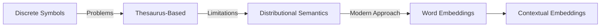
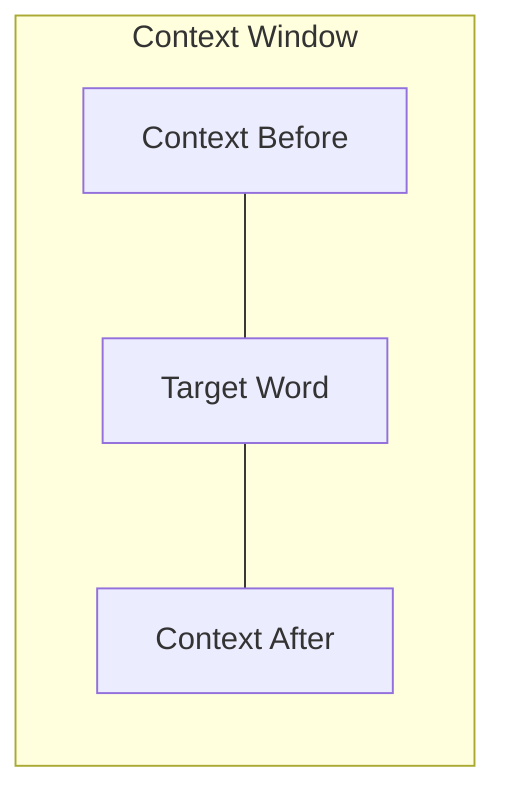
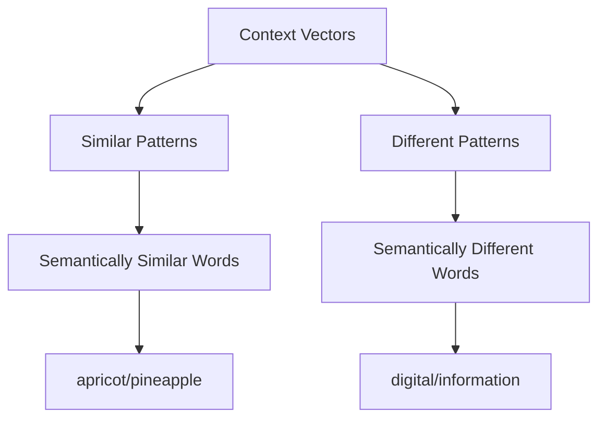
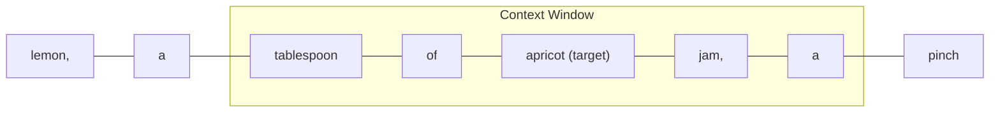
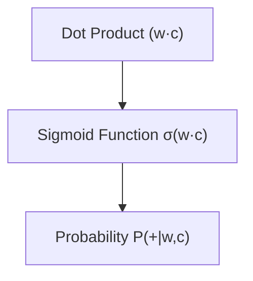
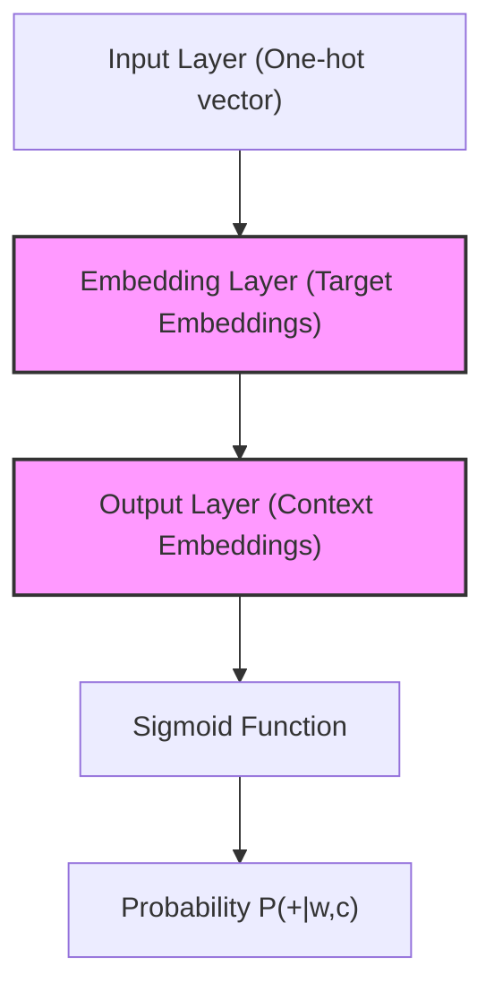

# Lec 07 : Word Representation: Word2Vec & fastText

# Word Representation in Language Models 🔤🧠

## 1. The Meaning of Words 📚

### Definition: *meaning* (Webster dictionary) 📖
- 🔹 The idea that is represented by a word, phrase, etc.
- 🔹 The idea that a person wants to express by using words, signs, etc.
- 🔹 The idea that is expressed in a work of writing, art, etc.

## 2. Need for Word Representation 🔍

For effective language modeling:
- 🔹 We need **effective representation** of words
- 🔹 The representation must somehow **encapsulate the word meaning**

## 3. Traditional Approach: Words as Discrete Symbols 🏷️

In traditional NLP, words are treated as discrete symbols:
- Example: hotel, conference, motel – a *localist representation*

Such symbols can be represented by **one-hot vectors**:
```
motel = [0 0 0 0 0 0 0 0 0 0 1 0 0 0 0]
hotel = [0 0 0 0 0 0 0 1 0 0 0 0 0 0 0]
```

> 📝 **Note:** Vector dimension = number of words in vocabulary (e.g., 500,000+)
> One position contains 1, all others contain 0s

## 4. Problems with Discrete Symbol Representation ⚠️

### Example Scenario:
In web search, if a user searches for "Delhi motel", we would also like to match documents containing "Delhi hotel"

### The Problem:
```
motel = [0 0 0 0 0 0 0 0 0 0 1 0 0 0 0]
hotel = [0 0 0 0 0 0 0 1 0 0 0 0 0 0 0]
```

| Issue | Explanation |
|-------|-------------|
| Orthogonality | These two vectors are completely orthogonal |
| No similarity | There is no natural notion of similarity for one-hot vectors |
| Potential solution | Could try to rely on WordNet's list of synonyms to get similarity |

## 5. Using Existing Thesauri: WordNet 📘

### WordNet 3.0 Statistics

| Category | Unique Strings |
|----------|---------------|
| Noun | 117,798 |
| Verb | 11,529 |
| Adjective | 22,479 |
| Adverb | 4,481 |

### Definition of "Sense" in WordNet 🔍

- Uses **synset** (synonym set) - a set of near-synonyms that instantiates a sense or concept
- Includes a **gloss** (definition)

#### Example:
- "chump" as a noun with the gloss: "a person who is gullible and easy to take advantage of"
- This sense of "chump" is shared by 9 words: chump¹, fool², gull¹, mark⁹, patsy¹, fall guy¹, sucker¹, soft touch¹, mug²
- Each of these words (in these specific senses) has the same gloss
- Note: Not every sense is shared; e.g., sense 2 of "gull" refers to the aquatic bird

### Multiple Senses Example: 'bass'
WordNet captures different meanings of the same word

## 6. Drawbacks of Thesaurus-based Approaches 🚫

| Limitation | Example |
|------------|---------|
| Missing nuance | "proficient" is listed as a synonym for "good" (only correct in some contexts) |
| Offensive terms | WordNet lists offensive synonyms without coverage of connotations or appropriateness |
| Missing new meanings | Missing modern usages: "wicked," "badass," "nifty," "wizard," "genius," "ninja," "bombest" |
| Maintenance challenges | Impossible to keep up-to-date with evolving language |
| Subjectivity | Requires human labor to create and adapt |

## Word Representation Evolution 🚀



> 💡 **Key Insight:** The evolution of word representation techniques shows a progression from simple symbolic approaches to more nuanced semantic models that better capture meaning and context.
>
> # 📊 Representing Words by Their Context 🔍

## Distributional Semantics: The Company Words Keep 🔠👥

> ### 💬 "You shall know a word by the company it keeps" 
> *— J. R. Firth (1957: 11)*

## How Context Defines Meaning 🧩

**Distributional semantics** operates on a fundamental principle: **a word's meaning is given by the words that frequently appear close-by**.

### What is Context? 🔎

- 🔹 When a word **w** appears in a text, its **context** is the set of words that appear nearby (within a fixed-size window)
- 🔹 Multiple contexts of **w** help build a comprehensive representation
- 🔹 Context windows capture the "neighboring words" that give meaning

## Example: Contexts for "banking" 🏦

| Context Example | ... | Context Before | **Target Word** | Context After | ... |
|-----------------|-----|----------------|-----------------|---------------|-----|
| Example 1 | ... | government debt problems turning into | **banking** | crises as happened in 2009 | ... |
| Example 2 | ... | saying that Europe needs unified | **banking** | regulation to replace the hodgepodge | ... |
| Example 3 | ... | India has just given its | **banking** | system a shot in the arm | ... |

> 💡 **Key Insight:** These context words collectively will represent the meaning of "banking"

## Visualizing the Context Window Concept 🖼️



## How Distributional Semantics Works 🔄

| Traditional Approach | Distributional Approach |
|----------------------|-------------------------|
| 📚 Dictionary definitions | 📊 Statistical patterns in text |
| 🔤 Fixed word meanings | 🔄 Dynamic contextual meanings |
| 👨‍💼 Human-created | 🤖 Data-driven |
| ⏱️ Static, slow to update | 🔄 Evolves with language use |

> 📘 **Note:** This approach forms the foundation of modern word embeddings and contextual representation models that power today's language AI systems.

## Advantages of Context-Based Representation 🌟

- 🔹 **Captures nuance**: Different contexts reveal different aspects of meaning
- 🔹 **Automatic**: Derived from data rather than manual construction
- 🔹 **Comprehensive**: Accommodates both common and rare usages
- 🔹 **Adaptable**: Can evolve as language changes

- # 📊 Count-based Methods for Word Representation 🔢

## Term-Context Matrix (Word-Word Matrix) 📈

> The co-occurrence patterns between words can reveal their semantic relationships

### Matrix Structure 🔍

- 🔹 **Rows**: Target words
- 🔹 **Columns**: Context words
- 🔹 **Cells**: Number of times row word and column word co-occur in some context

### Context Types 📝

Context can be defined as:
- 📄 Paragraph
- 🔍 Window of 10 words
- 📊 Sentence or document

### Vector Representation 📊

Each word becomes a **count vector** in $N_v$ (where V = vocabulary size):

| | aardvark | computer | data | pinch | result | sugar | ... |
|-|----------|----------|------|-------|--------|-------|-----|
| **apricot** | 0 | 0 | 0 | 1 | 0 | 1 | |
| **pineapple** | 0 | 0 | 0 | 1 | 0 | 1 | |
| **digital** | 0 | 2 | 1 | 0 | 1 | 0 | |
| **information** | 0 | 1 | 6 | 0 | 4 | 0 | |

## Sample Contexts from Brown Corpus 📚

> Examples of 20-word windows showing word co-occurrences

```
• equal amount of sugar, a sliced lemon, a tablespoonful of apricot preserve or jam, a 
  pinch each of clove and nutmeg,

• on board for their enjoyment. Cautiously she sampled her first pineapple and another 
  fruit whose taste she likened to that of

• of a recursive type well suited to programming on the digital computer. In finding the 
  optimal R-stage policy from that of

• substantially affect commerce, for the purpose of gathering data and information 
  necessary for the study authorized in the first section of this
```

## Word Similarity Through Context Vectors 🤝

> **Key Principle**: Two words are similar in meaning if their context vectors are similar

### Example of Similar Words:
- 🍑 "apricot" and 🍍 "pineapple" have identical context vectors
- 💻 "digital" and 📊 "information" have different patterns



## Limitations of Raw Counts ⚠️

### Problems with Raw Frequency:
- 📉 **Skewed distribution**: Common words dominate
- 🔤 Words like "the" and "of" are very frequent but not discriminative
- 🎯 Need measures that identify particularly informative context words

## Improved Measurement: TF-IDF Approach 📏

### Term Frequency (TF) 📈
- **Raw count**: $tf_{t,d} = count(t,d)$
- **Log-adjusted**: $tf_{t,d} = log_{10}(count(t,d)+1)$

### Document Frequency (DF) 📊
- $df_t$ = number of documents term $t$ occurs in
- Not to be confused with collection frequency (total count across all documents)
- Example: "Romeo" is very distinctive for one Shakespeare play

### Inverse Document Frequency (IDF) 🔄
- Measures how informative a word is
- Gives higher weight to rare terms that appear in few documents

| Measure | Purpose | Formula |
|---------|---------|---------|
| TF | Capture word importance in document | $tf_{t,d} = log_{10}(count(t,d)+1)$ |
| IDF | Downweight common words | $idf_t = log_{10}(\frac{N}{df_t})$ |
| TF-IDF | Combined importance measure | $tf\text{-}idf_{t,d} = tf_{t,d} \times idf_t$ |

> 💡 **Key Insight**: TF-IDF balances the frequency of a term with its uniqueness across documents, providing a more informative measure than raw counts.
>
> # 🧠 Skip-gram Model in Word2Vec 📚

## Mathematical Foundation of Skip-gram 📊

### Probability Equations

$$P(+|w, c) = \sigma(c \cdot w) = \frac{1}{1 + \exp(-c \cdot w)}$$

$$P(-|w, c) = 1 - P(+|w, c) = \sigma(-c \cdot w) = \frac{1}{1 + \exp(c \cdot w)}$$

> 🔍 **Key Insight**: These equations calculate the probability of a word appearing in (or not appearing in) the context of another word

## How Skip-gram Classifier Computes Probabilities 🧮

### For a Single Context Word
$$P(+|w, c) = \sigma(c \cdot w) = \frac{1}{1 + \exp(-c \cdot w)}$$

### For Multiple Context Words
- 🔹 When we have multiple context words, we need to consider all of them
- 🔹 We'll assume independence and multiply the probabilities:

$$P(+|w, c_{1:L}) = \prod_{i=1}^{L} \sigma(c_i \cdot w)$$

- 🔹 Taking the logarithm (for computational stability):

$$\log P(+|w, c_{1:L}) = \sum_{i=1}^{L} \log \sigma(c_i \cdot w)$$

## Skip-gram Training Process 🔄

### Training Data Example
For a +/- 2 word window in the sentence:
```
... lemon, a [ tablespoon of apricot jam, a ] pinch ...
```



### Skip-gram Classifier Goal 🎯

Given a candidate (word, context) pair such as:
| Positive Example | Negative Example |
|------------------|------------------|
| (apricot, jam) | (apricot, aardvark) |

The classifier assigns each pair a probability:
- $P(+ | w, c)$ - probability that c is a valid context word for w
- $P(- | w, c) = 1 - P(+ | w, c)$ - probability that c is not a valid context word for w

## Computing Similarity with Dot Products ✖️

| Method | Formula | Properties |
|--------|---------|------------|
| Dot Product | $w \cdot c$ | Basic similarity measure |
| Cosine Similarity | $\frac{w \cdot c}{||w|| \cdot ||c||}$ | Normalized dot product |

> 💡 **Key Insight**: Two vectors are similar if they have a high dot product

### Converting to Probabilities 🔄

- 🔹 Similarity(w, c) ∝ w·c 
- 🔹 To convert this similarity into a probability, we use the sigmoid function:

$$\sigma(x) = \frac{1}{1 + \exp(-x)}$$



## Skip-gram Classifier: Complete Picture 🖼️

### Components
- 🎯 **Input**: Target word w and its context window of L words $c_{1:L}$
- 📊 **Process**: Estimate probability based on vector similarity
- 🔢 **Output**: Probability of w occurring with these context words

### The Two Sets of Embeddings Needed 🧩

| Embedding Type | Description | Example |
|----------------|-------------|---------|
| Target Word Embeddings | Vectors for center words | $w_{apricot}$ |
| Context Word Embeddings | Vectors for surrounding words | $c_{jam}$, $c_{tablespoon}$ |

> 📝 **Note**: In Word2Vec, each word has two separate vectors - one for when it acts as a target word and one for when it acts as a context word

## Visual Summary of Skip-gram Architecture 🏗️



> 🔑 **Key Advantage**: This approach generates dense vector representations that capture semantic relationships between words based on their distributional properties
>
> 
