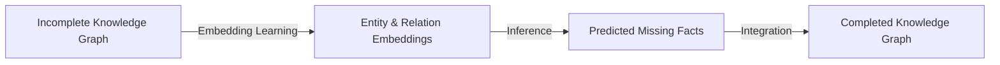
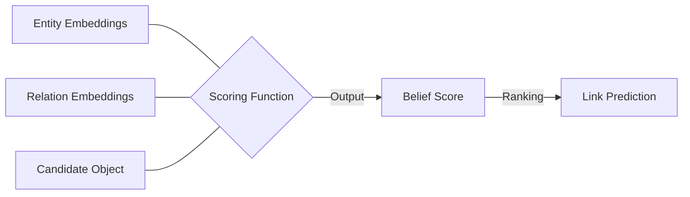
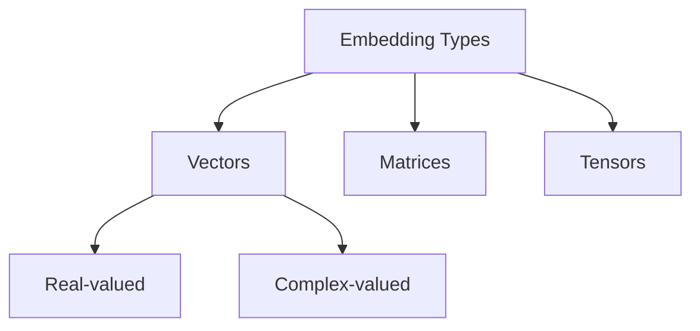
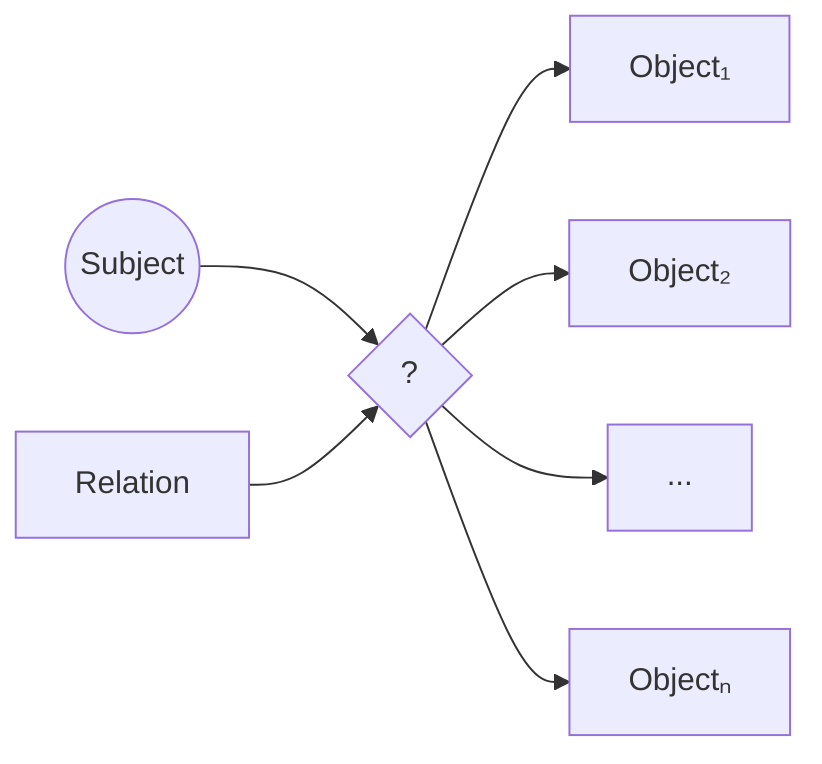
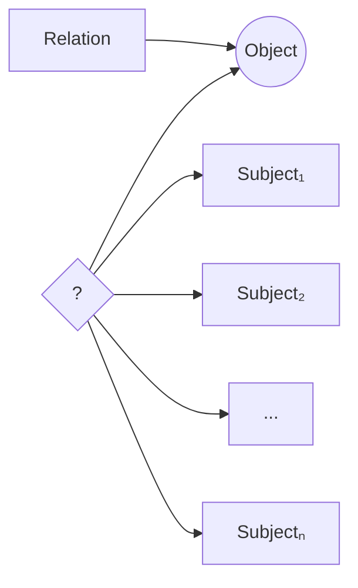
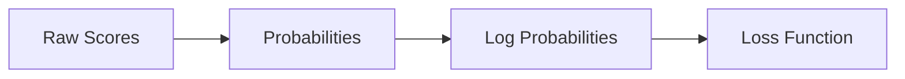
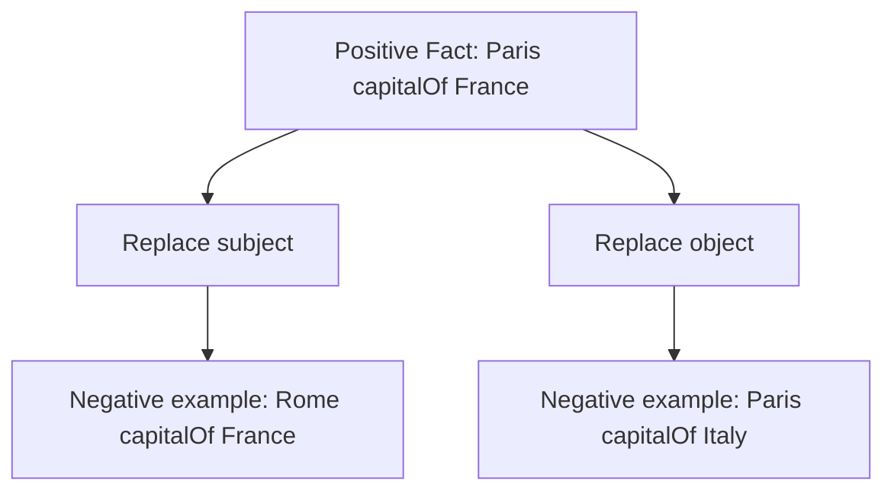
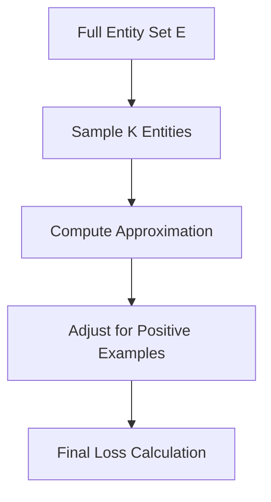
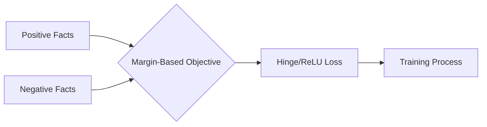

# Lec 27 | Knowledge and Retrieval: Knowledge Graph Completion and Evaluation

# 🧩 Knowledge Graph Completion: Filling the Gaps 📊

## The Challenge of Incomplete Knowledge 🔍



> 💡 **KG completion addresses the inherent incompleteness problem we saw earlier (where relations like /people/person/parents were 98.8% incomplete)**

## Core Approach 🛠️

| Stage | Process | Details |
|-------|---------|---------|
| 1️⃣ **Input** | Incomplete KG provided | A knowledge graph with known entities but missing relationships |
| 2️⃣ **Representation** | Create entity & relation embeddings | Transform graph elements into dense vector representations |
| 3️⃣ **Application** | Apply to KG and infer missing triples | Use learned patterns to predict new (subject, relation, object) facts |

## Embedding Learning Methods 🧠

### 1. Topology-Based Embeddings
- 🔗 **Graph Structure Focus**: Uses only connections between entities
- 📈 **Transitive Patterns**: Learns from existing relationship patterns
- 🌐 **Examples**: TransE, RotatE, ComplEx models

```
(Barack Obama)-[spouse]->(Michelle Obama)-[born_in]->(Chicago)
↓ may suggest ↓
(Barack Obama)-[visited]->(Chicago)
```

### 2. Text-Enhanced Embeddings
- 📝 **Alias Integration**: Incorporates textual descriptions and aliases
- 🔤 **Semantic Enrichment**: "44th President" might link to presidency relation
- 🧩 **Multi-Modal**: Combines structural and textual signals

## Mathematical Intuition 📐

For a TransE model with vectors $h$ (head), $r$ (relation), and $t$ (tail):
- Valid triples should satisfy: $h + r ≈ t$
- Example: $v_{Paris} + v_{capital\_of} ≈ v_{France}$

## KG Completion Pipeline 🔄

1. **Embedding Space Creation**: Map all entities and relations to vectors
2. **Pattern Learning**: Identify regularities in existing facts
3. **Scoring Function**: Measure likelihood of potential new relations
4. **Inference**: Predict missing facts based on confidence scores
5. **Integration**: Add high-confidence predictions to the knowledge graph

> 🔑 **Key Benefit**: By learning the underlying patterns in knowledge representation, we can extend KGs beyond manually curated facts.

## Applications 💼

- 🔍 **Enhanced Question Answering**: More complete knowledge means more answerable questions
- 🧩 **Data Integration**: Connecting disparate knowledge sources
- 🌐 **Recommendation Systems**: Understanding relationships between entities
- 🤖 **Reasoning Support**: Providing more complete context for LLM reasoning

# 📊 Knowledge Graph Completion (KGC): Mathematical Foundations 🧮

## Core Concepts & Architecture 🏗️



## 1️⃣ Geometric Representations 🔷

> 💡 **Key Idea**: Represent entities and relations as vectors in a continuous embedding space

| Entity/Relation | Mathematical Form | Geometric Interpretation |
|-----------------|-------------------|--------------------------|
| Entity (e) | $\vec{e} \in \mathbb{R}^d$ | Point in embedding space |
| Relation (r) | $\vec{r} \in \mathbb{R}^d$ | Vector operation on entities |

### Geometric Operations in Various Models 🔄

* **Point**: Entity as a location in space
* **Vector**: Direction and magnitude
* **Displacement**: Translation operation
* **Projection**: Mapping to subspace
* **Rotation**: Orientation transformation

## 2️⃣ Scoring Functions 📈

> 💡 **Purpose**: Quantify how likely a triple (subject, relation, object) is valid

```
f(subject, relation, object) → belief score
```

### Example Scoring Functions 🧮

| Model | Scoring Function | Geometric Intuition |
|-------|------------------|---------------------|
| TransE | $f(s,r,o) = -\|\vec{s} + \vec{r} - \vec{o}\|$ | Translation: subject + relation ≈ object |
| DistMult | $f(s,r,o) = \vec{s}^T \text{diag}(\vec{r}) \vec{o}$ | Bilinear product with diagonal relation matrix |
| ComplEx | Uses complex vectors | Captures asymmetric relations |
| RotatE | Rotation in complex space | Relation as rotation from subject to object |

## 3️⃣ Training Methodology 🎯

```python
# Pseudocode for KGC training
for epoch in range(num_epochs):
    for (subject, relation, object) in known_triples:
        # Sample negative examples (corrupted triples)
        negative_objects = sample_entities_except(object)
        
        # Compute scores
        positive_score = scoring_function(subject, relation, object)
        negative_scores = [scoring_function(subject, relation, neg) 
                          for neg in negative_objects]
        
        # Update embeddings to maximize margin between
        # positive and negative examples
        update_embeddings(positive_score, negative_scores)
```

## 4️⃣ Link Prediction Process 🔮

1. **Objective**: For (subject, relation, ?), find missing object
2. **Process**:
   * Score all possible entities as potential objects
   * Rank by belief score
   * Select top-k entities as predictions

## 5️⃣ Major KGC Models 🌐

| Model | Year | Key Innovation | Strengths |
|-------|------|----------------|-----------|
| TransE | 2013 | Translation-based | Simple, efficient |
| HTransE | 2015 | Hierarchical | Better modeling of complex relations |
| DistMult | 2015 | Bilinear diagonal model | Handles one-to-many relations |
| HolE | 2016 | Holographic embeddings | Compact, expressive |
| ComplEx | 2016 | Complex embeddings | Models asymmetric relations |
| RotatE | 2019 | Rotation in complex space | Captures various relation patterns |

> 🔑 **Key Challenge**: Finding embedding representations that accurately model the diverse patterns in knowledge graphs while generalizing to unseen relationships.

## Geometric Visualizations 🎨

```
TransE intuition:
       +
       |
       | r(capital_of)
       |
       v
Paris --- → France
```

---

💡 **Research Frontier**: Recent work integrates KGC with language models, using pre-trained contextual embeddings to enhance prediction accuracy and generalization capabilities.

# 📝 Initial Notation for Knowledge Graph Completion 🧮

## Entity Representation 🔷

> 💡 **Crucial concept**: Entities and relations are transformed into mathematical objects that can be manipulated in embedding space

| Notation | Meaning | Mathematical Form |
|----------|---------|------------------|
| *e* | Entity | Symbol representing real-world object |
| $\vec{e}$ or **e** | Entity embedding | Vector representation in embedding space |
| *s* | Subject entity | Entity in subject position of triple |
| *o* | Object entity | Entity in object position of triple |
| **s**, **o** | Subject/object embeddings | Vector representations of subject/object entities |

## Relation Representation 🔗

| Notation | Meaning | Mathematical Form |
|----------|---------|------------------|
| *r* | Relation | Symbol representing relationship type |
| **r** | Relation embedding | Mathematical representation (varies by model) |

## Embedding Types 📊



## Scoring System 🎯

| Notation | Definition | Interpretation |
|----------|------------|----------------|
| $f(s,r,o) \in \mathbb{R}$ | Raw confidence score | Higher values indicate greater likelihood of triple being valid |
| $(s,r,o) \in KG$ | "Positive" triple/fact | Triple exists in knowledge graph |
| $(s',r',o') \notin KG$ | "Negative" triple/fact | Triple does not exist in knowledge graph |

> 🔑 **Key insight**: Learning effective embeddings requires distinguishing between positive triples (known facts) and negative triples (presumed non-facts) through a scoring function

*This notation forms the foundation for understanding various knowledge graph completion models.*

# 🔄 From Score to Probability in KG Completion 📊

> 💡 **Converting raw scores to normalized probabilities enables probabilistic reasoning over knowledge graphs**

## Softmax Distribution Formulas 🧮

### Object Prediction

$$\Pr(o|s,r) = \frac{\exp(f(s,r,o))}{\sum_{o'} \exp(f(s,r,o'))}$$

#### Visual Representation:


### Subject Prediction

$$\Pr(s|r,o) = \frac{\exp(f(s,r,o))}{\sum_{s'} \exp(f(s',r,o))}$$

#### Visual Representation:


## 📋 Probability Distribution Properties

| Aspect | Details | Notes |
|--------|---------|-------|
| Domain | For each (s,r) pair, distribution over all entities o | Normalized across entity space |
| Range | [0,1] for each entity | Sum of probabilities equals 1 |
| Scaling | Exponential transformation (softmax) | Preserves ranking while normalizing |
| Sampling | Relation sampling (r) is relatively rare | Models typically focus on entity prediction |

## 🎯 Optimization Objectives

For valid triples $(s,r,o) \in \text{KG}$:

- 🔼 Maximize $\Pr(o|s,r) \approx 1$ 
  - *Given Paris and capitalOf, France should have probability near 1*
  
- 🔼 Maximize $\Pr(s|r,o) \approx 1$
  - *Given capitalOf and France, Paris should have probability near 1*

> 🔑 **Key insight**: By maximizing these probabilities for known facts, the model learns embeddings that capture the underlying structure of the knowledge graph, enabling inference of new facts.
>
> # 📉 Probability to Loss Function in KG Completion 🧮

## Objective Function Formulation 🎯



> 💡 **Key insight**: Converting from raw scores to a differentiable loss function enables gradient-based optimization of entity and relation embeddings

## Mathematical Formulation 📊

### Objective to Maximize:

$$\sum_{(s,r,o)\in\text{KG}} \log \Pr(s|r,o) + \sum_{(s,r,o)\in\text{KG}} \log \Pr(o|s,r)$$

This combines two goals:
- 🔍 **Subject prediction**: Given (relation, object), predict correct subject
- 🔎 **Object prediction**: Given (subject, relation), predict correct object

### Corresponding Loss Function:

$$\mathcal{L} = -\left(\sum_{(s,r,o)\in\text{KG}} \log \Pr(s|r,o) + \sum_{(s,r,o)\in\text{KG}} \log \Pr(o|s,r)\right)$$

## Training Dynamics 🔄

| Effect | Mechanism | Example |
|--------|-----------|---------|
| ✅ **Positive Triple Enhancement** | Directly maximizes probability of known facts | $(Paris, capitalOf, France)$ score increases |
| ❌ **Negative Triple Suppression** | Indirectly minimizes scores for invalid triples | $(Paris, capitalOf, Germany)$ score decreases |

## Computational Challenges 💻

- ⚠️ **Denominator Calculation**: Probabilities require summing over all entities
  ```
  Pr(o|s,r) = exp(f(s,r,o)) / ∑ₒ, exp(f(s,r,o'))
  ```
- 🔢 **Scale Issue**: Modern KGs contain millions of entities
- 🕒 **Efficiency Problem**: Computing exact probabilities becomes prohibitively expensive

> 🧠 **Implementation note**: In practice, various approximation techniques like negative sampling are used to make this computation tractable
>
> # 🎯 Negative Sampling in Knowledge Graph Completion 📉



## Core Strategy 🧩

> 💡 **Negative sampling** creates synthetic negative examples by corrupting positive facts, enabling efficient training by avoiding expensive computations over the entire entity space.

### Sampling Process 📊

| Step | Operation | Example |
|------|-----------|---------|
| 1️⃣ | Start with positive fact $(s,r,o)$ | $(Paris, capitalOf, France)$ |
| 2️⃣ | Replace subject with random $s'$ | $(Berlin, capitalOf, France)$ ❌ |
| 3️⃣ | Replace object with random $o'$ | $(Paris, capitalOf, Germany)$ ❌ |

## Training Implications 🔄

- ✅ **Computational Efficiency**: Approximates full denominator sum with small sample
- ⚖️ **Balanced Learning**: Exposes model to both positive and negative examples
- 🎲 **Stochastic Approach**: Different negative samples in each training iteration

## "Local Closed World" Assumption ⚠️

> 🔍 Assumes randomly sampled triples are likely false, which isn't always true due to KG incompleteness

- 🚫 **Problem**: Some "negative" samples might actually be valid but missing facts
- 📊 **Consequence**: Model may receive incorrect training signal
- 🛡️ **Mitigation**: Some approaches use smarter negative sampling strategies

## Implementation Benefits 💻

- 🚀 Makes training feasible on large-scale knowledge graphs
- 📉 Dramatically reduces computational complexity
- 🧠 Enables use of standard gradient-based optimization

> 🔑 **Key insight**: While based on a flawed assumption, negative sampling provides a practical compromise that makes KG completion possible at scale.

# 🎲 Uniform Negative Sampling in KGC 📊



## Mathematical Formulation 🧮

> 💡 **Core idea**: Approximate the full denominator sum by using a small random sample of entities

### Denominator Approximation:

| Component | Definition | Purpose |
|-----------|------------|---------|
| $A = \sum_{o\in E} \exp(f(s,r,o))$ | Full sum over all entities | Exact denominator |
| $K$ entities sampled from $E$ | Uniform random selection | Approximation set |
| $\mathbb{E}[\sum_{o\in K} \exp(f(s,r,o))] = \frac{K}{E}A$ | Expected value of sample sum | Statistical estimate |

## Statistical Properties 📈

- 🎯 **Unbiased Estimator**: The expected value equals the true value scaled by $\frac{K}{E}$
- 📊 **Variance Challenge**: High variance requires large $K$ (thousands of entities)
- ⚠️ **Accuracy Impact**: Under-sampling known to degrade model performance

## Implementation Considerations 🔧

When computing the probability ratio:

$$\frac{\exp(f(s,r,o))}{\frac{E}{K}\sum_{o'\in K} \exp(f(s,r,o'))}$$

- ⚠️ Must include positive object $o$ in denominator sum (even if not randomly selected)
- 🔄 This forced inclusion may introduce additional bias
- 🛠️ Practical implementations balance sample size with computational efficiency

> 🔑 **Practical trade-off**: Uniform negative sampling sacrifices some accuracy for dramatic computational efficiency gains, making KGC feasible on large knowledge graphs
>
> # 🎯 Discriminative Training in KG Completion (à la SVM) 📊



## Margin-Based Objective 📏

> 💡 **Core Principle**: For each positive fact $(s,r,o)$ and negative fact $(s',r',o')$, enforce a margin of separation between their scores

$$f(s,r,o) \geq \text{margin} + f(s',r',o')$$

## Loss Function Implementation 🧮

| Approach | Formula | Behavior |
|----------|---------|----------|
| Hinge/ReLU Loss | $\max\{0, \text{margin} + f(s'_k,r,o'_k) - f(s,r,o)\}$ | Zero loss when margin is satisfied |

## Scale Challenges 📈

- 🔢 With $E$ entities and $R$ relations:
  - Total possible fact triples: $E^2R$
  - Only a small fraction are positive facts
  - Rest are potential negative examples

> ⚠️ **Key Problem**: Creating constraints/loss terms for all possible negatives is computationally infeasible

## Practical Considerations 🛠️

- 🎯 **Target Use Case**: Typically predicting one missing component
  - $(s,r,?)$ → Object prediction
  - $(?,r,o)$ → Subject prediction
  
- ⚡ **Efficiency**: Full discriminative training across all possible negatives is unnecessary

> 📝 **Note**: Throughout discussion, $E$ and $|E|$ are used interchangeably to represent the number of entities; similarly for $R$ and $|R|$ with relations
>
> # 🎯 Sampling for Discriminative Training in KGC 📊

```mermaid
graph TD
    A[Positive Fact <br> (s,r,o)] --> B[Sample K Negative Facts]
    B --> C[Compute Pairwise Losses]
    C --> D[Average Losses]
    D --> E[Update Embeddings]
```

## Sampling Strategy 🔄

> 💡 **Key approach**: Rather than comparing against all possible negatives, sample a manageable subset for each positive example

### Process Overview 📝

| Step | Description | Example |
|------|-------------|---------|
| 1️⃣ | Identify positive fact from batch | $(Paris, capitalOf, France)$ |
| 2️⃣ | Sample $K$ negative facts by corruption | $(Rome, capitalOf, France)$, $(Paris, capitalOf, Germany)$, ... |
| 3️⃣ | Compute loss against each negative | Compare scores and apply margin |
| 4️⃣ | Average the losses for gradient update | $(1/K) \sum_k loss_k$ |

## Loss Function Implementation 🧮

$$\frac{1}{K}\sum_k \max\{0, \text{margin} + f(s'_k,\color{red}{r},o'_k) - f(s,\color{red}{r},o)\}$$

> ⚠️ **Note**: Relation $r$ typically remains the same in positive and negative examples

## Training Dynamics 📈

- ✅ **Zero Loss Condition**: When $f(s,r,o) > \text{margin} + f(s'_k,r,o'_k)$
  - Positive fact scores significantly higher than negative fact
  - No update needed when margin is satisfied
  
- 🔄 **Gradient Effect**: Increases score for positive facts, decreases for negative facts
  - Pushes embeddings to distinguish valid from invalid facts

## Practical Advantages 🌟

- 🚀 **Efficiency**: Drastically reduces computational requirements
- 🎛️ **Tunability**: Margin size and sample count K are adjustable hyperparameters
- 🔍 **Focus**: Concentrates learning on challenging negative examples

- # 🧮 Score Polarity in Knowledge Graph Models 📊

```mermaid
graph LR
    A[Score Function f(s,r,o)] --> B{Interpretation}
    B -->|Standard Polarity| C[High Score = More Likely]
    B -->|Reverse Polarity| D[Low Score = More Likely]
```

## Score Interpretation Conventions 🔄

> 💡 **Key insight**: Different KG completion models may use opposite interpretations of what score values indicate about triple validity

### Standard Polarity Assumption

| Score Value | Interpretation | Visual |
|-------------|----------------|--------|
| ⬆️ **Large** $f(s,r,o)$ | Triple $(s,r,o)$ is **more likely** valid | ✅ |
| ⬇️ **Small** $f(s,r,o)$ | Triple $(s,r,o)$ is **less likely** valid | ❌ |

### Alternative Polarity Models

Some knowledge graph models operate with the reverse interpretation:
- 📉 **Low scores** indicate higher probability of validity
- 📈 **High scores** indicate lower probability of validity

## Implementation Flexibility 🛠️

- 🔄 **Adaptable**: Probability calculations can be adjusted for either convention
  ```
  Standard: P(valid) ∝ exp(f(s,r,o))
  Reverse: P(valid) ∝ exp(-f(s,r,o))
  ```

- 🧩 **Loss Functions**: Can be modified accordingly without significant redesign
  ```
  Standard: maximize f(valid) - f(invalid)
  Reverse: maximize f(invalid) - f(valid)
  ```

> 🔑 **Practical Note**: The choice of polarity is mostly a model design decision - what matters is consistency within the implementation
>
> # 🔍 Testing Embedding and Score Quality in KG Completion 📊

```mermaid
graph TD
    A[KG Dataset] --> B[Split into Folds]
    B --> C[Train Set]
    B --> D[Dev Set]
    B --> E[Test Set]
    C --> F[Train KG Model]
    F --> G[Generate Rankings]
    G --> H[Evaluate Performance]
    H --> I[Mean Reciprocal Rank]
    H --> J[Hits@K]
```

## Evaluation Framework 🧪

### Task Definition
- 🎯 **KG Completion**: Predict missing elements in knowledge graph triples
- 📋 **Testing Process**:
  - Split KG into train, dev, test folds
  - Evaluate on queries with missing components: $(s,r,?)$ and $(?,r,o)$
  - System must provide **ranked list** of candidates for missing elements

### Evaluation Metrics 📏
- 🔢 **Mean Reciprocal Rank (MRR)**: Average of $\frac{1}{rank}$ of correct answer
- 🎯 **Hits@K**: Percentage of test cases where correct answer appears in top K results

## Standard Benchmark Datasets 📚

| Dataset | Entities | Relations | Train/Dev/Test Split | Description |
|---------|----------|-----------|---------------------|-------------|
| **WN18** | 41k | 18 | 141k/5k/5k | WordNet synsets (hypernymy, synonymy) |
| **FB15k** | 15k | 1345 | 483k/50k/59k | Freebase entities and relations |
| **WN18RR** | - | - | - | Harder variant of WN18 |
| **FB15k-237** | - | - | - | Filtered version of FB15k |
| **YAGO** | - | - | - | Another standard benchmark |

## Additional Evaluation Tasks 🧩

- 🔄 **Entity Alignment**: Matching entities across different KGs
- 🔍 **Analogy Tasks**: Testing relational patterns
- 💬 **Question Answering**: Using KG embeddings for QA

> 💡 **Key insight**: Comprehensive evaluation involves not just completion accuracy but also testing how well the embeddings capture semantic relationships
>
> # 🔍 Filtered Evaluation in KG Completion 📊

```mermaid
graph LR
    A[Query: (s,r,?)] --> B[Ranked Predictions]
    B --> C[Unfiltered Evaluation]
    B --> D[Filtered Evaluation]
    C -->|Less accurate| E[MRR, MAP]
    D -->|More accurate| F[Filtered MRR, MAP]
```

## Example Scenario 🧪

> 💡 **Key insight**: Removing training answers from evaluation produces fairer metrics by not penalizing the model for correctly recalling what it learned

### Original Ranked Results

| Rank | Entity | Status | Calculation |
|------|--------|--------|-------------|
| 1️⃣ | $o_1$ | ❌ | - |
| 2️⃣ | $o_2$ | ⚠️ Training answer | Should be filtered |
| 3️⃣ | $o_3$ | ❌ | - |
| 4️⃣ | $o_4$ | ❌ | - |
| 5️⃣ | $o_5$ | ❌ | - |
| 6️⃣ | $o_6$ | ✅ Test gold answer | Reciprocal rank = 1/6 |
| 7️⃣ | $o_7$ | ❌ | - |
| 8️⃣ | $o_8$ | ✅ Test gold answer | Second hit position = 8 |

## Unfiltered vs. Filtered Metrics 📏

### Without Filtering
- **MRR** = 1/6 = 0.167
- **MAP** = (1/6 + 2/8)/2 = 0.208

### With Filtering (remove $o_2$)
- **MRR** = 1/5 = 0.200 ⬆️
- **MAP** = (1/5 + 2/7)/2 = 0.243 ⬆️

## Why Filtering Matters 🎯

1. 🔄 **Fair Comparison**: Prevents penalizing models for ranking known training facts highly
2. 📊 **Realistic Assessment**: Better measures ability to predict truly unknown facts
3. 🧩 **Consistent Evaluation**: Standard practice across KG completion research

> 📝 **Evaluation Convention**: While simple in concept, filtered evaluation is crucial for accurate performance assessment in knowledge graph completion tasks
