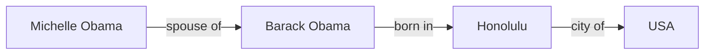
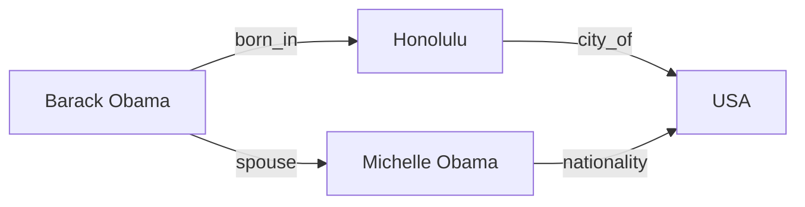
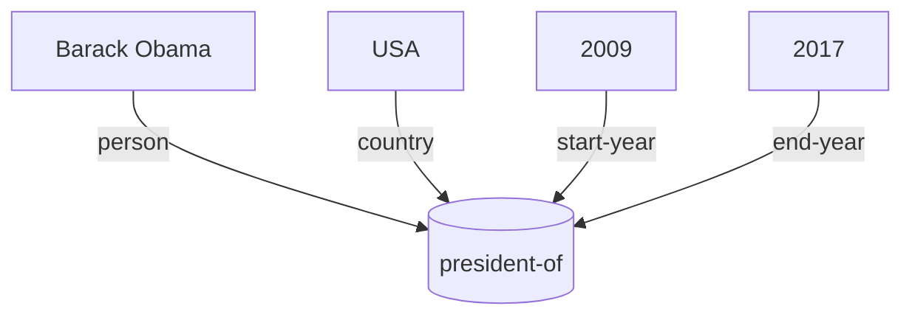
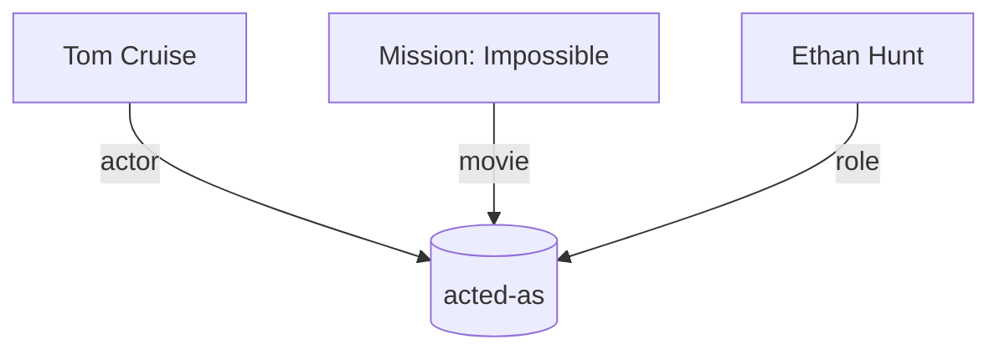
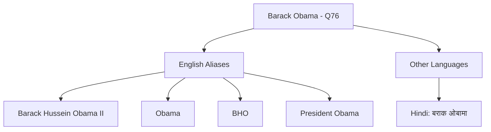
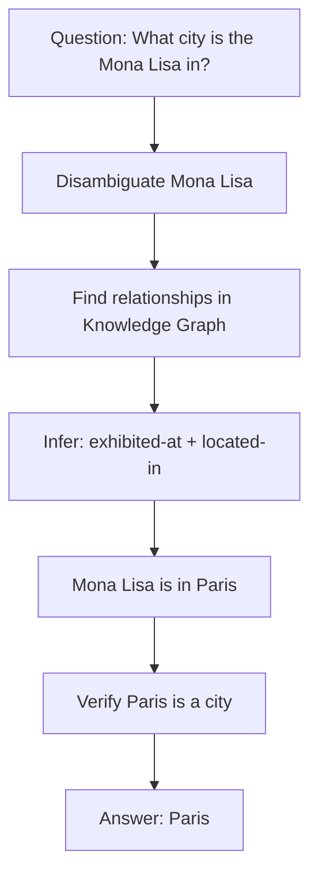
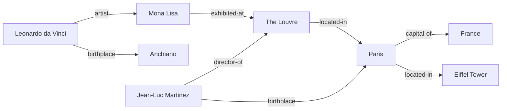
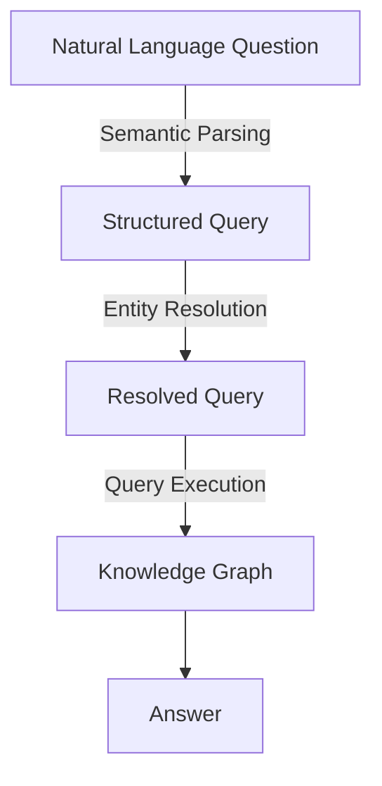
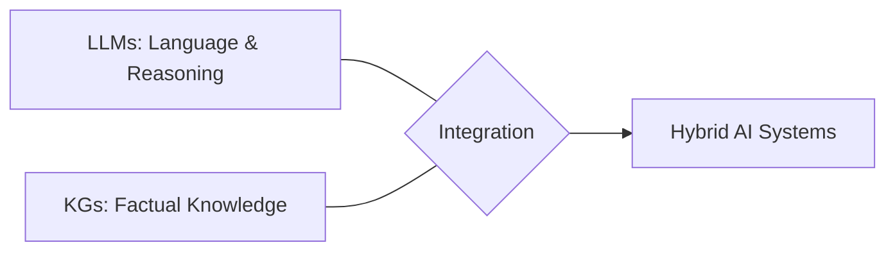

## Lec 26 | Knowledge and Retrieval: Knowledge Graph

# 📊 Knowledge Graphs & LLM Retrieval 🧠

## Introduction 🌟

Welcome back to the course on Large Language Models! In this module, we'll explore **Knowledge Graphs** and their retrieval from large language models.

> 💡 From ancient times to modern computing, humans have continuously sought ways to organize knowledge effectively.

## Historical Context 📜

Throughout history, humans have developed various knowledge organization systems:
- 🗿 The Rosetta Stone
- 📚 The Library of Alexandria
- 🔍 Vannevar Bush's vision of the Memex machine

## Modern Knowledge Graphs 🌐

In contemporary computing, knowledge organization has evolved into **Knowledge Graphs** such as:

| Knowledge Graph | Description | Notable Features |
|-----------------|-------------|------------------|
| Yago | Derived from Wikipedia | Temporal and spatial information |
| Freebase | Community-curated | Now part of Google Knowledge Graph |
| WikiData | Collaborative KB | Supports multiple languages |

## Knowledge Graph Structure 🏗️

For our purposes, a **Knowledge Base** (or interchangeably, a **Knowledge Graph**) consists of:

- 🔷 **Nodes** representing entities
  - People (Barack Obama, Michelle Obama)
  - Places (Honolulu, USA)
  
- 🔗 **Edges** labeled with relation types
  - "born in"
  - "city of"

### KG Triple Format ⚡

A KG triple or fact follows this structure:

```
Subject → Relation → Object
```

For example:
- Barack Obama → born in → Honolulu
- Honolulu → city of → USA

### Visual Representation 📈



## Beyond Binary Relations 🔄

While we typically work with binary relations (two entities in a relationship), we can extend beyond this format:

### N-ary Relations Example: Movies 🎬

Consider a table with three columns:
- Actor
- Role
- Movie

Examples:
- Tom Hanks played Jim Lovell in Apollo 13
- Tom Cruise played Ethan Hunt in Mission Impossible

## Key Takeaways 📌

- Knowledge graphs organize information as entities connected by relationships
- Binary relations form the foundation (subject-relation-object)
- More complex relationships can be modeled using n-ary relations
- Modern knowledge graphs serve as structured knowledge repositories for AI systems

# 📊 Knowledge Base (KB) / Knowledge Graph (KG) Structure 🧠

## Core Components 🏗️

The image illustrates the fundamental structure of a knowledge graph with:

### 🔵 Entities as Nodes
- **Barack Obama** (person)
- **Michelle Obama** (person)
- **Honolulu** (location)
- **USA** (country)

### 🔗 Relations as Edges
| Source Entity | Relation | Target Entity |
|---------------|----------|--------------|
| Barack Obama | born_in | Honolulu |
| Honolulu | city_of | USA |
| Barack Obama | spouse | Michelle Obama |
| Michelle Obama | nationality | USA |

## Knowledge Representation Principles 📝

> 💡 A KB triple or 'fact' looks like a relation-typed edge (subject, relation, object)

This structure enables the representation of real-world knowledge in a machine-readable format where:
- 🟢 **Nodes** are entities (people, places, things)
- ➡️ **Edges** are relations between entities
- 🔄 **Triples** capture facts as subject-relation-object statements

## Visual Structure 📈



## Knowledge Base Foundation 🌐

As noted at the bottom of the image, this demonstrates a **knowledge base with entities and binary relations** - the fundamental structure used in systems like Yago, Freebase, and WikiData.

# 🌐 Beyond Binary Relations in Knowledge Graphs 📊

## N-ary Relations Explained 🔄

> 💡 While basic knowledge graphs use binary relations (subject→relation→object), real-world facts often require more complex relationship structures.

## Example 1: Presidential Terms ⏳



### 📋 Table: "president-of" Relationship
| 👤 person | 🏳️ country | 📅 start-year | 📅 end-year |
|-----------|-----------|--------------|------------|
| B.Obama   | USA       | 2009         | 2017       |
| J.Chirac  | France    | 1995         | 2007       |
| ...       | ...       | ...          | ...        |

## Example 2: Movie Roles 🎬



### 📋 Table: "acted-as" Relationship
| 🎭 actor    | 🎭 role      | 🎬 movie           |
|------------|-------------|-------------------|
| Tom Hanks  | Jim Lovell  | Apollo 13         |
| Tom Cruise | Ethan Hunt  | Mission Impossible|
| ...        | ...         | ...               |

## Key Concepts 🔑

- 💎 **Diamond Nodes** represent complex relationships connecting multiple entities
- 🔄 **N-ary Relations** capture facts with more than two participants
- 📊 **Tabular Representation** offers an alternative way to view these relationships
- 🧩 **Entity Roles** define how each entity participates in the relationship

> 🌟 This approach allows knowledge graphs to represent temporal information, multi-participant events, and relationships with additional attributes.

# 🌐 Wikidata: Entity ("topic") Example 

## Entity Structure in Wikidata 📊

The image demonstrates how Wikidata organizes entity information using Barack Obama as an example:

> 💡 Wikidata assigns each entity a unique identifier to resolve ambiguity issues when names alone aren't sufficient.

### Core Components 🏗️

| Component | Example | Purpose |
|-----------|---------|---------|
| 📝 **Name** | Barack Obama | Human-readable identifier (potentially ambiguous) |
| 🔑 **Unique ID** | Q76 | Canonical machine-readable identifier |
| 📋 **Description** | 44th president of the United States from 2009 to 2017 | Contextual information for disambiguation |

### Entity Aliases System 🔄



### Entity Representation Details 📑

#### English Aliases
- Barack Hussein Obama II
- Barack Obama II
- Barak Obama
- Barry Obama
- President Obama
- President Barack Obama
- BHO
- Barack
- Barack H. Obama

#### Multilingual Support
| Language | Label | Description | 
|----------|-------|-------------|
| English | Barack Obama | 44th president of the United States from 2009 to 2017 |
| Hindi | बराक ओबामा | संयुक्त राज्य अमेरिका के 44वें राष्ट्रपति |

> 🔍 This structured approach allows Wikidata to function as a multilingual knowledge base while maintaining precise entity references.

# 📊 Knowledge Graphs: Useful but Incomplete 🧩

> 💡 While knowledge graphs provide structured information for numerous applications, they face significant challenges in comprehensive knowledge representation.

## Applications of Knowledge Graphs 🌐

- 🔍 Question answering systems
- 🛒 Product search functionality
- 💬 Dialog systems
- 📑 Information extraction

## Key Challenges 🚧

- 📚 **Comprehensiveness Gap**: It's not possible to manually cover all human knowledge
- ⏱️ **Currency Problem**: Keeping information updated is extremely difficult
- 🧠 **Scale Limitation**: Human knowledge is vast and constantly growing

## Incompleteness Statistics 📈

| Freebase Relation | % **IN**complete |
|-------------------|---------------:|
| /people/person/parents | 98.8 |
| /people/person/places_lives | 96.6 |
| /people/person/place_of_birth | 93.8 |
| /people/person/employment_history | 92.3 |
| /people/person/nationality | 78.5 |
| /people/person/education | 79.2 |

## Research Implications 🔬

- 🔄 Makes **KG completion** an important task for researchers
- 🔗 Even essential information like parents, birthplace, and nationality are significantly incomplete
- 📊 Most relations are missing for >75% of entities

*Reference: [Min et al 2013]*

# 🔄 Knowledge Graph Alignment 🌐

## Entity Alignment Between Knowledge Graphs 📊

```mermaid
graph LR
    subgraph G₁[English KG]
        DC1[Daniel_Craig] --- CR[Casino Royale 2006]
        CR --- EG1[Eva_Green]
        CR --- CP[Columbia Pictures]
    end
    
    subgraph G₂[Chinese KG]
        DC2[丹尼爾·克雷格] --- JB[007大戰皇家賭場]
        JB --- EG2[伊娃·格連]
        JB --- EN[英語]
    end
    
    DC1 -.->|align| DC2
    EG1 -.->|align| EG2
```

> 💡 The alignment matrix shows which entities correspond between different knowledge graphs (value 1.0 indicates alignment)

## Multilingual Knowledge Graph Example 🗺️

| KG1 (Chinese) | 🔄 | KG2 (English) |
|---------------|-----|---------------|
| 米开朗基罗 | ⟷ | Michelangelo |
| 佛罗伦萨 | ⟷ | Florence |
| 文艺复兴 | ⟷ | Renaissance |
| 罗马 | ⟷ | Rome |
| 意大利 | ⟷ | Italy |

## Key Alignment Principles ✅

- 🈯 **Transliteration/Translation**: Provides initial clues for entity matching across languages
- 🔄 **Neighboring Entities**: Agreement of connected entities is a strong signal for alignment
- 🔗 **Relation Types**: The specific relationships between neighbors may also be important 
- 🧩 **Holistic Approach**: Synergy between entity alignment, relation alignment, and KG completion

## Practical Applications 💼

Entity alignment enables:
- 🌐 Cross-lingual knowledge transfer
- 🔍 Enhanced search across multiple knowledge bases
- 📊 More complete knowledge representation
- 🤝 Integration of information from disparate sources

# 🔍 Knowledge Graph-based Question Answering (KGQA) 🧠

## Question Example: "What city is the Mona Lisa in?" 🖼️

> 💡 KGQA systems leverage structured knowledge and reasoning paths to answer natural language questions using multi-step inference.

## Reasoning Process ⚙️



### Step-by-Step Analysis 📋

| Step | Process | Example |
|------|---------|---------|
| 1️⃣ | **Entity Disambiguation** | Identify "Mona Lisa" as the painting |
| 2️⃣ | **Relationship Traversal** | Mona Lisa → exhibited-at → The Louvre |
| 3️⃣ | **Path Inference** | The Louvre → located-in → Paris |
| 4️⃣ | **Type Verification** | Confirm Paris is a city |

## Knowledge Graph Exploration 🌐



## KGQA Approaches 🛠️

### 1. Semantic Interpretation
- 🔄 Converts questions to logical forms
- 🔍 Maps entities and relations to KG elements
- 🧩 Applies structured reasoning rules

### 2. End-to-End Trainable
- 🤖 Uses neural networks to learn mappings directly
- 📊 Handles ambiguity through probabilistic models
- 🧠 Requires less explicit rule engineering

# 🔍 Semantic Interpretation in KGQA 🧠

## Process Overview 🔄



## Core Components 📊

### 1️⃣ Translation Process
> 💡 **Translate natural language questions to structured queries cognizant of KG schema**

```sql
-- From: "What city is the Mona Lisa in?"
-- To:
select ?city where{
  ?museum is_located_in ?city.
  "mona lisa" is_exhibited_at ?museum}
```

### 2️⃣ Entity Resolution
> 🔄 Maps text references to canonical KG entity identifiers

```sql
-- After entity resolution:
select ?city where{
  ?museum is_located_in ?city.
  Q1241 is_exhibited_at ?museum}
```

### 3️⃣ Query Execution
> 🔍 Executes the structured query against the knowledge graph

## Characteristics of Semantic Interpretation 📋

| Aspect | Details |
|--------|---------|
| ✅ **Pros** | 🔍 **Interpretable**: Clear reasoning path is visible |
|  | 🧩 **Precise**: Follows exact KG schema and relationships |
|  | 🛠️ **Controllable**: Query logic can be manually verified |
| ❌ **Cons** | 🔄 **Implementation Complexity**: Requires sophisticated NL→query translation |
|  | 🧪 **Schema Dependency**: Must align with KG schema exactly |
|  | 🤖 **Training Difficulty**: Not (easily) end-to-end trainable |

## Technical Components 🛠️

1. **Natural Language Parser**
   - Identifies question type (what, where, who, when)
   - Extracts entities and relationships
   - Maps to formal query language

2. **Query Generator**
   - Constructs valid queries (SPARQL, SQL, etc.)
   - Handles query constraints and filtering

3. **Entity Linker**
   - Resolves ambiguous references
   - Maps text to KG entity IDs

> 🔑 **Key Challenge**: Bridging the semantic gap between natural language expressions and the rigid structure of knowledge graphs
# 🧠 "Differentiable KG" Approach to KGQA 📊

## Neural End-to-End Architecture 🔄

```mermaid
graph TD
    A[Question: "What city is the Mona Lisa in?"] --> B[Contextual Text Representation]
    G[Knowledge Graph] --> H[Graph Representation Learning]
    B --> C[Cross-Attention Network]
    H --> C
    C --> D[Answer Selection]
    D --> E[Paris]
```

## Core Components 🛠️

### 1️⃣ Embedding Generation
- 📝 **Query Embedding**: Generate dense vector representation using BERT
  ```python
  # Pseudocode
  query_embedding = bert_encoder("What city is the Mona Lisa in?")
  ```
- 🌐 **Graph Embedding**: Transform KG into dense representations
  ```python
  # Pseudocode
  node_embeddings = graph_neural_network(knowledge_graph)
  ```

### 2️⃣ Cross-Attention Mechanism
> 💡 Creates soft alignments between question elements and graph nodes

```python
# Pseudocode for cross-attention
attention_scores = softmax(query_embedding @ node_embeddings.T)
context_vector = attention_scores @ node_embeddings
```

### 3️⃣ Answer Selection
- 🎯 Identifies which graph element(s) should be transcribed to response
- 🔍 Uses learned parameters to rank candidate answers

## Advantages & Limitations 📋

| ✅ Advantages | ❌ Limitations |
|--------------|---------------|
| 🤖 **End-to-end trainable** | 🧩 **Black box reasoning** |
| 🔄 **No explicit logical form needed** | 🔍 **Limited interpretability** |
| 📈 **Can leverage pre-trained models** | 📊 **Requires large training data** |
| 🧠 **Can learn complex patterns** | 🔧 **Harder to debug errors** |
| 📱 **More adaptable to new domains** | 📚 **May not follow explicit reasoning** |

## Technical Implementation 💻

- **Encoder Models**: BERT, RoBERTa, T5
- **Graph Models**: GCN (Graph Convolutional Networks), Graph Transformers
- **Learning Paradigm**: Supervised with answer as target entity

> 🔑 Unlike semantic parsing approaches, differentiable KG models learn to navigate the knowledge graph implicitly through neural attention mechanisms rather than through explicit query construction.
>
> # 🔄 Why LLM + KG? Combining Strengths for Better AI 🧠



## The Challenge of Dynamic Knowledge 🔄

> 💡 **Reality constantly changes**: Presidents, ministers, CEOs, and champion teams are always in flux

The factual world doesn't stand still:
- Political positions change with elections
- Company leadership rotates
- Sports champions are crowned yearly
- Geographic facts evolve (borders, populations, status)

## Parameter Space Problem 📚

```
┌───────────────────────────────────────┐
│  LLM Parameter Space (175B+ params)   │
├───────────────────────────────────────┤
│  ███████ Language Understanding       │
│  ███████ Reasoning Capabilities       │
│  ███████ Factual Knowledge            │ ← Becomes outdated!
└───────────────────────────────────────┘
```

- ⚠️ **Opaque storage**: Facts embedded deep within neural networks
- 💰 **Resource intensive**: Complete retraining costs millions in compute
- 🕰️ **Temporal decay**: Knowledge becomes outdated after training cutoff

## The Solution: Knowledge Separation 🧩

| Capability | Best Handled By | Characteristics |
|------------|----------------|-----------------|
| Language Understanding | LLM | Relatively stable |
| Reasoning | LLM | Core capability |
| Factual Knowledge | KG | Frequently changes |

## Key Benefits of Integration 🌟

### 1️⃣ Hallucination Prevention
- 🛡️ KGs provide grounded, structured facts
- 🔍 LLM reasoning operates on verified information
- 🧪 Claims can be validated against knowledge base

### 2️⃣ Enhanced Interpretability
- 📊 Clear knowledge provenance (source tracking)
- 🔄 Transparent reasoning paths
- 🧾 Explicit citation of facts

### 3️⃣ Practical Advantages
- 📱 Easier updates (modify KG, not retrain LLM)
- 💼 Domain-specific knowledge integration
- 🔒 Improved reliability for critical applications

> 🔑 **Key Insight**: By separating the stable parts (language, reasoning) from the changing parts (facts), we create systems that are both powerful and maintainable.
