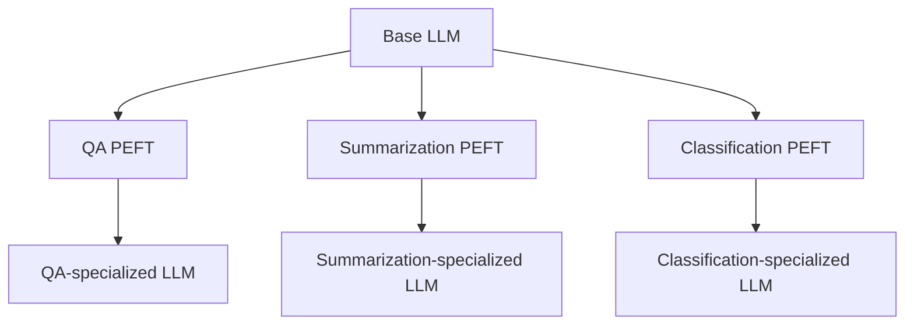
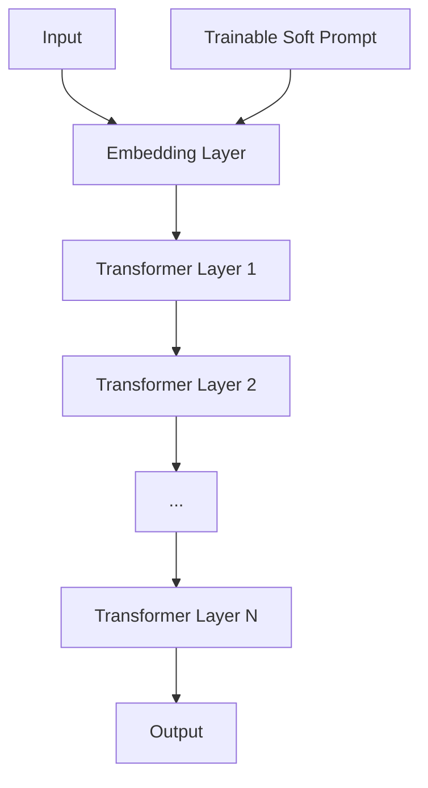
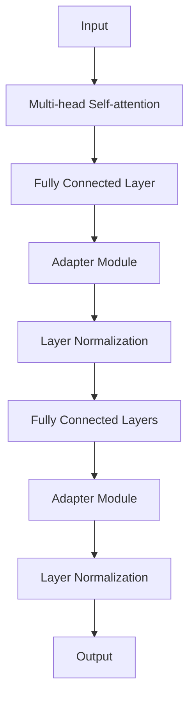
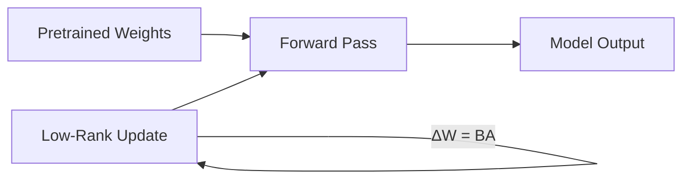

# Lec 29 | Parameter Efficient Fine-Tuning (PEFT)

# 📚 Transfer Learning Evolution in NLP & LLMs 🧠

## 1️⃣ Transfer Learning Before the LLM Era 🔄


### Traditional Transfer Learning Pipeline:


- **Pretraining Stage**: Models learn general language representations from large text corpora
- **Key Embedding Models**:
  | Model | Year | Key Innovation |
  |-------|------|----------------|
  | Word2vec | 2013 | Word embeddings using neural networks |
  | GloVe | 2014 | Global vectors for word representation |
  | ELMo | 2018 | Contextual word representations |
  | ULMFiT | 2018 | Universal language model fine-tuning |
  | BERT | 2018 | Bidirectional encoder representations |

- **Fine-tuning Stage**: Adapting pretrained models for specific tasks:
  - 📋 Classification
  - 🏷️ Sequence labelling
  - ❓ Question answering
  - ➕ Many other NLP tasks

## 2️⃣ Transfer Learning in the LLM Era 🚀


### Modern Transfer Learning Pipeline:


- **Enhanced Pretraining**:
  - Base pretraining + Instruction Tuning + Alignment
  
- **Modern Foundation Models**:
  - 🧩 Mixtral
  - 🔄 GPT-4
  - 🦙 LLaMA
  - 🌴 PaLM

- **In-context Learning**: 
  - Models learn from examples within the prompt
  - Can identify categories (Positive, Finance, Sports, Tech)
  - Infers patterns without parameter updates

### Key Insights:
> 💡 **In-context learning has mostly replaced fine-tuning in large models**

> 🔑 **In-context learning is especially valuable when accessing models through APIs**

## 3️⃣ Downsides of In-context Learning ⚠️


### Four Major Limitations:

1. **📉 Poor Performance**: 
   - Generally underperforms compared to fine-tuning
   - Reference: [Brown et al., 2020]

2. **🔄 Sensitivity Issues**:
   - Highly sensitive to prompt wording [Webson & Pavlick, 2022]
   - Order of examples matters significantly [Zhao et al., 2021; Lu et al., 2022]

3. **❓ Lack of Clarity**:
   - Unclear what models actually learn from prompts
   - Surprisingly, even random labels work! [Min et al., 2022]

4. **⏱️ Inefficiency**:
   - Prompt must be processed with every prediction
   - Computational overhead with each inference

## 4️⃣ Challenges with Full Fine-tuning of LLMs 🔍


### Hardware Challenges:
| Component | Purpose | Memory Impact |
|-----------|---------|---------------|
| Temp memory | Intermediate computations | ↑↑↑ |
| Forward Activations | Storing layer outputs | ↑↑↑ |
| Gradients | Parameter updates | ↑↑↑ |
| Optimizer states | Training progress | ↑↑ |

- **Memory Requirement**: 12-20× the size of model weights 💾

### Storage Challenges:
- Each specialized version requires a complete model copy
- Specialized models needed for:
  - 📊 Question Answering
  - 📝 Summarization
  - 🏷️ Classification

## 5️⃣ Parameter Efficient Fine Tuning (PEFT) 💡


### PEFT Architecture:


- **Core Concept**: Train small adapter modules rather than entire model
- **Task-specific Adapters**:
  - QA PEFT
  - Summarization PEFT
  - Classification PEFT

## 6️⃣ PEFT Advantages 🌟


### Key Benefits:

1. **💰 Reduced Computational Costs**:
   - Requires fewer GPUs
   - Shorter training time

2. **💻 Lower Hardware Requirements**:
   - Compatible with smaller GPUs
   - Less memory needed

3. **📈 Better Modeling Performance**:
   - Reduces overfitting
   - Prevents catastrophic forgetting

4. **💾 Storage Efficiency**:
   - Most weights shared across tasks
   - Only store small task-specific adapters

---

## Summary: Evolution of Transfer Learning in NLP 🔄

| Era | Primary Method | Models | Advantages | Limitations |
|-----|---------------|--------|------------|-------------|
| Pre-LLM | Fine-tuning | Word2vec, GloVe, BERT | Effective for specific tasks | Required task-specific data |
| LLM | In-context Learning | GPT-4, LLaMA, PaLM | No parameter updates needed | Inefficient, sensitive to prompts |
| Modern | PEFT | Adapter-based approaches | Efficient, better performance | Requires some engineering |

> 🚀 **PEFT represents the best of both worlds**: maintaining the adaptability of fine-tuning while approaching the efficiency and flexibility of in-context learning.


# 💡 (Soft) Prompt Tuning: A Parameter-Efficient Fine-Tuning Approach

## 📚 Core Concept & Architecture




### Key Mechanisms:
- 🧩 **Prepends a trainable tensor** to the model's input embeddings
- 🔵 Creates a "soft prompt" (shown in blue in the diagram)
- 📦 Only the small task-specific soft prompt needs to be stored
- 🔍 Significantly more parameter-efficient than full fine-tuning

> 💡 **Reference**: Lester et al. 2021 introduced this technique as an efficient alternative to full model fine-tuning

## 🚀 Multi-Task Serving Capabilities


### Training Process:
| Task | Prompt Color | Process |
|------|-------------|---------|
| Task A | Yellow | Train dedicated soft prompt |
| Task B | Teal | Train separate soft prompt |

### Inference Process:
- 🔄 Same model can handle mixed task inputs
- 🎯 Task-specific prompts are applied based on the input
- 🧠 Base model parameters remain unchanged

## 📊 Performance Analysis


### SuperGLUE Score Comparison:
| Approach | Line Color | Performance Characteristics |
|----------|------------|----------------------------|
| Prompt Design | Blue | Lowest performance overall |
| Model Tuning | Orange | Highest performance at all scales |
| Prompt Tuning | Green | Approaches Model Tuning with larger models |

### Key Findings:
- 📉 **Scale Dependency**: Prompt tuning performs less effectively with smaller models
- 📈 **Convergence**: With very large models (>10^10 parameters), prompt tuning nearly matches full fine-tuning
- ⚠️ **Task Difficulty**: Performance gap widens on more challenging tasks

> 📚 **Citations**: Performance limitations documented by Mahabadi et al., 2021; Liu et al., 2022

## 🔍 Cross-Domain Evaluation


### F1 Scores Across Datasets:
| Dataset | Domain | Model Score | Prompt Score | Δ |
|---------|--------|-------------|--------------|---|
| SQuAD | Wiki | 94.9 ±0.2 | 94.8 ±0.1 | -0.1 |
| TextbookQA | Book | 54.3 ±3.7 | **66.8 ±2.9** | **+12.5** |
| BioASQ | Bio | 77.9 ±0.4 | **79.1 ±0.3** | **+1.2** |
| RACE | Exam | 59.8 ±0.6 | **60.7 ±0.5** | **+0.9** |
| RE | Wiki | 88.4 ±0.1 | **88.8 ±0.2** | **+0.4** |
| DuoRC | Movie | 68.9 ±0.7 | 67.7 ±1.1 | -1.2 |
| DROP | Wiki | 68.9 ±1.7 | 67.1 ±1.9 | -1.8 |

### Key Insights:
- 🌟 **Out-of-Domain Excellence**: Shows significant improvement (+12.5) on BookQA
- 🔬 **Domain Adaptability**: Generally performs well across specialized domains (Bio, Exam)
- ⚖️ **Trade-offs**: Slight performance decreases in some Wiki and Movie domains

> 📊 Evaluation based on models trained on SQuAD and tested on MRQA 2019 shared task datasets (Houlsby et al., 2019)

## 🧰 PEFT Techniques Comparison

### Major Parameter-Efficient Approaches:
- 📝 **(Soft) Prompt Tuning**: Trainable tokens prepended to input
- 🔄 **Prefix Tuning**: Adds trainable parameters to each transformer layer
- 🔌 **Adapters**: Inserts small trainable modules between layers
- 📉 **Low Rank Adaptation (LoRA)**: Decomposes weight updates into low-rank matrices

## 💪 Advantages vs. Traditional Methods

| Aspect | Full Fine-tuning | Prompt Tuning | Benefit |
|--------|-----------------|---------------|---------|
| Storage | One model per task | One model + small prompts | 💾 Much lower storage requirements |
| Training | All parameters | ~0.01% of parameters | ⚡ Significantly faster training |
| Memory | High GPU requirements | Minimal requirements | 💻 Works on smaller hardware |
| Deployment | Complex | Simple prompt switching | 🚀 Easier multi-task serving |

---

## 🔑 Summary: When to Use Soft Prompt Tuning

- ✅ **Ideal for**: Large models (>10B parameters), multi-task deployment, limited compute resources
- ❌ **Less suitable for**: Smaller models, extremely difficult tasks requiring precise tuning
- 🔄 **Complements**: Can be combined with other PEFT techniques for enhanced performance
- 🌐 **Domain adaptation**: Particularly effective when adapting to specialized domains

# 🔌 Adapters: Efficient Model Tuning Architecture


## 📋 Core Concept & Architecture



### 🔄 Architectural Comparison:

| Regular Transformer Block | Transformer Block with Adapters |
|---------------------------|--------------------------------|
| Standard multi-head self-attention | Same multi-head self-attention |
| Standard fully connected layers | Fully connected layers + **Adapter modules** |
| Standard skip connections | Modified skip connections with adapters |
| Standard layer normalization | Layer normalization applied after adapters |

### 🧩 Adapter Module Structure:
- 🔼 **Down-projection**: Fully connected layer that reduces dimensionality
- ⚡ **Nonlinear activation**: Typically ReLU or GeLU
- 🔽 **Up-projection**: Fully connected layer that restores original dimensionality
- 🔄 **Skip connection**: Around the entire adapter module

> 💡 **Reference**: Originally proposed by Houlsby et al. 2019 as an efficient alternative to full fine-tuning

## 📊 Bottleneck Design & Efficiency


### 🔍 Parameter Reduction Mechanism:
- Uses **bottleneck architecture** to dramatically reduce trainable parameters
- Reduces high-dimensional features (`d`) into low-dimensional space (`m`)
- Example calculation:
  ```
  For d=1024 and m=24:
  • Full fine-tuning: 1,024 × 1,024 = 1,048,576 parameters
  • Adapters: 2 × (1,024 × 24) = 49,152 parameters
  ```
- Achieves **~95% parameter reduction** in this example

### ⚖️ Tradeoff Considerations:
- `m` (bottleneck dimension) controls the parameter-performance tradeoff
- Smaller `m` = fewer parameters but potentially lower performance
- Larger `m` = better performance but more parameters
- Typical values range from 8 to 64 depending on model size

### ⏱️ Inference Considerations:
- Additional adapter in each transformer layer increases inference latency
- More layers = more cumulative overhead
- Practical deployment requires balancing latency vs. parameter efficiency

## 📈 Performance Analysis


### 🔬 Experimental Results:
- **Parameter Efficiency**: Comparable to fully fine-tuned BERT with only 3.6% of trainable parameters
- **Competitive Performance**: Maintains consistent accuracy across parameter counts
- **Stability**: Notice the narrow confidence interval (shaded area) for adapters vs. fine-tuning

### 📊 Comparative Analysis:
- **vs. Fine-tuning Top Layers**: Superior and more consistent performance (orange line vs. blue line)
- **vs. Prefix Tuning**: Similar performance when using 3% vs. 0.1% of parameters
  - Adapters: 3% of parameters
  - Prefix Tuning: 0.1% of parameters

### 🌟 Key Advantages:
- 🔸 **Modularity**: Easy to swap adapters for different tasks
- 🔸 **Stability**: More stable training than other PEFT methods
- 🔸 **Predictability**: Performance scales predictably with bottleneck size
- 🔸 **Shared Base Model**: All task-specific knowledge stored in small adapter modules

## 🧰 Implementation Strategies

### ✅ Best Practices:
- Start with bottleneck dimension of ~64 for large models, ~16 for smaller ones
- Add layer normalization before and after adapter modules
- Use skip connections to prevent degradation during training
- Consider adapter location (after attention, after FFN, or both)

### 📋 Variants:
- **Pfeiffer Adapters**: Only placed after FFN sublayer
- **Houlsby Adapters**: Placed after both attention and FFN sublayers
- **Parallel Adapters**: Added in parallel rather than serial configuration

> 📌 **Key Insight**: Adapters offer an excellent balance between performance, parameter efficiency, and implementation simplicity, making them suitable for multi-task learning scenarios with limited computational resources.
>
> # 🔄 Low Rank Adaptation (LoRA): Efficient Fine-Tuning for LLMs


## 🧠 Core Concept & Architecture



### 📋 Regular Fine-tuning Process:
1. **Initial Forward Pass**: Use pretrained weights (W₀) with inputs (x)
2. **Backpropagation**: Calculate weight updates (ΔW)
3. **Updated Forward Pass**: Use W₀ + ΔW with inputs

### 🔑 LoRA Innovation:
- Represents weight updates as **product of two low-rank matrices**
- Formula: `h = W₀x + ΔWx = W₀x + BAx`
- Only trains the low-rank matrices A and B
- Original pretrained weights remain frozen

> 💡 **Key Insight**: Weight updates during fine-tuning have much lower intrinsic rank than the full weight matrices

## 📊 Mathematical Formulation & Implementation


### ⚙️ Core Formula:
```
h = W₀x + BAx
```
Where:
- W₀ ∈ ℝᵈˣᵈ (pretrained weights)
- A ∈ ℝʳˣᵈ (down-projection)
- B ∈ ℝᵈˣʳ (up-projection)
- r << d (rank is much smaller than dimensions)


### 💻 Implementation Details:
- Learn projection matrices A and B directly instead of using random projections
- Apply LoRA primarily to attention weight matrices in transformer models
- Typically target query (Wq), key (Wk), value (Wv), and output (Wo) matrices

## 🔬 Performance Analysis

### 📈 Weight Matrix Selection:


| Weight Type | WikiSQL Accuracy | MultiNLI Accuracy |
|-------------|------------------|-------------------|
| Wq | 70.4 | 91.0 |
| Wk | 70.0 | 90.8 |
| Wv | 73.0 | 91.0 |
| Wo | 73.2 | 91.3 |
| Wq + Wv | **73.7** | 91.3 |
| Wq + Wk + Wv + Wo | **73.7** | **91.7** |

> 📌 **Finding**: Applying LoRA to value (Wv) and output (Wo) matrices gives the best single-matrix performance

### 🎯 Rank Selection:


| Rank | Wq | Wq + Wv | All Matrices |
|------|----|---------|--------------| 
| r=1  | 68.8 | 73.4 | 74.1 |
| r=2  | 69.6 | 73.3 | 73.7 |
| r=4  | 70.5 | **73.7** | 74.0 |
| r=8  | 70.4 | 73.8 | 74.0 |
| r=64 | 70.0 | 73.5 | 73.9 |

> 🔍 **Insight**: Even very small ranks (r=2 or r=4) achieve comparable performance to much larger ranks

## 🔧 Implementation Techniques

### 🎬 Weight Initialization:


- **Matrix B**: Initially set to zero (B = 0)
  - Ensures ΔW = BA = 0 at the start
  - Preserves original model behavior initially

- **Matrix A**: Initialized from Gaussian distribution N(0, σ²)
  - Prevents disproportionate influence on updates
  - Balanced starting point for optimization

### 🧪 Training Process:
```python
# Pseudocode for LoRA implementation
def forward(x, W_pretrained, A, B):
    # Regular forward pass with frozen weights
    regular_output = W_pretrained @ x
    
    # LoRA update path
    lora_update = B @ (A @ x)
    
    # Combined output
    return regular_output + lora_update
```

## 🚀 Extensions & Variants


| Variant | Authors | Key Innovation |
|---------|---------|----------------|
| QLoRA | Dettmers et al., 2023 | 4-bit quantization for reduced memory |
| LongLoRA | Chen et al., 2024 | Sparse attention for longer contexts |
| LoRA+ | Hayou et al., 2024 | Different learning rates for A and B |
| DyLoRA | Valipou et al., 2023 | Dynamic rank selection |

## 💪 Advantages of LoRA

| Aspect | Benefit |
|--------|---------|
| 📉 **Parameter Efficiency** | Reduces trainable parameters by 99%+ |
| 💾 **Memory Usage** | Significantly lower than full fine-tuning |
| 🔄 **Model Switching** | Easily swap task-specific adapters |
| 🔍 **Performance** | Comparable to full fine-tuning |
| ⚡ **Inference** | Matrices can be merged for zero runtime overhead |

---

## 📝 Summary: Why LoRA Works

LoRA leverages the intrinsic low-dimensional nature of model updates during fine-tuning. By representing these updates as products of much smaller matrices, it achieves:

1. 📊 **Dramatic reduction** in trainable parameters
2. 🧠 **Preservation** of original model knowledge
3. 🎯 **Targeted adaptation** to specific tasks
4. 💻 **Resource efficiency** for deployment on limited hardware

> 🌟 **Key Takeaway**: LoRA has become one of the most widely adopted PEFT methods due to its excellent balance of simplicity, efficiency, and performance
