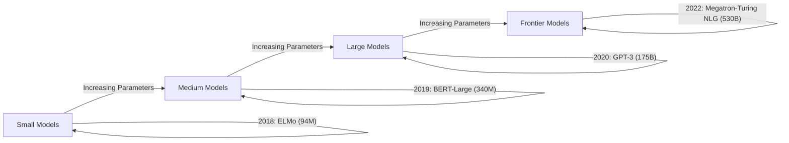
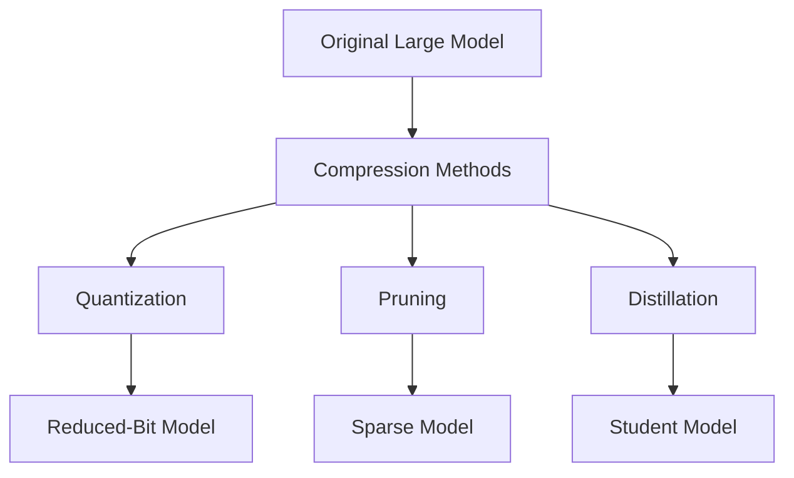
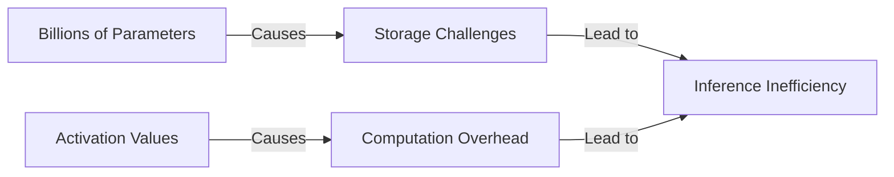
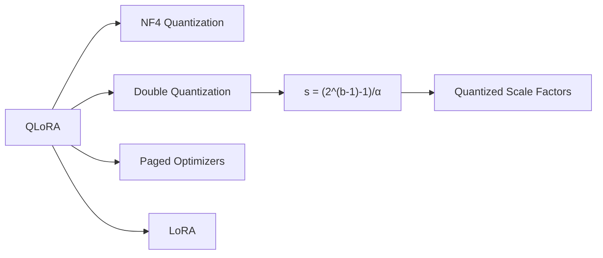
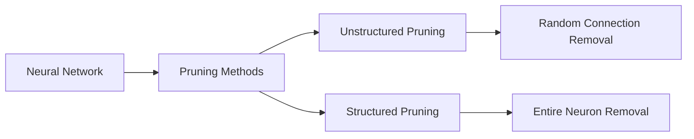
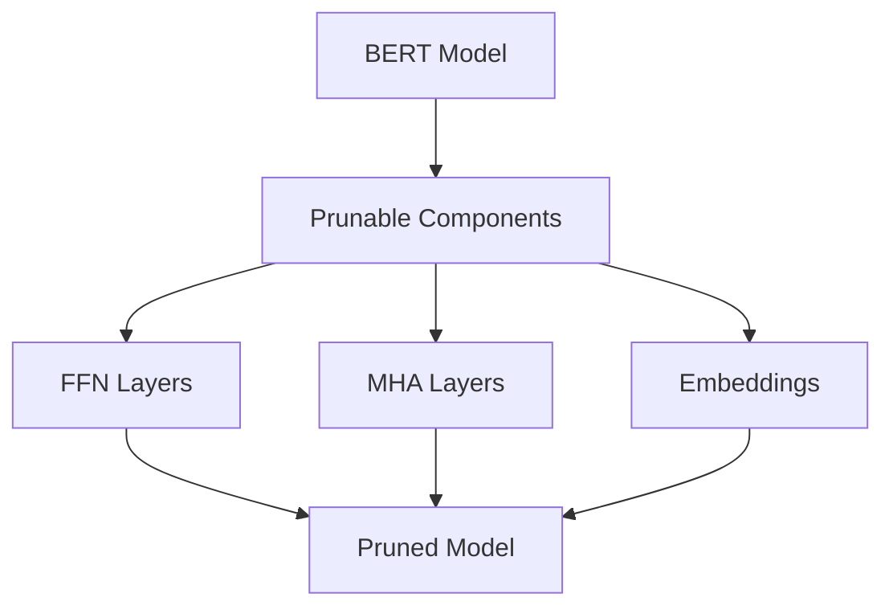
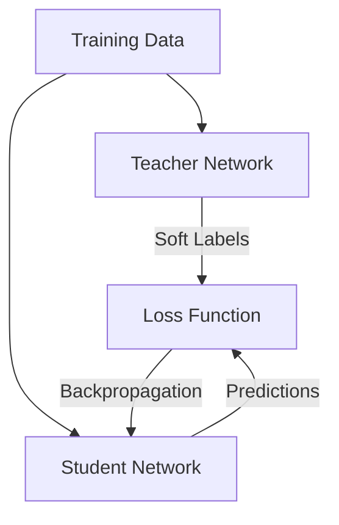
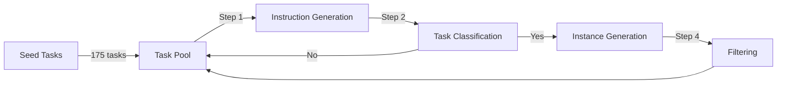

# Lec 30 | Quantization, Pruning & Distillation

# 🚀 LLM Inference: Challenges, Performance & Optimization

## 📈 Evolution of LLM Model Sizes (2018-2022)




### 📊 Key Model Size Milestones:
| Year | Model | Parameters | Scale Increase |
|------|-------|------------|----------------|
| 2018 | ELMo | 94M | Baseline |
| 2019 | BERT-Large | 340M | ~3.6× |
| 2019 | GPT-2 | 1.5B | ~16× |
| 2020 | T5 | 11B | ~117× |
| 2020 | GPT-3 | 175B | ~1,861× |
| 2021 | Turing-NLG | 17.2B | ~183× |
| 2022 | Megatron-Turing NLG | 530B | ~5,638× |

### ⚠️ Scaling Challenges:
1. 🖥️ **GPU Memory Requirements**: Exponentially increasing VRAM needs
2. ⏱️ **Latency Issues**: Slower inference with larger models
3. 💰 **Inference Costs**: Higher operational expenses
4. 🌍 **Environmental Impact**: Increased energy consumption and carbon footprint

## 🏆 Performance Benchmarks of Modern LLMs


### 📋 Benchmark Performance (Accuracy %):
| Model | MMLU | GPQA | DROP | MGSM | MATH | HumanEval | MMMU | MathVista |
|-------|------|------|------|------|------|-----------|------|-----------|
| GPT-4o | 🥇 92 | 🥇 51 | 🥇 85 | 🥇 88 | 🥇 71 | 🥇 92 | 🥇 68 | 🥇 68 |
| GPT-4o mini | 82 | 41 | 79 | 80 | 69 | 74 | 59 | 54 |
| Gemini Flash | 79 | 36 | 76 | 75 | 42 | 69 | 54 | 44 |
| Claude Haiku | 73 | 34 | 78 | 70 | 41 | 72 | 49 | 45 |
| GPT-3.5 Turbo | 70 | 30 | 74 | 53 | 38 | 67 | 54 | 40 |

> 💡 **Insight**: GPT-4o consistently outperforms other models across all benchmarks, especially in reasoning (MATH, MathVista) and coding (HumanEval) tasks.

## 💰 Cost Analysis & Efficiency


### 💲 Price Comparison: GPT-4o vs GPT-4o-mini

| Pricing Metric | GPT-4o | GPT-4o-mini | Cost Difference |
|----------------|--------|-------------|-----------------|
| Input (per 1M tokens) | $5.00 | $0.15 | 33.3× cheaper |
| Output (per 1M tokens) | $15.00 | $0.60 | 25× cheaper |
| Per API call | $0.0080 | $0.0003 | 26.7× cheaper |
| **Total cost** (10K calls) | $80.00 | $3.15 | 25.4× cheaper |

### 🤔 Why the Price Difference?
- 🔹 Smaller parameter count requires less computational resources
- 🔹 Lower training costs amortized over the model lifetime
- 🔹 Reduced inference hardware requirements
- 🔹 Potentially different quality-cost optimization targets

## ⚙️ Cost-Effective Inference Strategies


### 1️⃣ Model Compression Techniques



#### 📊 Compression Methods Compared:
| Technique | Approach | Storage Savings | Performance Impact | Implementation Difficulty |
|-----------|----------|-----------------|-------------------|---------------------------|
| 🔢 **Quantization** | Reduce precision (FP16, INT8, INT4) | 2-8× | Minor to moderate | Low to medium |
| ✂️ **Pruning** | Remove redundant parameters | 1.5-3× | Varies by technique | Medium to high |
| 🧠 **Distillation** | Train smaller model to mimic larger one | 2-10× | Moderate | High |

> 💡 **Key Consideration**: The optimal approach depends on your specific use case, hardware constraints, and performance requirements.

## 🔍 Summary & Recommendations

### Best Practices:
- 📈 **Performance/Cost Balance**: Select models appropriate for your task complexity
- 🔄 **Quantization First**: Apply quantization as the first optimization step (lowest hanging fruit)
- 💡 **Task-Specific Models**: Consider using specialized smaller models for specific tasks
- 🧪 **Test Thoroughly**: Validate performance after applying optimization techniques

### Future Trends:
- 🔮 Specialized hardware accelerators for efficient LLM inference
- 🔮 Hybrid approaches combining multiple optimization techniques
- 🔮 Adaptive inference systems that dynamically adjust model size based on input complexity

# 🔢 LLM Quantization: Efficient Representation for Inference

## 🧩 The Core Challenge with LLMs


### 💾 Storage & Computation Bottlenecks:



- **Model Size Issue**: LLMs contain billions of parameters requiring significant storage
- **Runtime Challenge**: During inference, activations (created as input × weights) consume additional memory
- **Efficiency Goal**: Represent billions of values using minimal bits without sacrificing performance

## 📊 Numerical Representation Formats


| Format | Total Bits | Sign | Exponent | Significand/Mantissa | Value Range |
|--------|------------|------|----------|----------------------|-------------|
| FP32   | 32 bits    | 1 bit| 8 bits   | 23 bits              | ~±3.4×10³⁸ |
| FP16   | 16 bits    | 1 bit| 5 bits   | 10 bits              | ~±65,504   |
| INT8   | 8 bits     | 1 bit| -        | 7 bits               | -127 to 127|

> 💡 **Key Insight**: Lower precision formats drastically reduce memory requirements but introduce approximation

## 🔄 The Quantization Process: FP32 → INT8


### 📏 Value Range Mapping:
- **FP32 Range**: -10.8 to 10.8 (example values)
- **INT8 Range**: -127 to 127 (fixed range)
- **Zero Preservation**: 0 in FP32 = 0 in INT8 (preserves origin point)

### 🧮 Example Mapping:
| FP32 Value | INT8 Quantized Value |
|------------|----------------------|
| 10.8       | 127                  |
| 5.47       | 64                   |
| 3.08       | 36                   |
| -7.59      | -89                  |
| -4.57      | -54                  |

## 🔬 Mathematical Foundation


### ⚙️ Quantization Formula:
```
s = (2^(b-1) - 1) / α
x_quantized = round(s • x)
```

Where:
- **s** = scale factor
- **b** = bit width (8 for INT8)
- **α** = maximum absolute value in the tensor
- **x** = original FP32 value

### 📝 Example Calculation:
```
s = 127 / 10.8 = 11.76
x_quantized = round(11.76 • x)
```

## 🛠️ Quantization Approaches


### Two Primary Methods:
1. 📊 **Post Training Quantization (PTQ)**
   - Apply after training is complete
   - No retraining required

2. 🧠 **Quantization Aware Training (QAT)**
   - Incorporate quantization effects during training
   - More complex but potentially better results

## 📋 Post Training Quantization (PTQ)


### 🔑 Key Characteristics:
- **Zero Retraining**: No modification to model architecture or additional training
- **Fixed Components**: Weights and biases are constants, making scale factor computation straightforward
- **Variable Components**: Inputs and activations require calibration dataset for proper scaling

## 🔍 Vector-wise Quantization Process


### 4-Step Implementation:
1. **Find Constants**: Determine scaling factors (Cw & Cx) for weights and activations
2. **Quantize**: Convert FP16 values to INT8 using scaling factors
3. **Integer Matrix Multiplication**: Perform computations in INT8 space
4. **Dequantize**: Convert results back to higher precision

## ⚡ Hardware Performance Impact


### 📈 NVIDIA H100 GPU Performance:
| Precision Format | Performance (H100 SXM) |
|------------------|------------------------|
| FP32             | 67 teraFLOPS          |
| FP16             | 1,979 teraFLOPS       |
| INT8             | 3,958 TOPS            |
| FP8              | 3,958 teraFLOPS       |

> 🚀 **Impact**: ~60× performance increase from FP32 to INT8 operations!

## 📊 LLM.int8() Method & Performance


### 📈 Performance Findings:
- ✅ Regular INT8 quantization maintains performance up to 2.7B parameters
- ⚠️ Performance collapse occurs at 6.7B+ parameters due to outlier values
- 🔬 LLM.int8() (Dettmers et al., 2022) maintains 16-bit accuracy regardless of scale by handling outliers separately

### 🔑 Key Advantages:
- 📉 **Memory Reduction**: 4× smaller model size compared to FP32
- 🚀 **Inference Speed**: 2-4× faster inference on optimized hardware
- 💻 **Deployment Flexibility**: Enables deployment on more resource-constrained devices

---

## 💡 Summary: Quantization Benefits & Tradeoffs

| Benefit | Tradeoff | Mitigation |
|---------|----------|------------|
| 📦 4× smaller models | Potential accuracy loss | Advanced techniques like LLM.int8() |
| ⚡ Faster inference | Handling outlier values | Mixed-precision approaches |
| 💻 Broader deployment | Hardware requirements | Specialized hardware acceleration |
| 🔋 Energy efficiency | Implementation complexity | Well-tested libraries & frameworks |

> 🌟 **Best Practice**: Use PTQ for most models up to 2.7B parameters; for larger models, consider specialized techniques like LLM.int8() that handle outliers explicitly

# 🧮 Advanced Quantization Techniques for LLMs

## 📊 LLM.int8(): Mixed-Precision Quantization


### 🔍 Performance Characteristics

```mermaid
graph TD
    A[Model Size] -->|< 2.7B Parameters| B[Regular INT8 Works Well]
    A -->|> 6.7B Parameters| C[Regular INT8 Fails]
    C -->|Due to| D[Outlier Features]
    E[LLM.int8()] -->|Maintains| F[16-bit Accuracy at All Scales]
```

| Method | Small Models (<2.7B) | Large Models (>6.7B) |
|--------|----------------------|----------------------|
| 8-bit baseline | ✅ Good accuracy | ❌ Severe degradation |
| 16-bit baseline | ✅ Good accuracy | ✅ Good accuracy |
| LLM.int8() | ✅ Good accuracy | ✅ Good accuracy |

> 💡 **Key Finding:** Standard INT8 quantization collapses at 6.7B+ parameters due to outlier values that cannot be represented well in 8-bit precision.

### ⚙️ Implementation Mechanism


The LLM.int8() method employs a **hybrid approach**:

1. 🟦 **Regular Values** → Standard 8-bit quantization:
   - Calculate vector-wise constants (Cw & Cx)
   - Convert to INT8 representation  
   - Perform INT8 matrix multiplication
   - Dequantize results

2. 🟨 **Outlier Values** → 16-bit precision path:
   - Identify and extract outliers
   - Process using higher precision FP16
   - Matrix multiplication in FP16

3. 🔄 **Combined Output** → Merge results from both paths

## 🚀 QLoRA: Quantized Low-Rank Adaptation


### 💾 Memory Efficiency Revolution

| Approach | Memory Required | Relative Reduction |
|----------|-----------------|-------------------|
| Standard Fine-tuning (65B model) | >780GB | Baseline |
| QLoRA | <48GB | >16× reduction |

> 🔑 **Impact:** QLoRA enables fine-tuning of massive models on consumer hardware while maintaining full model performance.

### 🧠 Technical Components of QLoRA




#### 1️⃣ Double Quantization
- **Concept:** Quantize both model weights AND quantization constants
- **Implementation:** Scale factors (normally FP32) are themselves quantized
- **Benefit:** Additional memory savings with minimal accuracy impact

### 💻 Hardware Accessibility


| Model | Traditional Hardware | QLoRA Hardware |
|-------|----------------------|----------------|
| Phi-1 (1.3B) | ~21GB GPU memory | Standard laptop (16GB GPU + 16GB CPU) |
| 65B models | 780GB system | Consumer-grade GPUs (48GB) |

### 🔧 Mixed Precision Approach


#### 🧩 LoRA Equation:
```
Y = XW + sXL₁L₂
```

Where:
- Original weights (W) are 4-bit quantized
- LoRA adapters (L₁, L₂) use higher precision
- Different precision formats:
  - BF16: 1 sign bit, 8 exponent bits, 7 fraction bits
  - FP32: 1 sign bit, 8 exponent bits, 23 fraction bits
  - FP16: 1 sign bit, 5 exponent bits, 10 fraction bits

## 🔄 Practical Benefits & Applications

### 🛠️ LLM.int8() vs QLoRA Comparison

| Feature | LLM.int8() | QLoRA |
|---------|------------|-------|
| Primary Goal | Efficient inference | Efficient fine-tuning |
| Memory Reduction | 2-4× | 16×+ |
| Performance Impact | Minimal | Minimal |
| Implementation Complexity | Medium | High |
| Key Innovation | Mixed-precision inference | 4-bit weights + LoRA |
| Release Year | 2022 | 2023 |

### 💪 Real-World Applications

1. **Deployment Scenarios**:
   - 🖥️ Run large models on consumer hardware
   - 🌐 Edge device deployment of powerful LLMs
   - 🔄 Fine-tune frontier models without specialized infrastructure

2. **Performance Benefits**:
   - ⚡ Faster inference and training
   - 💰 Lower operational costs
   - 🌱 Reduced environmental impact

> 🚀 **Together, these techniques represent a significant democratization of LLM capabilities, bringing powerful models within reach of researchers and developers with limited computational resources.**
>
> # 🔄 Advanced Model Optimization: QLoRA & Pruning Techniques

## 📊 QLoRA Performance: Efficient Fine-tuning Success


### 🔬 MMLU Accuracy Across LLaMA Models

| Quantization | 7B | 13B | 33B | 65B | Mean |
|--------------|-----|-----|-----|-----|------|
| BFloat16 | 38.4-45.6 | 47.2-50.6 | 57.7-60.5 | 61.8-62.5 | 53.0 |
| Float4 | 37.2-44.0 | 47.3-50.0 | 55.9-58.5 | 61.3-63.3 | 52.2 |
| NFloat4+DQ | 39.0-44.5 | 47.5-50.7 | 57.3-59.2 | 61.8-63.9 | 53.1 |

> 💡 **Key Finding**: NFloat4 with Double Quantization (DQ) achieves equivalent or better performance (53.1 mean accuracy) than BFloat16 (53.0) while using significantly less memory.

## 🧹 Pruning Approaches: Network Reduction Strategies


### 🔍 Core Pruning Paradigms:



| Approach | Implementation | Hardware Compatibility | Efficiency Gain |
|----------|----------------|------------------------|-----------------|
| **Unstructured** | Random weight removal | Limited | High theoretical sparsity |
| **Structured** | Removes entire units | Excellent | Direct computation savings |

## 📉 Magnitude Pruning Effectiveness


### 📊 Performance vs. Pruning Percentage:

- 🟦 **Pruned Only**: Performance collapses at >70% pruning
- 🟨 **Pruned + Retrained**: Maintains performance even at 80% pruning
- 🟥 **Sparse from Beginning**: Highly effective approach

> 🔑 **Findings from Han et al. 2015, See et al. 2016**:
> - 40% of weights can be pruned with negligible performance impact
> - With retraining, up to 80% pruning possible with no performance loss

## 🌟 Wanda: Activation-Aware Pruning


### ⚖️ Pruning Criteria Comparison:

| Method | Importance Score | Considers | Example Result |
|--------|-----------------|-----------|----------------|
| **Magnitude** | S = \|W\| | Only weight values | Potentially prunes important connections |
| **Wanda** | S = \|W\| · ‖X‖₂ | Weights + activations | Preserves weights with high activation impact |

## 🧩 Hardware-Optimized Structured Pruning


### 🖥️ NVIDIA A100 GPU Optimization:

- **Sparse Matrix Format**: Compresses R×C matrix into R×(C/2) data + R×(C/2) indices
- **Acceleration Pattern**: 2:4 sparsity (2 non-zero values per 4 elements)
- **Hardware Support**: Dedicated Tensor Cores for sparse operations

## 🏗️ Component-Level Pruning Framework


### 🔧 Architecture-Aware Pruning (Xia et al. 2022):



| Component | Pruning Strategy | Runtime Impact |
|-----------|------------------|----------------|
| Feed-Forward Networks | Reduce intermediate dimensions | Major speedup |
| Multi-Head Attention | Reduce number of attention heads | Significant speedup |
| Embeddings | Usually preserved | Minimal impact |

> ⏱️ **Efficiency**: Complete pruning process takes <20 hours on a single GPU

---

## 🔄 Combining QLoRA & Pruning: The Optimal Approach

For maximum efficiency in LLM deployment, combining quantization (QLoRA) with strategic pruning offers complementary benefits:

| Technique | Memory Reduction | Speed Improvement | Implementation Complexity |
|-----------|------------------|-------------------|---------------------------|
| QLoRA | 16×+ | Moderate | High |
| Pruning | 2-5× | High | Medium |
| Combined | 30×+ | Very High | High |

> 🚀 **Best Practice**: Apply quantization first to reduce memory footprint, then use structured pruning to accelerate inference on target hardware.
>
> # 🔄 Knowledge Distillation: Teaching Small Models with Big Knowledge


## 📚 Classic Knowledge Distillation



### 🎓 Teacher-Student Architecture:
- **Teacher**: Large, complex network with high accuracy
- **Student**: Smaller, faster network learning from teacher
- **Knowledge Transfer**: Through probability distributions (soft labels)

### 📊 Example Distribution Transfer:
| Label Class | Gold Label | Teacher's Soft Prediction |
|-------------|------------|---------------------------|
| Class 1 | 0 | 0.10 |
| Class 2 | 0 | 0.20 |
| Class 3 | 1 | 0.50 |
| Class 4 | 0 | 0.15 |
| Class 5 | 0 | 0.05 |

> 💡 **Key Insight**: Soft labels contain richer information than hard labels, teaching the student about relationships between classes

### ⚖️ Advantages vs. Limitations:
| Pros | Cons |
|------|------|
| 🔹 No architectural restrictions on student | 🔸 Requires training data |
| 🔹 Significant potential speed improvements | 🔸 Computationally expensive initially |
| 🔹 Preserves generalization capabilities | 🔸 Requires careful temperature tuning |

## 🧮 Sequence-Level Distillation


### 📝 Distillation Types:
1. **Word-Level Knowledge Distillation**:
   ```
   ℒWORD-KD = -∑∑ q(tj = k | s, t<j) × log p(tj = k | s, t<j)
   ```
   - Operates on individual token predictions
   - Matches probability distributions at each generation step

2. **Sequence-Level Knowledge Distillation**:
   ```
   ℒSEQ-KD = -∑ q(t | s) log p(t | s)
   ≈ -∑ 𝟙{t = ŷ} log p(t | s)
   = -log p(t = ŷ | s)
   ```
   - Focuses on entire sequence outputs
   - Often simplified to training on teacher's most likely sequence

### 🔍 Applications in NLP:
- 📊 Machine translation
- 📑 Text summarization
- 💬 Dialogue generation
- 📚 Document compression

## 🤖 Self-Instruct: Modern Self-Distillation


### 🔄 Self-Improvement Cycle:


### 📋 Process Breakdown:
1. **Instruction Generation**: LM creates new instructions from seed examples
   - Example: "Give me a quote from a famous person on this topic"

2. **Task Classification**: Model identifies valid instruction patterns

3. **Instance Generation**: Creates inputs/outputs using two strategies:
   - **Output-first**: Generate output, then input (classification tasks)
   - **Input-first**: Generate appropriate input for instruction (creative tasks)

4. **Filtering**: Quality control to ensure diverse, high-quality data

> 🚀 **Innovation**: Self-Instruct enables models to bootstrap their own capabilities without human-annotated examples

## 💡 Benefits Across Distillation Approaches

| Technique | Size Reduction | Speed Improvement | Quality Retention |
|-----------|----------------|-------------------|-------------------|
| Classic Distillation | 5-10× | 2-5× | High |
| Sequence Distillation | 4-8× | 3-6× | Medium-High |
| Self-Instruct | Variable | Variable | Very High |

---

## 🔮 The Future of Distillation

- 🧩 **Multi-teacher ensembles**: Combining knowledge from multiple expert models
- 🧠 **Progressive distillation**: Staged knowledge transfer through intermediate models
- 🔄 **Continuous self-improvement**: Models that iteratively refine through their own outputs
- 🌐 **Multimodal distillation**: Transferring knowledge across different data types

> 📌 **Key Takeaway**: Distillation techniques offer a powerful approach to making LLMs more efficient while preserving their capabilities, enabling deployment on resource-constrained devices
>
> # 🔄 Model Compression Methods Comparison: Detailed Analysis 📊

## Comprehensive Method Comparison Table

| Feature | 🎓 Knowledge Distillation<br>(Hinton et al. 2015) | 📝 Sequence Level Distillation<br>(Kim et al. 2016) | 🤖 Self-Instruct<br>(Wang et al. 2023) |
|:--------|:--------------------------------------------------|:---------------------------------------------------|:--------------------------------------|
| **Core Concept** | Teacher-student paradigm with knowledge transfer | Specialized distillation for sequence models | Self-improvement cycle using seed examples |
| **Primary Goal** | 📉 Compress large models to smaller ones | 📉 Optimize sequence generation models | 📈 Bootstrap model capabilities without extensive human data |
| **Architecture** | Large teacher → Small student | NMT teacher → Smaller sequence model | Same model bootstraps itself |
| **Knowledge Transfer** | Soft label probability distributions | Word-level or sequence-level probabilities | Task and instruction generation |
| **Mathematical<br>Foundation** | $KL(q(y\|x;\theta_T) \| p(y\|x;\theta))$ | $\mathcal{L}_{SEQ-KD} = -\sum q(\mathbf{t}\|\mathbf{s})\log p(\mathbf{t}\|\mathbf{s})$ | Iterative self-improvement algorithm |
| **Training Data<br>Requirements** | ⚠️ Requires substantial labeled data | ⚠️ Requires parallel corpora | ✅ Minimal (just 175 seed examples) |
| **Computational<br>Cost** | 🔴 High (needs both teacher and student) | 🟠 Medium-High | 🟢 Lower (single model iteration) |
| **Model Size<br>Reduction** | 5-10× smaller | 4-8× smaller | Variable (task-dependent) |
| **Quality<br>Retention** | High (80-90% of teacher performance) | Medium-High (context-dependent) | Very High (self-enhancing) |
| **Primary<br>Applications** | Image classification, general ML tasks | Machine translation, text summarization | Instruction tuning, task adaptation |

## 🔍 Method-Specific Details

### 1️⃣ Knowledge Distillation (Hinton et al. 2015)


#### Key Strengths:
- 🔹 No architectural constraints on student network
- 🔹 Preserves inter-class relationships through soft labels
- 🔹 Widely applicable across domains

#### Limitations:
- 🔸 Requires substantial training data
- 🔸 Initial computational overhead
- 🔸 Temperature hyperparameter tuning needed

### 2️⃣ Sequence Level Distillation (Kim et al. 2016)

#### Distillation Types:
1. **Word-Level Knowledge Distillation**:
   ```
   ℒWORD-KD = -∑∑ q(tj = k | s, t<j) × log p(tj = k | s, t<j)
   ```

2. **Sequence-Level Knowledge Distillation**:
   ```
   ℒSEQ-KD ≈ -log p(t = ŷ | s)
   ```

#### Key Strengths:
- 🔹 Specialized for sequence generation tasks
- 🔹 Two granularity levels (word & sequence)
- 🔹 Superior for neural machine translation

#### Limitations:
- 🔸 Limited to sequence modeling tasks
- 🔸 Performance gap in complex language tasks
- 🔸 Requires high-quality teacher translations

### 3️⃣ Self-Instruct (Wang et al. 2023)

#### Process Workflow:


#### Key Strengths:
- 🔹 Minimal initial data requirements
- 🔹 Self-improvement without human annotation
- 🔹 Flexible for instruction tuning

#### Limitations:
- 🔸 Quality dependent on seed examples
- 🔸 Potential reinforcement of model biases
- 🔸 Complex filtering requirements

## 📊 Performance Comparison

| Metric | Knowledge Distillation | Sequence Distillation | Self-Instruct |
|--------|------------------------|----------------------|---------------|
| **Speed Improvement** | ⭐⭐⭐⭐ (2-5×) | ⭐⭐⭐⭐⭐ (3-6×) | ⭐⭐ (Variable) |
| **Memory Efficiency** | ⭐⭐⭐ (Medium) | ⭐⭐⭐⭐ (High) | ⭐⭐ (Model-dependent) |
| **Task Generalization** | ⭐⭐⭐⭐ (Broad) | ⭐⭐ (Sequence-focused) | ⭐⭐⭐⭐⭐ (Highly adaptable) |
| **Implementation Complexity** | ⭐⭐ (Moderate) | ⭐⭐⭐ (Higher) | ⭐⭐⭐⭐ (Complex) |
| **Data Efficiency** | ⭐⭐ (Data-hungry) | ⭐⭐ (Requires corpus) | ⭐⭐⭐⭐⭐ (Minimal data needed) |

## 🎯 Ideal Use Cases

| Method | Best For | Not Recommended For |
|--------|----------|---------------------|
| **Knowledge Distillation** | General model compression<br>Image classification<br>Simple NLP tasks | Highly specialized tasks<br>Low-resource environments |
| **Sequence Distillation** | Machine translation<br>Text generation<br>Summarization | Multi-modal tasks<br>Classification problems |
| **Self-Instruct** | Instruction tuning<br>Capability expansion<br>Low-resource scenarios | When golden labels are available<br>When quality control is critical |

> 💡 **Expert Insight**: While Knowledge Distillation provides a general framework, Sequence Distillation specializes it for language tasks, and Self-Instruct represents a paradigm shift toward self-improvement. The optimal choice depends on your specific constraints, available data, and deployment targets.
