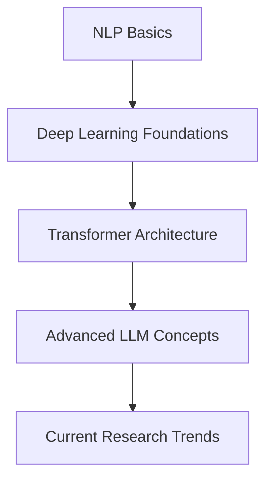
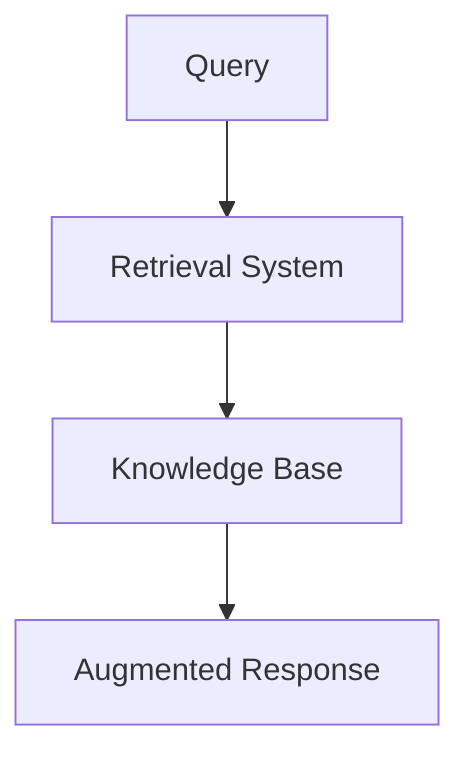
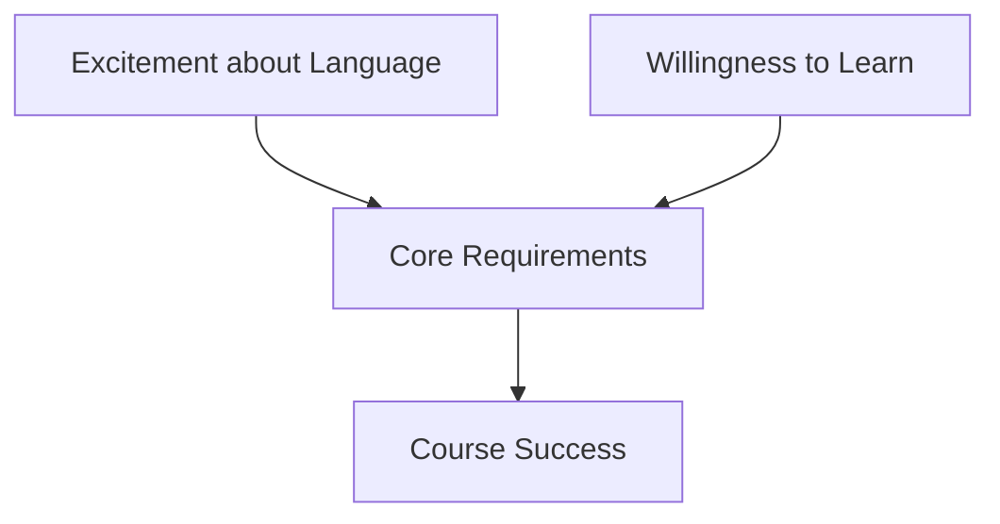
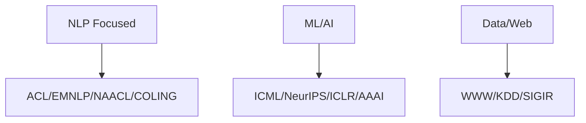

# Lec 01 : Introduction and Recent Advances

# Large Language Models: Course Overview 🤖

## Course Information 📚

### Teaching Team
| Role | Name | Institution |
|------|------|-------------|
| **Instructor** | Prof. Tanmoy Chakraborty | IIT Delhi |
| **Instructor** | Prof. Soumen Chakrabarti | IIT Bombay |
| **Teaching Assistant** | Anwoy Chatterjee | PhD student, IIT Delhi |
| **Teaching Assistant** | Poulami Ghosh | PhD student, IIT Bombay |

## Course Structure 🎓

### Core Components
1. **Foundational Knowledge**
   - Introduction to Natural Language Processing (NLP)
   - Deep Learning fundamentals
   - Essential concepts for understanding LLMs

2. **Advanced Topics**
   - Transformer architecture deep-dive
   - Recent developments in LLM research
   - State-of-the-art techniques and applications

## Course Level & Prerequisites 📋

This is designed as a **graduate-level introductory course** with the following characteristics:
- Focus on fundamental concepts
- Comprehensive coverage of LLM architecture
- Balance of theoretical understanding and practical applications

### Learning Path 🛣️


## Key Learning Objectives 🎯

- Understand core NLP concepts and their evolution
- Master the fundamentals of deep learning in the context of language models
- Gain in-depth knowledge of Transformer architecture
- Stay current with cutting-edge LLM research and developments

## Course Benefits 💡

- **Theoretical Foundation**: Build a strong understanding of LLM principles
- **Research Perspective**: Exposure to current trends and future directions
- **Practical Skills**: Apply concepts to real-world language processing challenges
- **Academic Rigor**: Graduate-level depth with clear learning progression

# Large Language Models: Comprehensive Course Structure 🎓

## 1. Foundational Basics 📚

### Natural Language Processing & Deep Learning
- **NLP Fundamentals** 
  - Core concepts and principles
  - Text processing techniques
  - Linguistic foundations

- **Deep Learning Essentials**
  - Neural network architectures
  - Training methodologies
  - Optimization techniques

### Language Models & Embeddings
- **Language Model Foundations**
  ```mermaid
  graph LR
    A[Statistical LMs] --> B[Neural LMs]
    B --> C[Modern LLMs]
  ```

- **Word Representation**
  | Model | Key Features |
  |-------|-------------|
  | Word2Vec | Context-based embeddings |
  | GloVE | Global word co-occurrence |

### Neural Architectures
```python
# Example architectures covered
architectures = {
    'CNN': 'Convolutional Neural Networks',
    'RNN': 'Recurrent Neural Networks',
    'Seq2Seq': 'Sequence-to-Sequence Models',
    'Attention': 'Attention Mechanisms'
}
```

## 2. Transformer Architecture 🔧

### Core Components
- **Positional Encoding**
  - Relative position representation
  - Sequence order preservation

- **Tokenization Strategies**
  ```markdown
  - BPE (Byte Pair Encoding)
  - WordPiece
  - SentencePiece
  ```

### Model Variants
- **Decoder-only LM** 
  - GPT-style architectures
  - Autoregressive generation

- **Encoder-only LM**
  - BERT-style models
  - Bidirectional context

- **Encoder-decoder LM**
  - T5-style architectures
  - Sequence transformation

## 3. Advanced Learning Paradigms 🧠

### Instruction & Context
- **Fine-tuning Approaches**
  - Task-specific adaptation
  - Instruction following

- **In-context Learning**
  - Few-shot learning
  - Zero-shot capabilities

### Advanced Prompting
```markdown
- Chain of Thoughts (CoT)
- Graph of Thoughts (GoT)
- Prompt Chaining
```

### Model Enhancement
- **Parameter-Efficient Fine-Tuning (PEFT)**
- **Alignment Techniques**

## 4. Knowledge Integration & Retrieval 📖

### Knowledge Management
- **Knowledge Graph Integration**
- **Question Answering Systems**

### Retrieval Techniques


## 5. Ethics & Contemporary Models 🌟

### Ethical Considerations
- **Bias Detection & Mitigation**
- **Toxicity Control**
- **Hallucination Prevention**

### Model Landscape
- Current SOTA models
- Comparative analysis
- Future directions

---

> 💡 **Note**: This course structure provides a comprehensive journey from fundamental concepts to advanced applications in LLM technology.

# Large Language Models: Course Prerequisites & Scope 📚

## Prerequisites Overview

### Core Requirements 🎯

#### Essential Prerequisites


#### Technical Requirements Matrix

| Category | Mandatory | Desirable |
|----------|-----------|-----------|
| **Programming** | ✅ Python | 🔄 Advanced frameworks |
| **Algorithms** | ✅ DSA | 🔄 Advanced algorithms |
| **ML/DL** | ✅ Machine Learning | 🔄 Deep Learning |
| **Domain** | ❌ None | 🔄 NLP background |

## Detailed Requirements Breakdown 🔍

### 1. Mandatory Prerequisites

#### Technical Skills
```python
required_skills = {
    "DSA": "Data Structures & Algorithms",
    "ML": "Machine Learning fundamentals",
    "Python": "Programming proficiency"
}
```

#### Soft Skills
- **Enthusiasm** for language and linguistics
- **Learning mindset** and adaptability
- **Problem-solving** approach

### 2. Desirable Background 📈

#### Advanced Knowledge Areas
- **NLP**: Natural Language Processing concepts
- **Deep Learning**: Neural network architectures
- **Advanced ML**: Modern machine learning techniques

## Course Scope Boundaries 🎯

### Not Covered in This Course ⚠️

```markdown
❌ Detailed coverage of:
    └── NLP fundamentals
    └── Machine Learning basics
    └── Deep Learning principles
```

### Modality Restrictions
```markdown
❌ Non-text generative models:
    └── Image generation
    └── Audio synthesis
    └── Video generation
```

## Success Factors 🌟

### Key Components for Success
1. **Strong Foundation**
   - Solid programming skills
   - Basic ML understanding
   - Algorithmic thinking

2. **Learning Approach**
   - Active participation
   - Regular practice
   - Collaborative learning

## Preparation Guidelines 📋

### Recommended Preparation
```markdown
1. Review Python programming
2. Brush up on ML basics
3. Practice DSA concepts
```

> 💡 **Pro Tip**: Focus on strengthening your understanding of mandatory prerequisites while gradually building knowledge in desirable areas.

---

*Note: While some prerequisites are listed as "desirable," the course is structured to accommodate learners with varying levels of experience in these areas.*
# Course Reading & Reference Resources 📚

## Core Reading Materials

### Essential Textbooks
1. **Speech and Language Processing**
   - Authors: Dan Jurafsky and James H. Martin
   - Access: [Stanford Online Edition](https://web.stanford.edu/~jurafsky/slp3/)

2. **Foundations of Statistical Natural Language Processing**
   - Authors: Chris Manning and Hinrich Schütze

3. **Natural Language Processing**
   - Author: Jacob Eisenstein
   - Access: [GitHub Repository](https://github.com/jacobeisenstein/gt-nlp-class/blob/master/notes/eisenstein-nlp-notes.pdf)

4. **Neural Network Models for NLP**
   - Author: Yoav Goldberg
   - Access: [Online Primer](http://u.cs.biu.ac.il/~yogo/nnlp.pdf)

## Academic Resources

### Key Journals 📰
- Computational Linguistics
- Natural Language Engineering
- Transactions of the ACL (TACL)
- Journal of Machine Learning Research (JMLR)
- Transactions on Machine Learning Research (TMLR)

### Major Conferences 🎯


## Course Acknowledgements

### Related Courses & Resources

#### NLP & Deep Learning
- **Stanford NLP**
  - Instructor: Chris Manning
  - Link: [CS224n](http://web.stanford.edu/class/cs224n/)

- **Advanced NLP**
  - Instructor: Graham Neubig
  - Link: [ANLP 2022](http://www.phontron.com/class/anlp2022/)
  - Instructor: Mohit Iyyer
  - Link: [CS685](https://people.cs.umass.edu/~miyyer/cs685/)

#### Large Language Models
- **Princeton LLM Course**
  - Instructor: Danqi Chen
  - Focus: Understanding Large Language Models

- **Stanford LLM Course**
  - Link: [CS324](https://stanford-cs324.github.io/winter2022/)

#### Specialized Topics
- **Computational Ethics in NLP**
  - Link: [CMU Course](https://demo.clab.cs.cmu.edu/ethical_nlp/)

- **Self-supervised Models**
  - Institution: JHU
  - Course: CS 601.471/671

- **WING.NUS LLM Course**
  - Link: [CS6101](https://wing-nus.github.io/cs6101/)

## Study Tips 💡

1. **Progressive Learning**
   - Start with foundational texts
   - Gradually explore advanced materials
   - Follow conference proceedings for latest developments

2. **Resource Utilization**
   - Use textbooks for core concepts
   - Reference journal papers for depth
   - Follow conference publications for cutting-edge research

3. **Practical Application**
   - Combine theoretical knowledge with hands-on practice
   - Implement concepts from papers
   - Participate in related research projects

> 📌 Note: All readings are optional but highly recommended for a deeper understanding of the field.
>
> 
