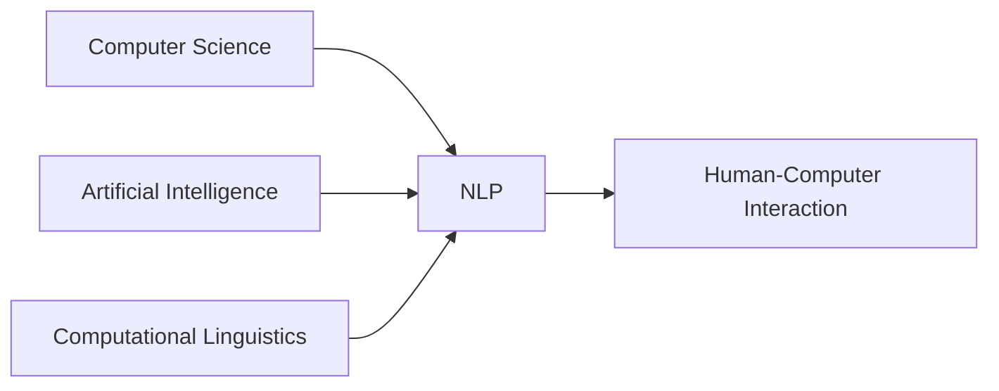

# Lec 02 : Introduction to Natural Language Processing

# Natural Language Processing (NLP): Core Concepts 🔤

## Understanding Natural Language 🗣️

### Definition & Characteristics
```markdown
Natural Language:
A communication system that has:
- Evolved naturally
- Developed through human usage
- Emerged without formal planning
- Adapted through repetition
```

### Key Properties of Natural Languages
| Property | Description |
|----------|-------------|
| **Evolution** | Organic development over time |
| **Adaptability** | Changes based on usage patterns |
| **Complexity** | Multi-layered linguistic structures |
| **Cultural Context** | Embedded social and cultural elements |

## Natural Language Processing (NLP) 🤖

### Core Definition


### Fundamental Components

#### 1. Computational Aspects
- Algorithm development
- Data structure design
- Processing optimization

#### 2. AI Integration
```python
nlp_components = {
    "machine_learning": "Pattern recognition and learning",
    "deep_learning": "Neural network architectures",
    "reasoning": "Logic and inference systems"
}
```

#### 3. Linguistic Elements
- Morphology
- Syntax
- Semantics
- Pragmatics

## The NLP Pipeline 🔄

### Processing Stages
1. **Text Input**
   - Raw text ingestion
   - Character encoding
   - Normalization

2. **Analysis**
   ```markdown
   - Tokenization
   - POS Tagging
   - Parsing
   - Semantic Analysis
   ```

3. **Understanding**
   - Context interpretation
   - Meaning extraction
   - Relationship mapping

## Applications & Impact 🌟

### Real-world Applications
| Domain | Examples |
|--------|----------|
| Communication | Machine translation, chatbots |
| Analysis | Sentiment analysis, text mining |
| Automation | Text summarization, content generation |
| Search | Information retrieval, question answering |

### Business Impact
```markdown
- Enhanced customer service
- Automated content processing
- Improved decision making
- Scalable language solutions
```

> 💡 **Key Insight**: NLP bridges the gap between human communication and computer processing, enabling sophisticated language-based applications and services.

---

*Note: This field continues to evolve rapidly with advances in machine learning and computational capabilities.*
